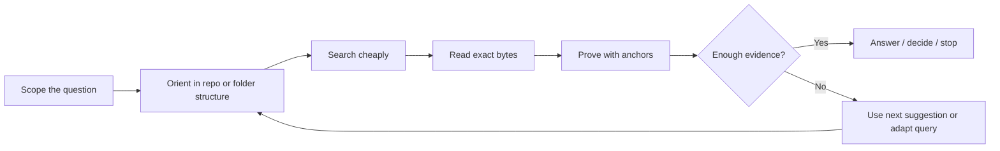
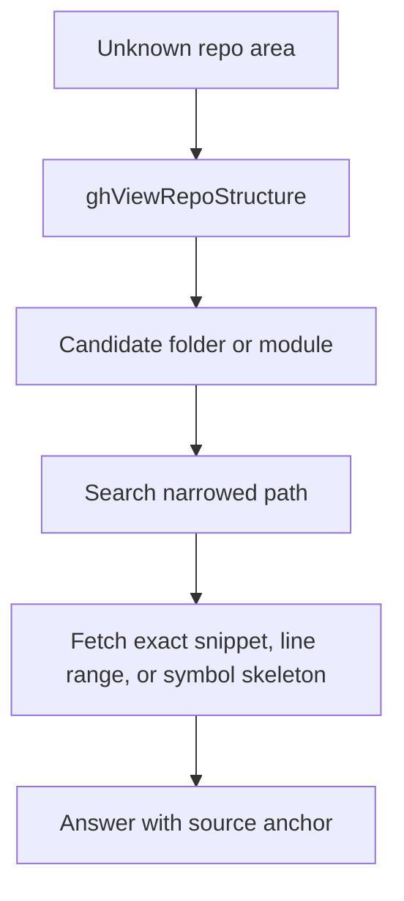
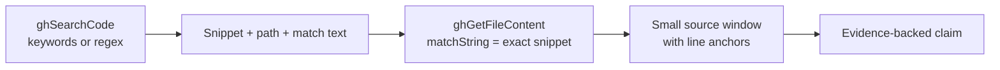
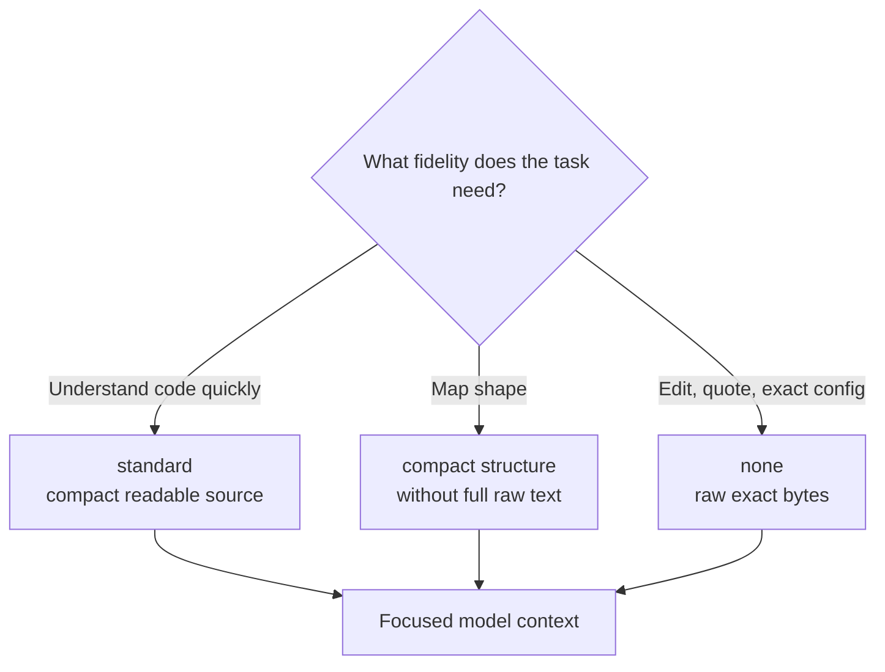
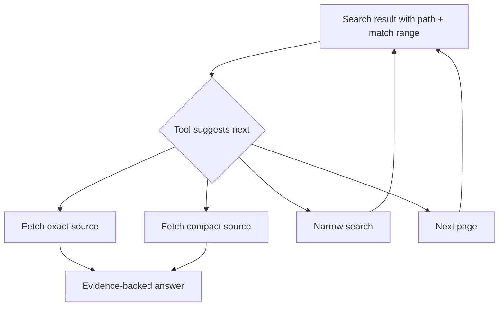
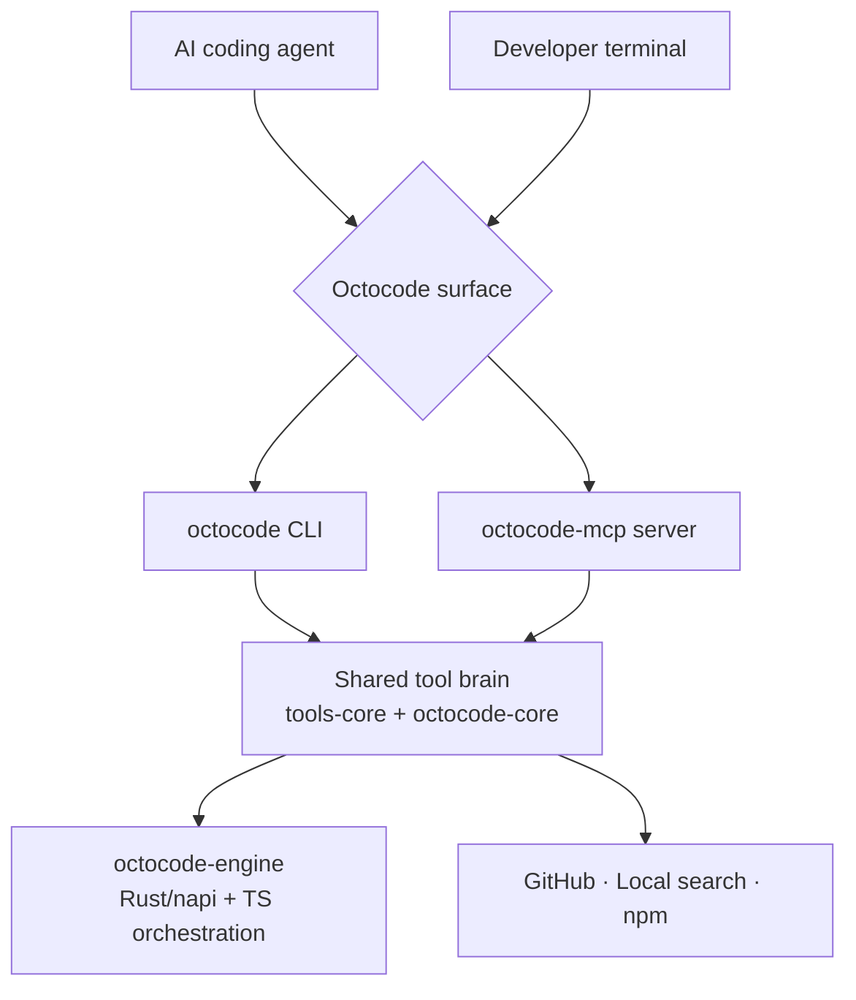
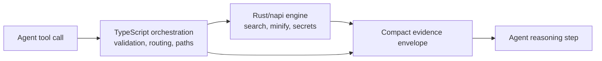
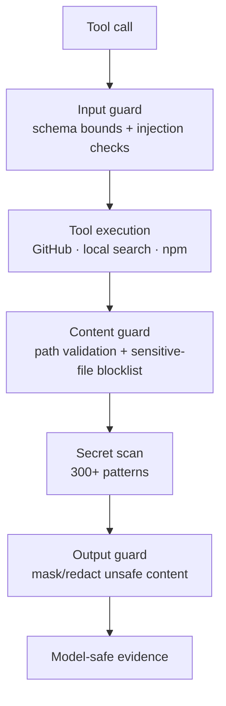
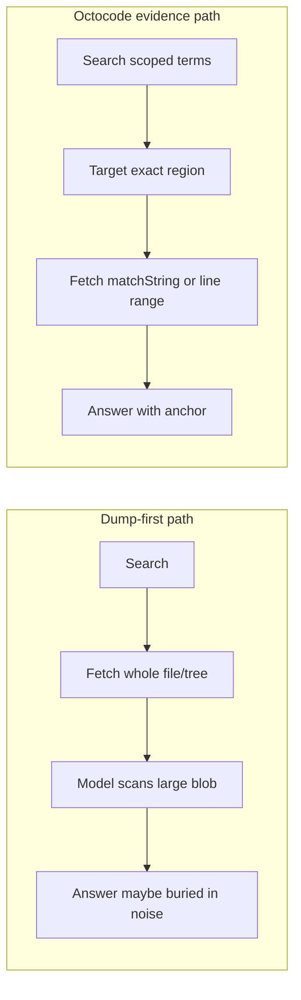

# The Octocode Benchmark: Context Engineering for Leaner GitHub Research

**A 30-question blind benchmark shows how evidence routing, minification, pagination, and safety cleanup help AI coding agents answer GitHub research questions without drowning the model in irrelevant context.**

[IMAGE: Hero image showing an AI coding agent choosing a small highlighted evidence snippet instead of a huge repository dump]

A familiar agent failure mode starts like this: the question is precise, but the tool response is not.

The agent asks for one fact. It gets a repository tree, a full file, a noisy command transcript, or a page of almost-right matches. Somewhere inside that wall is probably the answer.

The problem is what happens next. The model has to spend attention separating signal from sludge before it can reason about the thing you actually needed.

For agents, context is not just storage. It is attention budget.

That is the problem Octocode is built around.

Octocode is a CLI and MCP tool suite that helps AI agents research GitHub repositories by searching, reading exact regions, inspecting structure, and returning evidence with anchors instead of dumping everything into the model.

- Website: https://octocode.ai/
- GitHub: https://github.com/bgauryy/octocode

The short version: **Octocode keeps the agent’s research capability broad, but makes the evidence it sends to the model narrow.**

## How this started

Octocode started as a research tool I built for myself.

When MCP first started getting attention, I saw it less as a plugin protocol and more as a platform for shaping research flow between tools. At the time, that felt unusual. RAG was the dominant mental model, and a lot of people expected answers to behave like O(1) retrieval: ask once, get the answer, move on.

My own code research did not work that way. When I searched across many repositories, I would zoom out, adjust filters, inspect structure, follow a narrow clue, reject bad matches, and only then read the exact evidence. Octocode was my attempt to offload that intuition into an agentic tool: tools, descriptions, schemas, and prompt guidance that teach the agent how to conduct research instead of just dumping data.

That became my version of context engineering in two directions. On one side, I used context to teach the agent how to use the tools and handle the research flow. On the other side, I used engineering to reduce the load those tools put into the context window.

Some early feedback was skeptical: “Why is the MCP calling so many tools?” or “Doesn’t the agent already know how to search?” But it kept working well for me, and then for other users, so I kept evolving it. That loop — build the tool, use it as the main user, measure the research trail, reduce waste, repeat — has been Octocode’s evaluation loop since the beginning.

Eventually I wanted to test the hunch more formally. I created a 30-question GitHub research benchmark, ran each tool path three times, used a different LLM as a blind judge, and recorded both answer quality and context usage.

That is how this benchmark started.

Today, Octocode is used in organizations for efficient research across internal GitHub repositories, and by developers for day-to-day development and research. I am still the number one user of it.

In that 30-question GitHub research benchmark, Octocode reached near-parity correctness with `gh`, `gh + RTK`, and `gh + Headroom`, while sending far fewer characters through the model context.

## The benchmark result

Here is the headline table.

| Tool | Mean chars/question | Total chars over 30 Q | Headline geo-mean ratio vs Octocode | Correctness |
|---|---:|---:|---:|---|
| Octocode | 22,111 | 663,319 | 1.00× | near-ceiling |
| plain `gh` | 114,849 | 3,445,482 | ~2.0× more | near-parity |
| `gh + RTK` | 368,586 | 11,057,569 | ~3.2× more | near-parity |
| `gh + Headroom` | 382,598 | 11,477,951 | ~2.6–2.7× more | Octocode ahead in headline run; parity in CLI validation |

The ratio is a geometric mean, which reduces distortion from one unusually huge question while still showing the typical context gap.

[IMAGE: Clean benchmark table graphic with Octocode highlighted and context-character bars for gh, gh+RTK, and gh+Headroom]

The interpretation is simple:

- correctness mostly ties;
- Octocode’s advantage is context efficiency;
- less irrelevant context gives the model a better chance to attend to the load-bearing evidence.

A separately published CLI validation using `npx octocode@18.2.2` also showed correctness parity, with Octocode **2.37× leaner vs RTK** and **2.27× leaner vs Headroom**.

## What was measured

The benchmark used 30 self-contained GitHub research questions, run across 3 passes. For each question, isolated agents answered using assigned tool paths: Octocode, plain `gh`, `gh + RTK`, or `gh + Headroom`, depending on the matchup.

A fourth blind judge scored correctness, depth, workflow quality, and character usage. Character count means model input plus model output from per-call logs.

The fairness rule was important: every tool had to use the leanest legitimate path. Targeted search/read paths were required when they could answer the question, and whole-file or whole-tree dumps were disallowed when a narrower snippet, line range, selected patch, or metadata read was sufficient.

That matters because this benchmark is not measuring who can stuff the largest blob into a context window. It is measuring whether a tool can get an agent to the right evidence with less noise.

Public references:

- Questions list: https://github.com/bgauryy/octocode/tree/main/packages/octocode-benchmark/compare/github-questions
- HTML report: https://raw.githack.com/bgauryy/octocode/main/packages/octocode-benchmark/results/index.html
- Official site: https://octocode.ai

For transparency: the current RawGithack report link may show a one-step external-content interstitial before opening the report. The underlying report source is in the public repository, and a GitHub Pages mirror would make the final reading experience smoother.

## Why fewer characters matter

The benchmark is not saying “shorter is always better.” It is saying that when correctness is tied, the tool that delivers less irrelevant context gives the model a cleaner reasoning surface.

For agents, context is not just storage. It is attention budget.

A 300,000-character wall of output might contain the answer, but it also contains thousands of tokens competing with the evidence that matters. The model has to scan, compress, and reason over everything you gave it — including the irrelevant parts.

Octocode’s bet is different: do not fetch less capability; fetch less noise.

It uses that attention budget in two ways.

First, the tools are designed around reasoning-oriented research flows. The agent is nudged toward structure before search, search before fetch, exact reads before whole files, and `next` suggestions when the cheapest follow-up is clear. The workflow strengthens reasoning because each step asks, “what evidence would prove or disprove this?” instead of “what else can I dump?”

Second, the returned context stays focused on the domain of the question. Less irrelevant text means more of the model’s calculation is spent on the line, function, diff, symbol, issue, package, or metadata field that actually answers the task.

That means:

- stronger research trails with explicit proof steps;
- less context pollution;
- lower token and cost pressure;
- fewer brittle “the model scans a wall of output” moments;
- better attention on the load-bearing evidence.

## What Octocode is

Octocode can run as an MCP server for agent clients or as a CLI. This post focuses on GitHub research, but Octocode can also perform local code searches when an agent needs to inspect a checked-out repository.

It is not just a wrapper around `gh`. It is a research and evidence transport layer for coding agents.

The product design is agent-facing: tool descriptions, schemas, hints, pagination, continuation paths, minification, and safety boundaries are all part of how the system works.

The goal is not to hide information from the agent. The goal is to help the agent choose the next cheapest proof step.

## The mental model: evidence routing

Octocode’s workflow can be summarized like this:

```text
Scope → orient → search → read exact bytes → prove with anchors → decide/stop
```

That loop is adaptive, not ceremonial. If a search snippet already answers a simple question, the agent can stop. If not, it can fetch a smaller exact region and continue from anchored evidence instead of guessing.

The key is to ask for the smallest useful evidence at each step.



[IMAGE: Evidence-routing flow as a polished branded diagram: scope, orient, search, exact read, proof, stop]

This is the difference between “give the model the repository” and “give the model the evidence.”

## How Octocode avoids context bloat

### 1. Structure before full reads

When the agent does not know where the answer is, a structure view can be cheaper than opening files blindly.

For GitHub research, the agent can inspect repository shape with `ghViewRepoStructure`, then search or fetch only the region that matters. The same idea also exists for local repositories, but local search is not the focus of this post.

That is the “zoom out, then zoom in” pattern. For example, before asking for files, an agent can inspect a repository tree, notice the likely package or docs folder, and only then search inside that narrower area instead of reading the whole repository.



### 2. Search snippets can be enough

Search is cheap, but snippets are candidates, not always proof.

Sometimes the answer is literally in the snippet. In that case, the agent can answer directly with the source path. Other times, the snippet only points to the correct file, function, PR, or configuration block. Then Octocode encourages a targeted fetch instead of a whole-file dump.

A typical chain looks like this:



Example:

```text
1. Search GitHub for a configuration field, function name, or error string.
2. The search result returns a path plus the exact matching snippet.
3. Fetch that file with `matchString` set to the snippet text.
4. Answer from the returned source window instead of sending the whole file.
```

### 3. Targeted reads replace whole-file dumps

Instead of reading an entire file, the agent can fetch by:

- `matchString`;
- `startLine` / `endLine`;
- character pagination;
- compact source views when only structure is needed.

This is one of the biggest reasons Octocode can be leaner. It avoids fetching thousands of irrelevant lines after the search step has already narrowed the evidence.

[IMAGE: Side-by-side comparison: left panel shows a giant raw file dump, right panel shows a small highlighted `matchString` window with path and line anchors]

### 4. Minification is explicit

Octocode lets the agent choose the fidelity it needs:

- `standard` for compact readable content;
- compact structural views when shape matters;
- `none` for exact raw text when fidelity matters.

That choice is important. A model should not receive exact raw bytes unless exactness matters. But when it does matter — for edits, quotes, configuration values, or deterministic claims — the tool can provide them.



### 5. Pagination continues precisely

Heavy results are paginated or chunked. The agent pays for the next page only when the current evidence is insufficient.

This is different from truncation. Truncation throws away data and hopes the answer was in the first slice. Pagination says: here is a bounded slice, here is how to continue, and here is the reason to continue only if needed.

### 6. `queries[]` batches independent probes

Every tool accepts bulk input with `queries[]`, up to 5 queries per call.

That lets an agent run several independent probes without writing custom scripts or making repeated round trips. Dependent steps still stay sequential — structure, then search, then read — but independent checks can be batched.

### 7. `next` suggestions chain tool calls safely

Octocode responses can include machine-readable `next` suggestions: fetch exact, fetch standard/minified, narrow the search, or continue pagination.

The important part is that the agent should chain tool output literally. It should pass through `next`, match ranges, owner/repo, branch, commit IDs, PR IDs, and `localPath` instead of recomputing or guessing the next query.



## Under the hood

[IMAGE: Architecture overview showing CLI and MCP as thin surfaces over shared tools-core/core, backed by the Rust/napi engine]

Octocode’s architecture matters because the CLI and MCP server are not separate implementations with subtly different behavior.

They share the same tool brain.

### Shared CLI/MCP brain

The `octocode` CLI is a thin presentation layer: it parses input, routes commands, and renders output.

The `octocode-mcp` package is a thin stdio MCP server: it owns process lifecycle, tool registration, and output safety.

Both route into shared logic in `@octocodeai/octocode-tools-core` and schema/description metadata from `@octocodeai/octocode-core`. The result is that terminal users and MCP agent clients get the same research primitives.



### Rust/native engine

`@octocodeai/octocode-engine` is a napi-rs native package with TypeScript orchestration.

Rust owns fast, pure primitives such as minification, local search, binary/text utilities, and the secret-detection/sanitizer core.

TypeScript owns stateful orchestration such as tool routing, security registry, and path/command validators.



### Local search is available too

Although this post is about GitHub research, the same evidence-routing pattern can also run against a local checkout. An agent can search a local repository, inspect structure, and fetch only the relevant source window instead of dumping files into the model.

That local workflow is useful for coding tasks, but the benchmark discussed here is focused on GitHub research questions.

## Safety at the boundary

When an AI agent browses code, it can encounter `.env` files, credentials, private keys, CI tokens, or prompt-injection text inside untrusted files.

Octocode treats tool output as untrusted content until it has passed through safety checks.

The MCP boundary wraps output sanitization before tool results reach the model. Secret masking/redaction handles cloud credentials, AI provider keys, SaaS/dev-tool tokens, JWTs, PEM/SSH keys, bearer tokens, database strings, and high-entropy values.

Local reads use path validation, sensitive-file blocklists, symlink re-validation, and structured errors. Unsafe or oversized content can be redacted instead of dumped.



[IMAGE: Safety boundary diagram showing untrusted tool output passing through sanitizer, secret masking, path checks, and redaction before reaching the model]

## A concrete example: bad path vs Octocode path

Imagine the question is: “Which configuration field controls this behavior, and what is its value?”

A bad agent path looks like this:

1. Search the repository.
2. Fetch a full file or directory tree.
3. Ask the model to scan a giant blob.
4. Hope the answer survives the noise.

An Octocode path looks like this:

1. Search for the field or nearby identifier.
2. Inspect structure if the path is ambiguous.
3. Fetch the exact matching slice with a small context window.
4. Answer with the path, line range, and literal value.



Compression tools help after excess bytes have already been fetched. Octocode wins when it avoids fetching those bytes in the first place.

## What this benchmark does not prove

The honest version matters.

This benchmark measures research-answer quality and character efficiency on a public 30-question GitHub research suite. It was run by the Octocode project, so readers should treat it as transparent project evidence rather than independent third-party certification; the public questions and report are linked above for replication. It does not measure total product capability, latency, monetary cost, private held-out tasks, or every kind of coding-agent workflow.

Octocode also does not always win.

Tiny single-hit `gh` lookups can beat Octocode because fixed response overhead dominates. Failed or empty first probes can waste characters. Structured-file exactness must remain deterministic. And public benchmark suites are orientation, not a shipping gate.

Those limitations are useful. They point directly at improvement areas: lean response mode, better first-query guidance, exact structured reads, intra-question cache, and auto-region selection.

## The takeaway

The future of agent research is not bigger context dumps. It is smaller, sharper evidence.

Octocode’s result is not magic. It comes from boring, composable choices:

- structure before reads;
- search before fetch;
- exact slices before whole files;
- minification when fidelity is not required;
- pagination instead of truncation;
- anchored proof before conclusions;
- safety cleanup before output reaches the model;
- agent-facing schemas and `next` suggestions that make the right follow-up cheap.

That is why Octocode can preserve full research capability while sending less irrelevant context through the model.

If you want to try it:

- Start at https://octocode.ai
- Inspect the benchmark questions: https://github.com/bgauryy/octocode/tree/main/packages/octocode-benchmark/compare/github-questions
- Open the benchmark report: https://raw.githack.com/bgauryy/octocode/main/packages/octocode-benchmark/results/index.html
- Re-run or adapt the benchmark for your own agent stack

[IMAGE: Closing CTA image showing “smaller, sharper evidence” with a highlighted code line and source anchor]

## Publication checklist

Before pasting this into Medium:

- Export each Mermaid diagram as a PNG/SVG image and upload it, because Medium does not render Mermaid fences natively.
- Export or recreate the benchmark table as a polished image if the Medium editor does not preserve Markdown tables.
- Replace every image placeholder line with the final uploaded asset and alt text.
- Prefer a GitHub Pages mirror for the HTML report if the RawGithack interstitial is too distracting.
