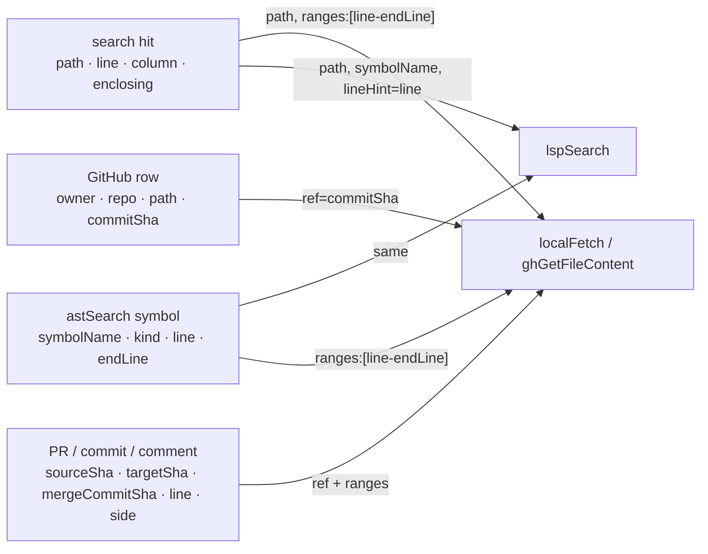

# Fix list

This page lists every open fix for the Octocode MCP tools. It is grouped as **general** (cross-tool, build, tests) and then **per tool**. Fixed items are not listed.

Last full re-check: 2026-10-06 at 16:30, live over MCP on the 15:34 native build (5 agents, about 220 probes; reports in `.octocode/evals/e2e-2026-10-06-post/`). Earlier sources: the 14:20 re-check, the 2026-10-05 tool-chain plan KPIs, and the 2026-10-06 workflow audit. The plan README, KPI and CHECK snapshots, and sensor scripts were removed on 2026-10-06; see B1.

## How to read this page

| Mark | Meaning |
|---|---|
| **P1** | Wrong or missing evidence, or a broken workflow step. |
| **P2** | An extra hop, a guess, or wasted tokens. |
| **P3** | Polish or maintainability. |
| **R** | A rename. It is a hard cutover to one name per purpose, done in one batch. It needs decision D1. |

Rules that apply to every fix:
- Paginate. Never trim evidence.
- Keep input flexible. Bare rows and value coercions stay allowed.
- Add no aliases.
- After each fix, run the changed tool live through MCP or the CLI, and replay its leads.

Code paths are under `packages/octocode-native/crates/runtime/src/` unless a row says otherwise.

## Status

- Native build 15:34 matches the core contract (no drift). `octocode scheme`, the CLI, and MCP run.
- 2026-10-06 native refactor (4 waves) and fixes are in: contextLines with matchString defaults to 10, max 100 (fetch tools + PR content); one provider error shape; clasify errors use `{errorCode, error, hints:{text}}`; disclosed default-excluded dirs and policy-withheld paths; structureSearch `next` past 10k; Rust macro bodies in astSearch/astRewrite; `method` kind; PR context from sourceSha; ghStructure materialize completeness.
- Fixed and removed from this page at 16:30: GF5, HI12, HI13, AS3. Rows marked **Partial (16:30)** say what remains.
- Build hygiene, fixed and removed on 2026-10-06 evening: B6.
  - `target/` 303 GB → 8 GB.
  - One integration-test binary per crate: 31 → 6 executables per build.
  - `test:rust` 3 → 2 cargo runs. `verify` drops the `cargo check` that repeated clippy.
  - `dev-unify`: the test build after `build:dev` went 66 s → 19 s, and release binaries are byte-identical.
  - `$DEV clean` and `$DEV clean:cache` replace cron-style sweeps.
  - Rules live in `skills-dev/rust-best-practices/references/build-profiles.md`.
  - Open residue: B15–B17.

Scores at 16:30 (overall /10, change vs the 2026-10-06 morning baseline):

| Tool | Now | Δ | Tool | Now | Δ |
|---|--:|--:|---|--:|--:|
| localSearch | 7.5 | +1.0 | ghSearchCode | 8.3 | +0.6 |
| localFetch | 7.5 | +0.5 | ghStructure | 8.4 | +0.3 |
| structureSearch | 7.5 | +1.0 | ghGetFileContent | 8.4 | +0.3 |
| astSearch | 8.0 | +0.5 | ghCloneRepo | 8.1 | 0 |
| lspSearch | 7.7 | 0 | ghSearchHistory | 7.6 | +0.2 |
| astTopology | 7.9 | +0.2 | ghGetHistoryItem | 7.1 | +0.4 |
| astRewrite | 8.3 | +0.2 | artifactSearch | 7.7 | +0.3 |
| ghSearchRepo | 7.6 | 0 | clasify (402, provisional) | 6.3 | +0.8 |

Whole surface 6.7 (+0.7): defaults/limits 4→7, CLI/MCP parity 30/30 byte-identical; naming 5 and envelope 6 unchanged; tools/list + instructions 15,613 B (target 14,700).

## New open items (16:30 re-check)

| # | P | Tool | Item | Evidence / fix site |
|--:|:-:|---|---|---|
| N1 | P1 | clasify | Hydrated windows can miss every hit: a window is centred on the midpoint between two hits and re-read narrower around that midpoint when the byte budget cuts it (453–459 between hits 429/483). 21 of 26 hit lines covered. | `tools/clasify/run/hydrate.rs` |
| N2 | P1 | lspSearch | `hints.textSearch` is scoped to the defining package, not the workspace (`arrayToMap`: 1 site vs 263 in 62 files). | `lsp_search/recovery.rs` `disclose_alias_cap` → `failure.rs` `flag_partial(workspace_root)`, `server_coverage.rs` |
| N3 | P2 | localFetch | Default context 10 makes one minified hit 11.5 KB (`lodash.min.js`); no `contextBytes` lead. | `local_fetch/extraction.rs` long-line path |
| N4 | P2 | localSearch | A partial result drops the `read` lead even with hits (the `includeIgnored` follow-up ends with only `binarySkipped`). | `local_search/leads.rs` |
| N5 | P2 | ghGetHistoryItem | Comment paging warning undercounts the remainder (75 vs 89 …). | `gh_get_history_item/issue.rs` |
| N6 | P2 | astTopology | The pager splits one cycle object into two `results[]` with no marker (4 results, `cycleCount` 3). | `response/row_pages.rs` |
| N7 | P2 | all | `retryable` and `httpStatus` are debug-only (core `verbosePaths`), so a default rate-limited row has no `retryable:true`. Decide: publish `retryable` by default. | core `verbosePaths` |
| N8 | P3 | local | List `matchString` gap marker before lines inside the gap; withheld-path notice twice on empty localSearch; structureSearch summary 10000 vs `totalItems` 9603 and a clipped, repeated hint; Linux `*.map` keymap sources skipped as source maps. | local_search, structure_search |
| N9 | P3 | GitHub | Materialize pages re-send the ~3.6 KB tree; empty-match hint names unpublished `regex:"rust"`; directory error text says "viewTree continuation" but it is a hint. | gh_structure, gh_get_file_content |
| N10 | P3 | history/artifacts | Bot comments dropped silently (105 vs 104); comment cursor grows `pageSize` as an offset; pypi `readManifest` always `pyproject.toml` (requests uses `setup.py`); commit `include` with no match has no warning; `readCommentCode` covers one line, first comment only. | gh_get_history_item, artifact_search |
| N11 | P3 | code intel | `macro_rules!` bodies skipped silently; astTopology echoes `path` in three forms; `rustContext` all-features rerun drops 7 sites with no reason; two warnings name `next.*` for a `hints.*` lead; E16 symbols still 77% diagnostics. | ast_search, ast_graph, lsp_search |
| N12 | P3 | clasify | For 60 s after a 402, an input error reports the quota error (exit 5, not 2): the quota gate runs before the per-page check. | `tools/clasify/run/mod.rs` ~370 |
| N13 | P3 | tests | `path_errors_have_one_hint_on_every_tool` passes, but live lspSearch and structureSearch give a different `pathNotFound` hint (tool-level hint wins before the runtime map). | `response/rows.rs`, tool `error_hint` |

## Review verdicts and plan (16:55)

Every row was reviewed for value, byte cost, contract/rename cost, and whether its premise still holds in code (reports: `.octocode/evals/fixlist-review/{general,local-codeintel,github-clasify,history-artifacts}.md`).

| Area | Rows | DO | DO-MODIFIED | DEFER | DROP |
|---|--:|--:|--:|--:|--:|
| General (D, X, B, N) | 45 | 11 | 28 | 4 (B4, B10, B11, B13) | 2 (D3, B14→B1) |
| Local + code intel (LS, SS, LF, AS, LP) | 30 | 10 | 18 | 1 (AS6 `kinds` enum, budget) | 1 (LF5, stale) |
| GitHub + clasify (GR, GC, GS, GF, CL) | 20 | 4 | 13 | 2 (CL4, CL5) | 1 (CL2, false premise) |
| History + artifacts (SH, HI, AR, X4–X6) | 23 | 4 | 18 | 0 | 1 (AR1 → GS4) |

**Decisions (recommended):**
- **D1 yes, after B1** so the effect is measured. The batch also unlocks non-R rows (list in `general.md`); slice order D2 → X1+X2 → X6+B12 → X4b/X5/AR3 → X10 → X13 → D4. Old leads fail closed (`staleSnapshot` / "re-run preview").
- **D2 yes, first slice:** 1-based `column`/`endColumn` in characters everywhere; remove lspSearch `position` (LP1, P1; also `walk.rs` `resume_query` emits 0-based `position`). Saves about 170 B on tools/list.
- **D3 drop:** tool names live in users' permission allow-lists, skills, and docs; the gain is cosmetic.
- **D4 yes, inside D1.**
- **N7:** publish `retryable` only when true (≈17 B on error rows, 0 B on tools/list); `httpStatus` stays debug-only.

**Premise corrections:**
- B1: the sensor scripts were never staged. All versions were recovered from unreachable git blobs to `.octocode/recovered-sensors/` (gitignored) on 2026-10-06; newest chain checker `4af87c11`, kpi `d2bd50a1`. The old 6 checks passed 16/16 with X1–X6 open: rebuild as `octocode-local-testing/harness/chain-check.mjs` with the 5 Acceptance checks.
- LF5 stale (a list `matchString` already returns `matchedLines`). LF1: call-site widening is documented in `block.rs`; make it declaration-only by choice, not as a bug. AS1 is P2 (text output prints a legend). SS5: fix the `maxDepth` text, not the code. HI3/HI8 code is in `patch.rs:79` / `inventory.rs:422`. SH2: PR rows have no `updatedAt`. AR3: `registry` input is unpublished, so the rename is nearly free. CL2: typed questions already wrap `ask`. CL3: clasify accepts 13 scout tools, not 4.
- New: structureSearch `files` `include:["src"]` is empty and blames .gitignore; `"src/"` works.

**Byte budget:** the proposed per-tool descriptions add about 500 B to a surface already 913 B over (15,613 vs 14,700). The tightened versions in the review reports are net negative (local −107 B, GitHub/clasify −13 B, history −3 B); with `position` removal and instruction routing cuts, about 400 B still remains (B8). Realistic targets: B7 1.5× (1.3× stretch), B9 ≤ 0.15 (0.08 is below one runnable lead).

**Merges:** X9+GS2+GF6 · X14+LP5+GS3+N8a+N10 bots+N11 · N13+B2+LS6/LF4 path errors · X6+B12 · N5+N10 cursor · X13+AR4 codes+GF4+SS7 · D2+X3+LP1 · D4+N11 paths · X10+B9 · X15+LF2+LS4 · X12+AS6+GF2 (`caseMode`).

**Execution waves:**

| Wave | Contract | Rows |
|---|---|---|
| 0 | none | B1 sensor (recover + 5 checks) · P1s N1 (clasify windows), N2 (lspSearch textSearch scope), GF2 (smart case for fetch, stay literal) · N4/LS5 (read lead on partial) · N12 · B5 |
| 1 | native + one additive regen (N7, B3, X4a `targetSha` from `baseRefOid` at no API cost) | X14 sweep (no silent omissions) · HI3 old-side numbers · HI6+N5 · HI11 · HI4 · HI5 · SH4/SH5 · GC3 · GR4 · GS1 · GF4 · CL1+N12 · LP2a workspace-relative paths · LS6/LF4/SS7/N13 shared path-error helper (exit 2) · LS7 · SS3/SS6 · AS4 · LP6/LP7 · X9 rename helper · N3/N6/N9 |
| 2 | one core regen, budget-negative | tightened descriptions · LS4/LF2/X15 field text · SS5 text · AS5 · LP8 · CL3 · SH1/SH2/HI7/HI10/AR2/AR4 output fields · GC2 · GR1–GR3 |
| 3 | D1 cutover | D2/X3/LP1 → X1+X2 (+AS1/AS2/LS3/LP2b/LP3/LP4) → X6+B12 → X4b/X5/AR3 → X10+B9 → X13 → D4 |
| 4 | — | B8 budget close-out · B10 · B11 · B13 (re-measure first) · HI9b with F3 |

## Decisions

D1 blocks every **R** row. D2 blocks lspSearch LP1.

| # | Decision | Recommendation |
|--:|---|---|
| D1 | Allow one batch of hard-cutover renames for one name per concept? | **Yes.** It removes 5 location encodings, 4 author spellings, and 2 column bases. Agents parse fewer packed strings. |
| D2 | Which base do column numbers use? | **1-based `column` everywhere**, like every line number. Remove lspSearch `position` (0-based UTF-16). Anchor with `lineHint` and an optional `column`. |
| D3 | Rename tools so local and GitHub pairs match? | **Optional, low value for the cost.** If yes: `ghGetFileContent`→`ghFetch`, `structureSearch`→`localStructure`, `ghGetHistoryItem`→`ghFetchHistory`. If no: name the twin tool in each description. |
| D4 | One workspace-relative path form for astSearch, astTopology, and astRewrite (F16)? | Do it in the D1 batch. It invalidates open astRewrite apply leads, because `expectedHashes` use scanned-directory paths. |

## General

### Output-to-input contract

Goal: each output field that a next tool consumes uses that tool's input name and input form. The agent never parses a packed string or joins paths.

| # | P | Concept | Today | Fix | R |
|--:|:-:|---|---|---|:-:|
| X1 | P1 | Location row | Five encodings: localSearch `{line,value}`; ghSearchCode `"452\tcode"`; owner-wide ghSearchCode `matches[].value` with no line; lspSearch `"433:20 in function x 430-475"`; astSearch `"227-428 function x +"`. | One row shape: `{path, line, column?, endLine?, value}`. Text render keeps the compact form. | R |
| X2 | P1 | Enclosing or declared symbol | Three packed formats: `in:"fn x@430"`, `"in function x 430-475"`, and the astSearch outline string. | `enclosing:{symbolName, kind, line, endLine}`. Its `symbolName` and `line` feed lspSearch directly. Its `line-endLine` feeds `ranges`. | R |
| X3 | P1 | Column | localSearch `column` (matchOnly) and astSearch are 0-based. lspSearch output is 1-based, but its `position` input is 0-based. | D2: 1-based `column` and `endColumn` everywhere. | R |
| X4 | P2 | **Partial (16:30):** PR views carry sourceSha; targetSha still missing. Commit identity | `commitSha` in most tools; `sourceSha`/`mergeCommitSha` on PRs; `commitId` in reviews; `sha` on commit rows. There is no PR base SHA. | Keep `commitSha` for "the ref this was read at". Add `targetSha`. Send all three PR SHAs in every PR view. Each description says "pass commitSha as ref". | R |
| X5 | P2 | Person | `author` (login) in PR comments; `user` in reviews and issue comments; an object in the commit view; the git name in PR commits and compare. | `author` = login, else git name, in every tool. Only the commit view keeps the full object. | R |
| X6 | P2 | Match counts | `matchLines`, `matchedLines`, `totalMatchedLines`, `matchCount`, `totalItems` (files at the top, matches per file). | Use `matchedLines`, `matchCount`, and `fileCount`. `pagination.totalItems` counts only the paged unit. | R |
| X10 | P2 | Lead names | About 45 lead keys. `verifyReferences` runs `callers`. `readBlock` can read an enclosing impl. `why` is removed from non-recovery leads (`channels.rs:49-58`). | Name each lead after what it runs. Keep a `why` of 8 words or fewer when the lead is not obvious. Always keep evidence caveats. | R |

### Behavior parity

| # | P | Concept | Today | Fix |
|--:|:-:|---|---|---|
| X7 | P2 | **Partial (16:30):** path include shared; bare word: names-only in localSearch, also dirs in structureSearch. `include` | The local tools share one rule: a plain path also matches its subtree. ghStructure raises maxDepth for a bare word. ghGetHistoryItem has its own path and glob parser. | Use the local rule in the GitHub tools too. |
| X8 | P2 | Case and regex defaults | localSearch uses smart case and infers regex. localFetch and ghGetFileContent are case-insensitive and literal. | Use one default in all three: smart case, regex only from metacharacters. Say it in the `matchString` description. |
| X9 | P2 | **Partial (16:30):** ghSearchCode warns + canonical leads; ghStructure/ghGetFileContent still silent. Renamed repos | ghSearchHistory and ghSearchCode follow and warn. ghStructure and ghGetFileContent follow silently, and their leads keep the old name. | Follow, warn once, and use the canonical `owner/repo` in every lead. See GS2 and GF6. |
| X11 | P2 | Hint clipping | `response.rs:39,55-71` cuts hints at 120 chars mid-list (astSearch rule keys, "inside,…"). | Write hints within the budget at the source. Test the length. Remove the runtime clip. |
| X12 | P2 | Unpublished fields | Leads use `offset`, `page`, `snapshot`, `entryType`, `noIgnore`, `minify`, `caseMode`, `captureText`. Agents cannot write them. Some empty hints name them only as text. | End each description with "follow next/hints verbatim". Make each recovery in a text hint a runnable lead. Publish `caseMode` and the astSearch `kinds` enum. |
| X13 | P2 | **Partial (16:30):** one rate-limit shape; dotted codes + bad-ref split remain. Error codes | A bad ref is `notFound` in ghStructure and `invalidInput` in ghGetFileContent. Three styles coexist: camelCase, dotted (`ast.symbols.input.invalid`, `lsp.capabilityUnavailable`, `structure.execution.failed`), and snake_case (`unsupported_capability`). | One camelCase code set. Each empty or error row names the probable cause and gives one runnable lead. |
| X14 | P2 | **Partial (16:30):** local omissions now disclosed; lsp lib.d.ts/unlistedNested still open. Silent omissions | lspSearch omits "9 lib.d.ts items" with no `next`. documentSymbols reports `unlistedNested:51` with no page. ghStructure collects sizes and drops them. | Put every omitted item behind `next`. |
| X15 | P2 | **Partial (16:30):** contextLines restored; resultView/block/minify/fullContent/operation still hidden. Workflow in descriptions | The published schema drops the descriptions of `resultView`, `block`, `contextLines`, `minify`, and `fullContent` (core `publishedSchema.ts`). Descriptions do not always say when, what, and next. | Use the per-tool descriptions below. Each states when, what it returns, and the next tool with its field. Restore one short line for each hidden option that changes the result. |

### Build, sensors, and tests

| # | P | Item | Evidence | Fix |
|--:|:-:|---|---|---|
| B1 | P1 | No sensor covers the chain any more. The chain checker and the KPI and complexity scripts were deleted from `IMPROVE/scripts/` on 2026-10-06. Their last run (14:15) failed on contract drift. | 2026-10-06 cleanup | Restore them while they are still staged (`git checkout -- IMPROVE/scripts`), or rebuild the checks in `octocode-local-testing/harness/`. Then run them after the native rebuild. |
| B2 | P2 | Only ghGetFileContent tests that its empty row matches the contract. No suite covers every tool. | The ghGetFileContent empty-match bug shipped because of this gap. | Add one shared test: build each tool's empty and error rows and run `validate_output`. |
| B3 | P3 | Core still declares the lead `retryRenamed`. Nothing emits it now. | `continuationChannels.kinds.leads`; `response/channels.rs` test | Remove it in core, then run `yarn contracts:regen` and rebuild native. |
| B4 | P3 | The native smoke test times out on the first load of a new 100 MB debug binary under load. The full `build:dev` failed twice. Not reproduced in about 10 dev and 2 release native builds on 2026-10-06 evening; code unchanged. | `scripts/native-addon-utils.cjs` (`SMOKE_TIMEOUT_MS` 60 s on macOS) | Retry the smoke once, or give the first load a longer timeout. |
| B5 | P3 | `auth/discovery::discovery_uses_explicit_path…` fails under full-suite load and passes alone. Not reproduced in 3 full `test:rust` runs (one inside `verify`) on 2026-10-06 evening; code unchanged. | `providers/github/auth/discovery.rs:153` (2 s budget) | Raise the budget, or run the test serially. |
| B7 | P2 | Bytes per answer: 1.90× rg/gh (target 1.3). The main cause is small-answer framing (`root`, `shared`, repeated `path`). | final2 KPI | Remove the framing when one row returns. |
| B8 | P2 | tools/list plus instructions: 15,504 B (target 14,700). | final2 KPI | Fit the new per-tool descriptions in this budget. |
| B9 | P2 | Lead share on small tasks: 0.196 (target 0.08). | final2 KPI | Make each lead its minimal runnable row (X10 helps). |
| B10 | P2 | D6: four output walks instead of one; union-branch clones. Shared-stage time is not −60%. | final2 plan | One output walk. HI5 is one symptom. |
| B11 | P2 | F15: astRewrite preview prepares every file again on each page (CLI). | final2 plan | Memoize the preview per snapshot. |
| B12 | P3 | PG1: each tool builds its own pagination block. | final2 plan | One `PageFacts` cursor API in `pages.rs`. Fix the X6 count names there. |
| B13 | P3 | 29 functions over 120 lines; 18 over cognitive complexity 25; 7 exact clones; 9 wrappers; 1 dead TS export; 13 file cycles. Largest: core `buildKnownDirectToolCommandPatternQueries` (585 lines), engine `search_files_detailed_filtered_with_extension` (392), CLI `startConfigView` (complexity 75). Clones: `dispatch.rs`, `domain_dispatch.rs`, `response.rs`, artifact `maven.rs`↔`registries.rs`, engine minify strategies, engine `graph_facts`↔`js_oxc`, `local_search/manifest.rs`↔`structure_search/memo.rs`. | final2 complexity run | Split the long functions, merge the clones, delete the wrappers and the dead export, and break the cycles. |
| B14 | — | Not re-measured: whole-MCP rating, per-tool rating, shared-stage time, clasify. | final2 KPI | Re-measure after B1. The scores below are the baseline. |
| B15 | P3 | `dev-unify` (`crates/runtime/Cargo.toml`) hand-mirrors the features that the dev-dependencies wiremock and tempfile turn on (hyper server/http2, hyper-util, tokio-util codec, bitflags/fastrand/slab std). Nothing fails when a dev-dependency change adds another feature, so test builds quietly go back to recompiling the crates `build:dev` built. | 2026-10-06: test-only units 47 → 15, measured with `cargo +nightly --unit-graph` | Add a harness check: diff the unit graphs of the `build:dev` and `test:rust` selections. Fail when a crate that is not test-only appears only in the test graph. |
| B16 | P3 | Cold test-build time after the one-binary-per-crate merge was measured only under load: 179 s before vs 233 s after, while a 100 GB delete and 4 peer builds ran. The incremental numbers are better (lib edit 29 → 21 s, test-file edit 2 s). | 2026-10-06 | Re-measure a cold `test:rust` on an idle machine. If it is slower, split the integration binary by domain into 2–3 binaries, not back to 27. |
| B17 | P3 | Parallel agent lanes each create a full `CARGO_TARGET_DIR`. One session had 7 (about 8 GB each), another had 15. Cargo has no safe shared cache (cargo#16804). `-Zfine-grain-locking` is nightly and can deadlock. | 2026-10-06: about 100 GB of stale lane dirs deleted; the AGENTS.md rule is now scratchpad + delete when done | Reuse at most 2 target dirs across sequential workers. Set `CARGO_INCREMENTAL=0` for throwaway lanes: no `incremental/` dirs, and sccache can cache workspace crates. Revisit when fine-grain locking stabilizes. |

## Per tool

The tools are in workflow order: local discovery, then precision, then GitHub, then history and packages. Each heading's scores (out of 10) are for input description, naming, output chaining, leads, and empty or error handling.

### localSearch: 6 · 5 · 6 · 7 · 4

Proposed description: *"Find literal or regex text when the path or line is unknown. Rows give path, 1-based line, and the enclosing symbol. Next: localFetch ranges to read; on a declaration row, lspSearch symbolName+lineHint. Empty: check the include/exclude scope first."*

| ID | P | Fix | Evidence |
|---|:-:|---|---|
| LS2 | P2 | Show `kind:"comment"\|"declaration"` on each row. The engine computes `rank` but uses it only to sort. | `engine/types.rs:33-37` |
| LS3 | P2 | Give every row the X2 `enclosing`. Today it is packed, sometimes lacks an end line (`fn startNativeMcp@430`), and is dropped on large pages. | `local_search/enclosing.rs`, live 14:20 |
| LS4 | P2 | Add one line per `resultView` value to the published schema. | core `publishedSchema.ts` |
| LS5 | P2 | **Partial (16:30):** bytes/ranking unchanged live. Rank the `binarySkipped` lead below `read` and `callers` when there are hits (2-lead cap). | carried over (C4) |
| LS6 | P3 | `pathNotFound`: add a runnable nearest-parent `viewTree` lead, as structureSearch has. Suggest `regex:"rust"` only when the text has metacharacters. Give `staleSnapshot` its own "query changed" message. | live 14:20 |
| LS7 | P2 | The scope-miss empty row ("Nothing searched: include/exclude matched no file") has only text. Add a lead to structureSearch `files` with the same `path` and `include`. | live 14:20 |

### structureSearch: 5 · 4 · 4 · 4 · 5

Proposed description: *"Find local paths you do not know: tree outlines a directory (maxDepth 1); files filters by name, glob, or extension recursively. Rows carry workspace-relative paths. Next: localFetch the manifest or minify:'symbols', or localSearch in a found directory."*

| ID | P | Fix | Evidence |
|---|:-:|---|---|
| SS2 | P1 | Give each row a workspace-relative `path` and structured `size`, `lineCount`, `modifiedMs`. Today rows are `{dir, files:["logo.png (268349)"]}`, relative to the query path. | `structure_search/files.rs`, live 14:20 |
| SS3 | P1 | **Partial (16:30):** root tree has leads; files lead still can pick generated files. T8: a tree at the repo root has no lead. Add a lead to the manifest or README and to the source directory. The `files` read lead must pick a small, non-generated file, not the 4.4 MB `tool_types.rs`. | live 14:20 (`hints: null`) |
| SS4 | P2 | Use one row shape for tree and files. Today the keys (`entries` and `files`) and size units ("8.6KB" and bytes) differ. Drop the `"./"` pseudo-entry. | `tree.rs`, `files.rs` |
| SS5 | P2 | Apply the `maxDepth` default to `files`. It is unbounded today, but the description says "omit: 1". | `files.rs` |
| SS6 | P3 | Make one `includeIgnored` lead set both `noIgnore` and `defaultExcludes:false` (2 hops today). Do not clip the empty text. | — |
| SS7 | P3 | A tree on a file exits 5 (execution error) with `notADirectory`. It is a caller mistake. Map it, and localFetch's directory error, to exit 2. | `runtime/exit.rs` `failure_kind` (owned by another lane) |

### localFetch: 5 · 6 · 6 · 7 · 5

Proposed description: *"Read a known local file: ranges for spans, matchString for hit windows, block:true to widen a declaration hit to its body, minify:'symbols' for an outline with line ranges. Next: lspSearch on a declaration line. Unknown path: structureSearch or localSearch."*

| ID | P | Fix | Evidence |
|---|:-:|---|---|
| LF1 | P1 | Make `block:true` widen only declaration hits. Today a call site pulls in the enclosing function too (`createNativeMcp` gives 227-475). Return `blocks:[{line, symbolName, endLine}]`. | live 14:20 |
| LF2 | P1 | **Partial (16:30):** only contextLines description restored. Publish short descriptions for `block` ("each declaration hit to its body, 400 lines max"), `contextLines` (its default), `minify`, and `fullContent`. | core `publishedSchema.ts` |
| LF3 | P2 | Give `minify:"symbols"` rows `line-endLine`, as astSearch symbols have. Document that `totalLines` counts view lines. | live 14:20 |
| LF4 | P2 | **Partial (16:30):** pathNotFound text unified; no notAFile/runnable leads yet. A directory path: return `notAFile` with a structureSearch tree lead (today `fileAccessFailed` and text). A missing file: lead to structureSearch `files` on the parent with the basename. A miss: a runnable localSearch on the directory, plus clasify when `totalLines` is 1000 or more. Fix the double period in "File not found: …ts.." | live 14:20 |
| LF5 | P3 | A list `matchString` returns `matchedLines:{term:[lines]}` (grep map). Today no per-term lines come back. Send `startLine`/`endLine` in every view or in none. | live 14:20 |

### astSearch: 6 · 6 · 5 · 6 · 6

Proposed description: *"Find code by syntax: symbols (declarations by name or kind → symbolName, line, endLine), match (ast-grep pattern or rule → line, column, endLine), syntaxTree (node kinds for patterns). Next: localFetch ranges line-endLine; lspSearch symbolName+lineHint."*

| ID | P | Fix | Evidence |
|---|:-:|---|---|
| AS1 | P1 | Return symbols as rows `{symbolName, kind, line, endLine, exported}`. Today: `"227-428 function createNativeMcp +"`. The `+` and `doc` marks are explained only in the CLI header. | `symbol_outline.rs`, live 14:20 |
| AS2 | P1 | Return match rows as `{line, column, endLine, endColumn, value}`. Today: `"371-379\tregisterTool( …"`. A long match marks the row `isPartial` (`valueClipped`). Give the full text through a localFetch lead instead. | `matches.rs`, live 14:20 |
| AS4 | P2 | Give each operation its own empty hint, with the file count. Symbols: "localSearch the literal or drop kinds". Rule: "check node kinds with syntaxTree on one file". Today: "Broaden the syntax/name query, path, or filters." | live 14:20 |
| AS5 | P2 | Accept an object rule wrapped in `{rule:…}`, as the YAML form is. Today: "Unknown field(s): rule". | live 14:20 |
| AS6 | P3 | Publish the `kinds` enum, `include`/`exclude`, and syntaxTree `ranges`. Today the 19 kinds appear only in an error. | live 14:20 |

### lspSearch: 5 · 4 · 5 · 6 · 6

Proposed description: *"Resolve identity from a symbolName+lineHint anchor (from localSearch or astSearch): definition, references, callers/callees, hover, typeDefinition, implementation, documentSymbols, diagnostic, workspaceSymbol. Servers: ts/js, py, rust, c/c++. Next: localFetch ranges; no server: astSearch."*

| ID | P | Fix | Evidence |
|---|:-:|---|---|
| LP1 | P1 | D2: anchor with `lineHint` and an optional 1-based `column`. Today `position {227,17}` (copied from the output `227:17`) hovers line 228 and returns `any`, with no warning. | `locations.rs`, live 14:20 |
| LP2 | P1 | Return callers and callees as `{path, symbolName, kind, line, endLine, sites:[{line,column}]}` with workspace-relative paths. Today callee paths are relative to the row's file (`../../../../node_modules/…`). | `walk.rs`, live 14:20 |
| LP3 | P1 | Return callHierarchy as separate `callers[]` and `callees[]`. Today one `files[]` mixes both, told apart only by "in" or "to" inside strings. | live 14:20 |
| LP4 | P2 | Use X1 rows for references. Replace `recovered.recoveredImporter:[…]` (3 label names, a repeated line list) with a `source` field on each row. | `ops.rs`, `recovery.rs` |
| LP5 | P2 | Put the omitted `lib.*.d.ts` items and the `unlistedNested` symbols behind `next` (X14). | live 14:20 |
| LP6 | P2 | **Partial (16:30):** py/rust partial reasons added. Give each `operation` a one-line meaning. State which servers support type hierarchy. Today the description says "counts" and "hierarchies", and TypeScript supertypes fails (`lsp.capabilityUnavailable`). | live 14:20 |
| LP7 | P2 | A wrong `lineHint`: give leads that re-anchor on the symbol's real lines (227, 433). Today it gives only a read of 295-305. Accept a directory `path` for workspaceSymbol as `workspaceRoot`. | live 14:20 |
| LP8 | P3 | Make `exhaustive`, `importerScan`, and `verifiedImporterFiles` agree between callers and references, or document them. | audit |

### clasify: 6 · 5 · 7 (source only) · 6 · 4

Proposed description: *"Locate a described target in unread files, or judge supplied state, when a literal search missed or hit 8+ files. Pass resources (read or search rows) × typed questions. Returns scored line windows, not bodies. Next: localFetch each best row's next.read."*

| ID | P | Fix | Evidence |
|---|:-:|---|---|
| CL1 | P2 | **Partial (16:30):** captured pages keep hints.read on 402; single-file locate and 60 s gate still no read. On a provider error (HTTP 402 today), send `next.read` for each resource, so the agent can read instead. Return JSON, not YAML. | live 14:20 |
| CL2 | P2 | **Partial (16:30):** default-view lead still asks the raw phrase. The localSearch handoff asks a real question ("Which candidate answers: <phrase>?") instead of the raw phrase, with a `why`. | `handoff.rs` |
| CL3 | P2 | Describe `tool` as "a read or search tool (localFetch, ghGetFileContent, localSearch, ghSearchCode)". Publish `candidateEvidence`. | — |
| CL4 | P3 | Type `mainGoal`, `reasoning`, `ask`, `known`, and `labels`. Use X1 and X2 names in `best` rows (`line`/`endLine`, not `startLine`). | `locate.rs` |
| CL5 | — | Re-measure live when the provider has quota (paid). | 402 |

### ghSearchRepo: 7 · 8 · 7 · 7 · 7

Proposed description: *"Find GitHub repositories when owner/repo is unknown (keywords, owner, topics, stars). Rows give owner, repo, and defaultBranch. Next: ghStructure to browse, ghSearchCode to find code. Archived repos are excluded."*

| ID | P | Fix | Evidence |
|---|:-:|---|---|
| GR1 | P2 | Drop non-evidence fields from each row (bytes 3.57× rg/gh). | final2 KPI |
| GR2 | P3 | Send `defaultBranch` (fetched, then dropped) and `fork`. | live 14:20 |
| GR3 | P3 | Say "archived repos excluded" in the description, or publish `archived`. | `gh_search_repo/mod.rs` |
| GR4 | P3 | Remove the `searchContent` lead. It reuses the repo keywords as code keywords. | live 14:20 |

### ghSearchCode: 7 · 7 · 7 · 7 · 5

Proposed description: *"Find files or lines in a known GitHub owner/repo (default-branch index; ref re-reads hit lines there). Hits give path, line numbers, and commitSha. Next: ghGetFileContent with ref=commitSha. Paths only: match:'path'."*

| ID | P | Fix | Evidence |
|---|:-:|---|---|
| GC2 | P2 | Owner-wide search uses the X1 row. Today it sends `matches[].value` with no line and no `commitSha`, and its `readTopMatch` has no `ref`. | live 14:20 |
| GC3 | P2 | **Partial (16:30):** bytes 870→409 B; keyword-line choice still wrong. Check that `readTopMatch` reads the line that holds every keyword. Unverified: for `merge_environment_settings`+`trust_env` it reads 487-509, while the shown hits are at 129 and 641. Close the byte gap (2.09× rg/gh). | live 14:20 |
| GC4 | P3 | Restore "a phrase is one item" in the published `keywords` text. For `atRef:false`, lead to ghStructure `include:[basename]` at the pinned SHA, not a root `viewRepo`. | audit |

### ghStructure: 7 · 7 · 6 · 6 · 8

Proposed description: *"List a GitHub repo tree at any ref, or find paths by name with include. Read with ghGetFileContent at commitSha. To grep many files: materialize, then localSearch at location.localPath."*

| ID | P | Fix | Evidence |
|---|:-:|---|---|
| GS1 | P2 | Make `entries[].dir` repo-relative. Today it is relative to the requested `path` (`regex-syntax` gives `dir:"benches"`), so the agent joins paths. | live 14:20 |
| GS2 | P2 | A renamed repo: warn once and use the canonical name in leads. Today `facebook/react` is followed silently and the read lead keeps `owner:"facebook"`. | live 14:20 |
| GS3 | P3 | Send file sizes. They are collected, and materialize skips files over 300 KiB. | `gh_structure/mod.rs` |
| GS4 | P3 | The read lead prefers non-test, non-README source. Today `include:["ReactDOMRoot"]` reads `__tests__/ReactDOMRoot-test.js`, and `regex-syntax` reads `README.md`. After materialize, lead to localSearch at `localPath`. | live 14:20 |

### ghGetFileContent: 6 · 8 · 8 · 6 · 3

Proposed description: *"Read a known GitHub file at a ref (pass the previous tool's commitSha): matchString windows, line ranges, or the declaration line with block:true. Find paths first with ghStructure or ghSearchCode."*

| ID | P | Fix | Evidence |
|---|:-:|---|---|
| GF2 | P1 | T5 and X8: the default match is case-insensitive (`MERGE_ENVIRONMENT_SETTINGS` matches lowercase lines 641 and 831). Publish `caseMode`. | live 14:20 |
| GF3 | P2 | **Partial (16:30):** block:true covers every hit; readBlock hint covers first hit; non-declaration lines still widen. Make `block` widen only declaration hits (as LF1). Make `readBlock` cover every match block, 10 ranges max, not only the top hit. | audit |
| GF4 | P3 | A bad ref: return `notFound`, as ghStructure does. Today `invalidInput`. Document that `matchedLines` is left out when every returned line matched. | live 14:20 |
| GF6 | P2 | A renamed repo is followed silently, with no warning (X9). | audit |

### ghSearchHistory: 6 · 7 · 6 · 7 · 6

Proposed description: *"Find unknown PR/issue numbers or commit SHAs: keywords and qualifiers, or commits by path, since, until (keywords search the default branch only). Rows carry number or sha (+prNumber from '(#N)'). Next: ghGetHistoryItem."*

| ID | P | Fix | Evidence |
|---|:-:|---|---|
| SH1 | P2 | **Partial (16:30):** readCommit lead added; no prNumber. Give commit rows `prNumber` from the `(#N)` headline, and a `readPullRequest` lead with `include:[path]` when the query has a path. | live 14:20 |
| SH2 | P2 | Give issue rows `commentsCount` and `updatedAt`, as PR rows have. | live 14:20 |
| SH3 | P2 | Map `since` on a PR search to a `created:>=` or `merged:>=` qualifier. Today: "Unknown field(s): since". Publish commit `ref`, or remove it from the error text. | live 14:20 |
| SH4 | P3 | A rejected qualifier lists the allowed keys. Add `linked:`. Give one example per operation (`reviewed-by` is PR-only). | live 14:20 |
| SH5 | P3 | An empty search leads to a query with one keyword fewer. Today `broadenSearch` drops every keyword and lists all issues. | live 14:20 |
| SH6 | P2 | Close the byte gap (2.72× rg/gh). | final2 KPI |

### ghGetHistoryItem: 5 · 5 · 4 · 7 · 5

Proposed description: *"Read a known PR, issue, commit, or base...head compare. No sections: summary; files: changes; patches: diffs numbered on both sides; reviewComments: path, line, side, commitSha. Next: ghGetFileContent at sourceSha (open) or mergeCommitSha (merged)."*

| ID | P | Fix | Evidence |
|---|:-:|---|---|
| HI3 | P2 | Number deleted lines with their **old** line (`"1104\t-old"`): the number belongs to the side of the sign. Today they are `"\t-…"`. | `files.rs` `number_patch`, live 14:20 |
| HI4 | P2 | Send `sourceSha`, `targetSha` (new), and `mergeCommitSha` in every PR view. Today the patches and matchString views send only `sourceSha`. | live 14:20 |
| HI5 | P2 | Accept `sections:["files"]` for commit and compare. Today compare rejects it ("allowed: body, comments, patches"). Merge enum values in union validation only from the branch whose discriminator matched. | `union.rs`, live 14:20 |
| HI6 | P2 | Make `changedFilesCount`, `additions`, and `deletions` describe the whole commit. Today `changedFilesCount:1` (filtered) sits next to `commitTotals.changedFilesCount:16`. Delete `commitTotals`. | live 14:20 |
| HI7 | P2 | PR summary: add `reviewCommentsCount` and `commitsCount`, and drop the fixed `themes:["discussion"]`. Issue summary: add `commentsCount` and a `readComments` lead. Today it has neither, and it inlines `body` while the PR summary does not. | live 14:20 (#24113) |
| HI8 | P2 | Rows marked `!omitted` drop the fake `+0 -0` and get a `readOmitted` lead to ghGetFileContent at sourceSha. | `files.rs` |
| HI9 | P2 | Patch walk: 37 calls at the 20k page. Use a larger default page for patch-only reads (F3). | carried over |
| HI10 | P3 | **Partial (16:30):** readCommit/readCommentCode added; others open. Commit patches get `readAtCommit` (ref=sha; old side=`parents[0]`). A matchString hit gets `readAtSource`. Mark synthesized `@@` headers. `files`+`include` gets a `readPatches` lead; today it has none. | live 14:20 |
| HI11 | P3 | `readAtMerge` reads sourceSha line numbers at mergeCommitSha. Read at `sourceSha`, or say where the ranges come from. Drift is unverified. | `continuations.rs` |

### artifactSearch: 6 · 5 · 6 · 6 · 7

Proposed description: *"Package facts by ecosystem and packageName (+version): versions, dependency counts, release source ref. Next: hints.viewReleaseSource → ghStructure at the release ref → ghGetFileContent. Trust only refs with a verification label."*

| ID | P | Fix | Evidence |
|---|:-:|---|---|
| AR1 | P2 | T7, partly better: the express release root now reads `index.js`. A subdirectory listing still reads `README.md`, and a bare-word include reads a test first (GS4). | live 14:20 |
| AR2 | P2 | Put `owner`, `repo`, and `sourceRef` on the row; today they exist only in hints. npm and pypi leads carry `verification` (`provenance`, `tag`). Maven's `viewRepo` has no label and no "default branch, not release evidence" caveat. | live 14:20 (guava) |
| AR3 | P2 | Rename `type` → `ecosystem` and `registry` → `registryUrl`; the output already uses `registryUrl`. **R** | contract |
| AR4 | P2 | Generate the `version` ecosystem list from the runtime capability list (contract: npm/pypi/crates; runtime: also go and nuget). Give Maven a tag probe, as pypi has; today a Maven row has no ref, license, or date. Rename `unsupported_capability` to `unsupportedCapability`. | live 14:20 |
| AR5 | P2 | Close the byte gap (5.44× rg/gh). | final2 KPI |

## Acceptance

Add these checks to the chain checker (B1):

1. **Chain fit.** For each lead and documented next step, each field the next tool consumes is in the source row, under the target's input name, in input form.
2. **Contract on empty and error rows.** Every tool's empty and error rows validate (B2).
3. **One base.** No input or output uses a 0-based coordinate (D2).
4. **No silent omission.** Each "omitted", "unlisted", or "skipped" count has a `next` that lists those items.
5. **Description lint.** Each published description names when to use the tool, what it returns, and the next tool with its field. Each fits its share of the tools/list budget (B8).
