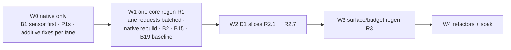

# Fix list

Open fixes for the Octocode tools. A fixed row is deleted, not marked. Last live re-check: 2026-10-06 22:00 on the 21:54 build (reports: `.octocode/evals/e2e-2026-10-06-final/`; prod A/B: `.octocode/evals/github-ab-2026-10-06/`; row reviews: `.octocode/evals/fixlist-review/`).

**P1** wrong or missing evidence, or a broken step · **P2** an extra hop, a guess, or wasted tokens · **P3** polish · **R** rename, needs D1.

Rules: paginate, never trim evidence; keep input flexible; no aliases; after each fix, run the tool live and replay its leads. Paths are under `packages/octocode-native/crates/runtime/src/` unless stated; "core" = `octocode-mcp-host/packages/octocode-core/src/toolContract/`.

Every row carries its plan: **Verdict** (DO · DO-MODIFIED · DEFER · DROP), **Why** (agent impact), **Blast radius**, **Impact** ("list" = tools/list bytes; response bytes; quality), **Wave/Lane** (see Plan), **Test first** (write red before code). Detail per row: `.octocode/plans/2026-10-06/{local,code-intel,github-read,history-artifacts,cross-cutting}.md`.

## Still open now (fix first: the fastest path to 9+)

| ID | P | Fix | Verdict | Why | Blast radius | Impact | Wave/Lane | Test first |
|---|:-:|---|---|---|---|---|---|---|
| N2 | P1 | lspSearch text lead uses the LSP root = **nearest** manifest (engine `lsp/workspace.rs:19`, cwd fallback `:32`): `arrayToMap` lead finds 1 of 62 files; tokio-util missed. New `lsp_search/scope.rs`: nearest `.git`, else outermost workspace manifest, else LSP root; clamped to the policy root; never cwd; `include` = language family. A bounded same-request rg scan sets `coverage.textOnlyFiles` (≤5 → one bulk per-file lead); clear `isPartial` at 0 only for file-level reasons (keep `dynamicDispatch`, `cfgGated`). | DO-MODIFIED | Agent follows the lead, sees 1 file, and wrongly calls the LSP answer complete. | `scope.rs` replaces `importers.rs:159 scan_root`; `failure.rs:431 flag_partial`, `server_coverage.rs:73`; engine resolver returns `Option`; no core | list 0; +40–80 B on partial rows; correct completeness, −1 hop | W0 lsp | `scope_prefers_vcs_root_over_nearest_package`, `scope_is_clamped_to_policy_root_and_never_cwd`, `site_level_partial_survives_matching_counts` |
| N6 | P2 | astTopology: the generic pager plans leaned secondary arrays after the `files` slices (`row_pages.rs:84,396`), so the 349-file SCC splits with no join and runtime cycles land on page 2. Cycle item = small fields first (`fileCount` new, `files` last); pager plans the rest (`runtimeCycles`, `cycleEdges`) before slices; every later part carries `rowPart.continues:{array,index}` (on `rowPart`, not in the element). Per-cycle `next.cycleFiles` deferred. | DO-MODIFIED | A page-1 reader gets 341 files and no runtime cycles; parts cannot be joined. | `response/row_pages.rs` (reorders every split row), `ast_graph/analysis.rs:508`; docs `OCTOCODE_PROTOCOL.md` | list 0; +35 B per later part; correct join | W0 ast | `split_element_later_parts_carry_continues_marker`, `secondary_lists_ride_the_first_part`; Acceptance 4 |
| Q1 | P1 | Warm TS `callers` 1.9 s (refs 334 ms). Root cause: `ops.rs:232 hierarchy` passes an **empty answered-set** to `importers()`, so callers re-verify all 24 lexical candidates; references pass the server-answered files. Fix: walk the hierarchy first, verify only unanswered importers (references parity); engine `ResponseScope.generation` = hash(anchor ⊕ N2 scope fingerprint of path/len/mtime) with first-page reuse; above a size cap, no reuse. No separate importer cache. | DO-MODIFIED | Slowest local hop, paid on every callers batch. | lsp `ops.rs`, `walk.rs:1112,1182`, `importers.rs:277`; engine `lsp/client.rs:379`; no contract | warm < 100 ms; 0 B; same evidence | W0 lsp (after N2) | `callers_skip_importer_verification_for_files_the_walk_answered`, `first_page_reuses_responses_when_generation_matches`, `fingerprint_changes_on_edit_add_delete`; warm timing via MCP (CLI is cold per call) |
| Q2 | P1 | astSearch `match`: drop `valueClipped` from `partialReasons` (`matches.rs:819`); sparse per-match `valueClipped:true` on object rows; `next.readHits` = localFetch `ranges` of the clipped rows only (replaces the prose diagnostic). W1: core declares `complete`, so drill-downs exit 0. | DO-MODIFIED | A false partial flag sends agents re-paging for matches that do not exist and teaches them to ignore `isPartial`. | `ast_search/matches.rs`, `policy_tests.rs`; core `complete` (shared with Q3); `exit.rs` test only | −30–40 B per row; −1 hop | W0 ast (+W1 `complete`) | `clipped_values_do_not_mark_the_row_partial`, `scope_gaps_still_mark_partial` |

## Plan (2026-10-06 night)

| Wave | Content | Gate |
|---|---|---|
| W0 | B1 (report mode) first; every row marked W0 below; pin tests for the dropped N11b and HI10. No contract change. | per lane: tests, live run, lead replay |
| W1 | One regen R1 owned by x: N7, B3, CL3, Q2/Q3 `complete`, Q3 `nested`, AS5, LP8, SH3, SH4, HI5 enum, AR4 table, GR2/GR5/GS6a, LS2/LF1/AR2/HI4 output docs; GS5 page kind if the spike needs it. Then B2, B15, B19 baseline. | B1 C2 + C4 strict |
| W2 | D1 slices, one compile break open at a time: R2.1 D2 (+LP1, LP3, AS2 columns) → R2.2 X1+X2 (+`sourceLineRanges`, CL4, LS3, AS1, AS2, LP2b, LP4, SS2, SS4 key) → R2.3 X6+B12 → R2.4 X4/X5/AR3 → R2.5 X10 → R2.6 X13b → R2.7 D4. Each slice: core → `yarn contracts:regen` → native rebuild → lanes fix own files → x updates docs/skills/harness. | C1 + C3 strict after R2.2; retired-name guard; pre-slice continuation replays fail closed |
| W3 | One regen R3: B8 (title decision), X15, X12 texts, SS5, GC4a, SH1 instruction trim, lane descriptions; then B7, B9, X11 clip removal. | C5 strict; ≤ 14,700 B |
| W4 | B10, B13, B16 split if needed, B19 pre-release soak. | release gate |

| Lane | Sole writer of |
|---|---|
| local | `tools/{local_search,local_fetch,structure_search}/**`, `policy/**`, `tools/numbered.rs` |
| lsp | `tools/lsp_search/**`, engine `lsp/` |
| ast | `tools/ast_*/**`, `tools/ast_rule.rs`, `tools/symbol_outline.rs`, `response/row_pages.rs`, `response/pager.rs` |
| gh | `tools/{gh_search_repo,gh_search_code,gh_structure,gh_get_file_content,gh_shared}/**`, `crates/github/**` |
| hist | `tools/{gh_search_history,gh_get_history_item,artifact_search}/**`, `providers/artifact/**`, `contracts/validate/union.rs` |
| x | core `toolContract/**` and every regen, `response/{rows,pages,channels}.rs`, `runtime/**`, `tools/clasify/**`, `tests/main.rs`, `docs/**`, `skills*/**`, harness sensors |

Seams: other lanes send core edits and `rows.rs`/`exit.rs` set additions to x per regen window; GF3 lives in local (`local_fetch/extraction.rs`); hist adds its `gh_shared` helpers (SH1 parser, X5 `person()`) in a new module; new integration test files are registered by x. R1 waits for the other session's in-flight core edits.

**Build.** At most 3 shared Cargo target dirs: repo `target/` (x only: `$DEV build:dev`, staging, MCP/harness); one scratch dir shared by all lanes for `cargo test -p octocode-native --features octocode-native/dev-unify <filter>` (Cargo's lock serializes; same features share units); optional one for `octocode-engine --all-features`. No per-agent dirs or worktrees (regen and native embed need one tree). The tree always compiles; a regen window freezes edits for about 10 minutes. After each wave x rebuilds, restarts MCP, runs `harness/run-all.mjs` + chain-check, and records kpi in `.octocode/evals/<date>/`.

**Decisions taken.** Keep tool `title`s in tools/list until W3 decides B8. At most 3 shared target dirs (B17). Rename `sourceLineRanges {start,end}` → `{line,endLine}` in R2.2. `retryable` only when true, native-enforced (N7).

## Scores (overall /10, 22:00)

| Tool | Score | Tool | Score | Tool | Score |
|---|--:|---|--:|---|--:|
| localSearch | 7.5 | astRewrite | 8.3 | ghGetFileContent | 8.6 |
| localFetch | 7.5 | ghSearchRepo | 7.9 | ghSearchHistory | 7.6 |
| structureSearch | 7.5 | ghSearchCode | 8.4 | ghGetHistoryItem | 7.7 |
| astSearch | 8.0 | ghStructure | 8.6 | artifactSearch | 7.7 |
| lspSearch | 7.7 | ghCloneRepo | 8.1 | clasify (provider 402) | 6.5 |
| astTopology | 7.9 | | | | |

Whole surface 6.9 (prod 5.5). Production 19.1.0 on the same GitHub tasks: ghSearch 6.0–6.5, ghGetFileContent 5.5, ghSearchHistory 6.0, ghGetHistoryItem 5.5, npmSearch 4.0.

## Decisions

| ID | Decision | Verdict | Why | Blast radius | Impact | Wave/Lane | Test first |
|---|---|---|---|---|---|---|---|
| D1 | One batch of hard-cutover renames (the **R** rows), after B1, in the W2 slice order. Each slice bumps the touched tool's snapshot tag (old cursors → `staleSnapshot` + `next.restart`); a deny-list guard `skills-dev/octocode-dev/scripts/retired-names.json`; no rename-mapping table (the strict unknown-field error already names the new field). | DO-MODIFIED | Agents parse 5 location encodings, 3 owner forms, 2 count vocabularies, 3 code styles. | core output/input schemas + regen; every row builder; `response/*`, `exit.rs`; docs, skills, harness parsers, CLI JSON users | list ≈ −160 B; hit lists ≈0, outlines/callers +25–35% (paged); −1 hop per chain | W2 x + all | per slice: B1 check, one contract fixture per tool, guard entry; replay a pre-slice continuation |
| D2 / X3 | 1-based `column`/`endColumn` everywhere (UTF-16 units, said in the field text); remove lspSearch `position`; `walk.rs:1078 resume_query` re-anchors with `symbolName`+`lineHint`+`orderHint` (no new field). Also ast match/metavar columns, astRewrite ranges, lsp `character`, localSearch `column` (`local_search/cursor.rs:196`). | DO | Output `227:17` pasted into `position` silently hovers line 228. | core `lspSearch.ts`; lsp `anchor.rs`, `walk.rs`, `importers.rs`; `ast_search/matches.rs`, `ast_rewrite/mod.rs:969`; docs 18, skills | list −207 B; removes the wrong-line class | W2 R2.1 lsp+ast+local | `walk_continuations_reanchor_by_symbol_and_line`, `metavar_columns_are_one_based`; B1 C3 |
| D4 | One workspace-relative path form for astSearch, astTopology, astRewrite, display-only: drop basename `display_name` (`tools/mod.rs:48`); astRewrite keeps internal ids and snapshot; `expectedHashes` keys workspace-relative (absolute still accepted); old keys fail closed with "re-run preview". | DO-MODIFIED | A diagnostic path cannot be pasted into localFetch. | `tools/mod.rs:48` callers, `ast_rewrite/{output,mod}.rs:333,1145`, `ast_graph`; ARCHITECTURE line | list 0; invalidates open apply leads | W2 R2.7 ast | `diagnostic_paths_are_workspace_relative`, `boundary_relative_keys_from_old_preview_fail_closed_with_rerun_hint` |
| N7 | `retryable` on error rows only when true; native never emits `false` (delete `dispatch.rs:300`), a native test enforces it; core moves the field from verbose to disclosure. `httpStatus` stays debug-only. | DO-MODIFIED | `errorCode` alone is ambiguous for transport/timeout/5xx; absence = do not retry unchanged. | core `outputSchemas.ts:308`; `runtime/dispatch.rs:92,300`, `runtime/github.rs` tests, `lsp_search/failure.rs`; docs | list 0; +17 B per retryable error row | W1 x | `provider_rows_state_retryable_only_when_true` (404 row has no key) |

## Cross-tool

| ID | P | Fix | Verdict | Why | Blast radius | Impact | Wave/Lane | Test first |
|---|:-:|---|---|---|---|---|---|---|
| X1 | P1·R | Location rows: five encodings today (localSearch `{line,value}`, ghSearchCode `"452\tcode"`, owner-wide `value` without line, lsp `"433:20 in function x 430-475"`, ast `"227-428 function x +"`). Rule: a packed string is only `"<line>\t<value>"`; else an object with next-tool input names: hit `{line,column?,endLine?,endColumn?,value}`, symbol `{symbolName,kind,line,endLine?,exported?}`, caller `{path,symbolName,kind,line,endLine,sites}`, span `{line,endLine}` (also `sourceLineRanges`, clasify `lines`); `path` hoisted per file group; one builder in `response/rows.rs`. | DO-MODIFIED | Parsing packed strings costs guesses and misread coordinates. | core `outputEvidence.ts` grammars; `symbol_outline.rs`, ast/lsp/local/gh_search_code row builders, `numbered.rs`, `render.rs`, clasify `compact.rs`; harness 5 parsers | hit lists ≈0; outlines/callers +25–35% (columnar fallback if B7 regresses >10%); −1 hop | W2 R2.2 x + all | B1 C1 "packed string with ≥2 coordinates" red; lsp callers fixture `tests.rs:2465` asserts objects |
| X2 | P1·R | Enclosing symbol (`in:"fn x@430"`, `"in function x 430-475"`, outline parents) → `enclosing:{symbolName,kind,line,endLine}`; rows grouped `{enclosing, rows}` when ≥2 hits share an owner. | DO-MODIFIED | Feeds lspSearch and `ranges` without parsing. | `local_search/enclosing.rs`, `lsp_search/locations.rs`, `symbol_outline.rs`, core | byte-neutral or smaller on dense files | W2 R2.2 x + local, lsp, ast | `single_hit_enclosing_has_end_line`, `grouped_hits_share_one_enclosing` |
| X4 | P2·R | Commit identity: additive now = HI4 (`targetSha` from GraphQL `baseRefOid`/REST `base.sha`; all three PR SHAs on every view); D1: reviews `commitId` → `commitSha`; a commit row's own `sha` stays. | DO-MODIFIED | Agent re-reads the summary to learn which commit. | native only (`pr_sections.rs:197`; passthrough, unnamed in core/docs) | +55–115 B per PR row (HI4) | W0 + W2 R2.4 hist | reviews page has `commitSha`, no `commitId` |
| X5 | P2·R | Person: value now = compare and PR-commit `author` login-first via one `person()` in `gh_shared`; D1: `user` → `author` on reviews and issue comments; commit view keeps `author`/`committer` objects. | DO-MODIFIED | One person under different keys and values breaks joins. | `gh_search_history/rows.rs:112`, `commit_compare.rs:232`, `pr_sections.rs:196,236`, `issue.rs:254`; native only | ≈0 B | W0 + W2 R2.4 hist | compare commit with login `rickhanlonii` → `author:"rickhanlonii"` |
| X6+B12 | P2·R | Match counts: `matchedLines` stays the **array** of line numbers (fetch tools, `numbered.rs:238`); counts are `matchCount`, `matchedLineCount`, `fileCount` (`totalMatches`, `totalMatchedLines`, `filesMatched` renamed; `TextMatch.matchLines` → `matchedLines`); `pagination.totalItems` counts the paged unit only; one `PageFacts` builder in `response/pages.rs` replaces 38 hand-built blocks. History: per-file `matchCount` now; `totalComments` → `commentsCount`, drop `returnedComments`. | DO-MODIFIED | One word meaning an array in one tool and a count in another forces a guess. | core schemas; `local_search/{types,cursor}.rs` (bump tag), `response/{rows,render}.rs`, lsp `locations.rs:181`, ast `matches.rs`; 38 tool files; harness 14, validate 34; allowlist `octocode-scraping` | −2 to −10 B per stats block | W2 R2.3 x | `page_facts_count_only_the_paged_unit`; fixture table: no `totalMatches`/`filesMatched`/`totalMatchedLines` |
| X7 | P2 | `include` bare word: structureSearch `include:["src"]` now lists only the `src/` entry; localSearch still says "Nothing searched". In `policy/include.rs` a bare word W → `*W*` + `**/*W*/**` for every local tool (astSearch inherits); field text "names or dirs containing it". GitHub-side parsers follow the same rule in their lanes. | DO | The dead-end hop on a directory word. | `policy/include.rs` (local, structure, ast scans); core text | list +10 B; wider matches for words like `test` | W0 local (first; before LS7) | `a_bare_word_also_matches_under_dirs_containing_it`, `bare_word_include_searches_inside_named_dir` |
| X9 | P2 | Renamed repos: transport records followed repo 301s; `gh_shared::canonical_repo` (memo `repo-canonical:` → redirect set → metadata once); ghStructure stores `full_name` with the default branch (free) and swaps to canonical before traverse, dates, and leads; ghGetFileContent rewrites continuations; one `renamed_warning` formatter. | DO-MODIFIED | Leads keep the old name: a redirect per call and stale chaining. | `crates/github` transport + `history.rs:109`, `gh_shared`, `gh_structure/{listing,mod}.rs`, `gh_get_file_content/{mod,errors}.rs`; cache key `repo-default-branch` → `repo-metadata` | +~90 B only on renamed repos; 0 calls otherwise | W0 gh | `gh_shared/tests.rs` (`renamed_to_c_d`): one warning + canonical leads; immutable-cache hit in a new runtime still warns; normal repo `expect(0)` metadata |
| X10 | P2·R | Lead names (47 kinds): vocabulary rule `read*` fetch · `find*` id search · `search*`/`textSearch` · `view*` tree · `include*` same query + flag · lsp leads named after their operation; e.g. `verifyReferences` → `callers`/`references`, `readTopMatch` → `read`; full map from `tool-inventory.mjs` first; no `why`. | DO-MODIFIED | Agents pick leads by name; a misnamed lead runs the wrong operation. | core `continuationChannels.ts`; ~70 native emitter sites; docs 26, 4 skill files, harness 4 | −3 to −10 B per lead | W2 R2.5 x | `every_emitted_lead_is_declared`; B1 C1 lead-name ⇄ target-tool table |
| X11 | P2 | Hint clipping: `response/rows.rs:39` clips at 120 chars **and** `visit()` keeps only the first hint. Each lane rewrites its hint sources to ≤120 chars, action first, lists moved to `warnings`/`summary`; x removes the runtime clip last. | DO-MODIFIED | Clipped or dropped guidance. | hint sources in every tool; `response/rows.rs` | ≈ −30 B per hinted empty row | W0 lanes, W3 x (clip) | per lane `*_hints_fit_without_clipping` (`concise(h) == h`) |
| X12 | P2 | Unpublished fields in hints: continuation fields stay unpublished; B1 C1 text lint fails a field named in `hints.text` that is neither published nor in a lead on the row; lanes turn texts into runnable leads (localFetch `caseMode` `executor.rs:1197,1205`, localSearch `defaultExcludes` `leads.rs:254`, `noIgnore`, `entryType`, ast `captureText`). Do not publish `kinds`. | DO-MODIFIED | A recovery named only in prose fails as an unknown field. | harness lint; local and ast hint texts | list 0; −1 failed hop | W1 lint x; W0–W3 lanes | harness fixture `try caseMode:"insensitive"` without a lead fails C1 |
| X13 | P2·R | Error codes. **X13a now:** one `classify_ref_failure` (`github/src/content.rs:486`) returns `NotFound`/`RefNotFound` for 422 "No commit found"; delete the 3 local re-maps (`gh_structure/traverse.rs:279`, `gh_get_history_item/mod.rs:458`, `gh_search_history/errors.rs`); shared `gh_shared::ref_recovery` → ghStructure `operation:"refs"` lead; `notAFile`/`notADirectory`/`ast.symbols.unsupported` → exit 2. **X13b (D1):** one camelCase enum in core `errorCodes.ts` with a generated exit table (no suffix matching). | DO-MODIFIED | Same failure, different code and exit; scripts and agents misclassify. | X13a: `crates/github`, 3 re-maps, `rows.rs:660` set; X13b: core `outputSchemas.ts:303`, 128 native sites in 26 files, `exit.rs`, docs 19, skills 19 | list 0; bad ref exit 2 → 3; +~110 B lead on ref errors | W0 gh + x; W2 R2.6 x | 422 "No commit found" → `NotFound`; `every_declared_code_maps_to_one_exit_class`; `cli_exit_codes.rs` per class |
| X14 | P2 | Silent omissions: every omitted, unlisted, or skipped count gets a `next` or an explicit terminal limit (Acceptance 4). Lane rows: LP5 (lib items inline), Q3 (nested), LS3 (enclosing drop), GS3 (sizes), ast `macro_rules!` bodies. | DO | An unlisted count invites a false completeness claim. | per lane | small +; never-trim | W0–W1 all lanes | B1 C4 (count > 0 needs `next` or `terminalLimit`) |
| X15 | P2 | Hidden field text: the published view nulls `block`, `minify`, `fullContent` (`publishedSchema.ts:116-119`, shared with ghGetFileContent) and `resultView` (`:197`); canonical `schema` already has them. Publish `resultView` and fix `contextLines` "default 0 (detailed: 3)"; `block` ≤30 B only if the B8 quota allows; `minify` and `fullContent` stay null. | DO-MODIFIED | `countLines` vs `countMatches` vs `matchOnly` are not self-explanatory. | core `publishedSchema.ts`, fixtures | list +60–100 B (inside B8) | W3 R3 x | published-schema test expects the `resultView` text; B8 quota stays green |

## Per tool

### localSearch

| ID | P | Fix | Verdict | Why | Blast radius | Impact | Wave/Lane | Test first |
|---|:-:|---|---|---|---|---|---|---|
| N4 | P2 | A partial result drops the `read` lead even with hits: drop the `self.complete` gate in `read_lead` (`leads.rs:291`); order `read` → `verifyReferences` → `binarySkipped`; the binary warning never names a capped-out lead (it lists the extensions). | DO | Hits on the page but no ready read. | `local_search/leads.rs` | +~180 B on partial rows with hits; −1 hop | W0 local | `partial_binary_cut_page_keeps_read_lead`, `binary_warning_never_names_a_capped_lead` |
| LS2 | P2 | Mark the engine's `rank == 3` rows with sparse `declaration:true`; no `kind` (clashes with `enclosing.kind`); comments stay unmarked (they sort last). | DO-MODIFIED | Agent guesses which same-name hit is the lspSearch anchor. | `local_search/{types,rows}.rs`; core `TextMatchSchema` doc | list 0; +19 B per declaration row | W0 local (+W1 doc) | `declaration_rows_are_marked_sparsely` |
| LS3 | P2 | Stage 1: the label always prints `@line-end`; labels are budgeted in `layout.rs` before the page cut; remove the silent `ENCLOSING_MAX_ROWS` drop. Stage 2: X2 object. | DO-MODIFIED | A missing end line costs a read; labels vanish on pages over 50 rows. | `enclosing.rs`, `leads.rs:559,647`, `layout.rs` | +4–6 B per labelled row; −1 hop | W0 local; W2 R2.2 | `single_hit_label_carries_end_line`, `large_page_keeps_enclosing_labels` |
| LS6 | P3 | One `PathPolicy::nearest_existing_dir` in `policy/path.rs` (moved from `structure_search/mod.rs:166`) for localSearch, localFetch, structureSearch; `pathNotFound` → `next.viewTree` of the nearest parent; one `staleSnapshot` text: "source or query changed; follow next.restart" (`response/pages.rs:479`, via x). | DO-MODIFIED | Text-only recovery makes the agent build the hop. | `policy/path.rs`, `local_search/executor.rs:352`; `pages.rs` text (all tools) | +~170 B on not-found rows; −1 hop | W0 local (+x) | `missing_path_leads_to_nearest_parent_tree`, `nearest_existing_dir_stops_at_policy_root` |
| LS7 | P2 | Scope-miss empty row: add `viewStructure` = structureSearch `files` with the same `path`/`include`/`exclude`; text ≤120 chars. After X7. | DO | The agent cannot see what the globs match. | `local_search/leads.rs`; existing lead kind | +~150 B on scope-miss rows; −1 hop | W0 local | `scope_miss_leads_to_files_listing_with_same_globs` |
| Q5 | P3 | The inferred-regex note shows only when the reading is ambiguous: none for `.*`, `.+`, `.?`, `\w`-style classes, a single `\|`; note for `a?.b`, `$scope`, `arr[0]`, `a \|\| b`. | DO-MODIFIED | Noise on obvious regexes, repeated per row. | `local_search/leads.rs` `add_leads` | −70 B per obvious-regex row | W0 local | `inferred_regex_note_only_when_ambiguous` |
| N8 | P3 | The withheld notice lives only in `warnings` (the empty hint falls back to the normal tip; structureSearch `files.rs` drops its copy); `.map` → `.js.map`, `.mjs.map`, `.cjs.map`, `.css.map`, `.ts.map` in `policy/discovery.rs:81`. | DO | The duplicate displaces the useful tip; Linux keymap sources look absent. | `local_search/leads.rs`, `structure_search/files.rs`, `policy/discovery.rs` (shared) | −90 to −150 B per empty withheld row; correct absence | W0 local | `keymap_sources_are_not_source_maps`, `withheld_notice_appears_once_on_empty_rows` |

### structureSearch

| ID | P | Fix | Verdict | Why | Blast radius | Impact | Wave/Lane | Test first |
|---|:-:|---|---|---|---|---|---|---|
| SS2 | P2 | Keep groups and packed `"name (bytes)"` entries; `dir` becomes workspace-relative (same rule as GS1); root entries move into a `{dir, files}` group (no bare strings); bump `ROW_LAYOUT`. | DO-MODIFIED | The agent joins `path + dir + name` across three shapes. | `structure_search/{mod,files,tree}.rs`; core `LocalDirectoryGroupSchema`; docs; harness `structureFiles` | +20–40 B per group; one shape | W2 R2.2 local | `files_groups_name_workspace_relative_dirs`, `old_layout_snapshot_is_stale` |
| SS3 | P2 | The `files` read lead ranks non-generated, non-test, ≤64 KiB, smaller first; a root `tree` page 1 gets `hints.read` of the manifest (else README, else a small source outline). | DO | The lead pointed at a 4.4 MB generated file (~180 pages). | `structure_search/files.rs` `outline_read`, `tree.rs` | +~150 B on root trees; −1–2 hops | W0 local | `files_read_lead_skips_generated_and_large`, `root_tree_leads_to_manifest` |
| SS4 | P2 | Now: tree entries print exact bytes with the `files` formatter (summary totals stay human); drop the root `.` row. D1: tree `entries` → `files` with SS2. | DO-MODIFIED | Rounded units are lossy and need a second parser. | `tree.rs`, `files.rs:473`; core `LocalTreeGroupSchema` (D1) | ≈0 B; exact sizes | W0 local; W2 R2.2 | `tree_and_files_print_exact_byte_sizes`, `files_never_lists_root_dot` |
| SS5 | P3 | Published-view text only (`publishedSchema.ts:201` flattens the union and keeps the tree text): "1 = children; omit: tree 1 (include: 20), files all." | DO-MODIFIED | A wrong `maxDepth:1` hop on file hunts. | one core string + fixture | list ±0 | W3 R3 x | published-schema test contains `files all` |
| SS6 | P3 | Record ignored dir names (≤64); when one is in the default-prune set, the `includeIgnored` lead sets both `noIgnore` and `defaultExcludes:false`; hint ≤120 chars, names move to `summary`. | DO | Two hops to reach a gitignored, pruned dir. | `structure_search/mod.rs:325 note_empty`, walks | −1 hop; −50 B text | W0 local | `include_ignored_lead_lifts_gitignore_and_prune_in_one_hop` (replay lists `x.rlib`) |
| N8b | P3 | Summary says `"{files} files, {dirs} dirs, {size}"` (drop the conflicting entries total, `tree.rs:398`); `note_empty` stops restating the summary. | DO | Agents compare counts to judge completeness. | `tree.rs` summary, `mod.rs` `note_empty` | −40 to −120 B | W0 local | `tree_summary_matches_paged_row_counts` |

### localFetch

| ID | P | Fix | Verdict | Why | Blast radius | Impact | Wave/Lane | Test first |
|---|:-:|---|---|---|---|---|---|---|
| N3 | P2 | Minified files: with neither `contextLines` nor `contextBytes` set, size each window to ≤~2 KiB (hit line whole) and add `next.expandContext` (`contextLines:10`) when narrowed; skip `readBlock` leads over ~16 KiB unseen. | DO-MODIFIED | One hit costs 11.5 KB and the lead points at a 48 KB read. | `local_fetch/extraction.rs` (`match_extract`, `finish_cut_declarations`) | 11.5 KB → ~2.3 KB per hit; full window one lead away | W0 local (before LF1) | `minified_default_window_is_byte_bounded`, `read_block_lead_is_byte_capped` |
| LF1 | P2 | `block:true` declaration-first: when a hit is on a declaration name line, widen only those hits; call-site hits keep their window (warning names the count); no declaration hit → today's widening; return `blocks:[{symbolName,line,endLine}]`. GF3 shares this extraction. | DO-MODIFIED | A call-site hit drags in a 259-line caller. | `local_fetch/{block,extraction,types}.rs`; core `FileContentShape` doc; ghGetFileContent via shared extraction | list 0; −10 KB on mixed hit sets; +45 B per block | W0 local (+W1 doc) | `call_site_hits_keep_window_when_a_declaration_hit_exists`, `block_reports_widened_declarations` |
| LF3 | P2 | `minify:"symbols"`: declaration heads get a `start-end` gutter (`13-37\t…`). `totalLines` already counts source lines; reword the outline-line count ("N more outline lines"). | DO-MODIFIED | No `ranges` for a body without another call. | `local_fetch/{executor,pagination}.rs`, `numbered.rs` `tab_gutter`; check harness `large-files.mjs` | +3–5 B per declaration head; −1 hop | W0 local | `symbols_view_heads_carry_line_ranges`, `symbols_pagination_names_outline_lines` |
| LF4 | P2 | A directory → `notAFile` + `next.viewTree`; a missing file → `viewStructure` `files` at the nearest existing dir with `include:[stem]`; the miss hint drops unpublished `caseMode` and gets a runnable localSearch lead; `notAFile`/`notADirectory` exit 2 (x). | DO | Text-only errors and a wrong exit (5). | `local_fetch/{executor,output}.rs`, LS6 helper, `response/rows.rs:660` set | +~170 B per error row; −1 hop; exit 5 → 2 | W0 local (+x) | `directory_path_is_not_a_file_with_tree_lead`, `missing_file_leads_to_files_by_stem`, `not_a_file_and_not_a_directory_are_invalid_input` |

### astSearch

| ID | P | Fix | Verdict | Why | Blast radius | Impact | Wave/Lane | Test first |
|---|:-:|---|---|---|---|---|---|---|
| AS1 | P2 | Symbol JSON rows `{symbolName,kind,line,endLine,exported}` (`exported` only when true); the text render keeps the outline line. | DO-MODIFIED | Structured clients parse `"227-428 function x +"`; names feed lspSearch as is. | `symbol_outline.rs` (shared with lsp documentSymbols), `ast_search/symbols.rs`, core `SymbolRowsSchema`, harness, skills | JSON +~40% per symbol; text 0 | W2 R2.2 ast | `structured_rows_feed_lsp_anchor` (text render byte-identical) |
| AS2 | P1 | Match rows always `{line,column,endLine,endColumn,value}`, 1-based (D2); clipping per Q2 (sparse `valueClipped` + `next.readHits`). After Q2. | DO-MODIFIED | Packed rows hide columns; `captureText` rows are 0-based. | `ast_search/matches.rs:992-1062`, `read_top_hits:937`, core `SearchFileSchema`, astRewrite rows | +~25 B per match row (JSON) | W2 R2.1–R2.2 ast | `match_rows_are_objects_with_one_based_columns` |
| AS4 | P2 | Empty hints per operation: symbols "0 declarations named X in N files" + localSearch `\bX\b` lead; match "0 matches in N parsed files" + `syntaxTree` lead on the first parsed file. | DO | One generic hint for every empty case. | `ast_search/{output,symbols,matches}.rs` | small +; −1 guess | W0 ast | `empty_symbols_hint_names_file_count_and_text_lead`, `empty_match_hint_leads_to_syntax_tree` |
| AS5 | P2 | Accept a rule-config object `{rule, constraints?, utils?, transform?}`, parsed as the YAML rule file (value coercion, not an alias); astRewrite shares it. | DO-MODIFIED | The object form fails while the YAML equivalent works. | core `astRule.ts` union; `tools/ast_rule.rs` | list 0 | W1 ast | `rule_config_object_matches_like_yaml_rule_file` |
| N11 | P3 | With a name filter, keep recovered-parse notes only for files whose source contains the name (else paths as strings); `response/pager.rs:493 build_continuation` carries the caller's original queries so a rejected row keeps its index. | DO-MODIFIED | 68% noise; shifted indices break chain fit. | `ast_search/symbols.rs:478-548`; `response/pager.rs` + `stage.rs` caller | ~−1 KB on the `sdsnewlen` case | W0 ast | `recovered_notes_only_for_files_mentioning_the_name`, `continuation_keeps_rejected_rows_and_indices` |

### lspSearch

| ID | P | Fix | Verdict | Why | Blast radius | Impact | Wave/Lane | Test first |
|---|:-:|---|---|---|---|---|---|---|
| LP1 | P1 | `position {227,17}` from output `227:17` hovers line 228: remove `position` (D2). | DO | See D2. | see D2 | see D2 | W2 R2.1 lsp | `walk_continuations_reanchor_by_symbol_and_line` |
| LP2 | P1 | (a) Paths inside call rows via one `display_path` helper, never file-relative (`walk.rs:581`); continuations keep the caller's `workspaceRoot` string (`mod.rs:321`). (b) D1: call rows as X1 objects. | DO-MODIFIED | `../../../../node_modules/…` forces a path join. | lsp `walk.rs:742-845`, `mod.rs:299-322`; response helper | ≈0 B; −1 join | W0 lsp; W2 R2.2 | `declared_in_paths_are_workspace_relative`, `workspace_symbol_next_page_keeps_relative_root` |
| LP3 | P1 | Drop `callHierarchy` (mixes callers and callees in one `files[]`); `callers`/`callees` walk with depth. | DO | Mixed rows cannot be told apart. | core enum; `walk.rs`, `importers.rs`, `ops.rs`, `receipt.rs`; docs, 2 skills | list −16 B | W2 R2.1 lsp | `call_hierarchy_operation_is_rejected_with_callers_callees_hint` |
| LP4 | P2 | References as grouped X1 rows; sparse `source:"importer"` only on recovered sites, replacing `recovered.recoveredImporter`. | DO-MODIFIED | Recovered sites stay distinguishable without a side object. | lsp `ops.rs:177`, `locations.rs`, `recovery.rs` | ≈0 B | W2 R2.2 lsp | `recovered_sites_carry_sparse_source_marker` |
| LP5 | P2 | List `lib.*.d.ts` items inline as `builtinLib:["String.toUpperCase",…]` (no continuation); `unlistedNested` → Q3. | DO-MODIFIED | Silent omission (Acceptance 4). | `walk.rs:338,1032` | +~15 B per item | W0 lsp | `builtin_lib_callees_are_listed_not_counted` |
| LP6 | P2 | Warning text names the container the lead lands in (generated from `tools::id::channel`); an all-features rerun still runs the scope-wide gate scan and flags `cfgNegatedFeatures`; no per-operation description lines (budget). | DO-MODIFIED | The warning points at `next.allFeatures` but the lead is a hint; the rerun silently loses 7 sites. | `server_coverage.rs:46-73` | small + | W0 lsp (after N2) | `all_features_run_flags_negated_feature_gates`, `warning_names_the_channel_the_lead_lands_in` |
| LP7 | P2 | Unresolved anchor → scan the file for the word, ≤3 runnable re-anchor leads (declarations first); workspaceSymbol with a directory `path` → `workspaceRoot`. | DO | A wrong `lineHint` dead-ends. | lsp `failure.rs:351`, `mod.rs:503` | −1 hop | W0 lsp | `unresolved_anchor_leads_to_real_symbol_lines`, `workspace_symbol_accepts_directory_path` |
| Q3 | P2 | documentSymbols ignores the 40-item default unless `pageSize` is set (the byte pager bounds it); `unlistedNested` → `next.expandNested` (unpublished `nested:true`) with `complete:true` (exit 0 drill-down). | DO-MODIFIED | A 52-symbol file needs 2 calls; nested symbols are unreachable. | lsp `locations.rs:620`, `render.rs`; core per-operation default, `nested`, `expandNested`, `complete` (with Q2) | list 0; −1 call per typical file | W1 lsp | `document_symbols_default_returns_all_symbols_one_page`, `nested_symbols_reachable_via_expand_nested` |
| Q4 | P3 | A TS/JS `variable` whose name line matches `type NAME =` gets kind `type`. | DO | Type aliases read as variables. | lsp `document_symbols_payload` | 0 B | W0 lsp | `ts_type_alias_symbol_kind_is_type` |
| LP8 | P3 | `importerScan` stays a disclosure; `verifiedImporterFiles` becomes verbose (debug-only): callers and references count different things. | DO-MODIFIED | Disagreeing counts invite a wrong comparison. | core field classes | −~30 B per row | W1 lsp (after Q1) | `verified_importer_files_is_debug_only` |

### astTopology / astRewrite (CLI beta)

| ID | P | Fix | Verdict | Why | Blast radius | Impact | Wave/Lane | Test first |
|---|:-:|---|---|---|---|---|---|---|
| B11 | P2 | astRewrite preview-only memo in a runtime store (`declarations_cache` pattern), keyed on root, rule, language, globs, caps, executable digest; page > 1 reuses when the snapshot and file stats match; apply always re-prepares. Does not wait for D4. | DO-MODIFIED | Each preview page re-parses every file. | `ast_rewrite/mod.rs:264-353` | page ≥ 2: prepare → stat-only | W0 ast | `preview_page_two_reuses_prepared_files`, `apply_always_reprepares` |

### clasify (provider returns 402; judgments unmeasured)

| ID | P | Fix | Verdict | Why | Blast radius | Impact | Wave/Lane | Test first |
|---|:-:|---|---|---|---|---|---|---|
| N1 | P1 | A cut window re-clusters its own hits at the fitted radius (`hit_cluster_windows_with`), reads the densest sub-window now, and puts the rest in the unjudged pool (→ `next.clasify`/`hints.read`); never shrink around a non-hit point (`run/hydrate.rs:125,586`). | DO-MODIFIED | The judge sees no hit and returns a false negative. | `tools/clasify/run/hydrate.rs`; no contract | +0–1 provider page per cut cluster | W0 x | `cut_window_recenters_on_hits_and_keeps_the_rest` |
| N13 | P2 | A 402 on a search resource exits 2: `runtime/exit.rs:93 clasify_failure` reads `resource.error` only when `pages` is absent, and `compact.rs:207` hoists the shared 402 there. Always include the resource code, then pages and answers. | DO | Scripts treat a quota failure as bad input. | `runtime/exit.rs` | exit 2 → 5 | W0 x | extend `clasify_whose_every_read_failed_exits_like_that_read`; `cli_exit_codes.rs` exit 5 |
| N12 | P3 | Move the 60 s quota memo after `capture_all` and per-page locate validation, before any provider request (`run/mod.rs:367`). | DO-MODIFIED | An input error reads as a quota error. | `tools/clasify/run/mod.rs` | correct exit 2 in the memo window; enables CL1 | W0 x | `runtime_clasify`: 402, then a minified locate within 60 s → InvalidInput |
| CL1 | P2 | Every failed resource, the memo path included (`unjudged_matrix`), carries the `read` lead search pages already carry (read → its own query; locate + prefilter → `matchString` from the literals); kept when `single_bare` collapses. | DO-MODIFIED | The only way forward while the provider is down. | `run/render.rs:287`, `output.rs`, `compact.rs` | +~120 B per failed resource | W0 x (with N12) | 402 on a localFetch locate → `read` passes `validate_query` |
| CL3 | P2 | `tool` text "Any read tool but clasify; query is its row." built from `clasifyContextTools()`; do **not** publish `candidateEvidence` (automatic; +90 B, no hop saved). | DO-MODIFIED | Text says "a read tool" while 13 tools work. | core `publishedSchema.ts:670` | list ≈0 | W1 x | published-view text test |
| CL4 | P3 | Typing `mainGoal`, `reasoning`, `ask`, `known`, `labels`: deferred (80–120 B, no measured error). `lines:[a,b]` in pages and `best` → `{line,endLine}` in R2.2. | DEFER | Runtime validation already rejects bad shapes. | `tools/clasify/compact.rs:99-125`; docs `OCTOCODE_CLASIFY.md`, skill `clasify.md:35` | list 0 | W2 R2.2 x | compact tests expect `line`/`endLine` |

### ghSearchRepo

| ID | P | Fix | Verdict | Why | Blast radius | Impact | Wave/Lane | Test first |
|---|:-:|---|---|---|---|---|---|---|
| GR1 | P2 | Drop topics equal to the language (as for the repo name). The repeated pagination warning is the shared page contract → B7. | DO-MODIFIED | Non-evidence bytes. | `gh_search_repo/mod.rs:372 repository_row` | −8 B per row | W0 gh | extend `topic_naming_the_repository_itself_is_dropped` |
| GR2 | P3 | `fork:true` only when true (owner listings return forks; search excludes them by default). | DO | An org's forks look like its own source. | `github/src/search.rs:78`, `repository_row`; core `RepositorySchema` doc | 0 B on search rows; +12 B per fork row | W0 gh (+W1 doc) | owner listing mock with one fork |
| GR4 | P3 | Remove the `searchContent` branch of `top_leads` (the kind stays for other tools). | DO | Repo words reused as code keywords give a junk search. | `gh_search_repo/mod.rs:253`, `provider_tests.rs:128`, docs | −125 B when emitted; frees a lead slot | W0 gh | page-2 keyword search has no `searchContent` |
| GR5 | P3 | `archived:true` means include archived (no qualifier); only-archived stays reachable with `qualifiers:"is:archived"` (then no default `archived:false`). Partial without `partialReasons` → B7. | DO-MODIFIED | The `includeArchived` lead returns only archived repos. | `gh_search_repo/query.rs:49`; core field text "Include archived." | list ±0; −1 hop | W0 gh (+W1 text) | `archived:Some(true)` → neither qualifier |

### ghSearchCode

| ID | P | Fix | Verdict | Why | Blast radius | Impact | Wave/Lane | Test first |
|---|:-:|---|---|---|---|---|---|---|
| GC2 | P2 | Owner-wide rows: take the SHA from each hit's `html_url` (`/blob/<sha>/`), resolve lines per repo at that SHA, pin `readTopMatch` `ref`. Repo-scoped keeps `resolve_commit` (index lag). | DO-MODIFIED | No line numbers and an unpinned read. | `gh_search_code/{code_output,mod}.rs`; core `commitSha` per file if undeclared; +N cached contents reads | fragments → numbered lines; +0.5–1 s; −1 hop | W0 gh (after GC3) | two-repo mock → numbered `lines`, `readTopMatch.ref == S`; 404 at S → `lineResolved:false` |
| GC3 | P2 | With no line holding every keyword, anchor on the smallest ≤60-line window holding each keyword, preferring a declaration start. | DO | Two-keyword reads miss the hits (`487-509`). | `gh_search_code/lines.rs:157` | 0 B; 1 hop instead of 2–3 | W0 gh | `sessions.py`-shaped fixture → `best == 831` |
| GC4 | P3 | (a) Published `keywords`: "ANDed literal items (a phrase is one); no OR/NOT." (b) `atRef:false` rows: the existing `viewRepo` lead gets `include:[basenames]` and drops `path`. | DO-MODIFIED | A moved file needs a name search. | core `publishedSchema.ts:131,144`; `code_output.rs:243` | list +36 B; +~20 B per ref search with misses | W0 gh (b); W3 (a) | ref search 404 → `viewRepo.include == ["adapters.py"]` |

### ghStructure

| ID | P | Fix | Verdict | Why | Blast radius | Impact | Wave/Lane | Test first |
|---|:-:|---|---|---|---|---|---|---|
| GS1 | P2 | `entries[].dir` repo-relative (the root row = the requested path); fix `dates.rs::attach` path rebuild in the same edit. | DO | Input form ≠ output form. | `gh_structure/{listing,dates}.rs`; 2 tests flip; clasify item joins | +len(path) per dir | W0 gh | path `pkg` → `dir == "pkg/src"` and `updated` maps every name |
| GS3 | P3 | Send file sizes, in the SS2/SS4 entry shape once it lands; materialize already names skipped paths. | DEFER | A second cutover if shipped before SS2. | `gh_structure/listing.rs` | +~7 B per file | W2 after R2.2 gh | 2-file tree → both sizes in the SS2 form |
| GS4 | P3 | Rank the read lead: include-stem match (non-test) → shallow entry files → other non-test code → manifest → README; stop emitting `exploreClone` after materialize. | DO-MODIFIED | The first read lands on a test or README. | `gh_structure/listing.rs:189`, `mod.rs:237`; docs | −~110 B per materialize | W0 gh | `[__tests__/X-test.js, client/X.js]` → `client/X.js` |
| GS5 | P2 | Dates on 300 entries take ~12 s. The GraphQL group is `Semaphore(1)` + 1 s spacing (`github/src/budget.rs:367`), so concurrency is out. Spike first: 1×300 aliases ≤5 s → `MAX_PATHS_PER_REQUEST` 300; else date the first 100 + `next.expandDates` (new page kind, per-chunk cache keys). | DO-MODIFIED | Slow first page on every recursive listing. | `github/src/commit_dates.rs`, `gh_structure/{dates,mod}.rs`; core kind (option 2 only) | ~12 s → ~4 s; 3 → 1 GraphQL point | W0 gh spike (+W1 kind) | 250 entries → 1 GraphQL request (or `expandDates` replay = 1 request) |
| GS6 | P3 | (a) Refs as maps `branches:{name:sha}`, `tags:{…}`; newest-first deferred; a smaller default page is rejected (rigid per-op default). (b) A materialize resume (`materializeOffset > 0`) omits `entries`. | DO-MODIFIED | Repeated keys and a re-sent tree. | `gh_structure/{refs,materialize,mod}.rs`; core `GitHubRefSchema` | −2.4 KB per refs page; −3.6 KB per resume | W0 gh (b); W1 (a) | refs → objects; resume at offset 50 has no `entries` |

### ghGetFileContent

| ID | P | Fix | Verdict | Why | Blast radius | Impact | Wave/Lane | Test first |
|---|:-:|---|---|---|---|---|---|---|
| GF3 | P2 | `readBlock` covers the first hit only (`extraction.rs:300 find_map`): one lead with `ranges` = every cut block's unseen lines (≤10, merged), with LF1's declaration rule. | DEFER | Same file and rule as LF1; owned by local. | `local_fetch/extraction.rs` | −1 hop per extra hit | W0 local (+gh replay test) | two-function JS fixture → `readBlock` covers both |
| GF4 | P3 | A bad ref returns `notFound` with a ghStructure `refs` lead (X13a). | DO | See X13. | see X13 | exit 2 → 3 | W0 gh | bad ref → `notFound`, lead `operation == "refs"` |

### ghSearchHistory

| ID | P | Fix | Verdict | Why | Blast radius | Impact | Wave/Lane | Test first |
|---|:-:|---|---|---|---|---|---|---|
| SH1 | P2 | `prNumber` only when the headline ends in `(#N)` (parser moved from `patch_hop.rs:353` to `gh_shared`); one `readPullRequest` lead for the first such row, with `include:[path]`; R3 trims the "(#N) headline" instruction clause. | DO | The commit → PR route takes 3 calls. | `gh_search_history/{rows,leads,shape}.rs`; `instructions.ts`; 2 skill refs | +17 B per suffixed row; instructions −45 B; −1–2 calls | W0 hist (+W3 trim) | `"Revert \"y (#1)\" (#2)"` → 2; mock → `readPullRequest {number:9, include:[path]}` |
| SH2 | P2 | Issue rows get `commentsCount` when non-zero (the `map_pr` rule); no `updatedAt` added. | DO | The agent cannot choose which discussion to read. | `gh_search_history/rows.rs:97` | +18 B per commented issue | W0 hist | `map_issue` 105 → count; 0 → no key |
| SH3 | P2 | PR/issue `since`/`until` → `created:>=`/`<=` with a disclosure warning (merge dates via `qualifiers merged:`); reject when `qualifiers` sets `created:`; publish commit `ref`. | DO-MODIFIED | One failed call plus a hand-written retry. | core `historyBranches.ts`, `history.ts`, `publishedSchema.ts:84`; native `mod.rs`, `query.rs`, `filters.rs`; field-effect coverage | list +~10 B; −2 calls | W1 hist | mock `since:"2026-09-01"` → `created:>=2026-09-01` + warning; conflict → invalidInput |
| SH4 | P3 | The rejection lists the allowed keys from the contract (`x-qualifierKeys`, unpublished meta) in `schema.rs` `pattern_message`; add `linked:`; drift test native `QUALIFIER_KEYS` = contract. | DO-MODIFIED | The agent guesses keys. | core `historyIssueInput.ts`; `filters.rs:113`, `query.rs`, `contracts/validate/schema.rs:352` | list 0; +250 B on error rows only | W1 hist | pattern failure lists the keys; drift test |
| SH5 | P3 | With ≥2 keywords, `broadenSearch` is one bulk lead of drop-one variants (≤5); with 1, today's lead. | DO | Dropping every keyword returns a 3 KB junk page. | `gh_search_history/leads.rs:120` | +60 B per variant on empty rows | W0 hist | `[a,b,c]` → 3 queries; 7 keywords → 5 |
| SH6 | P2 | Tool-local: drop `totalPages`, drop the envelope `owner`/`repo` echo when the query names them, `readPullRequest` → row 0 of best-match order. Per-row "N more", the partial banner, and `isPartial` on `hasMore` → B7. | DO-MODIFIED | Non-evidence bytes (2.72× rg/gh). | `gh_search_history/{shape,rows}.rs` | −60–90 B per page (−130–200 B more via B7) | W0 hist | no `totalPages`/`owner` when scoped; byte cap on the fixture page |

### ghGetHistoryItem

| ID | P | Fix | Verdict | Why | Blast radius | Impact | Wave/Lane | Test first |
|---|:-:|---|---|---|---|---|---|---|
| HI4 | P2 | GraphQL selects `baseRefOid` → `targetSha` (REST `base.sha` fallback); `slim_row` keeps `targetSha` + `mergeCommitSha` on every view, patches and matchString included. `targetSha` is not the merge base (documented). | DO | The agent re-reads the summary to learn which commit. | `gh_get_history_item/{graphql,pull_request}.rs:79,432`; core doc | +55–115 B per PR row; 0 calls | W0 hist (+W1 doc) | PR mock with `baseRefOid` → `targetSha` on summary, files, patches, matchString |
| HI5 | P2 | Core: commit/compare `sections` accept `files` (the default view, no-op); `union.rs` aggregates allowed values only from the branch whose discriminator matched (mirror `unionIssues.ts`). | DO | One failed call and a wrong allowed list. | `contracts/validate/union.rs:80` (all union tools; coordinate B10); core `history.ts:196`, `unionIssues.ts` | list 0; −1 call | W0 hist (union); W1 (enum) | compare `sections:["x"]` → "allowed: files, patches" |
| HI6 | P2 | Top-level counts describe the whole commit; the scoped count is `filePagination.totalItems`; delete `commitTotals` (passthrough, unnamed in core/docs); `include` matching 0 of N warns with ≤5 nearest dirs. | DO-MODIFIED | Two "changed files" numbers invite a wrong citation. | `gh_get_history_item/commit_compare.rs:59` | −25 B | W0 hist | 18-file commit + include → `changedFilesCount:18`, 9 files, no `commitTotals`; `nope/**` → warning |
| HI7 | P2 | Issue summary: `commentsCount` + `readComments` lead when > 0. PR summary: `commitsCount`, `reviewThreadsCount` (GraphQL; omitted on REST); drop the constant `themes`, keep `countScope`. | DO-MODIFIED | A blind section guess. | `gh_get_history_item/{issue,graphql,pull_request,pr_sections}.rs` | +~40 B per summary | W0 hist | issue 105 → count + lead; PR summary has both counts |
| HI8 | P2 | `omitted` rows print `M !omitted path` (no fake `+0 -0`; `tooLarge` keeps counts); the first unpatched file with no merge read gets the existing `readAtCommit` + `readParent` (reuse `change_reads`, no new lead name). | DO-MODIFIED | Fake counts and a dead-end file. | `gh_get_history_item/{inventory,pull_request,commit_compare,pr_menu}.rs` | −6 B per row; dead end → 1 call | W0 hist | omitted → `"M !omitted x.js"`; tooLarge-only page → `readAtCommit` |
| HI9 | P2 | No core change: (a) `window_end` cuts inside the next file at a line end when the whole-file boundary is under 75% of the window; (b) patch-only `continuePatch` leads carry `responseLength = min(2 × configured default, 50,000)` (already a continuation field). | DO-MODIFIED | The 115-file walk takes 38–51 calls (prod 18). | `gh_get_history_item/{patch,patch_hop,promotion}.rs` | ~18 calls; same bytes; pages ≤ ~11 K tokens | W0 hist | synthetic 115-file / 560 K PR walked by leads in ≤20 calls, byte-identical, 0 gaps |
| HI11 | P3 | `readAtMerge` carries `matchString` (≤10 distinctive added lines, one per hunk) and no `ranges`; exact ranges only at `sourceSha`. | DO | sourceSha line numbers read the wrong window on drifted files. | `gh_get_history_item/pr_menu.rs:331` | ≈0 B | W0 hist | lines shifted +3 at the merge commit → both hits found |
| HI12 | P3 | (a) Compare commits: headlines only + a `readCommit` lead; (c) `readCommentCode` groups anchored comments by (path, commitSha), ≤10 ranges ±3. (b) The comment cursor stays (lossless). | DO-MODIFIED | Several KB of messages; one-line comment reads. | `gh_get_history_item/{commit_compare,pr_sections,pull_request}.rs` | ~−70% compare commit bytes | W0 hist | 3-commit compare → no `message` + `readCommit`; 3 anchors → one lead, 3 ranges |

### artifactSearch

| ID | P | Fix | Verdict | Why | Blast radius | Impact | Wave/Lane | Test first |
|---|:-:|---|---|---|---|---|---|---|
| AR2 | P2 | Row gets `sourceRef` and `verification` ∈ {`provenance`, `tag`, `registryRef`, `defaultBranch`}; every lead keeps its label; no copied `owner`/`repo`. | DO-MODIFIED | The agent cannot tell a verified release ref from a registry claim. | `providers/artifact/types.rs:263` + providers, `artifact_search/leads.rs:58`; core `ArtifactSchema` doc | +45–70 B per exact row | W0 hist (+W1 doc) | npm gitHead → `registryRef` on row and leads; maven no ref → `defaultBranch` |
| AR3 | P2·R | Hard cutover `type` → `ecosystem`, `registry` → `registryUrl` (no alias); `{type:…}` fails naming `ecosystem`. Naming only: no agent failure measured. | DO | One clear input name. | core `artifactSearch.ts`, validation (4 branches); native types, fixtures; docs 10, skill refs 6, README, harness | list +10 B | W2 R2.4 hist | `{type:"npm"}` → invalidInput with `ecosystem` in `knownFields` |
| AR4 | P2 | Core capability table `{ecosystem:{version,keywords}}` drives the `version` text and the native gate (replaces `providers/artifact/mod.rs:52 matches!`); Maven exact version: POM + tag probe stripping `-jre`/`-android`; go `publishedAt`; pypi `readManifest` → `setup.py` for setuptools. Maven license/date deferred. | DO-MODIFIED | A failed call plus a manual GitHub hunt; a wrong manifest read. | core `artifactSearch.ts`; `providers/artifact/{mod,maven,registries,release_ref}.rs`, `leads.rs:96` | −1 call | W1 hist | maven `33.0.0-jre` → `sourceRef:"v33.0.0"`, `verification:"tag"`; go `publishedAt`; pypi → `setup.py` |
| AR5 | P2 | Drop the `dependencies` count when `dependencyList` is complete; keep lead wrappers. The 5.44× gap is mostly the baseline: re-baseline in B1 with `npm view --json …`. | DO-MODIFIED | Duplicate bytes; a misleading KPI. | provider mapping; B1 KPI | −17 B per row | W0 hist | a full list serializes without `dependencies` |

## Build, sensors, tests

| ID | P | Fix | Verdict | Why | Blast radius | Impact | Wave/Lane | Test first |
|---|:-:|---|---|---|---|---|---|---|
| B1 | P1 | No chain sensor. Copy recovered `4af87c11` (checker) and `d2bd50a1` (kpi) from `.octocode/recovered-sensors/` into `octocode-local-testing/harness/{chain-check,kpi,acceptance}.mjs` (outputs to `.octocode/evals/<date>/`, complexity skipped); pure C1–C5 checks + static half as config test `contract-acceptance.test.ts`; report mode first, strict per wave; the first run must flag the known open rows (X1, D2, Q3, N6, B8). | DO-MODIFIED | Every later number needs it; the old checker passed 16/16 with X1–X6 open. | harness new files + `run-all.mjs`; config test | none on the surface | W0 x (first) | `acceptance.test.mjs`: one red and one green fixture per check |
| B2 | P2 | One table-driven test, 16 tools × {empty, error}, through each tool's real path (temp workspace, wiremock, mock provider): `validate_output`, declared code, one runnable recovery, exit class. | DO-MODIFIED | `path_errors_have_one_hint_on_every_tool` bypasses each tool's `error_hint`. | new `tests/runtime_empty_error_rows.rs`; after LS6/LF4 | none | W1 x | the table itself (lspSearch vs structureSearch `pathNotFound` differ today) |
| B3 | P3 | Remove the never-emitted `retryRenamed` in core (with N7), native test lists, validate `tasks.json`. | DO | Dead contract surface. | core `continuationChannels.ts:128`; `channels.rs:326`, `gh_shared/tests.rs` | list 0 | W1 x | `every_declared_continuation_kind_has_its_contract_channel` |
| B7 | P2 | Bytes per answer 1.90× rg/gh: emit `shared` only when ≥2 rows share the key; keep `root`; take the shared page-warning dedupe (GR1, GR5, SH6). Target 1.5× (1.3× stretch). | DO-MODIFIED | Framing on small answers. | `response/{rows,render}.rs` | −5–9% on one-row answers | W3 x | one-row ghGetFileContent: `commitSha` on the row, no `shared` |
| B8 | P2 | tools/list 13,733 B + instructions 1,324 B = 15,057 B. Plan: D2 −170, `BATCH` second sentence −53, lspSearch description −110, lane texts −30, X15 +60, AR3 +10, `caseMode` +35 ⇒ ≈14,800; then the W3 `title` decision (−336) or a ≈110 B harder description cut. Default surface ≤14,700; clasify its own ≤1,300. | DO-MODIFIED | Every MCP session pays it. | core `instructions.ts:136`, `descriptions.ts`, `publishedSchema.ts`, `catalog.ts`, fixtures | −350 to −600 B per session | W3 x | `published_surface_within_budget` (sum + per-tool quotas) red today |
| B9 | P2 | Lead share 0.196–0.233 → ≤0.15: keep the full `{queries:[row]}` envelope; ≤1 lead on a complete single-hit answer; strip default-valued fields from lead queries centrally; X10 names. | DO-MODIFIED | Lead bytes crowd out evidence. | `response/{channels,continuations}.rs` | −80 to −190 B on small answers | W3 x | one-hit localSearch keeps 1 lead; no default-valued field; kpi ≤0.15 |
| B10 | P2 | Four output walks and union-branch clones → one walk, measured after D1 (`response/stage.rs`). | DEFER | Performance only; D1 changes what each walk does. | `response/stage.rs`, `contracts/validate/union.rs` (coordinate HI5) | latency | W4 x | kpi shared-stage time before/after |
| B13 | P3 | Complexity residue: the script is lost; clippy `too_many_lines`/`cognitive_complexity` + a clone scan after D1; fix only clones D1 touches. | DEFER | Stale numbers until shapes settle. | `runtime/dispatch.rs`↔`domain_dispatch.rs`, `local_search/manifest.rs`↔`structure_search/memo.rs` | none | W4 x | — |
| B15 | P3 | `dev-unify` drift: `skills-dev/octocode-dev/scripts/dev-unify-check.mjs` compares `cargo tree` feature sets of `build:dev` vs `test:rust` inside `$DEV verify`. | DO-MODIFIED | A new dev-dependency feature silently brings back recompiles. | `dev.mjs` verify | build time | W1 x | `dev-unify-check.test.mjs` with canned trees |
| B16 | P3 | Measure cold test-build idle (fresh scratch target, `CARGO_INCREMENTAL=0`) against the pre-merge revision; split `tests/main.rs` into 2–3 binaries only if ≥15% slower. | DO | 179 s → 233 s was measured under load. | `tests/main.rs` | build time | W0 measure; W4 split | — |
| B17 | P3 | At most 3 shared target dirs (decided; see Plan): update the `AGENTS.md` Build section and `rust-best-practices` `build-profiles.md:67`. | DO | Per-agent dirs cost ~25 GB each. | `AGENTS.md`, skill reference | disk, build time | W0 x | — |
| B18 | P3 | Root `build:dev` stops at the contract check: add `"verify"` to `packages/octocode-pi-extension` (owner: that package's session, via agents-communication). | DO | `$DEV verify` fails the workspace contract. | that package only | — | W0 (handoff) | `workspace-health.mjs` passes |
| B19 | P2 | One unreproduced 10-minute stall. `harness/soak.mjs --minutes=30`: stderr tee, exit code/signal, all 12 tools, cold restart every 5 min, 120 s per-call deadline → `sample <pid>`, RSS every 30 s, crash reports; CLI variant of 100 starts. Pass: no unexpected exit or breach, RSS < +25%, p95 drift < 2×. | DO-MODIFIED | A first-load hang would ship unseen. | new harness script | — | W1 baseline; W4 pre-release | `--minutes=0.2` dry run detects an injected slow tool |

## Acceptance (B1 checks)

1. **Chain fit.** Every field a lead or documented next step consumes is in the source row under the target's input name and form.
2. **Contract on empty and error rows** (B2).
3. **One base.** No 0-based coordinate in input or output (D2).
4. **No silent omission.** Every omitted, unlisted, skipped, or withheld count has a `next` that lists the items, or an explicit terminal limit.
5. **Description lint.** Each description names when, what it returns, and the next tool with its field; per-tool quotas sum to ≤ 14,700 B with instructions.
