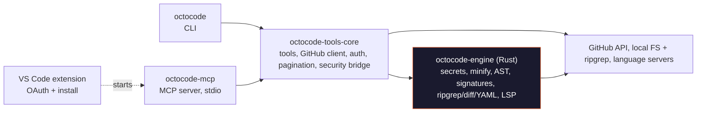

# Octocode - Agentic Research Platform

<div align="center">
  

  [](https://github.com/modelcontextprotocol/servers)
  [](https://deepwiki.com/bgauryy/octocode)
  [](https://glama.ai/mcp/servers/bgauryy/octocode)

  [](https://octocode.ai)
  [](https://www.youtube.com/@Octocode-ai)

</div>

**Evidence-first code research for AI agents and developers.**

Octocode researches **your local code and external code alike** (GitHub repos, PRs, npm) with one toolset: ripgrep + AST search, trees, precise reads, and LSP. Use it as a **CLI** or **MCP server**, backed by a **Rust engine** for fast, token-efficient results across single files or mega-repos.

---

## Table of Contents

- [Quick Start](#quick-start)
- [Why Octocode](#why-octocode)
- [Built for Research (Benchmarks)](#built-for-research-benchmarks)
- [Tools](#tools)
- [MCP](#mcp)
- [CLI](#cli)
- [Configuration](#configuration)
- [Authentication Methods](#authentication-methods)
- [Security](#security)
- [Language Support](#language-support)
- [Skills](#skills)
- [Architecture](#architecture)
- [Documentation](#documentation)
- [Troubleshooting](#troubleshooting)
- [Agent Workflows](#agent-workflows)

---

## Quick Start

**Prerequisites:** Node.js 20.12+

**1. Run the Octocode CLI with `npx`**

```bash
npx octocode --help
```

**2. Authenticate with GitHub** - optional, but unlocks private repositories and higher API rate limits:

```bash
npx octocode auth login
npx octocode status       # verify the active token source
```

**3. Choose your interface.** Same tools and Rust engine on both. (Clone is on by
default in the CLI, opt-in for MCP.)

**🖥️ CLI** - research straight from your terminal:

```bash
npx octocode
```

**🤖 MCP** - one-click install:

- [](https://cursor.com/en/install-mcp?name=octocode&config=eyJjb21tYW5kIjoibnB4IiwidHlwZSI6InN0ZGlvIiwiYXJncyI6WyJAb2N0b2NvZGVhaS9tY3BAbGF0ZXN0Il19)
- [](https://insiders.vscode.dev/redirect/mcp/install?name=octocode&config=%7B%22command%22%3A%22npx%22%2C%22type%22%3A%22stdio%22%2C%22args%22%3A%5B%22%40octocodeai%2Fmcp%40latest%22%5D%7D)

<details>
<summary><b>Show more install options (Windsurf, Kiro, Goose, LM Studio, Claude Code)</b></summary>
<br>

- [](https://insiders.vscode.dev/redirect/mcp/install?name=octocode&config=%7B%22command%22%3A%22npx%22%2C%22type%22%3A%22stdio%22%2C%22args%22%3A%5B%22%40octocodeai%2Fmcp%40latest%22%5D%7D&quality=insiders)
- [](windsurf://mcp/install?name=octocode&config=%7B%22command%22%3A%22npx%22%2C%22type%22%3A%22stdio%22%2C%22args%22%3A%5B%22%40octocodeai%2Fmcp%40latest%22%5D%7D)
- [](https://kiro.dev/launch/mcp/add?name=octocode&config=%7B%22command%22%3A%22npx%22%2C%22type%22%3A%22stdio%22%2C%22args%22%3A%5B%22%40octocodeai%2Fmcp%40latest%22%5D%7D)
- [](https://goose-docs.ai/extension?cmd=npx&arg=%40octocodeai%2Fmcp%40latest&id=octocode&name=octocode&description=Evidence-first%20code%20research%20for%20AI%20agents)
- [](https://lmstudio.ai/install-mcp?name=octocode&config=eyJjb21tYW5kIjoibnB4IiwidHlwZSI6InN0ZGlvIiwiYXJncyI6WyJAb2N0b2NvZGVhaS9tY3BAbGF0ZXN0Il19)

**Claude Code:**

```bash
claude mcp add-json octocode --scope user '{"command":"npx","type":"stdio","args":["octocode-mcp@latest"]}'
```
</details>

**Any other client:** `npx octocode install`

---

### Use it as an MCP server

Add to your MCP client config (or use a one-click install above):

```json
{
  "octocode": {
    "command": "npx",
    "type": "stdio",
    "args": ["octocode-mcp@latest"]
  }
}
```

Put a GitHub token and options under `env` (see [Configuration](#configuration)).

### Use it as an agentic-friendly CLI

Just run `npx octocode`, agents figure out the rest. The bare command prints built-in usage and the full tool catalog, so any coding agent knows how to drive it out of the box, no MCP client or extra wiring required.

```bash
npx octocode                                         # self-describing usage for agents
npx octocode tools                                   # list every tool
npx octocode tools localSearchCode --scheme          # inspect a tool's schema
```

Every MCP tool is also a plain command: JSON in, token-efficient YAML out. Local paths route to local tools; `owner/repo[/path]` routes to GitHub.

```bash
npx octocode tools localSearchCode \
  --queries '{"path":".","searchText":"authenticate","maxFiles":20}'
```
```yaml
results:
  - id: localSearchCode-1
    data:
      files:
        - path: src/auth.ts
          matches:
            - line: 12
              value: "export async function authenticate(req: Request) {"
```

Learn more at **[octocode.ai](https://octocode.ai)**.

---

## Why Octocode

Agents code better from evidence than from guesses. Octocode researches **two worlds with one flow**, your **local code** and **external code** on GitHub and npm, and hands back compact, citable context before an agent changes, reviews, or explains code. *Code is truth; context is the map.*

Most tools do one slice (web search, or grep your repo) and hand back a fixed blob. Octocode covers the whole loop and lets the **agent decide what data it needs next**:

- **Agent-driven, efficient flows.** Instead of one-shot dumps, Octocode chains cheap steps into an optimized research flow: broad code search, then fetch only the **exact matched lines/region**, with **smart pagination** and **out-of-the-box minification** so the model never over-fetches. Every result carries **next-step hints** to the cheapest follow-up.
- **Scales to monorepos.** Spot a pattern in one repo, follow the PR that introduced it, then trace it across other repos and your own files, without leaving the chat. Clone any repo and study it locally.
- **Smart GitHub flow.** Parallel bulk queries across code, PRs, commits, issues, and repos, all with the same search-broad, read-narrow, trace-semantically discipline.
- **Works without GitHub.** Clone any repo and point the local tools (search, AST, LSP, content) at it, same evidence-first flow.
- **Reads shape, not noise.** On-the-fly minify/skeletonize across 70+ languages: a 100 KB file in a few hundred tokens, not walls of boilerplate.
- **Fast, self-contained.** Search, parsing, navigation, and redaction run in one prebuilt **Rust engine**: quick on a laptop or a mega-repo, nothing extra to install.
- **Safe by default.** Every byte to the model is scanned and secrets redacted first (see [Security](#security)).

**What you can do** (whenever the next step needs proven context, not a guess):

| Need | Use Octocode to |
|------|-----------------|
| **Codebase questions** | Search local or GitHub code, read exact regions, browse trees, and carry file/line anchors into the answer. |
| **Implementation research** | Compare patterns across repositories, npm packages, pull requests, commits, and local files before changing code. |
| **Semantic navigation** | Resolve definitions, references, callers/callees, call hierarchy, hovers, symbols, diagnostics, and type relationships through LSP. |
| **Structural matching** | Run AST-shaped searches with patterns or YAML rules so comments and strings do not become false positives. |
| **Large-file context** | Minify, skeletonize, or paginate code so agents spend tokens on relevant structure instead of boilerplate. |
| **Agent workflows** | Same engine via MCP, CLI, and Agent Skills. |

---

## Built for Research (Benchmarks)

Octocode is a **research layer for coding agents**: it finds and proves the context an agent
needs *before* it writes, reviews, or explains code, via **CLI or MCP**. It shines at **deep
research across many repositories**: connecting the dots from a symbol to its source, the PR
that changed it, and the same pattern in other repos. The benchmark measures the two things a
developer actually pays for:

- **Accuracy**: did the agent get the answer right?
- **Context cost**: how many characters the model had to read to get there. Fewer characters =
  **lower token spend, faster turns, and sharper focus** (the model isn't buried in boilerplate).

We ran **30 real cross-repo questions** (dependency traces, call graphs, commit ranges, blast
radius, PR reviews), 3 passes each, against three GitHub setups a developer might use today:
plain `gh`, `gh` + Headroom (compression), and `gh` + RTK. A blind, neutral judge (gpt-5.5)
graded every answer.

### Scorecard (30 Q × 3 passes per matchup, local build v18.1.1, blind neutral gpt-5.5 judge, 95% bootstrap CIs)

**Typical context per question**: how many characters the model reads to answer, relative to
Octocode (lower is better):

```text
Octocode      ███          1.0× (baseline)
plain gh      ██████       2.0× more context
gh + Headroom ████████     2.6× more context
gh + RTK      ██████████   3.2× more context
```

| Dimension | Octocode | plain gh | gh + Headroom | gh + RTK |
|---|---:|---:|---:|---:|
| Correctness (/10) | ~9.2–9.3 | 9.3 | 8.6 | **9.4** |
| Chars, per-Q geo-mean (baseline÷Octo, 95% CI) | 1.0× | **2.0×** (1.5–2.6) | **2.6×** (1.9–3.7) | **3.2×** (2.4–4.5) |
| Correct-and-leaner wins (Octo / baseline) | n/a | 51 / 38 | 60 / 28 | 57 / 33 |
| Questions Octocode leaner | n/a | 67/89 | 63/88 | 68/90 |

**What this means for you:** at the **same accuracy** (all arms tie at ~9/10), Octocode answers
in **2–3× fewer characters** than every baseline, every 95% CI stays above 1×, and it is
leaner on ~72–75% of questions. That is directly less token spend and context bloat on each
research step. Even versus bare, disciplined `gh` (the leanest baseline) it is ~2× leaner, and
the lead grows on the hard multi-hop, large-file questions where agents usually derail.

**Why it's leaner without losing anything:**
- **Exact slices, not dumps**: reads the region, symbol, or diff you asked for, never a whole file or tree.
- **Lossless minification**: strips boilerplate across 70+ languages with zero data loss: a 100 KB file becomes a few hundred tokens of real structure.
- **No silent truncation**: you get the full slice; large results continue on demand via exact cursors.
- **One research loop**: GitHub + local + LSP + npm behind a single flow: structure → search → exact read → prove.

Full reports:
[vs plain gh](https://github.com/bgauryy/octocode/blob/main/packages/octocode-benchmark/results/full-octocode-vs-gh-152630-2026-08-07.md) ·
[vs gh+Headroom](https://github.com/bgauryy/octocode/blob/main/packages/octocode-benchmark/results/full-octocode-vs-headroom-134213-2026-08-07.md) ·
[vs gh+RTK](https://github.com/bgauryy/octocode/blob/main/packages/octocode-benchmark/results/full-octocode-vs-rtk-162848-2026-08-07.md).

### When to reach for Octocode vs a quick check

| Reach for **Octocode** when… | A **quick check** is enough when… |
|---|---|
| You need **exact field membership** (peer vs optional vs dev, version ranges). | You already know the file+line and just want to eyeball it. |
| The answer is a **trace across files/repos** (dependency → source → transport → parser chain). | You need one PR title, issue state, or a single `--json` field. |
| You want to **stay lean in context**: targeted reads, not whole-file/tree dumps. | The file is tiny and a full fetch is trivially cheap. |
| You need **reachability / call-graph proof** before a change. | A single grep hit already answers it. |

**Dig deeper:** [run](https://github.com/bgauryy/octocode/tree/main/packages/octocode-benchmark/skills/octocode-benchmark) ·
[design](https://github.com/bgauryy/octocode/blob/main/packages/octocode-benchmark/skills/octocode-benchmark/references/BENCHMARK.md) ·
[questions](https://github.com/bgauryy/octocode/tree/main/packages/octocode-benchmark/compare/github-questions) ·
[stats method](https://github.com/bgauryy/octocode/blob/main/packages/octocode-benchmark/skills/octocode-benchmark/references/aggregation-and-stats.md) ·
[all reports](https://github.com/bgauryy/octocode/tree/main/packages/octocode-benchmark/results) (historical runs carry their own caveats).

---

## Tools

**17 tools in the full catalog.** MCP registers 14 by default; the CLI exposes 15
because clone is enabled there by default. `ghCloneRepo` is opt-in on MCP
(`ENABLE_CLONE=true`), while `ghListReleases` and `ghSearchDiscussions` are opt-in
on both surfaces. Local tools default on for the **CLI** and off for the **MCP
server** (`ENABLE_LOCAL=true` enables them on MCP; `ENABLE_LOCAL=false` disables on
CLI). Flags: [Configuration](https://github.com/bgauryy/octocode/blob/main/docs/CONFIGURATION.md).

**Token knobs.** `concise:true` returns path/title-only lists. `minify` controls file read density: `symbols` = skeleton with line numbers, `standard` = comments/blanks stripped (default), `none` = exact bytes.

### GitHub Tools

| Tool | What it does | Knob |
|------|--------------|------|
| `ghSearchCode` | Code and path search across GitHub by owner, repo, path, filename, extension, and match filters. Accepts 1 to 5 parallel queries. | `concise` |
| `ghGetFileContent` | Read a GitHub file or region: full file, line range, match slice, or paginated chars. | `minify` |
| `ghViewRepoStructure` | Browse a repository's directory tree, plus opt-in repo enrichments. | `include` |
| `ghSearchRepos` | Discover repositories by keywords, owner, topic, language, stars, updated, license, visibility. | `concise` |
| `ghSearchPullRequests` | Search pull requests, or deep-read one PR: files, patches, comments, reviews, commits. | `content` |
| `ghSearchIssues` | Search issues, or read one issue's body and comments. | `content` |
| `ghSearchCommits` | Walk a repo's commit history, or compare two refs (`base`+`head`). | `includeDiff` |
| `ghListReleases` | List releases + latest, with opt-in assets. **Opt-in** (`ENABLE_RELEASES=true`). | `includeAssets` |
| `ghSearchDiscussions` | Search a repo's Discussions (Q&A, RFCs, announcements) via GraphQL. **Opt-in** (`ENABLE_DISCUSSIONS=true`). | `keywordsToSearch` |
| `ghCloneRepo` | Clone a repo or sparse subtree into the local cache for local/LSP analysis. **Opt-in** on MCP (`ENABLE_CLONE=true`; CLI on by default). | `sparsePath` |

### Local Tools

| Tool | What it does | Knob |
|------|--------------|------|
| `localSearchCode` | Local code/text search returning file and line anchors. `mode:"structural"` runs Octocode AST shape queries (`pattern` or `rule`). | `mode` |
| `localViewStructure` | Browse a local directory tree: depth, filters, pagination, metadata. | `detail` |
| `localFindFiles` | Find local files and directories by name, path, regex, extension, size, time, permissions, type. | |
| `localFindDeadCode` | Find likely-unreferenced exports and dead-code clusters using whole-repository reachability analysis. | `entrypoints` |
| `localGetFileContent` | Read a local file or region: exact slice, match string, line range, or paginated chars. | `minify` |

### Package Search

| Tool | What it does | Knob |
|------|--------------|------|
| `npmSearch` | npm package lookup and keyword search; returns metadata and the source repository for GitHub handoff. | `concise` |

### LSP

| Tool | What it does |
|------|--------------|
| `lspGetSemantics` | Typed semantic navigation: `definition`, `references`, `callers`, `callees`, `callHierarchy`, `hover`, `documentSymbols`, `typeDefinition`, `implementation`, `workspaceSymbol`, `supertypes`, `subtypes`, and `diagnostic`. From the CLI, invoke it directly: `npx octocode tools lspGetSemantics --queries '<json>'`. Navigation runs through installed language servers (see the [LSP Tools Reference](https://github.com/bgauryy/octocode/blob/main/docs/OCTOCODE_TOOLS.md#lsp-tools-reference)). |

Full schemas, fields, and examples for every tool live in [`docs/OCTOCODE_TOOLS.md`](https://github.com/bgauryy/octocode/blob/main/docs/OCTOCODE_TOOLS.md) (linked under [Documentation](#documentation)).

---

## MCP

The MCP server exposes the Octocode tool catalog directly to your AI assistant over stdio.

https://github.com/user-attachments/assets/de8d14c0-2ead-46ed-895e-09144c9b5071

### Manual Configuration

Add to your MCP client config, using `octocode-mcp`:

```json
{
  "octocode": {
    "command": "npx",
    "type": "stdio",
    "args": [
      "octocode-mcp@latest"
    ]
  }
}
```

Add a GitHub token and options under `env` - see [Authentication](#authentication-methods) and [Configuration](#configuration).

---

## CLI

Same research engine, no MCP client needed. Local paths route to local tools; `owner/repo[/path]` routes to GitHub. Authenticate once with `npx octocode auth login` (see [Authentication](#authentication-methods)); run `npx octocode --help` for full usage.

### Commands

#### Tools

| Command | What it does |
|---------|--------------|
| `npx octocode tools <name> --scheme` | Show one tool's schema: fields, types, bounds, defaults |
| `npx octocode tools <name> --queries '<json>'` | Run a tool (same tools as MCP), YAML output |
| `npx octocode tools <name> --queries '<json>' --json` | Run a tool, full `CallToolResult` JSON |
| `npx octocode tools` | List every available tool |

#### More commands

- **Cache & clone** - `npx octocode clone`, `npx octocode cache fetch|status|clear`
- **Skills** - `npx octocode skill list|install|check|info|remove` for bundled Octocode skills
- **Language servers** - `npx octocode lsp-server list|install|status|uninstall|clean`
- **Setup & introspection** - `npx octocode install`, `npx octocode auth`, `npx octocode status`, `npx octocode context`

Full syntax, flags, and exit codes: [Octocode CLI Guide](https://github.com/bgauryy/octocode/blob/main/packages/octocode/docs/OCTOCODE_CLI.md)

---

## Configuration

Everything is optional; Octocode runs on sensible defaults. Settings resolve from three sources, in priority order:

```text
environment variables  >  <octocode-home>/.octocoderc  >  built-in defaults
```

1. **MCP / environment variables** (highest): per client or per project, set in your MCP config `env` or your shell.
2. **Global config**: `<octocode-home>/.octocoderc`, machine-wide defaults read by **both the CLI and the MCP server**.
3. **Built-in defaults**: used when neither is set.

**Octocode home** (`<octocode-home>`) holds the global config, encrypted credentials, sessions, stats, and tmp materialization caches. It defaults by platform and can be overridden with `OCTOCODE_HOME`:

| Platform | Location |
|----------|----------|
| macOS | `~/.octocode` |
| Linux | `${XDG_CONFIG_HOME:-~/.config}/.octocode` |
| Windows | `%APPDATA%\.octocode` |

Set values as MCP `env` entries (per client; these win over `.octocoderc`) or globally in `<octocode-home>/.octocoderc` (JSON with comments). **Tokens never go in `.octocoderc`** - use `env` or `npx octocode auth login`.

### Common settings

Most-used settings (both CLI and MCP unless noted):

| Env var | `.octocoderc` key | Default | What it does |
|---------|-------------------|---------|--------------|
| `OCTOCODE_TOKEN` / `GH_TOKEN` / `GITHUB_TOKEN` | env only | unset | GitHub token, in priority order. Never in `.octocoderc`. |
| `ENABLE_LOCAL` | `local.enabled` | CLI `true`, MCP `false` | Local filesystem + LSP tools on/off. |
| `ENABLE_CLONE` | `local.enableClone` | CLI `true`, MCP `false` | `ghCloneRepo` + directory fetch on/off. |
| `WORKSPACE_ROOT` | `local.workspaceRoot` | `cwd` | Root for resolving relative local paths. |
| `ALLOWED_PATHS` | `local.allowedPaths` | `[]` | Extra path allowlist for local access. |
| `OCTOCODE_OUTPUT_FORMAT` | `output.format` | `yaml` | Response format: `yaml` or `json`. |

`OCTOCODE_HOME`, GitHub Enterprise (`GITHUB_API_URL`), MCP tool whitelisting (`TOOLS_TO_RUN`/`ENABLE_TOOLS`/`DISABLE_TOOLS`), and network timeouts/retries: see the [Configuration Reference](https://github.com/bgauryy/octocode/blob/main/docs/CONFIGURATION.md).

### Example Configuration

**`~/.octocode/.octocoderc`:**
```json
{
  "github": {
    "apiUrl": "https://api.github.com"
  },
  "local": {
    "enabled": true,
    "enableClone": true
  },
  "output": {
    "format": "yaml"
  }
}
```

Per-project overrides and custom LSP servers live in a workspace `.octocode/` folder. For the full `.octocoderc` schema, a ready-to-copy example, clone-cache tuning, GitHub Enterprise setup, and precedence details, see the [Configuration Reference](https://github.com/bgauryy/octocode/blob/main/docs/CONFIGURATION.md).

---

## Authentication Methods

GitHub-backed tools require authentication. Any one method is enough. Full details: [Authentication Setup](https://github.com/bgauryy/octocode/blob/main/docs/CONFIGURATION.md).

### Option 1: Octocode CLI (Recommended)

```bash
npx octocode auth login
npx octocode status       # verify the active token source
```

Interactive login lets you choose Octocode browser OAuth or `gh auth login`. Octocode OAuth credentials are stored encrypted on disk.

### Option 2: GitHub CLI (also supported)

```bash
gh auth login
```

Octocode reads the `gh` token automatically - no further config needed.

### Option 3: Personal Access Token (also supported)

Set `OCTOCODE_TOKEN`, `GH_TOKEN`, or `GITHUB_TOKEN` in your shell. Required scopes: `repo`, `read:user`, `read:org`.

Create a token at [github.com/settings/tokens](https://github.com/settings/tokens).

> **Security tip**: Never commit tokens to version control. Use environment variables or secure secret management.

---

## Security

**Every byte to the model is scanned and redacted first.** All content (local files, GitHub/npm responses, errors, tool output) passes through the Rust engine's secret scanner on the way *in* and *out*, so secrets never reach the LLM. Identical under MCP and CLI.

- **Secret redaction, in and out.** 300+ provider credential patterns (AWS, Azure, GCP, GitHub, OpenAI, Anthropic, Stripe, Slack, 1Password, and more) plus generic JWTs, PEM/private keys, bearer tokens, database connection strings, and high-entropy strings. Masked values surface a redaction warning so the agent knows.
- **Content sanitized at the source.** Local reads (`localGetFileContent`, ripgrep, structural search, binary, file discovery, structure) and external fetches (GitHub code/files, npm) are scanned as they are read, not only at the boundary.
- **Path safety.** Relative inputs resolve from `WORKSPACE_ROOT` / config / `cwd`, then local reads are bounded to the engine's allowed roots (home by default, plus `ALLOWED_PATHS` and Octocode-registered roots). Symlinks are resolved and the real target is **re-validated**, so a link cannot escape into a blocked location.
- **Sensitive files blocked by default.** Reads of known secret-bearing files and folders return a redacted error instead of contents: keys/certs, `.env*`, `.npmrc`/`.netrc`, cloud/infra credentials (`.aws/`, `.kube/`, `*.tfstate`), `.git/`, browser logins, OS keychains, and wallets. Full list in [SECURITY.md](https://github.com/bgauryy/octocode/blob/main/docs/SECURITY.md).
- **Command safety.** Normal local search runs in-process inside `octocode-engine`. External helpers are fixed per lane, command/argument allowlisted, and run via `spawn` with argument arrays: no shell strings, no injection.
- **Schema validation** runs before any tool executes; untrusted input size and shape are bounded.
- **Credentials.** GitHub auth via env tokens, AES-256-GCM-encrypted on-disk OAuth, or the `gh` CLI; tokens are never logged.

**Full security model, pipeline, and threat coverage: [SECURITY.md](https://github.com/bgauryy/octocode/blob/main/docs/SECURITY.md).** Related: [Configuration & Authentication](https://github.com/bgauryy/octocode/blob/main/docs/CONFIGURATION.md) · [Credentials](https://github.com/bgauryy/octocode/blob/main/docs/CONFIGURATION.md#github-token)

---

## Language Support

Four code-intelligence axes; three are native to the Rust engine and need no external tooling:

| Axis | What it does | How to use it |
|------|--------------|---------------|
| **Structural AST** | Tree-sitter shape queries (`pattern` or YAML `rule`) across 60+ extensions. | `localSearchCode mode:"structural"` · CLI `tools localSearchCode --scheme` |
| **Signature outline** | Body-free skeleton with line numbers from real tree-sitter parsing, no heuristics. An anti-growth guard returns the real file when a skeleton wouldn't be smaller. | `minify:"symbols"` · CLI `tools localGetFileContent --scheme` |
| **Content minification** | Comment/whitespace stripping for 70+ languages and config formats; HTML/Vue/Svelte also minify embedded `<style>`/`<script>`. | `minify:"standard"` (default) |
| **LSP navigation** | definition, references, callers/callees, callHierarchy, hover, typeDefinition, implementation, documentSymbols, via an installed language server; JS/TS also have a native, no-server path. | `lspGetSemantics` · CLI `tools lspGetSemantics --scheme` |

📋 **Full support matrix:** every extension with its exact AST, signature, LSP,
and minify capability lives in the
**[Full format support matrix](https://github.com/bgauryy/octocode/blob/main/packages/octocode-engine/docs/LSP_SERVER_LIFECYCLE.md#full-format-support-matrix)**.

---

## Skills

> [Agent Skills](https://agentskills.io/what-are-skills) are a lightweight, open format for extending AI agent capabilities.
> Browse and install on [**skills.sh/bgauryy/octocode-mcp**](https://www.skills.sh/bgauryy/octocode-mcp)

**13 skills** under [`skills/`](https://github.com/bgauryy/octocode/tree/main/skills), bundled in the `octocode` package. Each is a lean `SKILL.md` that loads references only when needed, so they compose. Start with ⭐ [Research](https://www.skills.sh/bgauryy/octocode-mcp/octocode-research) for evidence-first code work.

```bash
npx octocode skill list
npx octocode skill install octocode-research --platform pi
npx octocode skill check --json
npx octocode skill help
```

#### Core Research & Extraction
| Skill | Use when |
|-------|----------|
| ⭐ [**octocode-research**](https://github.com/bgauryy/octocode/tree/main/skills/octocode-research) | Evidence-first research, review, debugging, refactors, prior-art validation. |
| [**octocode-scraping**](https://github.com/bgauryy/octocode/tree/main/skills/octocode-scraping) | Public page extraction and crawl triage: static corpus + graph v2 (pages/data/actions/risks/evidence), then CDP handoff for dynamic actions and blocked pages. |
| [**octocode-chrome-devtools**](https://github.com/bgauryy/octocode/tree/main/skills/octocode-chrome-devtools) | Browser/CDP evidence: network, console, performance, cookies/storage, screenshots, auth-gated pages, and live validation of scrape-graph actions. |

#### Planning & Architecture
| Skill | Use when |
|-------|----------|
| [**octocode-brainstorming**](https://github.com/bgauryy/octocode/tree/main/skills/octocode-brainstorming) | Disciplined idea exploration before building: options, worth-building tests, prior-art maps. |
| [**octocode-rfc-generator**](https://github.com/bgauryy/octocode/tree/main/skills/octocode-rfc-generator) | Evidence-backed RFCs, design docs, migration plans, option comparisons. |
| [**octocode-documentation**](https://github.com/bgauryy/octocode/tree/main/skills/octocode-documentation) | Writing or updating README, API docs, runbooks, AGENTS.md, ADRs. |

#### Evaluation & Review
| Skill | Use when |
|-------|----------|
| [**octocode-roast**](https://github.com/bgauryy/octocode/tree/main/skills/octocode-roast) | Blunt, evidence-backed code critique with severity ranking and repair paths. |
| [**octocode-graph-eval**](https://github.com/bgauryy/octocode/tree/main/skills/octocode-graph-eval) | Measuring whether a change helped: goal→KPI contracts, baselines, accept/revert loops, eval suites. |
| [**octocode-prompt-optimizer**](https://github.com/bgauryy/octocode/tree/main/skills/octocode-prompt-optimizer) | Making prompts, tool schemas, and agent contracts clearer, safer, cheaper, measurable. |

#### Agent Orchestration
| Skill | Use when |
|-------|----------|
| [**octocode-subagent**](https://github.com/bgauryy/octocode/tree/main/skills/octocode-subagent) | Delegation: spawn gates, decomposition, sealed packets, coordination, synthesis. |
| [**octocode-awareness**](https://github.com/bgauryy/octocode/tree/main/skills/octocode-awareness) | Shared-repo coordination: collision avoidance, handoffs, verification debt, durable memory. |
| [**octocode-skills**](https://github.com/bgauryy/octocode/tree/main/skills/octocode-skills) | Agent-skill lifecycle: discover, review, create, improve, install, sync. |
| [**octocode-orchestrator-local-worker**](https://github.com/bgauryy/octocode/tree/main/skills/octocode-orchestrator-local-worker) | Offloading token-heavy text work to a local Ollama worker under a verify gate. |

**Web automation workflow:** `octocode-scraping` performs the safe static pass first (fetch/crawl/extract → local corpus → graph v2). When the graph exposes dynamic actions or static output is blocked/thin, `octocode-chrome-devtools` validates live actionability, cookies/storage, network/HAR bodies, screenshots, or auth-gated state; discovered URLs/data/artifacts can be fed back into the scraping corpus for continued proof.

---

## Architecture

A yarn-workspaces monorepo. The **MCP server** and the **CLI** are thin front-ends over one shared TypeScript tool core, which delegates every CPU-heavy path to a single **Rust engine** (compiled via [napi-rs](https://napi.rs) to prebuilt `.node` binaries). One tool catalog, one security layer, one response shaper, reached two ways.



**Request flow** is identical whether a call arrives over MCP or the CLI:

```text
client → sanitize inputs (Rust) → run tool (GitHub / FS / LSP) → sanitize + YAML-serialize + paginate (Rust) → result + next-step hints
```

**One Rust engine** owns secret detection, sanitization, path/command validation, minification (70+ languages), signature extraction, structural AST search, ripgrep parsing, diff filtering, YAML serialization, and LSP, so the Node event loop stays unblocked and there is no duplicate native loader. It ships prebuilt for darwin (arm64/x64), linux (arm64/x64, gnu + musl), and win32-x64; no Rust toolchain is needed at runtime.

### Packages

| Directory | npm package | Role |
|-----------|-------------|------|
| [`packages/octocode`](https://github.com/bgauryy/octocode/tree/main/packages/octocode) | `octocode` | CLI: quick commands, raw tool runner, skill installs, auth/login/logout, install, status, context. |
| [`packages/octocode-mcp`](https://github.com/bgauryy/octocode/tree/main/packages/octocode-mcp) | `octocode-mcp` | MCP server (stdio) that registers the tool catalog for AI assistants. |
| [`packages/octocode-tools-core`](https://github.com/bgauryy/octocode/tree/main/packages/octocode-tools-core) | `@octocodeai/octocode-tools-core` | Shared tool core: implementations, GitHub client, credentials and token resolution, session, pagination, security bridge. |
| [`packages/octocode-engine`](https://github.com/bgauryy/octocode/tree/main/packages/octocode-engine) | `@octocodeai/octocode-engine` | Rust/napi native engine: security scanning, minification, signatures, structural AST, ripgrep/diff/YAML, LSP. |
| [`packages/octocode-config`](https://github.com/bgauryy/octocode/tree/main/packages/octocode-config) | `@octocodeai/config` | Zero-dep env + config loader: `getOctocodeHome`, `.env` parsing, `.octocoderc` reading. Single source used by every package and skill. |
| [`packages/octocode-vscode`](https://github.com/bgauryy/octocode/tree/main/packages/octocode-vscode) | `octocode-mcp-vscode` | VS Code extension: GitHub OAuth + multi-editor MCP install. |

`packages/octocode-benchmark` (private, not published) holds benchmark methodology, evals, and run artifacts - see [Documentation](#documentation).

---

## Documentation

Website: **[octocode.ai](https://octocode.ai)** · Product docs: **[github.com/bgauryy/octocode/tree/main/docs](https://github.com/bgauryy/octocode/tree/main/docs)**. This section is the canonical documentation index; benchmark methodology, evals, and run artifacts live in [`packages/octocode-benchmark`](https://github.com/bgauryy/octocode/tree/main/packages/octocode-benchmark).

| Area | Docs |
|---|---|
| MCP server | [Octocode MCP Server](https://github.com/bgauryy/octocode/blob/main/docs/OCTOCODE_MCP.md) · [Configuration & Authentication](https://github.com/bgauryy/octocode/blob/main/docs/CONFIGURATION.md) |
| Tools and workflows | [Octocode Tools Reference](https://github.com/bgauryy/octocode/blob/main/docs/OCTOCODE_TOOLS.md) · [RDD Manifest & Workflows](https://github.com/bgauryy/octocode/blob/main/MANIFEST.md) · [Octocode Research Skill](https://github.com/bgauryy/octocode/tree/main/skills/octocode-research) · [Search Guide](https://github.com/bgauryy/octocode/blob/main/docs/context/SEARCH_GUIDE.md) |
| CLI | [Octocode CLI Guide](https://github.com/bgauryy/octocode/blob/main/packages/octocode/docs/OCTOCODE_CLI.md) |
| Skills | [Skills](https://github.com/bgauryy/octocode/tree/main/skills) |
| Development and security | [Security Model](https://github.com/bgauryy/octocode/blob/main/docs/SECURITY.md) · [LSP Server Lifecycle](https://github.com/bgauryy/octocode/blob/main/packages/octocode-engine/docs/LSP_SERVER_LIFECYCLE.md) |
| Benchmarks and evals | [Benchmark Results](https://github.com/bgauryy/octocode/tree/main/packages/octocode-benchmark/results) · [Benchmark Design](https://github.com/bgauryy/octocode/blob/main/packages/octocode-benchmark/skills/octocode-benchmark/references/BENCHMARK.md) · [Benchmark Runbook](https://github.com/bgauryy/octocode/blob/main/packages/octocode-benchmark/skills/octocode-benchmark/references/INSTRUCTIONS.md) · [Support Matrix](https://github.com/bgauryy/octocode/blob/main/packages/octocode-engine/docs/LSP_SERVER_LIFECYCLE.md#full-format-support-matrix) |
| Shared internals | [Credentials Architecture](https://github.com/bgauryy/octocode/blob/main/docs/CONFIGURATION.md#github-token) · [Session Persistence](https://github.com/bgauryy/octocode/blob/main/docs/OCTOCODE_MCP.md#session-persistence) |

---

## Troubleshooting

**Node.js or Environment Issues?**
Run the built-in doctor command to check your environment:

```bash
npx node-doctor check --json
```

**Common Pitfalls:**
- **GitHub Auth Failures:** Ensure your Personal Access Token (PAT) has the `repo` and `read:user` scopes. If using the CLI, run `npx octocode auth login` to refresh.
- **MCP Connection Issues:** If your AI assistant (like Cursor or Windsurf) fails to connect, ensure you have run `npx octocode auth login` in your terminal first, or explicitly pass your `OCTOCODE_TOKEN` in the MCP `env` configuration.
- **Native Engine Errors:** Octocode uses a prebuilt Rust engine. If it fails to load on Linux, ensure your system has `glibc` or `musl` compatibility. On macOS/Windows, ensure you are on a supported architecture (x64 or arm64).

---

## Agent Workflows

### Recommended dev mode: Pi + Octocode

[Pi](https://github.com/earendil-works/pi) is a fast, local-first coding agent whose stated philosophy is *"CLI tools with READMEs (Skills) over MCP."* Pairing it with Octocode gives a lean, evidence-driven dev loop - **Pi edits, Octocode researches**. Two routes, pick by how much surface you need:

- **Skill route - recommended, leanest.** Drop the [`octocode-research`](https://www.skills.sh/bgauryy/octocode-mcp/octocode-research) skill into Pi's global skills dir. It drives the Octocode **CLI** directly - no MCP transport, minimal token overhead - and Pi auto-discovers it:

  ```bash
  npx octocode skill install octocode-research --platform pi
  ```

- **Adapter route - full tool surface.** Install [`pi-mcp-adapter`](https://github.com/nicobailon/pi-mcp-adapter) to expose Octocode MCP tools behind a single ~200-token proxy tool, so servers stay disconnected until a tool is actually called. Enable clone tools with `ENABLE_CLONE=true`.

### Research-driven loop

Most agent failures happen before the edit: guessing who owns a behavior, trusting a snippet without reading the source, editing before proving blast radius. Run a cheaper loop instead: orient with trees, search, read exact evidence, use AST/LSP when identity matters, then patch and verify. The host edits, Octocode is the map, and skills encode the habit.

### The Manifest

**"Code is Truth, but Context is the Map."** Read the [Manifest of Octocode for Research Driven Development](https://github.com/bgauryy/octocode/blob/main/MANIFEST.md) to understand the philosophy behind Octocode.
