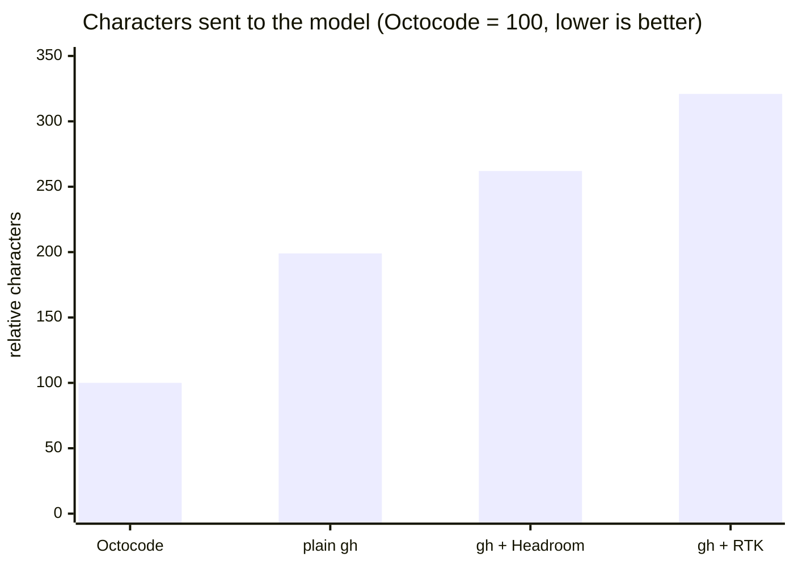
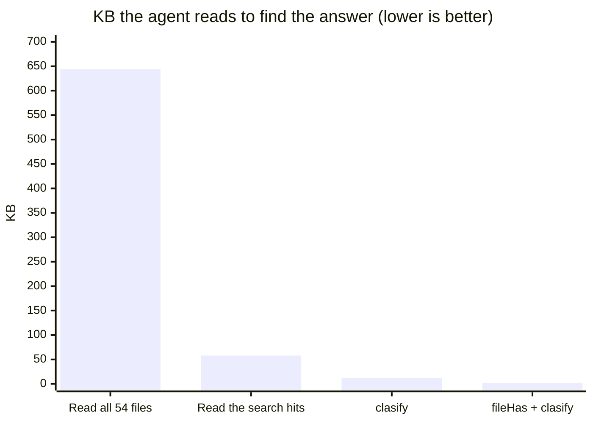

# Octocode: an agentic toolkit for software engineering

<div align="center">
  

  [](https://github.com/modelcontextprotocol/servers)
  [](https://deepwiki.com/bgauryy/octocode)
  [](https://glama.ai/mcp/servers/bgauryy/octocode)

  [](https://octocode.ai)
  [](https://www.youtube.com/@Octocode-ai)

</div>

**Evidence-first code research for AI agents and developers.**

Octocode gives Cursor, Claude, VS Code, Codex, Pi, and any MCP client deep, cited access to local code, GitHub, and package registries: search, exact reads, AST and LSP navigation, pull request history, and package lookup. One Rust engine, two interfaces: an MCP server and the `npx octocode` CLI.

## Why Octocode

- **Evidence, not guesses:** every answer cites exact files and lines.
- **Research loop:** orient → search → read exact evidence → prove identity with LSP.
- **Lean context:** reads return only the lines you need; 2–3.2× fewer characters than `gh` at equal correctness ([benchmarks](#benchmarks)).
- **Judge before you read:** `clasify` asks an AI judge (Jev) which unread files answer the question, so the agent opens only the right one.
- **Next step built in:** every result carries the read or search to run next.
- **Secure by default:** read-only research, secrets redacted, path guardrails.
- **Free and open source** under the MIT license.

The idea and the research loop: [The Octocode protocol](https://github.com/bgauryy/octocode/blob/main/docs/OCTOCODE_PROTOCOL.md) · [The manifest](https://github.com/bgauryy/octocode/blob/main/MANIFEST.md).

---

## Quick start

Requires Node.js 24.15+ (24.x).

### 1. Sign in to GitHub

Public repositories and local code work without signing in. For private repositories and higher rate limits, use **either** CLI:

```bash
gh auth login                    # GitHub CLI: if you are already signed in, Octocode uses it automatically
npx octocode auth login          # or the Octocode CLI: one-time browser sign-in
```

Check with `npx octocode auth status`. Tokens, GitHub Enterprise, and npm registries: [AUTHENTICATION.md](https://github.com/bgauryy/octocode/blob/main/docs/AUTHENTICATION.md).

### 2. Add Octocode to your agent

Add it to any MCP client:

```json
{
  "octocode": {
    "command": "npx",
    "type": "stdio",
    "args": ["octocode-mcp@latest"]
  }
}
```

- **Claude Code:** `claude mcp add octocode --scope user -- npx -y octocode-mcp@latest`
- **Any client:** `npx octocode install` detects your installed hosts and writes the config.
- **Setup details:** [MCP guide](https://github.com/bgauryy/octocode/blob/main/docs/OCTOCODE_MCP.md).
- **One click:** [](https://cursor.com/en/install-mcp?name=octocode&config=eyJjb21tYW5kIjoibnB4IiwidHlwZSI6InN0ZGlvIiwiYXJncyI6WyIteSIsIm9jdG9jb2RlLW1jcEBsYXRlc3QiXX0=) [](https://insiders.vscode.dev/redirect/mcp/install?name=octocode&config=%7B%22command%22%3A%22npx%22%2C%22type%22%3A%22stdio%22%2C%22args%22%3A%5B%22-y%22%2C%22octocode-mcp%40latest%22%5D%7D)

<details>
<summary>More one-click installs</summary>

[](https://insiders.vscode.dev/redirect/mcp/install?name=octocode&config=%7B%22command%22%3A%22npx%22%2C%22type%22%3A%22stdio%22%2C%22args%22%3A%5B%22-y%22%2C%22octocode-mcp%40latest%22%5D%7D&quality=insiders)
[](windsurf://mcp/install?name=octocode&config=%7B%22command%22%3A%22npx%22%2C%22type%22%3A%22stdio%22%2C%22args%22%3A%5B%22-y%22%2C%22octocode-mcp%40latest%22%5D%7D)
[](https://kiro.dev/launch/mcp/add?name=octocode&config=%7B%22command%22%3A%22npx%22%2C%22type%22%3A%22stdio%22%2C%22args%22%3A%5B%22-y%22%2C%22octocode-mcp%40latest%22%5D%7D)
[](https://goose-docs.ai/extension?cmd=npx&arg=-y&arg=octocode-mcp%40latest&id=octocode&name=octocode&description=Evidence-first%20code%20research%20for%20AI%20agents)
[](https://lmstudio.ai/install-mcp?name=octocode&config=eyJjb21tYW5kIjoibnB4IiwidHlwZSI6InN0ZGlvIiwiYXJncyI6WyIteSIsIm9jdG9jb2RlLW1jcEBsYXRlc3QiXX0=)

</details>

### 3. Or use the CLI

No MCP client? Run `npx octocode`. Your agent reads the tool list it prints and calls each tool as a command ([CLI guide](https://github.com/bgauryy/octocode/blob/main/packages/octocode/docs/OCTOCODE_CLI.md)).

### Other hosts

- **VS Code:** the [Octocode MCP](https://marketplace.visualstudio.com/items?itemName=bgauryy.octocode-mcp-vscode) extension signs in to GitHub and sets up MCP.
- **Pi:** `pi install npm:@octocodeai/pi-extension`, or just the skill: `npx octocode skill install octocode-research --platform pi --global`.
- **Claude Code and Codex plugins:** coming soon ([Claude Code](https://github.com/bgauryy/octocode/blob/main/packages/octocode-claude-plugin/README.md), [Codex](https://github.com/bgauryy/octocode/blob/main/packages/octocode-codex-plugin/README.md)).

---

## Benchmarks

30 GitHub research questions, each answered 3 times by agents and graded by a blind judge.


```mermaid
xychart-beta
    title "Characters sent to the model (Octocode = 100, lower is better)"
    x-axis ["Octocode", "plain gh", "gh + Headroom", "gh + RTK"]
    y-axis "relative characters" 0 --> 350
    bar [100, 199, 262, 321]
```

| Compared with | Octocode sends the model | Correctness (Octocode / other, of 10) |
|---|---|---|
| plain `gh` | **2.0× less** | 9.2 / 9.3 |
| `gh` + Headroom | **2.6× less** | 9.3 / 8.6 |
| `gh` + RTK | **3.2× less** | 9.3 / 9.4 |

Finding code by description among 54 files, `clasify` ranked the answer first while the agent read **1.9 KB instead of 644 KB**:


```mermaid
xychart-beta
    title "KB the agent reads to find the answer (lower is better)"
    x-axis ["Read all 54 files", "Read the search hits", "clasify", "fileHas + clasify"]
    y-axis "KB" 0 --> 700
    bar [644, 58, 11.8, 1.9]
```

Details: [benchmark summary](https://github.com/bgauryy/octocode/blob/main/packages/octocode-benchmark/results/SUMMARY.md) · [clasify results](https://github.com/bgauryy/octocode/blob/main/docs/OCTOCODE_CLASIFY.md#at-a-glance).

---

## Tools

**16 tools.** Your agent gets 12 tools over MCP and 13 in the CLI; `clasify` joins both when you add its key.

| You want to | Tool |
|---|---|
| See a project's folders and find files | `structureSearch` |
| Search local code for text | `localSearch` |
| Find functions, classes, and code patterns | `astSearch` |
| Read exact lines, or one whole function | `localFetch` |
| Find a symbol's definition, references, and callers | `lspSearch` |
| Find a GitHub repository | `ghSearchRepo` |
| Search code across GitHub | `ghSearchCode` |
| Browse a repository at any branch or tag | `ghStructure` |
| Read a file from GitHub | `ghGetFileContent` |
| Find pull requests, issues, and commits | `ghSearchHistory` |
| Read a pull request, issue, or commit | `ghGetHistoryItem` |
| Check package versions and dependencies | `artifactSearch` |
| Pick the right file without reading them all | `clasify` |
| Clone a repository for deep local work (CLI) | `ghCloneRepo` |
| Map imports, or rewrite code safely (CLI beta) | `astTopology`, `astRewrite` |

Full reference: [Tools](https://github.com/bgauryy/octocode/blob/main/docs/OCTOCODE_TOOLS.md) · [clasify guide](https://github.com/bgauryy/octocode/blob/main/docs/OCTOCODE_CLASIFY.md).

---

## CLI

| Command | What it does |
|---|---|
| `npx octocode` | lists the tools for your agent |
| `npx octocode auth login` | signs in to GitHub |
| `npx octocode install` | adds Octocode to your editor or agent |
| `npx octocode skill install octocode-research` | adds the research skill to your agent |
| `npx octocode config` | shows your settings |

Full guide: [CLI](https://github.com/bgauryy/octocode/blob/main/packages/octocode/docs/OCTOCODE_CLI.md).

---

## Configuration

Everything is optional. Set options in the MCP `env` block, the shell, or `~/.octocode/.env`:

| Variable | What it does |
|---|---|
| `WORKSPACE_ROOT`, `ALLOWED_PATHS` | which local directories tools may read |
| `TOOLS_TO_RUN`, `DISABLE_TOOLS` | choose which tools your agent sees |
| `OCTOCODE_CLASSIFICATION_API` | enable `clasify` ([get a key](https://docs.typesafe.ai/introduction)) |
| `GITHUB_API_URL` | use GitHub Enterprise |

All settings: [CONFIGURATION.md](https://github.com/bgauryy/octocode/blob/main/docs/CONFIGURATION.md).

---

## Security

- Research tools are read-only (only the CLI beta `astRewrite` edits files) and never run shell strings.
- Every byte to the model is scanned, and 300+ kinds of secrets are redacted.
- Local reads stay inside the workspace and `ALLOWED_PATHS`; secret files such as `.env` are blocked.
- `clasify` is the only tool that sends content to a third party, and only with its key set.

Details: [SECURITY.md](https://github.com/bgauryy/octocode/blob/main/docs/SECURITY.md).

---

## Skills

Install with `npx octocode skill install <name>` ([all skills](https://github.com/bgauryy/octocode/blob/main/skills/README.md)), or browse [skills.sh/bgauryy/octocode-mcp](https://www.skills.sh/bgauryy/octocode-mcp).

| Skill | Use it for |
|---|---|
| ⭐ [octocode-research](https://github.com/bgauryy/octocode/tree/main/skills/octocode-research) | evidence-first research, review, and debugging |
| [octocode-architect](https://github.com/bgauryy/octocode/tree/main/skills/octocode-architect) | architecture and dependency review |
| [octocode-brainstorming](https://github.com/bgauryy/octocode/tree/main/skills/octocode-brainstorming) | weighing an idea or decision from several sides |
| [octocode-rfc-generator](https://github.com/bgauryy/octocode/tree/main/skills/octocode-rfc-generator) | RFCs and execution plans |
| [octocode-documentation](https://github.com/bgauryy/octocode/tree/main/skills/octocode-documentation) | READMEs, API docs, ADRs |
| [octocode-roast](https://github.com/bgauryy/octocode/tree/main/skills/octocode-roast) | blunt, evidence-backed code critique |
| [octocode-clean-agentic-code](https://github.com/bgauryy/octocode/tree/main/skills/octocode-clean-agentic-code) | behavior-preserving cleanup |
| [octocode-eval-benchmark](https://github.com/bgauryy/octocode/tree/main/skills/octocode-eval-benchmark) | evals and honest benchmarks |
| [octocode-agentic-prompts](https://github.com/bgauryy/octocode/tree/main/skills/octocode-agentic-prompts) | better prompts and tool schemas |
| [octocode-scraping](https://github.com/bgauryy/octocode/tree/main/skills/octocode-scraping) | page extraction and crawling |
| [octocode-chrome-devtools](https://github.com/bgauryy/octocode/tree/main/skills/octocode-chrome-devtools) | browser evidence: network, console, storage |
| [octocode-skills](https://github.com/bgauryy/octocode/tree/main/skills/octocode-skills) | creating and maintaining skills |
| [octocode-agents-communication](https://github.com/bgauryy/octocode/tree/main/skills/octocode-agents-communication) | coordinating several agents |

Unpublished: [octocode-architecture-view](https://github.com/bgauryy/octocode/tree/main/skills-beta/octocode-architecture-view) (tested), and the repository skills in [`skills-dev/`](https://github.com/bgauryy/octocode/tree/main/skills-dev).

---

## Packages

| Package | What it is |
|---|---|
| [`octocode`](https://github.com/bgauryy/octocode/tree/main/packages/octocode) | the CLI |
| [`octocode-mcp`](https://github.com/bgauryy/octocode/tree/main/packages/octocode-mcp) | the MCP server |
| [`octocode-mcp-vscode`](https://github.com/bgauryy/octocode/tree/main/packages/octocode-vscode) | VS Code extension |
| [`@octocodeai/pi-extension`](https://github.com/bgauryy/octocode/tree/main/packages/octocode-pi-extension) | Pi extension |
| [`@octocodeai/claude-plugin`](https://github.com/bgauryy/octocode/tree/main/packages/octocode-claude-plugin), [`@octocodeai/codex-plugin`](https://github.com/bgauryy/octocode/tree/main/packages/octocode-codex-plugin) | Claude Code and Codex plugins (coming soon) |
| [`@octocodeai/octocode-native`](https://github.com/bgauryy/octocode/tree/main/packages/octocode-native) | the Rust engine behind both interfaces |
| [`@octocodeai/config`](https://github.com/bgauryy/octocode/tree/main/packages/octocode-config) | configuration and tool contracts |
| [`@octocodeai/octocode-agents-communication`](https://github.com/bgauryy/octocode/tree/main/packages/octocode-agents-communication) | agent coordination |
| [`octocode-chrome-devtools`](https://github.com/bgauryy/octocode/tree/main/packages/octocode-chrome-devtools), [`octocode-benchmark`](https://github.com/bgauryy/octocode/tree/main/packages/octocode-benchmark), [`octocode-mcp-cli`](https://github.com/bgauryy/octocode/tree/main/packages/octocode-mcp-cli), [`octocode-skill-installer`](https://github.com/bgauryy/octocode/tree/main/packages/octocode-skill-installer) | browser server, benchmark, and internal tooling (private) |

How the pieces fit: [DEVELOPMENT.md](https://github.com/bgauryy/octocode/blob/main/skills-dev/octocode-dev/docs/DEVELOPMENT.md).

---

## Documentation

All docs: [documentation hub](https://github.com/bgauryy/octocode/blob/main/docs/README.md).

| Topic | Docs |
|---|---|
| Concepts | [Protocol](https://github.com/bgauryy/octocode/blob/main/docs/OCTOCODE_PROTOCOL.md) · [Manifest](https://github.com/bgauryy/octocode/blob/main/MANIFEST.md) · [Workflows](https://github.com/bgauryy/octocode/blob/main/docs/OCTOCODE_WORKFLOWS.md) |
| Interfaces | [MCP](https://github.com/bgauryy/octocode/blob/main/docs/OCTOCODE_MCP.md) · [CLI](https://github.com/bgauryy/octocode/blob/main/packages/octocode/docs/OCTOCODE_CLI.md) |
| Tools | [Tool reference](https://github.com/bgauryy/octocode/blob/main/docs/OCTOCODE_TOOLS.md) · [Data contract](https://github.com/bgauryy/octocode/blob/main/docs/TOOL_DATA_CONTRACT.md) · [clasify](https://github.com/bgauryy/octocode/blob/main/docs/OCTOCODE_CLASIFY.md) |
| Setup | [Configuration](https://github.com/bgauryy/octocode/blob/main/docs/CONFIGURATION.md) · [All settings](https://github.com/bgauryy/octocode/blob/main/docs/generated/CONFIG_SETTINGS.md) · [Authentication](https://github.com/bgauryy/octocode/blob/main/docs/AUTHENTICATION.md) · [Security](https://github.com/bgauryy/octocode/blob/main/docs/SECURITY.md) |
| Engine | [Languages](https://github.com/bgauryy/octocode/blob/main/packages/octocode-native/docs/engine/SUPPORTED_LANGUAGES_AND_FEATURES.md) · [Language servers](https://github.com/bgauryy/octocode/blob/main/packages/octocode-native/docs/engine/LSP_SERVER_LIFECYCLE.md) · [Code graph](https://github.com/bgauryy/octocode/blob/main/packages/octocode-native/docs/engine/CODE_GRAPH.md) |
| Results | [Benchmark summary](https://github.com/bgauryy/octocode/blob/main/packages/octocode-benchmark/results/SUMMARY.md) · [Changelog](https://github.com/bgauryy/octocode/blob/main/CHANGELOG.md) |
| Contributing | [AGENTS.md](https://github.com/bgauryy/octocode/blob/main/AGENTS.md) · [Development](https://github.com/bgauryy/octocode/blob/main/skills-dev/octocode-dev/docs/DEVELOPMENT.md) · [Release](https://github.com/bgauryy/octocode/blob/main/skills-dev/octocode-dev/docs/RELEASE.md) |
| Legal | [Privacy](https://github.com/bgauryy/octocode/blob/main/PRIVACY.md) · [Terms](https://github.com/bgauryy/octocode/blob/main/TERMS.md) · [MIT license](https://github.com/bgauryy/octocode/blob/main/LICENSE) |

---

## Troubleshooting

| Problem | Fix |
|---|---|
| GitHub auth fails | `npx octocode auth status`, then `npx octocode auth login --refresh` |
| MCP cannot reach GitHub | run `npx octocode auth login` (or `gh auth login`) once, then restart the MCP server |
| Path is outside allowed roots | add the directory to `ALLOWED_PATHS` |
| Node.js errors | use Node.js 24.15+ (24.x); `npx node-doctor` diagnoses the setup |

More fixes: [authentication](https://github.com/bgauryy/octocode/blob/main/docs/AUTHENTICATION.md#troubleshooting) · [configuration](https://github.com/bgauryy/octocode/blob/main/docs/CONFIGURATION.md#troubleshooting).
