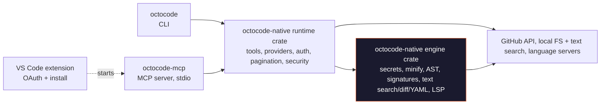

# Octocode: an agentic toolkit for software engineering

<div align="center">
  

  [](https://github.com/modelcontextprotocol/servers)
  [](https://deepwiki.com/bgauryy/octocode)
  [](https://glama.ai/mcp/servers/bgauryy/octocode)

  [](https://octocode.ai)
  [](https://www.youtube.com/@Octocode-ai)

</div>

**Evidence-first tools, workflows, and runtime infrastructure for coding agents.**

Octocode is an **agentic toolkit** for researching, changing, coordinating, and evaluating software work. It gives coding agents one evidence model across local code, GitHub, and package registries — plus reusable Agent Skills, CLI and MCP interfaces, native runtime primitives, coordination, host integrations, and evaluation infrastructure.

Start with the **CLI** or **MCP server**. Both use the same tool contracts and Rust-backed research engine, from exact file reads and text search to AST, repository topology, and LSP navigation. Reach for the other packages when a task needs them.

---

## Table of contents

- [Quick start](#quick-start)
- [Why Octocode](#why-octocode)
- [Benchmarks](#benchmarks)
- [Tools](#tools)
- [MCP](#mcp)
- [CLI](#cli)
- [Configuration](#configuration)
- [Authentication methods](#authentication-methods)
- [Security](#security)
- [Language support](#language-support)
- [Skills](#skills)
- [Architecture](#architecture)
- [Documentation](#documentation)
- [Troubleshooting](#troubleshooting)
- [Agent workflows](#agent-workflows)

---

## Quick start

**Prerequisites:** Node.js 24.15.0+ (24.x)

**1. Run the Octocode CLI with `npx`**

```bash
npx octocode --help
```

**2. Authenticate with GitHub** - optional, but unlocks private repositories and higher API rate limits:

```bash
npx octocode auth login
npx octocode auth status  # verify the active token source
```

**3. Choose your interface.** Same tools and Rust engine on both. `ghCloneRepo`
is CLI-only (it needs persistent storage); MCP never registers it.

**🖥️ CLI** - research straight from your terminal:

```bash
npx octocode
```

**🤖 MCP** - one-click install:

- [](https://cursor.com/en/install-mcp?name=octocode&config=eyJjb21tYW5kIjoibnB4IiwidHlwZSI6InN0ZGlvIiwiYXJncyI6WyIteSIsIm9jdG9jb2RlLW1jcEBsYXRlc3QiXX0=)
- [](https://insiders.vscode.dev/redirect/mcp/install?name=octocode&config=%7B%22command%22%3A%22npx%22%2C%22type%22%3A%22stdio%22%2C%22args%22%3A%5B%22-y%22%2C%22octocode-mcp%40latest%22%5D%7D)

<details>
<summary><b>Show more install options (Windsurf, Kiro, Goose, LM Studio, Claude Code)</b></summary>
<br>

- [](https://insiders.vscode.dev/redirect/mcp/install?name=octocode&config=%7B%22command%22%3A%22npx%22%2C%22type%22%3A%22stdio%22%2C%22args%22%3A%5B%22-y%22%2C%22octocode-mcp%40latest%22%5D%7D&quality=insiders)
- [](windsurf://mcp/install?name=octocode&config=%7B%22command%22%3A%22npx%22%2C%22type%22%3A%22stdio%22%2C%22args%22%3A%5B%22-y%22%2C%22octocode-mcp%40latest%22%5D%7D)
- [](https://kiro.dev/launch/mcp/add?name=octocode&config=%7B%22command%22%3A%22npx%22%2C%22type%22%3A%22stdio%22%2C%22args%22%3A%5B%22-y%22%2C%22octocode-mcp%40latest%22%5D%7D)
- [](https://goose-docs.ai/extension?cmd=npx&arg=-y&arg=octocode-mcp%40latest&id=octocode&name=octocode&description=Evidence-first%20code%20research%20for%20AI%20agents)
- [](https://lmstudio.ai/install-mcp?name=octocode&config=eyJjb21tYW5kIjoibnB4IiwidHlwZSI6InN0ZGlvIiwiYXJncyI6WyIteSIsIm9jdG9jb2RlLW1jcEBsYXRlc3QiXX0=)

**Claude Code:**

```bash
claude mcp add-json octocode --scope user '{"command":"npx","type":"stdio","args":["octocode-mcp@latest"]}'
```
</details>

**Any other client:** `npx octocode install`

---

### Use it as an MCP server

Add to your MCP client config (or use a one-click install above):

```json
{
  "octocode": {
    "command": "npx",
    "type": "stdio",
    "args": ["octocode-mcp@latest"]
  }
}
```

Put a GitHub token and options under `env` (see [Configuration](#configuration)).

### Use it as an agentic-friendly CLI

Run `npx octocode` and agents figure out the rest. The bare command prints the tool catalog, availability, and agent instructions, so any coding agent knows how to drive it out of the box, no MCP client or extra wiring required.

```bash
npx octocode                                         # self-describing usage for agents
npx octocode schema                                  # compact catalog of every tool
npx octocode schema localSearch                      # one tool's input contract
```

Every MCP tool is also a plain command named after the tool: JSON in, structured JSON out (single-line by default to save agent tokens, `--pretty` for indented).

```bash
npx octocode localSearch \
  '{"queries":[{"path":"/absolute/path/to/project","matchString":"authenticate","pageSize":20,"mainGoal":"find auth","reasoning":"locate the auth entry point"}]}'
```
```json
{
  "results": [
    {
      "index": 0,
      "data": {
        "files": [
          {
            "path": "src/auth.ts",
            "matches": [
              { "line": 12, "value": "export async function authenticate(req: Request) {" }
            ]
          }
        ]
      }
    }
  ]
}
```

Learn more at **[octocode.ai](https://octocode.ai)**.

---

## Why Octocode

Coding agents need more than a search command. They need reliable evidence, rules for choosing the next tool, safe execution boundaries, reusable workflows, and ways to coordinate and measure results. Octocode packages those pieces as one composable toolkit. *Code is truth; context is the map.*

The toolkit has five layers:

| Layer | What it provides |
|------|------------------|
| **Research** | One evidence flow across local code, GitHub, pull requests, issues, commits, and package registries. |
| **Agent workflows** | Skills for research, architecture, documentation, evaluation, scraping, prompt design, and orchestration. |
| **Interfaces and hosts** | CLI, MCP, and VS Code setup. |
| **Runtime and safety** | Shared contracts, configuration, tool execution, native code intelligence, secret redaction, and guarded file operations. |
| **Coordination and evaluation** | Local multi-agent coordination (session identity, path leases, messages) and benchmark infrastructure. |

The research layer connects **local code** and **external code** on GitHub and package registries. Instead of returning a fixed blob, it lets the agent decide what evidence it needs next:

- **Agent-driven, efficient flows.** Instead of one-shot dumps, Octocode chains cheap steps into an optimized research flow: broad code search, then fetch only the **exact matched lines/region**, with **smart pagination** and **out-of-the-box minification** so the model never over-fetches. Every result carries **next-step hints** to the cheapest follow-up.
- **Judge before you read (`clasify`).** The credential-gated `clasify` tool rates *unread* candidates or locates the answering lines in an unread file, and returns **verdicts and line windows, never file bodies**. It pays off when it classifies an explicit list without reading every item, locates an answer inside a large known file, or screens for absence. When a literal can be guessed, searching for it is cheaper. It routes reading; it is never proof. See [Semantic assessment](#semantic-assessment--clasify).
- **Scales to monorepos.** Spot a pattern in one repository, follow the PR that introduced it, then trace it across other repositories and your own files, without leaving the chat.
- **Smart GitHub flow.** Parallel bulk queries across code, PRs, commits, issues, and repositories, all with the same search-broad, read-narrow, trace-semantically discipline.
- **Works without GitHub.** Clone any repository and point the local tools (search, AST, LSP, content) at it, same evidence-first flow.
- **Reads shape, not noise.** On-the-fly best-effort minification across broad code/data formats, plus grammar-backed outlines for 28 first-class extensions: a large file becomes focused evidence instead of walls of boilerplate.
- **Fast, self-contained.** Search, parsing, navigation, and redaction run in one prebuilt **Rust engine**: quick on a laptop or a mega-repo, nothing extra to install.
- **Safe by default.** Every byte to the model is scanned and secrets redacted first (see [Security](#security)).

**What you can do** (whenever the next step needs proven context, not a guess):

| Need | Use Octocode to |
|------|-----------------|
| **Codebase questions** | Search local or GitHub code, read exact regions, browse trees, and carry file/line anchors into the answer. |
| **Implementation research** | Compare patterns across repositories, package registries, pull requests, commits, and local files before changing code. |
| **Semantic navigation** | Resolve definitions, references, callers/callees, call hierarchy, hovers, symbols, diagnostics, and type relationships through LSP. |
| **Structural matching** | Run AST-shaped searches with patterns or YAML rules so comments and strings do not become false positives. |
| **Large-file context** | Minify, skeletonize, or paginate code so agents spend tokens on relevant structure instead of boilerplate. |
| **Agent workflows** | Same engine through MCP, CLI, and Agent Skills. |

The concept, the research loop, and the measured advantages (and where plain tools still win) are in [The Octocode protocol](https://github.com/bgauryy/octocode/blob/main/docs/OCTOCODE_PROTOCOL.md).

---

## Benchmarks

A plain-markdown CLI research benchmark lives in [`packages/octocode-benchmark/`](packages/octocode-benchmark/README.md): 30 shared GitHub questions, each answered by isolated agents using the Octocode CLI or a `gh` baseline (plain `gh`, `gh` + RTK, `gh` + Headroom), then graded by a blind judge. Every call is instrumented, so characters through the model are measured, not self-reported.

Results per matchup, with confidence intervals: [benchmark summary](packages/octocode-benchmark/results/SUMMARY.md).

---

## Tools

**16 tools in the full discovery catalog.** By default MCP registers **12**.
`ghCloneRepo`, `astTopology` and `astRewrite` are CLI-only; MCP never registers
them. `clasify` needs `OCTOCODE_CLASSIFICATION_API`, while `astRewrite` and
`astTopology` need
`OCTOCODE_BETA`. The CLI lists 14 commands, and all 16 with `OCTOCODE_BETA`;
cloning requires persistent storage.

| Surface | Registers by default | Gated tools |
|---|---:|---|
| MCP, no flags | 12 of 16 | `ghCloneRepo`, `astTopology` and `astRewrite` are always omitted; `clasify` can be enabled. |
| CLI, no flags | 14 of 16 | `astTopology` and `astRewrite` are listed with `OCTOCODE_BETA`; run without it, they name the gate to set. `clasify` needs its key. |

Use `TOOLS_TO_RUN` for a strict allowlist or `DISABLE_TOOLS` to remove tools from
the default set. `OCTOCODE_ENABLE_LOCAL=false` disables local, graph, and LSP tools.
Flags: [Configuration](https://github.com/bgauryy/octocode/blob/main/docs/CONFIGURATION.md).

**Token knobs.** `concise:true` returns path/title-only lists. `minify` controls file read density: `none` = exact bytes (default), `standard` = comments/blanks stripped, `symbols` = skeleton with line numbers. Responses are minimal by default; `debug:true` adds scan stats, receipts, and snapshots.

### GitHub tools

| Tool | What it does | Knob |
|------|--------------|------|
| `ghSearchRepo` | Discover GitHub repositories by keywords, topics, owner, and metadata filters. | `match` |
| `ghSearchCode` | Search indexed default-branch code within an owner (and optional repo); paths only or snippets. | `match` |
| `ghStructure` | Browse a known repository tree with optional sizes, languages, contributors, branches, and tags. | `include` |
| `ghGetFileContent` | Read a GitHub file or region: full file, line range, match slice, or paginated chars. | `minify` |
| `ghSearchHistory` | Search or list pull requests, issues, or commits through strict `operation:"pullRequest"`, `"issue"`, or `"commit"` queries. | `operation` |
| `ghGetHistoryItem` | Read one pull request or issue by `number`, one commit by `ref`, or a comparison by `base`+`head`. | `operation` |
| `ghCloneRepo` | CLI-only clone of a repository or sparse subtree into the local cache for local and LSP analysis. Requires persistent storage. | `path` |

Each GitHub search tool accepts 1 to 5 parallel queries and has no `operation` field.

### Local tools

| Tool | What it does | Knob |
|------|--------------|------|
| `localSearch` | Lexical text and regex search over local files. | `matchString` |
| `structureSearch` | Directory outlines and file discovery by name or metadata; no parser. | `operation` |
| `astSearch` | AST shape, syntax-tree, and symbol queries. | `operation` |
| `astTopology` | CLI only. Cross-file dependency graph analysis: dependencies, dependents, paths, cycles, reachability, dead code, and drift. Beta feature gated by `OCTOCODE_BETA`. | `operation` |
| `astRewrite` | CLI only. Preview or apply snapshot-bound structural rewrites. Beta feature gated by `OCTOCODE_BETA` (the sole gate for both preview and apply). | `apply` |
| `localFetch` | Read a local file or region: exact slice, match string, line range, or paginated chars. | `minify` |

### Package search

| Tool | What it does | Knob |
|------|--------------|------|
| `artifactSearch` | Package lookup and capability discovery across eight ecosystems; returns registry metadata and upstream source links. | `type`, `packageName` / `keywords` |

### LSP

| Tool | What it does |
|------|--------------|
| `lspSearch` | Typed semantic navigation: `definition`, `references`, `callers`, `callees`, `callHierarchy`, `hover`, `documentSymbols`, `typeDefinition`, `implementation`, `workspaceSymbol`, `supertypes`, `subtypes`, and `diagnostic`. From the CLI, invoke it directly: `npx octocode lspSearch '<json>'`. Navigation runs through installed language servers (see the [LSP tools reference](https://github.com/bgauryy/octocode/blob/main/docs/OCTOCODE_TOOLS.md#lsp-tools-reference)). |

### Semantic assessment — `clasify`

`clasify` is the only semantic tool. **Scout** screens unread local or GitHub read requests, **Locate** finds the line window that answers a question in an unread file, and **Judge** classifies state the caller already holds. Batch independent candidates in one `resources[] × questions[]` matrix (≤25 cells). Results carry typed judgments and source ranges, never source bodies.

Use it to classify an explicit list instead of reading every item, to locate an answer inside a large known file (add `prefilter` literals when the answer contains one), or to screen for absence. To locate behavior, guess one literal and search for it first: when a literal can be guessed, search is cheaper than clasify ([measurements](docs/OCTOCODE_CLASIFY.md)). Skip it for identifiers, literals, PR filters and search snippets. Scores from 0.36 to 0.69 mean read to verify. A verdict routes reading and does not prove a claim; verify the deciding source.

**Enable classification** (restart CLI and MCP processes afterwards):

```bash
export OCTOCODE_CLASSIFICATION_API='your-provider-key'
```

Without a nonblank key, `clasify` disappears from MCP, the instructions, and every `next.*`. `OCTOCODE_CLASSIFICATION_API_HOST` only overrides the provider endpoint. Modes, limits, and measurements: [OCTOCODE_CLASIFY.md](https://github.com/bgauryy/octocode/blob/main/docs/OCTOCODE_CLASIFY.md); key handling: [AUTHENTICATION.md](https://github.com/bgauryy/octocode/blob/main/docs/AUTHENTICATION.md).

Full schemas, fields, and examples for every tool live in [`docs/OCTOCODE_TOOLS.md`](https://github.com/bgauryy/octocode/blob/main/docs/OCTOCODE_TOOLS.md) (linked under [Documentation](#documentation)).

---

## MCP

The MCP server exposes the Octocode tool catalog directly to your AI assistant over stdio.

https://github.com/user-attachments/assets/de8d14c0-2ead-46ed-895e-09144c9b5071

### Manual configuration

Use the JSON block in [Use it as an MCP server](#use-it-as-an-mcp-server), or run `npx octocode install` to write it into a supported client (Cursor, Windsurf, Claude Desktop, Claude Code, VS Code extensions, Zed, Codex, Goose, and more; `npx octocode install --list`). Add a GitHub token and options under `env` - see [Authentication](#authentication-methods) and [Configuration](#configuration). Registration rules, startup checks, and transport details: [MCP server guide](https://github.com/bgauryy/octocode/blob/main/docs/OCTOCODE_MCP.md).

---

## CLI

Same research engine, no MCP client needed. Every tool is a plain command named after the tool: `npx octocode <toolName> '<json>'`. Authenticate once with `npx octocode auth login` (see [Authentication](#authentication-methods)); run `npx octocode --help` for full usage.

### Commands

#### Tool commands

| Command | What it does |
|---------|--------------|
| `npx octocode <toolName> '<json>'` | Run a tool (same tools as MCP): readable text on a terminal, single-line JSON on a pipe (`--json` forces JSON) |
| `npx octocode <toolName> --input <file\|->` | Run a tool with the JSON query read from a file, or `-` for stdin |
| `npx octocode schema <toolName>` | Show one tool's public input contract: fields, types, bounds, defaults |
| `npx octocode schema` | Compact catalog of enabled tools |

Input is always `{"queries":[row, …]}`. A row may carry `mainGoal` and
`reasoning`; a `next.*` continuation inherits its row's brief.

#### More commands

- **Auth and config** — `npx octocode auth` (token status, `--json`), `npx octocode auth login [--refresh|--force]|logout`, `npx octocode config` (config file paths and set key names; `--check`/`--add`/`--remove` for global `.env` keys, values never printed)
- **Code graph** — `npx octocode graph ingest <path>` then `npx octocode graph query <op>` (callers, impact, cycles, issues, ...) over a persisted graph in `<workspace>/.octocode/graph`
- **Skills** — `npx octocode skill list|install|check|info|remove` for bundled Octocode skills
- **Setup** — `npx octocode install`, `npx octocode help`
- **Maintenance (hidden from help, still available)** — `npx octocode cache status|clear`; `npx octocode lsp-server list|install|status|uninstall|clean|which`

Full syntax, flags, and exit codes: [Octocode CLI guide](https://github.com/bgauryy/octocode/blob/main/packages/octocode/docs/OCTOCODE_CLI.md)

---

## Configuration

Everything is optional; Octocode runs on sensible defaults. Settings resolve per field, first valid value wins:

```text
shell / MCP env  >  <workspace>/.octocode/.env  >  <octocode-home>/.env  >  <workspace>/.octocode/.octocoderc  >  <octocode-home>/.octocoderc  >  defaults
```

Some security-sensitive keys (for example `WORKSPACE_ROOT`, `ALLOWED_PATHS`, `OCTOCODE_BETA`) are read only from the shell or the trusted home `.env`; each key's accepted sources are listed in [CONFIG_SETTINGS.md](https://github.com/bgauryy/octocode/blob/main/docs/generated/CONFIG_SETTINGS.md). A misconfigured file or value never stops Octocode: it is skipped and reported on stderr with the file path and the reason. Run `npx octocode config` to see which files and keys are in effect.

**Octocode home** (`<octocode-home>`) is `.octocode` inside the OS home directory (`~/.octocode`, `%USERPROFILE%\.octocode` on Windows); override it with `OCTOCODE_HOME`. It holds the global config, encrypted credentials, and the cache shared by the CLI and MCP (`tmp/`). Set `OCTOCODE_STORAGE_MODE=memory` (or `storage.mode: "memory"`) to stop persistent writes. **Tokens never go in `.octocoderc`** — use `env` or `npx octocode auth login`.

### Common settings

| Env var | `.octocoderc` key | Default | What it does |
|---------|-------------------|---------|--------------|
| `OCTOCODE_ENABLE_LOCAL` | `local.enabled` | `true` | Local filesystem, graph, and LSP tools on or off. |
| `WORKSPACE_ROOT` | `local.workspaceRoot` | process cwd | Base for relative tool paths and display paths; also an allowed root. |
| `ALLOWED_PATHS` | `local.allowedPaths` | `[]` | Extra allowed roots (comma-separated in env). |
| `TOOLS_TO_RUN` / `DISABLE_TOOLS` | `tools.enabled` / `tools.disabled` | unset | Strict tool allowlist / tools removed from the default set. |
| `OCTOCODE_BETA` | `local.beta` | `false` | Enable the CLI-only beta tools `astTopology` and `astRewrite` (preview and apply). |
| `OCTOCODE_OUTPUT_FORMAT` | `output.format` | `yaml` | MCP text-channel encoding: `yaml` or `json`. Structured content and CLI stdout are always JSON. |
| `OCTOCODE_STORAGE_MODE` | `storage.mode` | `persistent` | `memory` prevents persistent cache, materialization, and state writes. |
| `GITHUB_API_URL` | `github.apiUrl` | `https://api.github.com` | GitHub REST API root (GitHub Enterprise). |

GitHub tokens and the `clasify` key: [Authentication](#authentication-methods). Every key, alias, cache limit, network timeout, and an example `.octocoderc`: [Configuration Reference](https://github.com/bgauryy/octocode/blob/main/docs/CONFIGURATION.md).

### Example configuration

**`~/.octocode/.octocoderc`** (JSON with comments):
```json
{
  "github": { "apiUrl": "https://api.github.com" },
  "local": { "enabled": true },
  "output": { "format": "yaml" },
  "storage": { "mode": "persistent" }
}
```

---

## Authentication methods

GitHub tools work without a token at GitHub's lower public rate limit; a credential unlocks private repositories and higher limits. Any one of these is enough:

```bash
npx octocode auth login     # GitHub OAuth device flow; token stored encrypted in <octocode-home>
npx octocode auth status    # verify: active source, username, host (--json for machines)
```

- **Environment token** — `GH_TOKEN` or `GITHUB_TOKEN` in the shell, CI, or MCP `env`. An environment token always wins over a stored login.
- **GitHub CLI** — if `gh auth login` is done, Octocode falls back to `gh auth token` automatically.

Resolution order, refresh (`auth login --refresh`), logout, GitHub Enterprise, the `clasify` key, and npm registry credentials: [AUTHENTICATION.md](https://github.com/bgauryy/octocode/blob/main/docs/AUTHENTICATION.md). Never commit tokens.

---

## Security

**Every byte to the model is scanned and redacted first.** All content passes through the Rust engine's secret scanner on the way *in* and *out*, so secrets never reach the model. That covers local files, GitHub and npm responses, errors, and tool output. The behavior is identical under MCP and the CLI.

- **Secret redaction, in and out.** 300+ provider credential patterns (AWS, Azure, GCP, GitHub, OpenAI, Anthropic, Stripe, Slack, 1Password, and more) plus generic JWTs, PEM/private keys, bearer tokens, database connection strings, and high-entropy strings. Masked values surface a redaction warning so the agent knows.
- **Content sanitized at the source.** Local reads (`localFetch`, text search, structural search, binary, file discovery, structure) and external fetches (GitHub code/files, npm) are scanned as they are read, not only at the boundary.
- **Path safety.** Local reads are bounded to the allowed roots: the workspace root (`WORKSPACE_ROOT`, else the process cwd), `ALLOWED_PATHS`, and `OCTOCODE_HOME`. The OS home directory is not allowed unless listed. Relative paths resolve against the process cwd, not `WORKSPACE_ROOT`. Symlinks are resolved and the real target is **re-validated**, so a link cannot escape into a blocked location.
- **Sensitive files blocked by default.** Reads of known secret-bearing files and folders return a redacted error instead of contents: keys/certs, `.env*`, `.npmrc`/`.netrc`, cloud/infra credentials (`.aws/`, `.kube/`, `*.tfstate`), `.git/`, browser logins, OS keychains, and wallets. Full list in [SECURITY.md](https://github.com/bgauryy/octocode/blob/main/docs/SECURITY.md).
- **Command safety.** Normal local search runs in-process inside the native engine crate. External helpers are fixed per lane, command/argument allowlisted, and run through `spawn` with argument arrays: no shell strings, no injection.
- **Schema validation** runs before any tool executes; untrusted input size and shape are bounded.
- **Credentials.** GitHub auth through environment tokens, an encrypted Octocode login (`credentials.json`, AES-256-GCM), older OS-credential-store logins, or the `gh` CLI; tokens are never logged. `clasify` is the only tool that sends content to a third party, and only with its key set.

**Full security model, pipeline, and threat coverage: [SECURITY.md](https://github.com/bgauryy/octocode/blob/main/docs/SECURITY.md).** Related: [Authentication](https://github.com/bgauryy/octocode/blob/main/docs/AUTHENTICATION.md) · [Configuration](https://github.com/bgauryy/octocode/blob/main/docs/CONFIGURATION.md)

---

## Language support

Octocode has 11 first-class source-language families: JavaScript, TypeScript, Rust, Python, C, C++, Assembly, Java, Scala, Go, and C#. Structural search/rewrite, signatures, graph facts, syntax inspection, and LSP grammar adapters derive from one registry of 12 grammars (TSX has its own) covering exactly 28 extensions in the default build; `npx octocode schema` prints the live inventory. The CUDA grammar (`.cu`/`.cuh`) is opt-in and absent from release builds; those files still route to `clangd` for LSP. Built-in semantic-server routes cover 11 families and 27 extensions because generic Assembly requires trusted custom configuration.

| Axis | What it does | How to use it |
|------|--------------|---------------|
| **Structural AST** | Tree-sitter shape queries (`pattern` or YAML rule documents) over the 28 first-class extensions. | `astSearch operation:"match"` · CLI `schema astSearch` |
| **Signature outline** | Body-free skeleton with line numbers from the same grammar registry, no heuristics. | `minify:"symbols"` · CLI `schema localFetch` |
| **Content minification** | Broader best-effort comment/whitespace processing for code and data formats. A minifier route is not parser support. | `minify:"standard"` (default is `none`) |
| **LSP navigation** | Semantic navigation through installed servers for the 11 built-in language families; trusted custom routes can support Assembly and other extensions. | `lspSearch` · CLI `schema lspSearch` |

Text search, ordinary reads, GitHub/history tools, and artifact lookup remain language-agnostic. YAML ast-grep rule documents do not imply YAML source parsing. Syntax graph facts are candidates; use LSP for semantic proof.

📋 **Full support matrix:** [Supported languages and features](https://github.com/bgauryy/octocode/blob/main/packages/octocode-native/docs/engine/SUPPORTED_LANGUAGES_AND_FEATURES.md).

---

## Skills

> [Agent Skills](https://agentskills.io/what-are-skills) are a lightweight, open format for extending AI agent capabilities.
> Browse and install on [**skills.sh/bgauryy/octocode-mcp**](https://www.skills.sh/bgauryy/octocode-mcp)

**14 public skills** in [`skills/`](https://github.com/bgauryy/octocode/tree/main/skills), bundled in the `octocode` package. Each is a lean `SKILL.md` that loads references only when needed. Start with ⭐ [Research](https://www.skills.sh/bgauryy/octocode-mcp/octocode-research) for evidence-first code work.

Tested skills live in [`skills-beta/`](skills-beta/) and are not published. Skills for working on this repository live in [`skills-dev/`](skills-dev/).

```bash
npx octocode skill list
npx octocode skill install octocode-research --platform pi --global
npx octocode skill check --json
npx octocode skill help
```

### Core research and extraction
| Skill | Use when |
|-------|----------|
| ⭐ [**octocode-research**](https://github.com/bgauryy/octocode/tree/main/skills/octocode-research) | Evidence-first research, review, debugging, refactors, prior-art validation, and `clasify` typed judgments over unread files. |
| [**octocode-architect**](https://github.com/bgauryy/octocode/tree/main/skills/octocode-architect) | Architecture and algorithm review, dependency/flow analysis, verified flaw detection, and evidence-gated refactoring. |
| [**octocode-scraping**](https://github.com/bgauryy/octocode/tree/main/skills/octocode-scraping) | Public page extraction and crawl triage: static corpus + graph v2 (pages/data/actions/risks/evidence), then CDP handoff for dynamic actions and blocked pages. |
| [**octocode-chrome-devtools**](https://github.com/bgauryy/octocode/tree/main/skills/octocode-chrome-devtools) | Browser/CDP evidence: network, console, performance, cookies/storage, screenshots, auth-gated pages, and live validation of scrape-graph actions. |

### Plan and architecture
| Skill | Use when |
|-------|----------|
| [**octocode-brainstorming**](https://github.com/bgauryy/octocode/tree/main/skills/octocode-brainstorming) | Check an issue, idea, or open decision from more than one direction: context, evidence, and the objection. Exploratory mode (18+) starts only when someone asks for it. |
| [**octocode-rfc-generator**](https://github.com/bgauryy/octocode/tree/main/skills/octocode-rfc-generator) | Evidence-backed RFCs, execution plans, and audits of an existing RFC. |
| [**octocode-documentation**](https://github.com/bgauryy/octocode/tree/main/skills/octocode-documentation) | Writing or updating README, API docs, runbooks, AGENTS.md, ADRs. |

### Evaluation and review
| Skill | Use when |
|-------|----------|
| [**octocode-roast**](https://github.com/bgauryy/octocode/tree/main/skills/octocode-roast) | Blunt, evidence-backed code critique with severity ranking and repair paths. |
| [**octocode-clean-agentic-code**](https://github.com/bgauryy/octocode/tree/main/skills/octocode-clean-agentic-code) | Behavior-preserving cleanup: dead exports, shims, duplicate logic, stale prose/config/tests, and agent residue (AI slop). |
| [**octocode-eval-benchmark**](https://github.com/bgauryy/octocode/tree/main/skills/octocode-eval-benchmark) | Smart evals and honest benchmarks: goal→KPI contracts, graders, held-out suites, guardrails, and accept/revert loops. |
| [**octocode-agentic-prompts**](https://github.com/bgauryy/octocode/tree/main/skills/octocode-agentic-prompts) | Making prompts, tool schemas, and agent contracts clearer, safer, cheaper, measurable. |

### Agent orchestration
| Skill | Use when |
|-------|----------|
| [**octocode-skills**](https://github.com/bgauryy/octocode/tree/main/skills/octocode-skills) | Agent-skill lifecycle: discover, review, create, improve, install, sync. |
| [**octocode-agents-communication**](https://github.com/bgauryy/octocode/tree/main/skills/octocode-agents-communication) | Coordinating agents or sessions that share work: discover collaborators, reserve edits, exchange results and handoffs. |

**Web automation workflow:** `octocode-scraping` performs the safe static pass first (fetch/crawl/extract → local corpus → graph v2). When the graph exposes dynamic actions or static output is blocked/thin, `octocode-chrome-devtools` validates live actionability, cookies/storage, network/HAR bodies, screenshots, or auth-gated state; discovered URLs/data/artifacts can be fed back into the scraping corpus for continued proof.

---

## Architecture

Octocode is a yarn-workspaces monorepo organized as a toolkit rather than one application. The **MCP server** and **CLI** are thin interfaces over one Rust runtime. `octocode-native` consumes canonical public contracts and contains separate runtime-policy and engine-primitive Rust crates; Node only launches the native CLI, registers MCP transport, and materializes Agent Skills. Skills, host integrations, coordination, file mutation, and evaluation packages build around that research spine without duplicating tool execution.


```mermaid
graph LR
    CLI["octocode<br/>CLI"]
    MCP["octocode-mcp<br/>MCP server, stdio"]
    VSC["VS Code extension<br/>OAuth + install"]
    CORE["octocode-native runtime crate<br/>tools, providers, auth, pagination, security"]
    ENGINE["octocode-native engine crate<br/>secrets, minify, AST, signatures, text search/diff/YAML, LSP"]
    EXT["GitHub API, local FS + text search, language servers"]

    CLI --> CORE
    MCP --> CORE
    VSC -. starts .-> MCP
    CORE --> ENGINE
    CORE --> EXT
    ENGINE --> EXT

    style ENGINE fill:#1a1a2e,stroke:#e75d2a,color:#fff
```

**Request flow** is identical whether a call arrives over MCP or the CLI:

```text
client → sanitize inputs (Rust) → run tool (GitHub / FS / LSP) → sanitize + serialize + paginate (Rust) → result + next-step hints
```

**One Rust execution path** owns provider calls, secret detection, sanitization, path and command validation, best-effort minification across broad formats, signature extraction for first-class grammars, structural AST search and rewrite, text search, diff filtering, serialization, and LSP. The native package ships prebuilt CLI and N-API artifacts for darwin (arm64/x64), linux (x64 gnu and musl, arm64 gnu), and win32-x64; no Rust toolchain is needed at runtime.

### Packages

Each workspace package owns one layer of the toolkit. The package map, contract pipeline, and build commands are in [DEVELOPMENT.md](https://github.com/bgauryy/octocode/blob/main/skills-dev/octocode-dev/docs/DEVELOPMENT.md).

| Layer | Directory / package | Responsibility |
|------|---------------------|----------------|
| Interface | [`packages/octocode`](https://github.com/bgauryy/octocode/tree/main/packages/octocode) · `octocode` | Agent-oriented CLI for raw tool calls, authentication, installation, configuration inspection, cache management, language servers, and Agent Skills. |
| Interface | [`packages/octocode-mcp`](https://github.com/bgauryy/octocode/tree/main/packages/octocode-mcp) · `octocode-mcp` | Thin stdio MCP server that publishes the enabled tool catalog and forwards validated calls to the shared runtime. |
| Interface | [`packages/octocode-vscode`](https://github.com/bgauryy/octocode/tree/main/packages/octocode-vscode) · `octocode-mcp-vscode` | VS Code extension for GitHub OAuth, token synchronization, and MCP installation across supported editors. |
| Research runtime | [`packages/octocode-native`](https://github.com/bgauryy/octocode/tree/main/packages/octocode-native) · `@octocodeai/octocode-native` | Consolidated distribution for the native CLI, runtime addon (`.`/`./runtime`), and engine primitive addon (`./engine`), backed by separate Rust crates. |
| Configuration and contracts | [`packages/octocode-config`](https://github.com/bgauryy/octocode/tree/main/packages/octocode-config) · `@octocodeai/config` | Octocode home resolution, `.env` / `.octocoderc` loading, and the configuration contract; also the only tool-contract generator (embeds the `octocode-core` contract for native and TypeScript consumers). |
| Skill distribution | [`packages/octocode-skill-installer`](https://github.com/bgauryy/octocode/tree/main/packages/octocode-skill-installer) · `@octocodeai/octocode-skill-installer` | Shared installer for durable skill materialization, platform-specific links or copies, upgrades, and conflict reporting. |
| Coordination | [`packages/octocode-agents-communication`](https://github.com/bgauryy/octocode/tree/main/packages/octocode-agents-communication) · `@octocodeai/octocode-agents-communication` | Standalone npm CLI with a separate lean communication skill. Coordinates session identity, advisory path leases, and direct messages. |
| Evaluation | [`packages/octocode-benchmark`](https://github.com/bgauryy/octocode/tree/main/packages/octocode-benchmark) · `@octocodeai/octocode-benchmark` | Private CLI research benchmark: Octocode against `gh`, `gh` + RTK and `gh` + Headroom on 30 GitHub questions, with a blind judge and measured characters. |

The separately versioned [`@octocodeai/octocode-core`](https://github.com/bgauryy/octocode-mcp-host/tree/main/packages/octocode-core) package authors the public tool schemas, descriptions, and shared MCP/CLI instructions. This monorepo consumes those contracts through `@octocodeai/config`; `octocode-native` owns their execution.

---

## Documentation

Website: **[octocode.ai](https://octocode.ai)** · Documentation hub: **[`docs/README.md`](https://github.com/bgauryy/octocode/blob/main/docs/README.md)**, one owner doc per topic.

| Area | Docs |
|---|---|
| Start here | [The Octocode protocol](https://github.com/bgauryy/octocode/blob/main/docs/OCTOCODE_PROTOCOL.md) · [MCP server](https://github.com/bgauryy/octocode/blob/main/docs/OCTOCODE_MCP.md) · [CLI guide](https://github.com/bgauryy/octocode/blob/main/packages/octocode/docs/OCTOCODE_CLI.md) |
| Using Octocode | [Workflows](https://github.com/bgauryy/octocode/blob/main/docs/OCTOCODE_WORKFLOWS.md) · [Tool reference](https://github.com/bgauryy/octocode/blob/main/docs/OCTOCODE_TOOLS.md) · [Data contract](https://github.com/bgauryy/octocode/blob/main/docs/TOOL_DATA_CONTRACT.md) · [clasify](https://github.com/bgauryy/octocode/blob/main/docs/OCTOCODE_CLASIFY.md) · [Configuration](https://github.com/bgauryy/octocode/blob/main/docs/CONFIGURATION.md) · [Authentication](https://github.com/bgauryy/octocode/blob/main/docs/AUTHENTICATION.md) · [Security](https://github.com/bgauryy/octocode/blob/main/docs/SECURITY.md) |
| Developing Octocode | [Development](https://github.com/bgauryy/octocode/blob/main/skills-dev/octocode-dev/docs/DEVELOPMENT.md) · [Adding config](https://github.com/bgauryy/octocode/blob/main/skills-dev/octocode-dev/docs/ADDING_CONFIG.md) · [Tool quality](https://github.com/bgauryy/octocode/blob/main/skills-dev/octocode-dev/docs/TOOL_QUALITY.md) · [Release](https://github.com/bgauryy/octocode/blob/main/skills-dev/octocode-dev/docs/RELEASE.md) · [Benchmark research](https://github.com/bgauryy/octocode/blob/main/packages/octocode-benchmark/results/SUMMARY.md) |
| Skills and method | [Public skills](skills/) · [Tested skills](skills-beta/) · [Repository skills](skills-dev/) · [RDD manifest](https://github.com/bgauryy/octocode/blob/main/MANIFEST.md) |
| Language support | [LSP lifecycle and language matrix](https://github.com/bgauryy/octocode/blob/main/packages/octocode-native/docs/engine/LSP_SERVER_LIFECYCLE.md) |

---

## Troubleshooting

**Node.js or environment issues?** Octocode needs Node.js 24.15.0+. To diagnose a Node setup, run [node-doctor](https://www.npmjs.com/package/node-doctor):

```bash
npx node-doctor
```

**Common pitfalls:**
- **GitHub auth failures:** Run `npx octocode auth status --json` to see which source is active (an environment token always wins over a stored login). Refresh with `npx octocode auth login --refresh`, or switch accounts with `--force`. See [AUTHENTICATION.md](https://github.com/bgauryy/octocode/blob/main/docs/AUTHENTICATION.md).
- **MCP connection issues:** If your AI assistant (like Cursor or Windsurf) fails to connect, ensure you have run `npx octocode auth login` in your terminal first, or explicitly pass your `GITHUB_TOKEN` in the MCP `env` configuration.
- **Native engine errors:** Octocode uses a prebuilt Rust engine. Supported: macOS arm64/x64, Linux x64 (glibc or musl) and arm64 (glibc), Windows x64.

---

## Agent workflows

### Recommended dev mode: Pi + Octocode

[Pi](https://github.com/earendil-works/pi) is a fast, local-first coding agent whose stated philosophy is *"CLI tools with READMEs (Skills) over MCP."* Pairing it with Octocode gives a lean, evidence-driven dev loop — **Pi edits, Octocode researches**. Two routes, pick by how much surface you need:

- **Skill route — recommended, leanest.** Drop the [`octocode-research`](https://www.skills.sh/bgauryy/octocode-mcp/octocode-research) skill into Pi's global skills dir. It drives the Octocode **CLI** directly — no MCP transport, minimal token overhead — and Pi auto-discovers it:

  ```bash
  npx octocode skill install octocode-research --platform pi --global
  ```

- **Adapter route — full tool surface.** Install [`pi-mcp-adapter`](https://github.com/nicobailon/pi-mcp-adapter) to expose Octocode MCP tools behind a single ~200-token proxy tool, so servers stay disconnected until a tool is called. MCP never exposes `ghCloneRepo`; clone through the CLI.

### Research-driven loop

Most agent failures happen before the edit: guessing who owns a behavior, trusting a snippet without reading the source, editing before proving blast radius. Run a cheaper loop instead: orient with trees, search, read exact evidence, use AST/LSP when identity matters, then patch and verify. The host edits, Octocode is the map, and skills encode the habit. How to choose and combine tools for each step: [Workflows](https://github.com/bgauryy/octocode/blob/main/docs/OCTOCODE_WORKFLOWS.md#choose-the-first-tool).

### The Manifest

**"Code is Truth, but Context is the Map."** Read the [Manifest of Octocode for Research Driven Development](https://github.com/bgauryy/octocode/blob/main/MANIFEST.md) to understand the philosophy behind Octocode.
