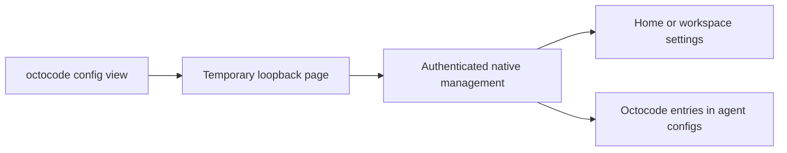

# Octocode configuration

Configures feature gates, storage, caches, timeouts, config files, and environment precedence for the Octocode toolkit. Credentials are in [`AUTHENTICATION.md`](AUTHENTICATION.md). Configuration controls whether a capability is available; it does not redefine a tool's input schema. See [`OCTOCODE_TOOLS.md`](OCTOCODE_TOOLS.md) for tool fields, [`OCTOCODE_MCP.md`](OCTOCODE_MCP.md) for server lifecycle, and [`SECURITY.md`](SECURITY.md) for path, secret, and command boundaries.

## Table of contents

- [Quick setup](#quick-setup)
- [Local configuration view](#local-configuration-view)
  - [Add or change configuration in the view](#add-or-change-configuration-in-the-view)
- [Authentication](#authentication)
- [Config files](#config-files)
  - [Where everything lives](#where-everything-lives)
  - [Cache storage and lifecycle](#cache-storage-and-lifecycle)
  - [npm registries and authentication](#npm-registries-and-authentication)
  - [`.env` — environment fallback](#env--environment-fallback)
  - [`.octocoderc` — Octocode settings](#octocoderc--octocode-settings)
  - [How settings override each other](#how-settings-override-each-other)
  - [Misconfiguration never blocks startup](#misconfiguration-never-blocks-startup)
- [MCP client `env` block](#mcp-client-env-block)
- [All settings reference](#all-settings-reference)
  - [Third-party keys](#third-party-keys)
  - [Octocode settings — env var or `.octocoderc`](#octocode-settings--env-var-or-octocoderc)
  - [Advanced runtime — env var only](#advanced-runtime--env-var-only)
  - [Protected keys](#protected-keys--never-sourced-from-env)
- [GitHub Enterprise](#github-enterprise)
- [Troubleshooting](#troubleshooting)
- [See also](#see-also)

---

## Quick setup

```bash
npx octocode auth login                          # GitHub OAuth device flow; encrypted token in ~/.octocode
npx -y octocode config view                       # settings, keys, and agent MCP entries
npx octocode auth status --json                  # verify
```

Already have a GitHub token and don't want a browser login? Set `GITHUB_TOKEN`; see [AUTHENTICATION.md](AUTHENTICATION.md).

---

## Local configuration view



Run `npx -y octocode config view` to open the bundled page in your default browser.
Use `--no-open` to print the session link without opening a browser.
Use `--idle-timeout 300` to close the server after five minutes of inactivity.
The default is 900 seconds; allowed values are 30 through 3600 seconds.
Press Ctrl+C or select **End session** to stop the server.

- **Settings** shows saved values, effective values, and their source. Select home or workspace before saving.
- **Keys** accepts environment variable names and replacement values. Existing secrets are never returned to the page.
- **Agents** discovers Octocode entries across supported client files. It reports configuration status, rather than a live connection test.
- Agent edits preserve other MCP entries. Unsupported or ambiguous layouts remain read only.
- Discovery checks supported client paths and the current workspace. It does not scan other project directories or enterprise policies.
- Continue main configuration arrays are read only. Imported Continue blocks report unknown coverage.
- Editing checks file revisions. If another process changes the file, refresh before saving again.
- Restart the affected agent or MCP server after editing. Client environment values can override the shared Octocode files.

### Add or change configuration in the view

1. Run `npx -y octocode config view`. The page opens on **Settings**.
2. Select **Save to**:
   - **Home** writes `~/.octocode/.octocoderc` and `~/.octocode/.env`. The value applies to every project.
   - **Workspace** writes `<project>/.octocode/.octocoderc` and `<project>/.octocode/.env`, where `<project>` is the directory where you ran the command. The value applies to that project only and overrides home.
3. Make the change on the applicable tab. Each save writes the file immediately and reloads the page data.

**Settings tab.** Use **Search** to find a setting, for example `output.format` or `network.timeout`.

| Setting type | How to enter the value |
|---|---|
| Boolean | Select or clear the checkbox. |
| Choice | Select a value from the list. |
| Number | Enter a number in the allowed range. The page rejects other values. |
| List | Enter a JSON array of strings, for example `["localSearch","localFetch"]`. Enter `null` to inherit the list. |
| Text or path | Enter the text. |

Select **Save** to write the value to the selected scope. Select **Use inherited value** to remove the value from that scope only.
Under each setting, **Effective value** and **Effective source** show the value that applies and the file it comes from.
An environment variable overrides both files, and a workspace value overrides a home value.
If you save a home value and the effective value does not change, look for a workspace or environment override.

Some settings are home only, for example `local.allowedPaths`, `local.beta`, `github.apiUrl`, and `lsp.configPath`.
In **Workspace** scope these settings are disabled.
`storage.mode` accepts only `memory` in a workspace.

**Keys tab.** Use this tab to add an API key or another environment variable.

1. In **Add a key**, enter the name in **Key name**, for example `GITHUB_TOKEN`. Use letters, digits, and `_` only, and do not start with a digit.
2. Enter the value in **New value**. The value must be on one line.
3. Select **Save key**. The key appears in the list as **Set**. The page never shows the saved value again.

To change a key, enter the new value in **Replacement** and select **Replace**. To delete a key, select **Remove**.
Keys that control trust boundaries are home only, for example `ALLOWED_PATHS`, `WORKSPACE_ROOT`, `GITHUB_API_URL`, `OCTOCODE_BETA`, and `OCTOCODE_LSP_CONFIG`.
In **Workspace** scope the view refuses them. GitHub tokens and `OCTOCODE_CLASSIFICATION_API` are permitted in a workspace.
A credential stored in `.octocoderc` shows **Stored setting**, for example `classification.api`. **Replace** and **Remove** edit that setting.

**Agents tab.** Each card is one MCP client configuration file, for example Cursor `~/.cursor/mcp.json` or Claude Code `~/.claude.json`.

1. Find the client and scope (`home`, `workspace`, or `local`).
2. If Octocode is not installed, select a launcher in **Launch with** (`npx`, `bunx`, or `pnpm`) and select **Install**.
3. To add an environment variable to the Octocode entry, enter **Environment key** and **New value**, then select **Save agent key**. Select **Remove key** to delete one.
4. If the card shows **Enabled**, clear it and select **Save / update** to turn the entry off without removing it.
5. Select **Remove Octocode** to delete the Octocode entry. Other MCP servers in the file stay unchanged.
6. Restart the agent.

The view shows symbolic links and unreadable or malformed configuration files as read only. It disables edits for the affected file and shows configuration warnings. Other writable files remain available.

**If a save fails.** The message tells you the cause:

- *Configuration changed* or *Agent config changed* — another process edited the file. The page reloads it. Review the values and save again.
- *Invalid value for …* — the value has the wrong type, is out of range, or is not an allowed choice.
- *may only be configured in home scope* or *cannot be loaded from this .env scope* — select **Home** and save again, or set the variable in the launching environment.
- *Values must be a single line* — remove line breaks from the value.

Octocode's own `.env` and `.octocoderc` files are replaced without a backup, so a removed secret leaves no copy.
An agent client's file keeps its previous content in one rolling hidden backup next to it, for example `~/.cursor/.mcp.json.bak`; `octocode install --rollback <backup>` restores it.

The page uses bundled assets and an authenticated server bound to `127.0.0.1` on a temporary port.
It checks the request host and origin. It does not grant cross-origin access.
The printed link contains a one-use session credential; keep it private.
A browser extension permitted to read this page can access values you enter.

Environment keys are saved in `.env` files and credential settings (`classification.api`, `classification.apiHost`) in `.octocoderc`; neither is encrypted.
On Unix, new configuration files and backups have owner-only permissions.
Existing GitHub login storage remains separate; see [Authentication](AUTHENTICATION.md).
Keep workspace key files out of version control.
For terminal entry without shell-history exposure, use `octocode config set KEY --stdin`.

---

## Authentication

GitHub tokens are resolved in this order: token environment variables (`GH_TOKEN`, then `GITHUB_TOKEN`; process env, then workspace `.env`, then home `.env`) → the encrypted `npx octocode auth login` token in `OCTOCODE_HOME` → an older OS-credential-store login → `gh auth token`. Environment always beats stored logins. OAuth device login, refresh, `auth status`/`logout`, GitHub Enterprise, the `clasify` key, and npm registry credentials are documented in [AUTHENTICATION.md](AUTHENTICATION.md).

---

## Config files

### Where everything lives

**`.octocode` in your home directory is the Octocode home**: the one folder the whole platform shares, used by the CLI, the MCP server, the VS Code extension, and installed skills. It is `~/.octocode` on macOS and Linux and `%USERPROFILE%\.octocode` on Windows. `XDG_CONFIG_HOME` and `APPDATA` are not used. To move it, set `OCTOCODE_HOME=/custom/path` for every product.

Agent configuration files are also written when you use `install` or the configuration view. Deleting `tmp/` is always safe. Deleting `credentials.json` and `.key` signs you out.

**Your settings and secrets** (you may edit these):

| Path | What it holds |
|------|---------------|
| `.octocoderc` | Global Octocode settings: tools, network, local paths, output, storage. A project's `<project>/.octocode/.octocoderc` overrides it field by field. See [`.octocoderc`](#octocoderc--octocode-settings). |
| `.env` | Trusted environment fallbacks: GitHub token, classification (clasify) key, third-party API keys. Only this home file may set [home-only keys](#protected-keys--never-sourced-from-env). See [`.env`](#env--environment-fallback). |

**Managed by Octocode** (don't edit by hand):

| Path | What it holds |
|------|---------------|
| `credentials.json`, `.key` | The GitHub sign-in from `octocode login`: `credentials.json` is encrypted, and `.key` holds its key. `octocode logout` removes both. Both files are private to your user. See [Authentication](AUTHENTICATION.md). |
| `.credentials.lock` | A lock that serializes credential writes between processes. |
| `skills/` | Agent Skills installed with `octocode skill install`. Hosts such as Claude, Cursor or Codex link to these copies. |
| `stats.json` | Usage counters (clasify calls and tokens). Written only when `storage.stats` (`OCTOCODE_ENABLE_STATS=1`) is on and storage is persistent. |
| `logs/evictions.jsonl` | A log of cached checkouts that cleanup removed, so a vanished local path can be explained. `octocode cache status` shows the recent ones. |

**Caches** (rebuilt on demand; clone checkouts may also contain local edits; see [Cache storage and lifecycle](#cache-storage-and-lifecycle)):

| Path | What it holds |
|------|---------------|
| `tmp/response/` | Cached GitHub file bodies and directory listings, shared by the CLI and MCP so repeated reads don't spend GitHub rate limit. |
| `tmp/clone/` | Git clones made by `ghCloneRepo` (CLI), keyed by owner, repo, and branch or sparse selection. Local tools can then search them. |
| `tmp/materialize/v2/` | Files materialized by `ghStructure` from the GitHub API at an immutable commit SHA. A manifest beside each commit directory records the files written; a directory without its manifest is cleared, never reused. octocode-mcp 19.x used `tmp/tree/`. |
| `tmp/ratelimit/` | The last-known GitHub rate-limit state, shared across processes, so a new CLI call doesn't hit a limit that another call already saw. |
| `tmp/clone-locks/`, `tmp/clone-tmp/`, `tmp/git-home/` | Working space for clones: per-repository locks, staging, and an isolated git home so your personal git config never affects a clone. |

**Skill workspaces.** When a skill works without a project, it writes its reports and state to a named folder here, for example `research/`, `plans/` or `agents-communication/`. Inside a project, skills use `<project>/.octocode/` instead.

**Per-project folder `<project>/.octocode/`:**
- `.octocoderc` and `.env`, which layer over the home files ([How settings override each other](#how-settings-override-each-other)).
- `graph/`, the stored code graph used by the graph commands.
- Skill outputs for that project.

### Cache storage and lifecycle

The CLI and MCP share the same file-based cache roots under `OCTOCODE_HOME` (no database, no editor-local storage).

Set `storage.mode` to `"memory"` when Octocode must not create persistent caches or session state: it disables clone/directory/exact-file materialization, response-cache disk reads and writes, cache maintenance, and stats writes. File-content requests still return content without a `localPath`. It does not delete existing files or configured credentials.

| Concern | Behavior |
|---------|----------|
| Automatic cleanup | At most one sweep per 24 hours, tracked by the marker `tmp/.last-cache-maintenance`. It deletes entries older than 24 hours under `tmp/response`, `tmp/materialize/v2`, the legacy `tmp/tree` and `tmp/ratelimit`, and search snapshots older than 60 seconds. Clones use lock/status-aware eviction during clone activity; automatic directory-age sweeps preserve them. |
| When it runs | Synchronously when a native runtime starts: once per CLI process, and at MCP server start. There is no background timer. Skipped when `storage.mode` is `memory` or `tmp/` does not exist. |
| Failure | Best-effort; an unavailable or read-only cache home never blocks CLI execution or MCP startup. |
| Ownership | Sweeps only those Octocode-owned directories; other `tmp/` content is preserved. |
| Manual | `octocode cache status` prints the cache home and recent evictions; `octocode cache clear` deletes cached GitHub files and listings (remove `tmp/` checkouts directly). |

Only GitHub file bodies and directory listings are cached (`ghGetFileContent`, and the contents listings `ghStructure` reads): in memory (1,000 entries, 32 MiB) and, with persistent storage, on disk under `tmp/response/`, with a 5-minute freshness window. Listings keep their ETag for conditional refresh; bodies read at a commit SHA are never revalidated. History calls are never cached, and search and package calls keep at most per-process memos. Only `ghGetFileContent` reports `cache: 1` (with `debug: true`). In-memory provider, client, branch-resolution, credential, and session caches are process-local and disappear on exit.

### npm registries and authentication

`artifactSearch` with `type:"npm"` uses the query's `registry` field, or `https://registry.npmjs.org/` by default, and reads registry-scoped credentials only from your user npmrc (`NPM_CONFIG_USERCONFIG`, else `~/.npmrc`). A project `.npmrc` is never read. Private, loopback and link-local registries need `OCTOCODE_ALLOW_PRIVATE_REGISTRY=true`. Details: [AUTHENTICATION.md](AUTHENTICATION.md#npm-registry-credentials).

### `.env` — environment fallback

A plain `KEY=VALUE` file for environment fallbacks, including Octocode settings, GitHub and classification credentials, and third-party API keys used by installed skills.

**Where:** `~/.octocode/.env` (global) · `<project>/.octocode/.env` (workspace, overrides global)

```bash
# ~/.octocode/.env
GH_TOKEN=ghp_example
OCTOCODE_CLASSIFICATION_API=classification_key_example
TAVILY_API_KEY=tvly-...   # curated, deeper research — https://app.tavily.com/
SERPER_API_KEY=...        # broad Google SERP results — https://serper.dev/
EXA_API_KEY=...           # neural/category-filtered search — https://dashboard.exa.ai/
```

Rules:

- A non-empty key in your shell or MCP client environment wins over both files.
- The workspace file wins over the global file for the same key. Missing or blank workspace values fall back to global.
- CLI and MCP load both files automatically. Node helpers load the supplied workspace by default; an embedding host can explicitly opt out with `trusted: false`. Native `trustedProject` controls executable language-server configuration, not dotenv loading.
- Product configuration keys, including GitHub and classification credentials, are accepted from either file, except **home-only keys**, which a workspace `.env` cannot set (they are skipped and listed under `skippedProtected` in `octocode config --json`): `GITHUB_API_URL`, `OCTOCODE_BETA`, `ALLOWED_PATHS`, `WORKSPACE_ROOT`, `OCTOCODE_ALLOW_PRIVATE_REGISTRY`, `OCTOCODE_LSP_CONFIG`, `OCTOCODE_LSP_AUTO_INSTALL`, `OCTOCODE_LSP_CACHE_DIR`, `OCTOCODE_TRUST_PROJECT_LSP_CONFIG`, `OCTOCODE_STORAGE_MODE`, `OCTOCODE_CLASSIFICATION_API_HOST`, and `OCTOCODE_CARGO`. Keep credential files out of version control.
- Empty environment values normally allow fallback. A present-but-blank `OCTOCODE_CLASSIFICATION_API` disables classification and prevents file fallback.
- [Protected infrastructure keys](#protected-keys--never-sourced-from-env) remain blocked in both files.

Credential aliases (GitHub tokens, the classification key) resolve source first, then alias priority; see [AUTHENTICATION.md](AUTHENTICATION.md#token-environment-variables). Metadata exposes names and source files, never credential values.

Skills query every web-search engine whose key is set and validated, then fuse results (Serper, Tavily, and Exa are not interchangeable). With no key set, skills fall back to keyless DuckDuckGo.

### `.octocoderc` — Octocode settings

A JSONC file for Octocode's own behavior — tool availability, network, local path restrictions, output format, LSP config, and storage. **Restart the MCP server or start a new agent session after editing.**

**Where:** `~/.octocode/.octocoderc` (global, or `$OCTOCODE_HOME/.octocoderc`) · `<project>/.octocode/.octocoderc` (workspace, where `<project>` is the process working directory)

```jsonc
// <project>/.octocode/.octocoderc — only what this repo needs to change
{
  "output": { "format": "json" },
  "tools": { "disabled": ["ghSearchRepo"] }
}
```

Layering is **per field**: a workspace value replaces the global value for that field only; every field the workspace file omits still comes from the global file. Arrays replace rather than concatenate, and `null` on a list field (for example `tools.enabled`) resets it. Both files rank below every environment source, including the global `.env`. The workspace file is loaded without a trust flag, exactly like the workspace `.env`, and follows the same [protected-key](#protected-keys--never-sourced-from-env) boundary: a field bound to a protected or home-only environment key (for example `local.allowedPaths`, `local.beta`, `github.apiUrl`) is ignored in a workspace file, with a warning. When the working directory is your OS home, `<project>/.octocode` *is* the Octocode home, and the file is read once.

Every setting also has an **env var**, and env vars always win. See [Octocode configuration settings](generated/CONFIG_SETTINGS.md) for the complete generated example, env mappings, defaults, constraints, credential policy, and token priority (generated from the same contract consumed by TypeScript and Rust).

Unknown keys emit a warning with their full path, so a misspelling like `local.enableLocl` is visible instead of silently defaulting. `tools.enabled` / `TOOLS_TO_RUN` is a strict allowlist (e.g. `["ghSearchCode","localSearch"]`); `tools.disabled` / `DISABLE_TOOLS` removes names from the default set. An allowlist cannot bypass availability policy — MCP still omits `clasify` unless a [classification key](AUTHENTICATION.md#classification-key-clasify) is set. Unknown or removed tool names in these lists are ignored without a warning.

### How settings override each other

```
Shell env vars / MCP client env block       ← always win, highest priority
<workspace>/.octocode/.env                  ← first file fallback
~/.octocode/.env                            ← trusted home fallback
<workspace>/.octocode/.octocoderc           ← workspace Octocode settings
~/.octocode/.octocoderc                     ← global Octocode settings
Built-in defaults                           ← lowest
```

Precedence is resolved per field, top to bottom; the first source with a valid value wins.

- **Env vars always beat file config**, including a workspace `.octocoderc`.
- **Workspace wins over home at each tier**: workspace `.env` over home `.env`, workspace `.octocoderc` over home `.octocoderc`. Missing, blank, or invalid values fall back to the next source.
- **GitHub/classification credentials follow this fallback order.** Token discovery and OAuth refresh remain in native.

### Misconfiguration never blocks startup

A bad value is reported and skipped; the CLI and MCP server always start. Each problem is printed once per process to **stderr** (stdout is reserved for CLI results and MCP JSON-RPC), naming the file or variable and the reason:

```
octocode: config warning: /repo/.octocode/.octocoderc: network.maxRetries: Must be a number; value ignored [invalid_config]
octocode: config warning: /repo/.octocode/.octocoderc: Failed to parse config file: …; the whole file is ignored [config_load_error]
octocode: config warning: /Users/me/.octocode/.env: REQUEST_TIMEOUT is not a valid integer for network.timeout; value ignored [invalid_env_value]
```

| Problem | Effect |
|---|---|
| Unreadable file, invalid JSON, or a non-object root | That file is ignored; the other layers still apply. |
| Invalid field value (wrong type, out of range, relative path, non-http URL, unknown enum) | Only that field is dropped; it falls back to the next layer or the default. |
| A section that is not an object (for example `"network": 5`) | Only that section is dropped. |
| Unknown key | Warning only; the key is ignored. |
| Invalid nonblank environment value | Skipped, falling back to the next source. The value is never printed. |

Warnings print on tool calls and `octocode config`; `octocode schema` does not print them. `octocode config` lists both `.octocoderc` files and their top-level keys; `octocode config --json` also returns the `diagnostics` array.

---

## MCP client `env` block

Configure the MCP server without a shell profile by passing env vars in your client config:

```json
{
  "mcpServers": {
    "octocode": {
      "command": "npx",
      "args": ["-y", "octocode-mcp@latest"],
      "env": {
        "GITHUB_TOKEN": "ghp_...",
        "REQUEST_TIMEOUT": "60000",
        "GITHUB_API_URL": "https://ghe.mycompany.com/api/v3"
      }
    }
  }
}
```

Run `npx octocode install --ide cursor` to write this automatically (`--ide` also accepts `claude-desktop`, `claude-code`, `windsurf`, `trae`, `antigravity`, `vscode-cline`, `vscode-roo`, `vscode-continue`, `zed`, `opencode`, `gemini-cli`, `kiro`, `codex`, and `goose`; the aliases `claude` → `claude-desktop` and `vscode` → `vscode-cline`).

---

## All settings reference

### Third-party keys

Set in `~/.octocode/.env`, a workspace `.octocode/.env`, or your shell. Skills use these keys for web search.

| Key | Default | Notes |
|-----|---------|-------|
| `TAVILY_API_KEY` | unset | Web search — curated research. [Get a key](https://app.tavily.com/) |
| `SERPER_API_KEY` | unset | Web search — Google SERP results. [Get a key](https://serper.dev/) |
| `EXA_API_KEY` | unset | Web search — neural/category search. [Get a key](https://dashboard.exa.ai/) |

### Octocode settings — env var or `.octocoderc`

Settings tables, defaults, ranges, enum values, aliases, protected-environment policy, GitHub token priority, and `OCTOCODE_HOME` behavior are generated in [Octocode configuration settings](generated/CONFIG_SETTINGS.md). Edit `packages/octocode-config/config-contract.json`, not this guide, when policy changes.

### Storage and advanced runtime

Stats persistence (`storage.stats` / `OCTOCODE_ENABLE_STATS`) and the ghCloneRepo cache (`storage.cloneCache.ttl` / `OCTOCODE_CACHE_TTL_MS`, `storage.cloneCache.maxSize` / `OCTOCODE_MAX_CACHE_SIZE`, `storage.cloneCache.maxClones` / `OCTOCODE_MAX_CLONES`) live under `storage`: defaults and ranges are in [generated settings](generated/CONFIG_SETTINGS.md). `storage.mode="memory"` overrides settings that otherwise enable disk caching or stats.

### Language servers

`~/.octocode/lsp-servers.json` (or the file `lsp.configPath` / `OCTOCODE_LSP_CONFIG` names) maps an extension to a server; an entry replaces the built-in server for that extension, for example `{"languageServers":{".ts":{"command":"tsgo","args":["--lsp","-stdio"],"languageId":"typescript"}}}`. Assembly servers come only from this file. `lsp.trustProjectConfig` also trusts a project `.octocode/lsp-servers.json`; `lsp.autoInstall` (`prompt`, `off`, `auto`) governs `octocode lsp-server install`; `lsp.cacheDir` moves managed installs; `lsp.prewarm` (`targeted`, `all`, `off`) controls background server starts. Details: [LSP server lifecycle](../packages/octocode-native/docs/engine/LSP_SERVER_LIFECYCLE.md).

Response-cache entry counts/sizes and per-surface tool-call timeouts are bounded internally and not configurable via env vars (CLI uses a longer window for LSP cold starts). Network timeout/retries use `REQUEST_TIMEOUT` / `MAX_RETRIES`. Classification provider requests (`clasify`) share one process-wide gate per provider endpoint: at most `OCTOCODE_CLASSIFICATION_CONCURRENCY` (`classification.maxConcurrency`, default `10`, range 1–64) in flight, one tool call may use up to three quarters of it, and the gate halves itself on provider throttling (429/503/529, `Retry-After` pauses every caller) and recovers gradually. Use `octocode cache clear` / `octocode cache status` for the GitHub content cache.

### Protected keys — never sourced from `.env`

Both home and project `.env` files block these infrastructure and security controls. Set them in your shell, CI, or the MCP `env` block.

| Key | Why protected |
|-----|---------------|
| `PATH` | OS binary resolution — `.env` must not hijack it |
| `HOME` | OS home directory |
| `SHELL` | Login shell |
| `USER` / `LOGNAME` | User identity |
| `PWD` | Working directory |
| `TMPDIR` | System temp directory |
| `NODE_OPTIONS` | Node runtime flags — a security risk if `.env` could set them |
| `PYTHON` | Python interpreter path |
| `OCTOCODE_HOME` | Configuration home selection |

`OCTOCODE_STORAGE_MODE` (and its `storage.mode` field) is home-trusted: a workspace `.env` or `.octocode/.octocoderc` cannot turn disk persistence on. A workspace may still set it to `memory` to opt that project out of persistence; a `persistent` value from a workspace is ignored with a `workspace_config_protected` warning. Set it in the global config, the global `.env`, or the process environment.

Classification credentials and the blank-value kill switch are in [AUTHENTICATION.md](AUTHENTICATION.md#classification-key-clasify).

---

## GitHub Enterprise

Set `GITHUB_API_URL` (or `github.apiUrl` in the home `.octocoderc`) to the enterprise API root, for example `https://github.mycompany.com/api/v3`. It is home-trusted: a workspace file cannot set it. Tokens, device login (`OCTOCODE_GITHUB_CLIENT_ID`), and `gh` passthrough for enterprise hosts are in [AUTHENTICATION.md](AUTHENTICATION.md#github-enterprise).

---

## Troubleshooting

Always start with `npx octocode auth status --json` (token source + identity), `npx octocode schema` (enabled tools; `schema <name>` shows a disabled tool's gate), and `npx octocode config` (config paths + which keys are set).

| Symptom | Fix |
|---------|-----|
| Token, login, Enterprise, or `clasify` key problems | See [AUTHENTICATION.md troubleshooting](AUTHENTICATION.md#troubleshooting) |
| `ghCloneRepo` unavailable | Use the CLI with `OCTOCODE_STORAGE_MODE=persistent`. MCP never exposes cloning. Check `npx octocode schema`. |
| `astRewrite` or `astTopology` unavailable | Both are beta and CLI-only: set `OCTOCODE_BETA=true` or `local.beta: true` (shell or home config only) and run them with `octocode <tool>`. MCP never registers either. |
| Local tools turned off | Ensure neither `OCTOCODE_ENABLE_LOCAL` nor `local.enabled` is `false` |
| A tool is missing | Inspect `npx octocode schema <name>`; check `TOOLS_TO_RUN` / `tools.enabled` (strict allowlists) and `DISABLE_TOOLS` / `tools.disabled`. Unknown or removed names are ignored silently. |
| Slow / timeouts | Raise `REQUEST_TIMEOUT` (max `300000` ms) |
| `clasify` returns `classificationQuotaExhausted` | The provider account has no credit or quota (HTTP 402); add credit, then rerun |
| `clasify` returns `classificationRateLimited` | The provider is throttling; wait for the reported retry time, or lower `OCTOCODE_CLASSIFICATION_CONCURRENCY` when several agents share one key |
| A skill's external search is unavailable | Follow that skill's provider/credential instructions; the catalog exposes no general web-search tool. |
| `stats.json` never written | Set `storage.stats: true` or `OCTOCODE_ENABLE_STATS=1` (off by default) |
| `.env` key ignored | A home-only key (see [`.env` rules](#env--environment-fallback)) was set in a workspace `.env`, or the shell/MCP `env` already sets it; check `octocode config --json` → `skippedProtected`. Token vars are accepted in either `.env`. |
| `.env` key not loading | Confirm the process uses the intended workspace cwd and restart after editing .env |
| Settings not taking effect | Restart the MCP server or start a new agent session after editing `.octocoderc`; check stderr (or `octocode config --json` → `diagnostics`) for ignored values; confirm the process working directory is the workspace whose `.octocode/.octocoderc` you edited |

---

## See also

- [Authentication](AUTHENTICATION.md) — GitHub tokens, OAuth login, Enterprise, `clasify` key, npm credentials
- [Adding config to Octocode](../skills-dev/octocode-dev/docs/ADDING_CONFIG.md) — contributor guide for adding settings, sections, and credentials
- [Octocode tools reference](OCTOCODE_TOOLS.md) — all tools and parameters
- [Octocode MCP server](OCTOCODE_MCP.md) — startup lifecycle and client config
- [Octocode CLI guide](../packages/octocode/docs/OCTOCODE_CLI.md) — all CLI commands
- [LSP server lifecycle](../packages/octocode-native/docs/engine/LSP_SERVER_LIFECYCLE.md) — custom language server config
- [Security](SECURITY.md) — secret redaction and path validation
