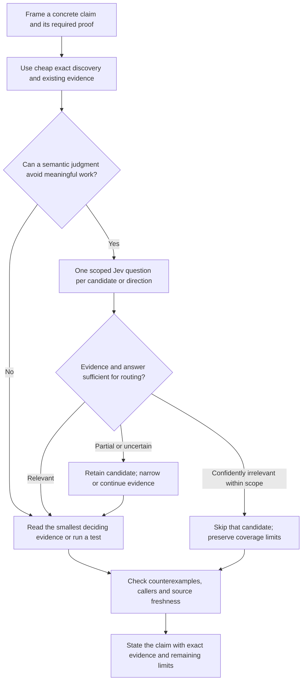

# Jev across Octocode tools: evidence, cost and research decisions

Jev is most useful when it can prevent substantial irrelevant evidence from entering the host's context. It does not create evidence, return newly discovered anchors, or turn a likely answer into a verified code claim. Use direct tools first for cheap exact questions; use Jev selectively to choose where to inspect next.

This assessment covers every entry in the twelve-tool catalog. Nine read tools can supply hidden context; astRewrite, ghCloneRepo and Jev itself cannot. Evidence includes source inspection, real CLI execution, real provider classifications, measured request/response tokens, and explicitly labeled limitations. See the [frozen measurement plan](../.octocode/octocode-eval-benchmark/jev-per-tool-2026-09-20/FRAME.md) and [captured catalog](../.octocode/octocode-eval-benchmark/jev-per-tool-2026-09-20/catalog.json).

## What is being measured

Each Jev query has one context and one typed question:

```json
{
  "context": {"tool": "localFetch", "query": {"path": "/observed/repository/candidate.ts", "reasoning": "Precheck this unread candidate", "fullContent": true}},
  "question": {"type": "choice", "instructions": "Does the supplied result implement the retry decision? Treat missing implementation as insufficient.", "criteria": {"direct": "Implements the retry decision", "background": "Related context without the deciding implementation", "unrelated": "Sufficient evidence of a different concern", "insufficient": "Missing deciding evidence"}}
}
```

Replace illustrative paths with observed, authorized paths and use the nested tool's current schema. An outer `queries` array supports up to five independent questions, each repeating its context. The runtime selects the model. Inline `{value: ...}` is available when the host already has the relevant evidence.

We distinguish four claims:

| Claim | Required evidence |
|---|---|
| Integration works | The real CLI executes the underlying tool, returns a validated answer, and preserves errors/coverage |
| Less host-visible context | Tokenize requests, responses and necessary follow-up reads against a sufficient direct baseline |
| Better reasoning quality | Source-grounded correctness and routing outcomes, including counterexamples and insufficient evidence |
| Faster research | Comparable end-to-end timing of complete investigations; a smaller response alone is insufficient |

Token counts use `o200k_base`. They measure visible tool context, not total host-model billing or reasoning tokens. Jev provider usage is a separate cost. Fixture/oracle authoring, this review and harness engineering are outside these measured tool paths. Small cases demonstrate feasibility or a local failure; they do not establish production accuracy, general speedup, or probability calibration. Different tools have different fixture tasks, so their percentages are not a ranking of tool quality and are not pooled into one savings claim.

## Per-tool evidence

The table counts **complete stated tool paths**, not only the smaller Jev reply. Shared evidence and deciding verification are counted once on the direct side and once after classification. These historical independent-question measurements repeated context; the current matrix contract can reuse one capture when every question applies to every resource, but it does not retroactively change the results. Remote rows cover two questions per tool. Local reused slices are attributed from an earlier five-query batch; they are not new independent timing trials. LSP's direct baseline is the known source file needed to verify the behavioral claim, not just the smaller symbol metadata.

| Tool | Evidence checked | Exact outcome | Direct → Jev + deciding verification, tokens | Case-level decision |
|---|---|---|---|---|
| localFetch | Reused live source/scout probes | Scout 5/5; behavior 2/2 | Scout **18,620 → 14,434 (−22.5%)**; behavior 3,100 → 3,736 (+20.5%) | Use for large candidates that can be skipped |
| localSearch | Reused live bounded search | 1/1 | 675 → 1,020 (+51.1%) | Direct targeted search wins this case |
| astSearch | Reused full-capture and outline probes | 1/2 | 1,192 → 1,859 (+56.0%) | Useful scope filter; failed behavioral proof |
| lspSearch | New real rust-analyzer result | 2/2 | 874 → 1,516 (+73.5%) | Direct identity/body verification wins this case |
| ghSearch | New live GitHub code search | 2/2 | 203 → 693 (+241.4%) | Compact search page is cheaper directly |
| ghGetFileContent | New pinned GitHub file region | 2/2 | 679 → 1,164 (+71.4%) | Known short region is cheaper directly |
| ghSearchHistory | New live commit-search page | 2/2 | 983 → 1,618 (+64.6%) | Correct partial-page handling; added cost |
| ghGetHistoryItem | New pinned commit patch | 2/2 | 1,625 → 2,201 (+35.4%) | Compression does not repay required patch read |
| artifactSearch | New real npm package metadata | 2/2 | 155 → 609 (+292.9%) | Use direct metadata for small exact facts |
| ghCloneRepo | Real CLI excluded-context probe | Rejected; zero provider calls | Not admitted as hidden context | Clone normally only when repeated research needs it |
| astRewrite | Real CLI excluded-context probe | Rejected; zero provider calls | Not admitted as hidden context | Preview/apply normally; optional judgment on supplied values |
| jev | Real CLI recursion probe; existing inline tests | Recursion rejected; zero provider calls | No recursive evaluator | Host owns evidence and next-action composition |

**Proof files:** [local methods, measurements and LSP receipts](../.octocode/octocode-eval-benchmark/jev-per-tool-2026-09-20/local/REPORT.md), [remote methods and real-upstream receipts](../.octocode/octocode-eval-benchmark/jev-per-tool-2026-09-20/remote/REPORT.md), [remote deduplicated arithmetic](../.octocode/octocode-eval-benchmark/jev-per-tool-2026-09-20/remote/joint-metrics.json), [excluded-context probes](../.octocode/octocode-eval-benchmark/jev-per-tool-2026-09-20/excluded-tool-probes.json), and the [original five-file scout](../.octocode/octocode-eval-benchmark/jev-tool-context-2026-09-20/scout-report.md).

All five remote families used real public upstream results, not fixture servers. The LSP success used installed rust-analyzer; a separate installed TypeScript-server attempt failed and is recorded as unavailable, not a negative code judgment. The native wrapper worked for all nine read tools, but these probes cover particular operations and cases, not every mode of each tool.

The twelve new live judgments (ten remote, two LSP) matched their frozen outcomes. The earlier AST behavioral false positive remains part of the assessment. This demonstrates bounded classification capability; no paired host experiment established improved reasoning accuracy. Total new provider usage was 13,449 input and 393 output tokens, separately from the host-visible numbers above.

**Timing:** even the successful file-scout token comparison took 5.414 seconds of classification plus 1.218 seconds of retained reads versus 3.022 seconds of direct reads. Those are tool-path observations, not timed host-model investigations. Individual remote Jev calls took about 1.15–2.23 seconds versus 0.66–1.37 seconds for their direct baseline reads; adding verification took about 1.52–3.50 seconds per independent task. These observations favored direct retrieval. The LSP direct startup was 16.521 seconds while its two-query Jev batch took 6.986 seconds, but warm indexes/process pooling and different call shapes confound that comparison. Reused local cases have only shared batch timing. None of these measurements establishes faster complete research.


## How each tool fits

### localFetch

The strongest tested use is a known, substantial unread candidate file: ask whether it implements the behavior under investigation, retain direct/background/uncertain candidates, and inspect deciding spans only in retained files. File identity is already known, so the answer can eliminate a read without first extracting a new path. Prefer a direct match, line range or outline when the anchor is known or all of the content must be read anyway. A source classification does not prove the behavior of omitted callers or delegates.

### localSearch

Use a hidden search result to classify a bounded page or a proposed search direction, such as whether the page contains likely retry-policy implementation rather than documentation mentions. Start with literal/regex filters, file views and tight scopes; these already remove irrelevant tokens deterministically. A positive hidden page usually needs an ordinary read to recover paths and lines. Jev cannot return a separate verdict for every unseen match from one question. Match truncation and per-file pagination can remain even when file pagination is complete.

### astSearch

Syntax patterns and full captures can provide bounded implementations for semantic triage; symbol outlines and topology can rank the next inspection. Keep proof types separate: syntax establishes shape, graph edges are candidates, and missing function bodies are insufficient for behavioral claims. A previous live probe misclassified a parser claim despite a complete AST capture. Do not replace exact structural checks, LSP confirmation or execution tests with a probabilistic label. Counts and declaration lookup are direct-tool tasks.

### lspSearch

Use the language server directly for definition identity, references, implementations, types and callers. Those are already narrow semantic results. Jev may help prioritize a large returned caller set against a supplied investigation direction, but cannot infer runtime behavior from names or invent missing bodies. The host still needs exact locations and deciding implementations. Server unavailability, stale indexes and unresolved references remain evidence gaps; a classifier cannot repair them.

### ghSearch

Repository and indexed-code results can support a page-level capability/relevance precheck or classification among alternatives already named by the host. Apply provider filters first. A pure Choice only selects caller-supplied labels: it cannot extract a new repository or file path from hidden results. Read retained pages to obtain anchors, then use pinned file reads. A negative result on a partial page or incomplete index is not proof that code does not exist.

### ghGetFileContent

Use the same candidate-file pattern as localFetch when the remote file is substantial and might be skipped. Pin a commit for reproducibility and prefer exact ranges for known anchors. Verify the deciding lines in retained files. Existing authenticated retrieval caching may avoid retransferring a body; it does not remove the body from Jev's input or make a repeated judgment free. Current implementation quality and historical code must refer to the same revision before combining evidence.

### ghSearchHistory

Use metadata filters first to locate candidate issues, pull requests or commits. Jev can classify a page for incident relevance or distinguish discussion about one failure mode from another. Positive pages still need visible item identities before deeper investigation. Titles, descriptions and search snippets can motivate a hypothesis; they do not establish that a fix shipped or remains active today. Dates, refs and merged status are exact fields to inspect directly.

### ghGetHistoryItem

A known issue/PR/commit can be screened for whether its discussion or patch addresses the investigation. This is more promising than hidden broad history search because the item identity is already known and an irrelevant large thread can be skipped. Ask separately about evidence support and missing coverage. A patch can establish what changed in that commit; current behavior needs current source, relevant call paths and tests. Direct diff/metadata views remain cheaper when the needed fact is exact.

### artifactSearch

Registry descriptions and supplied requirements can support preliminary package-fit classification. Prefer direct lookup for versions, repository URLs, licenses and other exact metadata. Metadata alone cannot establish runtime safety, compatibility, maintenance quality or all edge-case behavior. Hidden discovery also conceals the package name unless already supplied as an alternative; a positive result needs a normal metadata read followed by source or documentation verification. Do not treat registry lookup success as a recommendation-quality benchmark.

### ghCloneRepo

Cloning writes a checkout, so it is excluded from hidden Jev context. Use ordinary metadata/evidence to decide whether repeated AST/LSP work justifies a clone; execute an authorized clone normally, then use Jev with read tools over the checkout. For one known file, direct remote retrieval often avoids clone/setup overhead. No evidence here shows that asking Jev before cloning is cheaper than an already-settled deterministic choice.

### astRewrite

Structural rewriting is excluded from hidden Jev context. The host can run an authorized preview, then supply selected preview evidence as `context.value` for an unresolved semantic risk question. That does not save the tokens already spent reading the preview. Snapshot/hash checks, permission and tests still govern apply. A favorable judgment cannot authorize a mutation or establish that the rewrite preserves behavior.

### jev

Recursive Jev context is rejected. The host owns composition: evaluate one independent question, inspect uncertainty, then choose an exact read/test or a genuinely dependent later question. Repeating the same vote without new evidence adds cost rather than new proof. Repeated context across independent queries causes separate evaluations and provider input; batch size is not evidence sharing. Noul is probability of yes, Choice is a supplied alternative, and Score is an ordered assessment—not unrestricted reasoning or extraction.

The three excluded contexts were tested separately through the real CLI: each was rejected and the loopback provider observed zero requests. [Boundary receipts](../.octocode/octocode-eval-benchmark/jev-per-tool-2026-09-20/excluded-tool-probes.json).

## Macro: an evidence-driven research loop



Jev contributes to **routing evidence**, not to upgrading the authority of evidence. A search match remains lexical evidence, an AST edge remains structural evidence, an LSP result remains a server-resolved relation, and an execution test remains a concrete observed behavior. The host must connect those to the claim being made.

Maintain a compact ledger with the claim, required proof type, candidate/revision, Jev question and answer, coverage, retained/skipped action, deciding source/test, and unresolved counterevidence. Store hashes and queries for traceability, but cite actual deciding source locations in the final answer. A result hash binds one returned state; it is neither a reusable evidence handle nor proof that a later retrieval is unchanged.

### The measured break-even point

The previous frozen five-file scout supplies a complete small pipeline:

| Stage | Host-visible tokens |
|---|---:|
| Read all five candidates directly | 18,620 |
| Jev requests and responses | 2,714 |
| Read both retained files once | 11,720 |
| Scout plus deciding reads | 14,434 |
| Net saving | **4,186 (22.48%)** |

Three skipped reads avoided 6,900 tokens; 2,714 tokens of classification overhead consumed part of that saving. With respective schema discovery costs included, the comparison was 19,368 versus 16,308 tokens. This is a development regression against full candidate reads, not an optimized complete-agent research comparison. [Original frozen report](../.octocode/octocode-eval-benchmark/jev-tool-context-2026-09-20/REPORT.md).

The useful condition is:

`avoided direct evidence tokens > Jev request/response + extra verification + incremental setup tokens`

If every candidate must still be read, the left side is zero. The measured behavior-check workflow illustrates that failure: 4,297 direct tokens became 5,945 after classification and verification, with only four of five exact labels correct. A wrong label had low confidence; an exact counterexample—not a second model vote—resolved it.

### Quality, time and caching

Before running, specify what a negative answer may skip, what uncertainty retains, and which claims still require a deciding read/test. Completeness-sensitive claims such as “no callers remain” cannot exclude candidates solely on a Jev label; their proof may require full coverage and remove the potential saving. Include an insufficient alternative when evidence can be missing. Do not invent a confidence threshold after seeing a mistake to make the benchmark pass. Narrow independent questions reduce ambiguity, but these probes do not prove that prompting alone fixes reasoning errors.

Do not automatically wrap every search, read, AST or LSP call. Hidden execution still performs retrieval and adds inference latency. A faster host investigation is plausible when large irrelevant reads and later reasoning are avoided, but requires an end-to-end timed comparison. Observed individual/batch durations below are not such proof.

Reuse current host evidence when available. Existing retrieval caches may save network bytes, while repeated Jev contexts still consume provider input. Do not auto-page large evidence sets or average page probabilities. Continue relevant partial evidence explicitly, and deduplicate the final retained reads across questions.

## Priorities supported by the findings

1. Keep admission selective. Before invoking Jev, name the expensive read or branch that a different answer can eliminate. The measured win came from avoiding three candidate reads, not from adding a vote to required evidence.
2. Discover identifiers cheaply, then scout known candidates. Visible file-only/metadata discovery followed by hidden per-file classification avoids asking a pure typed answer to extract unseen paths.
3. Tighten the ordinary query first. Exact ranges, metadata fields, structural patterns and known symbol identity often solve the task with less overhead than classification.
4. Reuse evidence and verification across questions. An already-read result offers no further read-token saving. Independent Jev rows repeat provider context; retained deciding reads should not repeat.
5. Measure a new complete investigation before changing defaults. Compare targeted direct tools against optional Jev under the same task, source revision, quality oracle and host-model budget. Include unsuccessful calls, source discovery, schema setup, counterexample tests and final citations. These probes do not justify mandatory Jev routing.

## Reproduction and evidence limits

The [per-tool artifact directory](../.octocode/octocode-eval-benchmark/jev-per-tool-2026-09-20/) contains the frozen catalog/schemas, baseline inputs/results, expected outcomes, classification receipts and measurements. The [previous pipeline evaluation](../.octocode/octocode-eval-benchmark/jev-tool-context-2026-09-20/REPORT.md) supplies reused cases rather than paid reruns. Read-tool implementation is shared through [domain_dispatch.rs](../packages/octocode-native/crates/runtime/src/runtime/domain_dispatch.rs); [jev_context.rs](../packages/octocode-native/crates/runtime/src/runtime/jev_context.rs) validates/sanitizes output and reports coverage; [jev/mod.rs](../packages/octocode-native/crates/runtime/src/tools/jev/mod.rs) restricts tool context and projects one typed answer.

The contract and CLI examples live in [OCTOCODE_JEV.md](OCTOCODE_JEV.md). This document records demonstrated outcomes and bounded recommendations. Unmeasured speed, accuracy and task-level cost improvements remain unmeasured.
