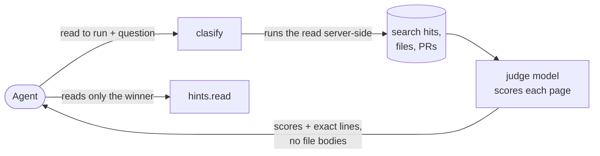
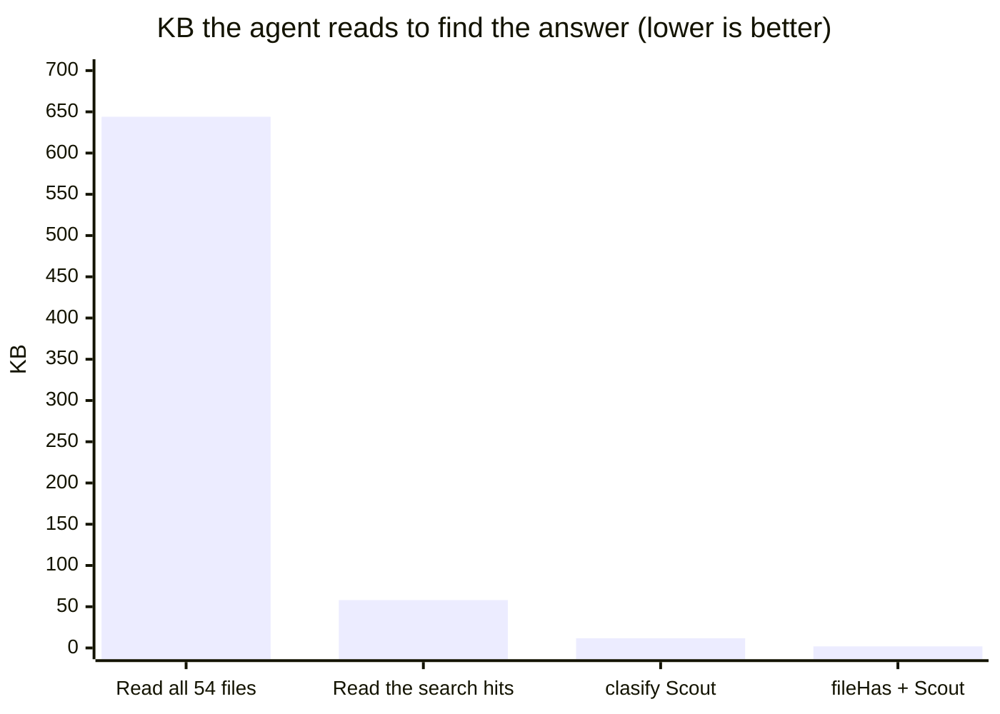
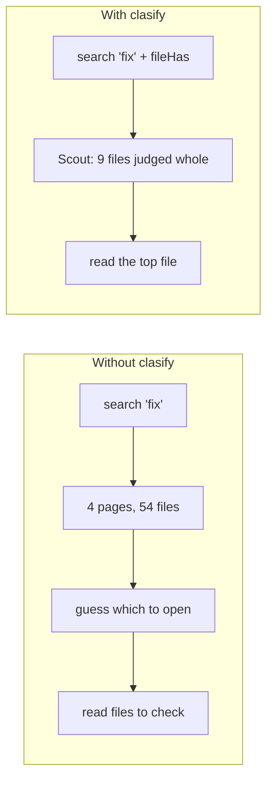
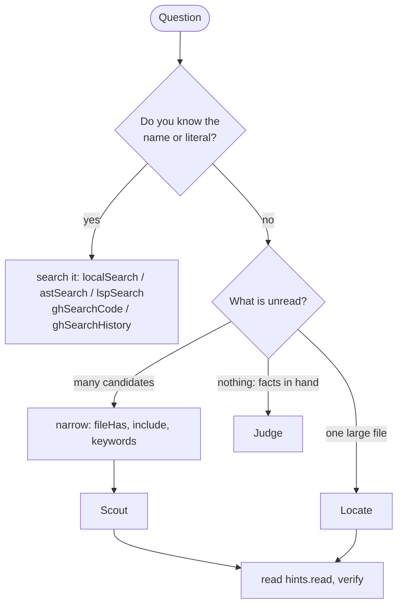

# Octocode Clasify

**Ask a question about code you have not read. Get back where to look, not the code.**

> **In 30 seconds**
>
> - `clasify` runs a search or a file read *for* your agent, asks a judge model your question about each result, and returns scores plus the exact lines to read next.
> - Use it when you can **describe** what you want but do not know its **name**, and the alternative is reading a lot.
> - Finding described code among 54 files, the agent read **1.9 KB instead of 644 KB**, with the answer ranked first.
> - It never proves anything. It tells the agent what to read.

## The idea in one picture



The agent's context never receives the bodies clasify judged, only the scores and the read it chose to run.

## Quick start

1. Set the provider key, then restart MCP ([AUTHENTICATION.md](AUTHENTICATION.md#classification-key-clasify)):

   ```bash
   export OCTOCODE_CLASSIFICATION_API='your-provider-key'
   ```

2. Wrap the read you would have run in a `resource`, and ask what the answer must contain:

   ```json
   {"queries":[{"mainGoal":"The ast-grep code that expands a fix template into replacement text.",
     "resources":[{"id":"s","tool":"localSearch","query":{"path":"crates","matchString":"fix","fileHas":["template"]}}],
     "questions":[{"id":"rel","type":"relevant","ask":"Builds replacement text from a fix template and matched metavariables"},
                  {"id":"suf","type":"sufficient","ask":"Shows where template metavariables are replaced by matched text"}]}]}
   ```

3. Read the top page. Each page is one file with its scores:

   ```json
   {"path":"crates/core/src/replacer/template.rs","line":1,"endLine":388,"answers":{"rel":0.97,"suf":0.86}}
   ```

   Run its `hints.read` (or read its `path` and lines when it has none). From a shell: `npx octocode clasify --input request.json`.

## Pick a flow

| I want to… | Flow | Wrap this read | Ask | Then |
|---|---|---|---|---|
| find **which** of many files, PRs, or packages is the one | **Scout** | `localSearch`, `ghSearchCode`, `ghSearchHistory`, … | `relevant` + `sufficient` | read the top pages' `hints.read` |
| find **where** in one large file | **Locate** | `localFetch`, `ghGetFileContent` | `locate` | run `hints.read`; if it misses, run `next.clasify` |
| know whether a large fetch is **worth reading** | **Gate** | the fetch | `sufficient` | read the bounded `hints.read`, not the whole fetch |
| get a **label** for facts I already hold | **Judge** | a `value` | `yesno`, `choice`, or `score` | use the label, only when the label is the deliverable |

Clasify ranks attention. It never proves identity, reachability, absence, or edit safety: read the deciding source.

## Terms

- **Resource:** the read clasify runs for you (`tool` + `query`), or a `value` you already hold.
- **Page:** one judged unit: one file of a search, one PR, or one window of a file.
- **`relevant` / `sufficient`:** "is this the right area?" / "does this page alone answer?"
- **`hints.read`:** the exact read to run next; copy it unchanged.
- **`next.clasify`:** the same call, continued over the candidates not judged yet.
- **`coverage:"partial"`:** more candidates remain; never read it as "not found".

## At a glance

Task: find where ast-grep fills a fix template with matched metavariables, described in words. The word `fix` appears in 54 files.



```text
Find the fix-template code among 54 files (described, word `fix`)
  Read all 54 files        ████████████████████████████████████    644 KB  answer found by reading everything
  Read the search hits     ███▏                                     58 KB  listed, not ranked
  clasify Scout            ▋                                      11.8 KB  answer ranked 1st
  fileHas + clasify Scout  ▏                                       1.9 KB  answer ranked 1st
```

| Route | Calls | Agent reads | Result |
|---|---:|---:|---|
| Read all 54 files | 54 | 644 KB | found, after reading everything |
| Read the search hits (`localSearch "fix"`) | 4 | 58 KB | the file is listed, not ranked |
| **clasify Scout** over that search | 2 | **11.8 KB**, 54× less than reading | **ranked first**, relevant 0.97 |
| **`fileHas:["template"]` + clasify Scout** | 1 | **1.9 KB**, 339× less | **ranked first**, same answer |



The trade-off is time: a Scout or Locate call takes 0.4–5.6 s, a search 0.05–0.6 s. More tasks: [Benchmarks](#benchmarks).

## When to use it



| ✅ Use it when | ❌ Skip it when |
|---|---|
| the target is **described, not named**: "the code that re-indents a multi-line fix value" | **you know the name**: search `instantiationDepth` for 1.8 KB, not clasify for 16 KB |
| the alternative is **reading a lot**: more than about 10 candidate files, or one file over about 500 lines | **the file is small** (under about 300 lines): reading it costs about as much as one judgment |
| the candidates are **many and noisy**: search hits, GitHub files, PR lists | **the list is short** (about 15 rows or fewer): 13 PRs cost 2.8 KB to list and 2.8 KB to judge |
| you will **read the winner anyway**: clasify picks what to read | **you need proof** (identity, every caller, absence, edit safety): use `lspSearch`, read the source |
| a few seconds per call are fine | **latency matters**: a call takes 0.4–5.6 s |

### Where it pays, by source tool

The following table rates each source tool, measured on ast-grep (`crates/`, 156 Rust files) and TypeScript's `checker.ts`.

| Source tool | Flow | Value | Without clasify | With clasify |
|---|---|---|---|---|
| `localSearch` + `fileHas` | Scout | **highest** | 9 files, 124 KB to read | 1 call, 1.9 KB, answer first |
| `localSearch` | Scout | **high** | 54 files, 58 KB of hits, no ranking | 2 calls, 11.8 KB, all 54 judged, answer first |
| `localFetch` | Locate | **high** | `checker.ts` is 3 MB | 4 calls, 16 KB, both guards in the top 2 |
| `ghSearchCode` | Scout | **high** | 14.5 KB of hits for 20 files, no ranking | 8.1 KB, each of the 20 files judged whole |
| `ghGetFileContent` | Locate, Gate | medium | read the file at a ref | the same Locate, no clone |
| `ghSearchHistory`, `ghGetHistoryItem` | Scout | medium | keyword lists mix fixes with bot bumps | ranks by content: the binding fix #2677 scored 0.88 |
| `astSearch`, `lspSearch` | Scout | low | short lists are cheap to read | only for long lists (dozens of rows) |
| `artifactSearch`, `structureSearch`, `ghStructure` | Scout, `choice` | low | names usually decide | when names carry the meaning |

With a provider key, `localSearch`, `localFetch`, `ghSearchCode`, `ghGetFileContent`, and `ghSearchHistory` add one clasify handoff sentence to their descriptions.

## Worked examples

The following examples are real calls from 2026-10-08, trimmed to the deciding fields.

### Scout a wide local search, narrowed first

Goal: find where ast-grep fills a fix template with matched metavariables. The word `fix` hits 54 files. Narrow to the files that also mention `template`, then Scout:

```json
{"queries":[{"mainGoal":"The ast-grep code that expands a rule's fix template: it substitutes matched metavariables ($A, $$$ARGS) into the replacement text.",
  "resources":[{"id":"s","tool":"localSearch","query":{"path":"crates","matchString":"fix","fileHas":["template"]}}],
  "questions":[{"id":"rel","type":"relevant","ask":"Builds replacement text from a fix template and matched metavariables"},
               {"id":"suf","type":"sufficient","ask":"Shows where metavariables in the fix template are replaced by matched text"}]}]}
```

The `relevant` score of each judged file:

```text
core/src/replacer/template.rs  ██████████████████████████████████▉  0.97  ← the answer: read it
config/src/fixer.rs            █████████████████████████████████▊   0.94  ← its caller
core/src/replacer.rs           █████████████████████████████████▍   0.93
core/src/replacer/indent.rs    ██████████████████████████████▌      0.85
outline/src/extractor.rs       ███████████████████████████          0.75
cli/src/run.rs                 ███████████▏                         0.31  ← defer
core/src/matcher/pattern.rs    █████▍                               0.15
```

All 9 files were judged whole: 1 call, 1.9 KB, 0.7 s. `template.rs` also scored highest on `sufficient` (0.86; the next was 0.43). Next, read `template.rs`: its page carries no `hints.read` because that read is the page itself, so run `localFetch` with `matchString:"fn replace_fixer", block:true` or the page's lines. Without `fileHas`, the same Scout judges all 54 files in 2 calls and 11.8 KB, with the same top two.

### Locate in one large file

Goal: find where a multi-line value is re-indented when it is inserted into a fix. `indent.rs` has 423 lines.

```json
{"queries":[{"mainGoal":"Find the ast-grep code that decides how a multi-line metavariable value is re-indented when inserted into a fix.",
  "resources":[{"id":"f","tool":"localFetch","query":{"path":"crates/core/src/replacer/indent.rs"}}],
  "questions":[{"id":"loc","type":"locate","ask":"Where a multi-line replacement value gets re-indented to the insertion column"}]}]}
```

```json
{"best":{"loc":[{"line":173,"endLine":178,"exists":0.97,"probability":0.78}]},
 "hints":{"read":{"tool":"localFetch","query":{"queries":[{"path":".../indent.rs","ranges":["173-178"]}]}}}}
```

Run `hints.read`: lines 173–178 open `pub fn indent_lines`. That read's `hints.readBlock` (`173-193`) returns the whole function. Two small reads replace 423 lines.

### Scout a GitHub code search

```json
{"queries":[{"mainGoal":"The ast-grep source that expands a fix template by substituting matched metavariables into replacement text.",
  "resources":[{"id":"s","tool":"ghSearchCode","query":{"owner":"ast-grep","repo":"ast-grep","keywords":["fix"],"extensions":["rs"],"pageSize":20}}],
  "questions":[{"id":"rel","type":"relevant","ask":"Builds replacement text from a fix template and matched metavariables"},
               {"id":"suf","type":"sufficient","ask":"Shows where template metavariables are replaced by matched text"}]}]}
```

Each of the 20 files is fetched and judged whole at the search's `commitSha`. `config/src/fixer.rs` ranks first (relevant 0.96, sufficient 0.73), then `rule_config.rs` (0.93) and `rewrite.rs` (0.81); unrelated CLI printers stay below 0.3. The call returns 8.1 KB in 5.6 s with `coverage:"partial"`: the index has more pages, and `next.clasify` judges them. Each page's `hints.read` is a `ghGetFileContent` read pinned to that commit.

### Screen pull requests

A broad `keywords:["fix"]` list of the 20 newest merged PRs scored at most 0.61: the binding fix was not on that page. Treat that as a signal to narrow, not to read the 0.61 row. With `keywords:["metavar"]`, 13 PRs came back and the fix #2677 scored 0.88, in 1.5 s. Each row carries a `ghGetHistoryItem` `hints.read`. For a list this short, the gain is ranking by content, not bytes: the list alone is 2.8 KB.

## Write questions that work

The judge sees only `mainGoal`, the question, and the evidence, never your conversation.

| Weak | Strong | Why |
|---|---|---|
| `mainGoal: "how fixes work"` | `"The ast-grep code that expands a rule's fix template into replacement text."` | names the artifact kind and what it does |
| `ask: "Is this relevant?"` | `ask: "Builds replacement text from a fix template and matched metavariables"` | one checkable fact |
| `ask: "Handles parsing and validation of config"` | two questions: `"Parses sgconfig.yml"`, `"Validates rule fields"` | one fact per question |
| `ask: "find escapeRegExpCharacters"` | `localSearch matchString:"escapeRegExpCharacters"` | a literal is a search; clasify returns a `localSearch` lead instead |

Pair `relevant` (is this the area) with `sufficient` (does this page alone answer). Put every question about the same evidence in one matrix: all questions of a page share one provider request.

## Read the scores

Scores are attention, not proof. In the runs on this page:

- **The answer** scored 0.94–0.97 `relevant`, and 0.73–0.86 `sufficient`.
- **Related code** (callers, neighbors) scored 0.75–0.94 `relevant`, but `sufficient` stayed under 0.5.
- **Unrelated files** stayed under about 0.3.

| You see | Do |
|---|---|
| high `sufficient` | read it; stop only if the read shows the deciding line |
| high `relevant`, low `sufficient` | read it and keep screening: it is near the answer |
| best score mid-band (about 0.4–0.7) | unresolved: narrow the source or follow `next.clasify` |
| low | defer, never discard |
| `coverage:"partial"` | more candidates remain: run `next.clasify` before you say "not found" |

## Benchmarks

Measured on 2026-10-08 against fixed ground truth. Bars show the kilobytes the agent reads (tool JSON; about 4 bytes per token), on a linear scale per task; "read" rows count raw file bytes. "Without" is the best direct route; a literal route assumes the agent already knows the deciding word.

```text
Which of 156 Rust files parses sgconfig.yml (described, word `config`)
  Read all 156 files        ████████████████████████████████████  1,260 KB
  Read the search hits      ███▌                                    126 KB  997 lines in 71 files, no ranking
  clasify Scout             ██                                       74 KB  answer ranked 1st (0.97)
  Search the known literal  ▍                                      15.6 KB  cheapest when you know `sgconfig`

Recursion guard in checker.ts (52,760 lines, 3 MB)
  Read the file             ████████████████████████████████████  3,000 KB
  clasify Locate            ▏                                        16 KB  both guards in top 2
  Search `depth`            ▏                                      11.3 KB  misses one of the two guards
  Search the known literal  ▏                                       1.8 KB  finds one guard

Re-indent logic in indent.rs (423 lines)
  Read the file   ████████████████████████████████████   11.6 KB
  clasify Locate  █▊                                      0.6 KB  indent_lines, lines 173-178

Fix-template code on GitHub (20 files)
  Read the search hits  ████████████████████████████████████   14.5 KB  unranked
  clasify Scout         ████████████████████                    8.1 KB  each file judged whole

Which of 87 GitHub files implements organize-imports
  clasify Scout         ████████████████████████████████████     43 KB  implementation ranked 1st (0.97)
  Read the search hits  ████████████████████                     24 KB  guess from file names

Scout evidence: whole files vs search snippets (156 files)
  Snippets (candidateEvidence:search)  ████████████████████████████████████    161 KB  18 calls, answer scored 0.69
  Whole files (default)                ████████████████▌                        74 KB  4 calls, answer scored 0.97
```

| Task | Without clasify | With clasify | Quality |
|---|---|---|---|
| Fix-template code among 54 files | 4 calls, 58 KB, unranked | 1–2 calls, 1.9–11.8 KB | answer first |
| `sgconfig.yml` parser among 156 files | 7 calls, 126 KB | 4 calls, 74 KB | answer 0.97, next 0.64 |
| Same, literal `sgconfig` known | 2 calls, 15.6 KB | 4 calls, 74 KB | both find it: search |
| Recursion guard in `checker.ts` | search `depth`: 11.3 KB, one guard missed | 4 calls, 16 KB | both guards top 2 |
| Same, literal `instantiationDepth` known | 1 call, 1.8 KB, one guard | 4 calls, 16 KB | search is cheaper; clasify is more complete |
| Arrow-function decision in `parser.ts` (10,767 lines) | 1 call, 3.7 KB with the literal | 1 call, 2.4 KB | exact function first |
| Described targets in 364–770-line files (3 tasks) | 4.6–6.5 KB | 1.3–3.0 KB, verify read included | top 1 correct in all three |
| organize-imports among 87 GitHub files | 2 calls, 24 KB, guess by name | 3 calls, 43 KB | implementation first (0.97) |
| Re-indent logic in `indent.rs` | read 11.6 KB | 1 call, 0.6 KB | exact function |
| PR that fixed metavariable bindings | 20 PRs, none fits | narrowed keywords + Scout | #2677 at 0.88 |

Speed and size per call:

| Call | Calls | Agent reads | Wall time |
|---|---:|---:|---:|
| Scout 9 local files | 1 | 1.9 KB | 0.7 s |
| Scout 54 local files | 2 | 11.8 KB | 3.4 s |
| Scout 20 GitHub files | 1 | 8.1 KB | 5.6 s |
| Screen 13 PRs | 1 | 2.8 KB | 1.5 s |
| Locate in 423 lines | 1 | 0.6 KB | 0.4–0.7 s |

Provider tokens are billed by the classification provider, separately from the host model. The kilobytes above are what enter the agent's context.

Takeaways:

- **Quality:** every scaled task ranked the answer first, judged every candidate, and kept second valid answers that one literal search missed.
- **Tokens:** the win is against reading files. Against a search whose literal you already know, the search stays cheaper.
- **Narrow first:** `fileHas` before Scout cut 11.8 KB to 1.9 KB with the same answer.
- **Rules:** `sufficient` stops screening only when its read shows the deciding line. A low score defers a candidate; it never discards one. Scores never prove absence.

## Reference

Field-level detail for each flow, the limits, the output shape, and availability.

### Questions

Each question is `{id?, type, ask}` and states one fact. Put every independent question about the same evidence in one matrix; they are batched into one provider request per page.

| `type` | Answer |
|---|---|
| `relevant`, `supports`, `sufficient`, `adds` (needs `known`) | P(yes) presets |
| `yesno` | P(yes), optional `labels:{true,false}` |
| `choice` | one label from `labels:{label: meaning}`; add `insufficient` when no label may fit |
| `score` | a level on `labels:[low … high]` |
| `locate` | ranked line windows: `{exists, probability}` |

How to phrase them: [Write questions that work](#write-questions-that-work).

### Scout

A list resource fans out into one page per candidate: a file (`localSearch`, `ghSearchCode`, `astSearch`, `lspSearch`), a repository, a PR or commit, or a package. Each page has answers and its own `hints.read`. A bare path list (`structureSearch`, `ghStructure`) stays one page: ask a `choice` over the paths.

- **Files, not snippets (default).** A `localSearch`/`ghSearchCode` candidate is judged on its file: whole when it fits its share of the budget, else in windows around its hits, so search a word the answer region holds. GitHub files are read whole within their share, with the anchored window as the fallback. `candidateEvidence:"search"` keeps snippets only.
- **Scale.** One call hydrates up to 40 files and judges up to 48 pages per query. The rest continues through `next.clasify`, which reaches every candidate once.
- **Act per page.** See [Read the scores](#read-the-scores).
- **Handoff.** A descriptive `localSearch`/`ghSearchCode` page with 8 or more files carries `hints.clasify`; run it unchanged.

An end-to-end Scout: [Scout a wide local search](#scout-a-wide-local-search-narrowed-first).

### Locate

`locate` needs an unminified `localFetch`/`ghGetFileContent` page or a file-chunk search. The runtime tags small passages, asks Jev one Choice (which passage answers) and one Noul (does any) in one request, and maps the answer to a declaration-aligned window: its context lines never reach above the passage's declaration.

- `best[questionId]` lists up to three windows `{line, endLine, exists, probability}`, ranked by `exists`, then `probability`; rows whose `exists` differs by 0.02 or less rank by `probability`.
- `hints.read` is the exact read of the top row. Run it unchanged; the read's `hints.readBlock` expands to the enclosing declaration.
- On an open walk, `best` ranks only the pages judged so far. If its read lacks the answer, follow `next.clasify`; `carry` holds the running top three.
- `prefilter:[terms]` on a file read judges only up to three 600-line windows around rare literals.
- A literal-only ask (`find escapeRegExpCharacters`) over local resources skips the provider and returns a `localSearch` lead instead.

### Judge supplied state

Use a `value` resource only for a small evidence set you already hold, when the label changes the next read, test, or edit. Never paste an unread body into `value`: use a read resource.

```json
{"queries":[{"mainGoal":"Decide whether the abort claim holds.",
  "resources":[{"id":"e","value":{"claim":"Aborting a queued task guarantees it never starts.","observations":["Started tasks continue after abort."]}}],
  "questions":[{"id":"support","type":"choice","ask":"Support for the exact claim",
    "labels":{"supported":"Covers the claim.","contradicted":"Conflicts with it.","insufficient":"A deciding condition is missing."}}]}]}
```

### Limits

| Limit | Value |
|---|---:|
| Queries per call | 5 |
| Resources / questions / cells (resources × questions) per query | 25 / 25 / 25 |
| Cells per call | 50 |
| Pages judged per query per call (one provider request each) | 48 |
| Evidence per resource per call (`maxChars`, default and maximum) | 1,000,000 chars |
| Characters per page | 80,000 |
| Hydrated files per search page / characters per file | 40 / 32,000 |
| `prefilter` terms | 8 |
| Choice labels / score levels | 2–255 / 2–10 |
| `carry` rows per question | 3 |

A page over its limit fails with `classificationContextTooLarge` and keeps its `hints.read`. A candidate that does not fit this call's remainder resumes through `next.clasify`, never silently dropped. A replay whose source changed fails with `staleSnapshot`.

### Output

Results run `queries[] → resources[] → pages[] → answers[questionId]` and never hold source bodies.

- A resource states a shared `path`, `ref`, and `totalLines` once. A page is `{path?, line, endLine, answers}`; `scope` appears only on a page that judged part of its file, and an uncertain choice or score keeps its `probabilities`.
- A page carries `hints.read` unless that read is `localFetch {path, ranges:["line-endLine"]}` of the page itself.
- `coverage` appears only as `partial` (more remains: never read it as absence) or `error`.
- A failed page or answer carries `error:{errorCode, error, hints?}`. A page with neither `answers` nor `error` was not judged, for the reason the resource states.
- `debug:true` adds the full receipt: `source`, `scope`, runner-up windows, and provider `usage`.

Run `next.clasify` and `hints.read` unchanged. Treat `partial`, `error`, `insufficient`, and mid-band scores as unresolved. Cite the source, not the score.

### How it works

1. **Preflight:** invalid matrices fail before any read or provider call.
2. **Secured read:** each read runs through the normal dispatcher and output sanitizer, so clasify never reads or leaks more than a direct call could.
3. **Pages:** searches split into per-file candidates. Small files are judged whole, smallest first, and leftover budget flows to larger files. Locate pages split into declaration-grouped passages.
4. **Provider:** one gate per endpoint (default concurrency 10, `OCTOCODE_CLASSIFICATION_CONCURRENCY`). Throttles halve the limit, and repeated failures open a 10 s circuit. All questions of a page share one request. A process-local cache (30 min) reuses identical judgments within a long-lived MCP process.
5. **Output:** shared failures collapse and limitations hoist. Every judgment ends in an executable step (`hints.read`, `next.clasify`, or a search lead).

### Availability

Clasify needs `OCTOCODE_CLASSIFICATION_API`; setup, the optional host, and the blank-value kill switch are in [AUTHENTICATION.md](AUTHENTICATION.md#classification-key-clasify).

- **No key:** MCP does not list `clasify` and drops `hints.clasify` leads. Restart MCP after changing the key.
- **MCP startup:** one minimal judgment probes the provider. On failure (bad key, HTTP 402 quota, unreachable host) `clasify` is hidden, and stderr says `clasify disabled: provider check failed (<errorCode>)`. A rate limit keeps it.
- **HTTP 402** (`classificationQuotaExhausted`) pauses provider requests to that key for 60 s.
- **CLI:** no probe; a failing provider surfaces on the call.
- **Model:** `jev-latest`, the newest stable Jev release (`jev-1.13.0` on 2026-10-08).

```bash
npx octocode config check OCTOCODE_CLASSIFICATION_API
npx octocode schema clasify --view query
npx octocode clasify --input request.json
```

CLI exit codes: `0` judged; `6` a continuation remains; `2` invalid input; `3`/`4`/`7`/`5` when every read failed with not-found, auth, rate-limit, or another error; `5` also covers a missing key. Full table: [OCTOCODE_PROTOCOL.md](OCTOCODE_PROTOCOL.md#38-pages-leads-and-failure-hints).

#### Usage stats

With `OCTOCODE_ENABLE_STATS=true` and persistent storage, `<octocode-home>/stats.json` `stats.clasify` counts successful provider requests: `calls`, `input_tokens`, `output_tokens`, `known_usage_calls`, and `unknown_usage_calls`. Cached judgments add nothing, failed attempts have no token receipt, and a stats failure never fails a call. For an isolated benchmark, use a unique `OCTOCODE_HOME` and report provider usage separately from host tokens.
