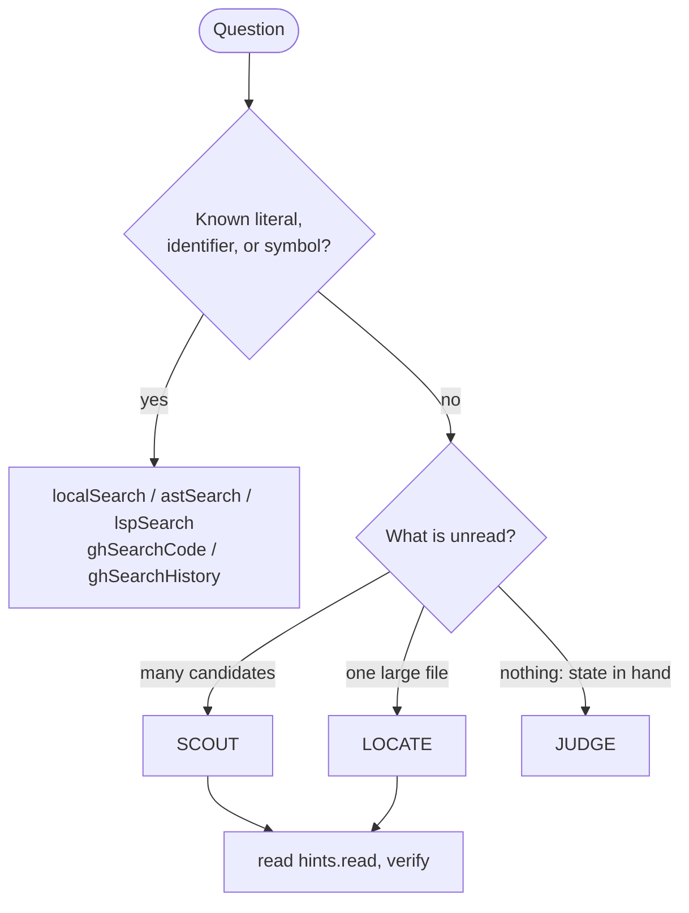

# Octocode Clasify

`clasify` judges unread sources for the agent. It runs a read (`tool`+`query`) server-side, sends the evidence to the Jev classification provider, and returns typed judgments with exact `hints.read` windows. Source bodies never enter the agent's context until it reads the window it chose. A `value` resource judges state the agent already holds.

| Flow | Resource | Ask | Then |
|---|---|---|---|
| **SCOUT** many candidates | a search, history, package, AST or LSP list | `relevant` + `sufficient` | read the winners' `hints.read` |
| **LOCATE** a described target | a file you would otherwise read whole, or a search | `locate` | read `hints.read`; if it lacks the answer, run `next.clasify` |
| **GATE** a large fetch | the fetch query | `sufficient` | read the bounded `hints.read`, not the whole fetch |
| **JUDGE** held state | `value` | `yesno` / `choice` / `score` | use the label, only when the label is the deliverable |

Clasify ranks attention. It never proves identity, reachability, absence, or edit safety: read the deciding source.

## When to use it



Use it when the target is described, not named, and the alternative is reading many files or one large file. Skip it for a known literal or identifier (one search is cheaper), for a small file, or when held evidence already decides.

## Benchmark: with and without clasify

Measured 2026-10-08 on fixed ground truth. Host bytes are the tool JSON the agent reads (about 4 bytes per token); provider tokens are separate and cheap. "Without" is the best direct route; for literal tasks it assumes the agent already knows the deciding word.

| Task | Without clasify | With clasify | Research quality |
|---|---|---|---|
| Which of 156 Rust files parses `sgconfig.yml`, described only (search `config`) | 7 calls, 126 KB to list 997 hit lines in 71 files; no ranking | 4 calls, 74 KB; all 156 files judged | right file 0.97 relevant, next 0.64 |
| Same, deciding literal known (`sgconfig`) | 2 calls, 15.6 KB | 4 calls, 74 KB | both find it; use search |
| Which of 87 GitHub files implements organize-imports | 2 calls, 24 KB; guess by file name | 3 calls, 43 KB | implementation ranked first (0.97 relevant, 0.81 sufficient) |
| Recursion guard in `checker.ts` (52,760 lines, 3 MB), described only (search `depth`) | 11.3 KB, 78 lines to judge by eye | 4 calls, 16 KB | both real guards top-2; the `depth` search misses the `tailCount` guard |
| Same, literal known (`instantiationDepth`) | 1 call, 1.8 KB, one guard | 4 calls, 16 KB, both guards | search is cheaper; clasify is more complete |
| Arrow-function decision in `parser.ts` (10,767 lines) | 1 call, 3.7 KB with the literal | 1 call, 2.4 KB | exact function first |
| Described target in ast-grep core files of 364–770 lines (3 tasks) | 4.6–6.5 KB | 1.3–3.0 KB, verify read included | top-1 correct in all three |
| Scout judging snippets instead of files (`candidateEvidence:"search"`) | — | 156 files: 18 calls, 161 KB; GitHub: 35 KB | answer scored 0.69 / 0.08 locally (files: 0.97 / 0.90); 0.64 sufficient on GitHub (files: 0.81) |
| Reading every candidate instead (what Scout replaces) | 1.26 MB (156 files); 3.0 MB (`checker.ts`) | 74 KB; 16 KB | 17× and 190× fewer host bytes |

Takeaways:

- **Quality:** every scaled task ranked the answer first, judged every candidate, and kept second valid answers that a single literal search missed.
- **Tokens:** the win is against reading files. Against a search whose literal you already know, search stays cheaper.
- **Rules:** `sufficient` stops screening only when its read shows the deciding line. A low score defers a candidate; it never discards one. Scores never prove absence.

## Questions

Each question is `{id?, type, ask}` and states one fact. Put every independent question about the same evidence in one matrix; they are batched into one provider request per page.

| `type` | Answer |
|---|---|
| `relevant`, `supports`, `sufficient`, `adds` (needs `known`) | P(yes) presets |
| `yesno` | P(yes), optional `labels:{true,false}` |
| `choice` | one label from `labels:{label: meaning}`; add `insufficient` when no label may fit |
| `score` | a level on `labels:[low … high]` |
| `locate` | ranked line windows: `{exists, probability}` |

Jev does not see your transcript: say in `mainGoal` what a useful source must contain, and name the artifact kind ("the SDK server code that rejects invalid arguments", not "how arguments are rejected").

## Scout

A list resource fans out into one page per candidate: a file (`localSearch`, `ghSearchCode`, `astSearch`, `lspSearch`), a repository, a PR or commit, or a package. Each page has answers and its own `hints.read`. A bare path list (`structureSearch`, `ghStructure`) stays one page: ask a `choice` over the paths.

- **Files, not snippets (default).** A `localSearch`/`ghSearchCode` candidate is judged on its file: whole when it fits its share of the budget, else in windows around its hits, so search a word the answer region holds. GitHub files are read whole within their share, with the anchored window as the fallback. `candidateEvidence:"search"` keeps snippets only.
- **Scale.** One call hydrates up to 40 files and judges up to 48 pages per query. The rest continues through `next.clasify`, which reaches every candidate once.
- **Act per page.** Sufficient: read it, then stop only if it shows the deciding line. Relevant: read it and keep screening. Low: defer.
- **Handoff.** A descriptive `localSearch`/`ghSearchCode` page with 8 or more files carries `hints.clasify`; run it unchanged.

```json
{"queries":[{"mainGoal":"The ast-grep code that reads and parses sgconfig.yml.",
  "resources":[{"id":"s","tool":"localSearch","query":{"path":"/abs/repo/crates","matchString":"config"}}],
  "questions":[{"id":"rel","type":"relevant","ask":"Reads or parses the project configuration file"},
               {"id":"suf","type":"sufficient","ask":"Shows where the configuration file is found and deserialized"}]}]}
```

## Locate

`locate` needs an unminified `localFetch`/`ghGetFileContent` page or a file-chunk search. The runtime tags small passages, asks Jev one Choice (which passage answers) and one Noul (does any) in one request, and maps the answer to a declaration-aligned window.

- `best[questionId]` lists up to three windows `{line, endLine, exists, probability}`, ranked by `exists`, then `probability`; rows whose `exists` differs by 0.02 or less rank by `probability`.
- `hints.read` is the exact read of the top row. Run it unchanged; the read's `hints.readBlock` expands to the enclosing declaration.
- On an open walk, `best` ranks only the pages judged so far. If its read lacks the answer, follow `next.clasify`; `carry` holds the running top three.
- `prefilter:[terms]` on a file read judges only up to three 600-line windows around rare literals.
- A literal-only ask (`find escapeRegExpCharacters`) over local resources skips the provider and returns a `localSearch` lead instead.

## Judge supplied state

Use a `value` resource only for a small evidence set you already hold, when the label changes the next read, test, or edit. Never paste an unread body into `value`: use a read resource.

```json
{"queries":[{"mainGoal":"Decide whether the abort claim holds.",
  "resources":[{"id":"e","value":{"claim":"Aborting a queued task guarantees it never starts.","observations":["Started tasks continue after abort."]}}],
  "questions":[{"id":"support","type":"choice","ask":"Support for the exact claim",
    "labels":{"supported":"Covers the claim.","contradicted":"Conflicts with it.","insufficient":"A deciding condition is missing."}}]}]}
```

## Limits

| Limit | Value |
|---|---:|
| Queries per call | 5 |
| Resources / questions / cells (resources × questions) per query | 25 / 25 / 25 |
| Cells per call | 50 |
| Pages judged per query per call (one provider request each) | 48 |
| Evidence per resource per call (`maxChars`, default and maximum) | 1,000,000 chars |
| Characters per page | 80,000 |
| Hydrated files per search page / characters per file | 40 / 32,000 |
| `prefilter` terms | 8 |
| Choice labels / score levels | 2–255 / 2–10 |
| `carry` rows per question | 3 |

A page over its limit fails with `classificationContextTooLarge` and keeps its `hints.read`. A candidate that does not fit this call's remainder resumes through `next.clasify`, never silently dropped. A replay whose source changed fails with `staleSnapshot`.

## Output

Results run `queries[] → resources[] → pages[] → answers[questionId]` and never hold source bodies.

- A resource states a shared `path`, `ref`, and `totalLines` once. A page is `{path?, line, endLine, answers}`; `scope` appears only on a page that judged part of its file, and an uncertain choice or score keeps its `probabilities`.
- A page carries `hints.read` unless that read is `localFetch {path, ranges:["line-endLine"]}` of the page itself.
- `coverage` appears only as `partial` (more remains: never read it as absence) or `error`.
- A failed page or answer carries `error:{errorCode, error, hints?}`. A page with neither `answers` nor `error` was not judged, for the reason the resource states.
- `debug:true` adds the full receipt: `source`, `scope`, runner-up windows, and provider `usage`.

Run `next.clasify` and `hints.read` unchanged. Treat `partial`, `error`, `insufficient`, and mid-band scores as unresolved. Cite the source, not the score.

## How it works

1. **Preflight:** invalid matrices fail before any read or provider call.
2. **Secured read:** each read runs through the normal dispatcher and output sanitizer, so clasify never reads or leaks more than a direct call could.
3. **Pages:** searches split into per-file candidates. Small files are judged whole, smallest first, and leftover budget flows to larger files. Locate pages split into declaration-grouped passages.
4. **Provider:** one gate per endpoint (default concurrency 10, `OCTOCODE_CLASSIFICATION_CONCURRENCY`). Throttles halve the limit, and repeated failures open a 10 s circuit. All questions of a page share one request. A process-local cache (30 min) reuses identical judgments within a long-lived MCP process.
5. **Output:** shared failures collapse and limitations hoist. Every judgment ends in an executable step (`hints.read`, `next.clasify`, or a search lead).

## Availability

Clasify needs `OCTOCODE_CLASSIFICATION_API`; setup, the optional host, and the blank-value kill switch are in [AUTHENTICATION.md](AUTHENTICATION.md#classification-key-clasify).

- **No key:** MCP does not list `clasify` and drops `hints.clasify` leads. Restart MCP after changing the key.
- **MCP startup:** one minimal judgment probes the provider. On failure (bad key, HTTP 402 quota, unreachable host) `clasify` is hidden, and stderr says `clasify disabled: provider check failed (<errorCode>)`. A rate limit keeps it.
- **HTTP 402** (`classificationQuotaExhausted`) pauses provider requests to that key for 60 s.
- **CLI:** no probe; a failing provider surfaces on the call.
- **Model:** `jev-latest`, the newest stable Jev release (`jev-1.13.0` on 2026-10-08).

```bash
npx octocode config check OCTOCODE_CLASSIFICATION_API
npx octocode schema clasify --view query
npx octocode clasify --input request.json
```

CLI exit codes: `0` judged; `6` a continuation remains; `2` invalid input; `3`/`4`/`7`/`5` when every read failed with not-found, auth, rate-limit, or another error; `5` also covers a missing key. Full table: [OCTOCODE_PROTOCOL.md](OCTOCODE_PROTOCOL.md#38-pages-leads-and-failure-hints).

### Usage stats

With `OCTOCODE_ENABLE_STATS=true` and persistent storage, `<octocode-home>/stats.json` `stats.clasify` counts successful provider requests: `calls`, `input_tokens`, `output_tokens`, `known_usage_calls`, and `unknown_usage_calls`. Cached judgments add nothing, failed attempts have no token receipt, and a stats failure never fails a call. For an isolated benchmark, use a unique `OCTOCODE_HOME` and report provider usage separately from host tokens.
