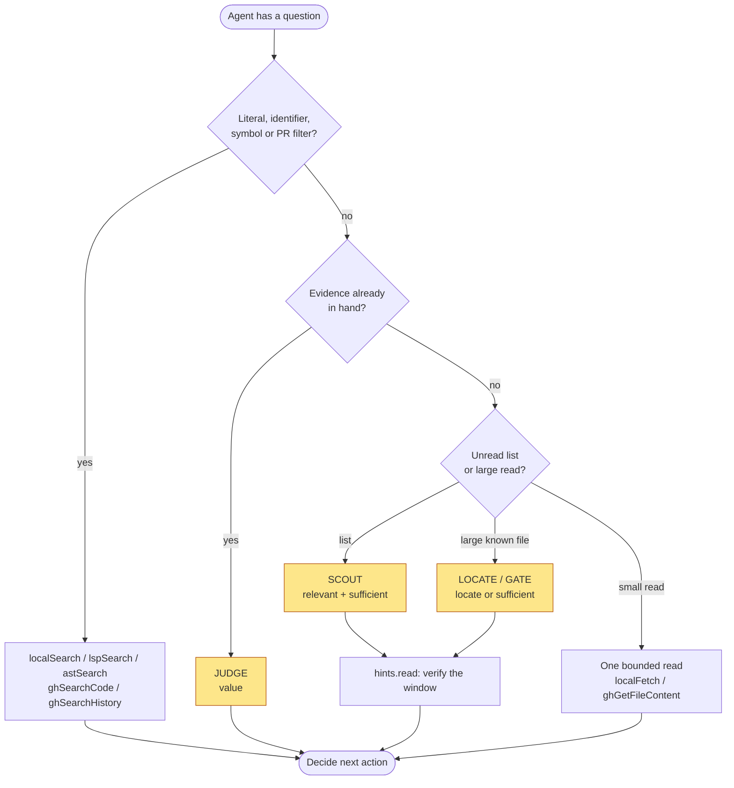
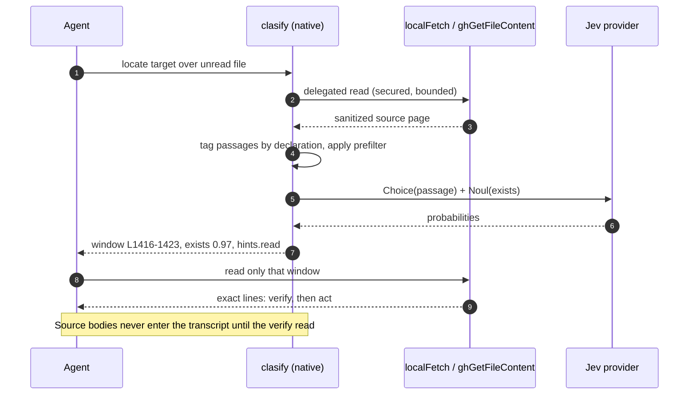
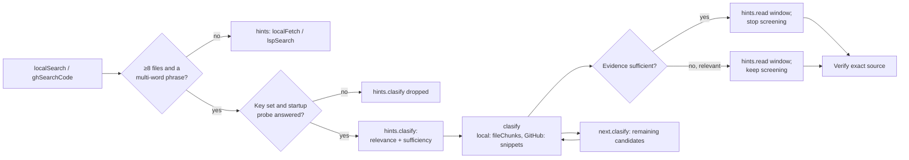

# Octocode Clasify

`clasify` is Octocode's only semantic tool. One concept has three names, each in one layer: `clasify` is the tool, `classification` is its provider configuration and native provider module (`OCTOCODE_CLASSIFICATION_*`, `providers/classification`), and Jev is the vendor behind that provider.

A resource is either a read (`tool`+`query`: clasify runs it, judges the result, and returns typed judgments plus source receipts, never bodies) or held state (`value`: no read). Four flows use them:

| Flow | Resource | Ask | Then |
|---|---|---|---|
| **LOCATE** a described, not named, target | a known large file or fetch | `locate` | run `hints.read`; if it lacks the answer, run `next.clasify` |
| **GATE** a large fetch | that `localFetch` / `ghGetFileContent` / `ghGetHistoryItem` query | `sufficient` | run the page's bounded `hints.read`, not the whole fetch |
| **SCOUT** an unread list | a search, history, package, AST, or LSP list query | `relevant` + `sufficient` (a path list: `choice`) | run each kept page's `hints.read` |
| **JUDGE** held state | `value` | `yesno` / `choice` / `score` | use the label; only when the label is the deliverable |

Clasify routes work. It does not prove source facts, global absence, symbol identity, reachability, or edit safety. Read the deciding source after a judgment.

## When to call it



Literal routes are 3–10× cheaper and about 5× faster than a provider round-trip, so reserve Clasify for questions no literal can answer: an explicit classification request, a supplied-state judgment, or unread-resource screening whose answer changes which items to read. Use `relevant` plus `sufficient` to find relevant candidates still missing deciding facts. Use `locate` over unread known files when the target is semantic and no useful literal is known, or `prefilter` literals to focus a large file. Direct search and bounded reads stay the default for literals, symbols, and known anchors.

Measured on the current build (2026-10-07, fixed ground truth, host tokens = what the agent reads):

| Use | Without clasify | With clasify | Verdict |
|---|---|---|---|
| LOCATE a described target in a large file (11 tasks) | scripted search-then-read; missed 2 of 7 | 0.50× tokens (6 wins, 1 tie, 0 losses), about 28× slower | use |
| Guessable literal or identifier | one `localSearch` | 1.2–9× tokens; a one-identifier ask now short-circuits to that search | avoid |
| SCOUT a list (15 lists) | tool order: right item first 8/15 | first 13/15 (MRR 0.71 → 0.93); local `fileChunks` also 0.61× tokens; snippets and remote lists are not cheaper | local `fileChunks` only |
| `prefilter` on a huge file with a repeated literal | 17 calls, 7,970 tokens | 1 call, 373 tokens | use |
| JUDGE state already held | decide in text | +300 ms; resends the evidence | only when the label is the deliverable |

Two rules come from this run. **sufficient** stops screening only when its read shows the deciding line (2 of 8 candidate sets with no answer had a non-answer at sufficient ≥ 0.71). **low** defers a candidate, never discards it (2 of 38 true candidates scored low because the judged window missed the answer). On an open walk the first `best` was a near-miss in 4 of 7 multi-page targets, so follow `next.clasify` when its read lacks the answer. Scores never calibrate a universal threshold and never prove absence.

The budget is host-model context. Provider tokens are cheaper and tracked separately; they may rise when private assessment keeps larger source bodies out of the host transcript. Do not trade more host reads or weaker routing for fewer provider tokens. Judge a route by the host tokens of the whole workflow (results, repairs, reads, answer), with provider tokens and latency reported separately; method: `skills/octocode-eval-benchmark`.

Skip Clasify when an exact lookup, held evidence, direct reasoning, or one cheap read decides the next action. File count, file size, ambiguity, one search miss, or a shorter response alone are not reasons to call it. Every call adds provider tokens, latency, and verification work.

| Intent | Use Clasify when | Use direct evidence when |
|---|---|---|
| Map several properties | Up to 25 independent source-local questions apply to the same unread pages (one matrix) | Each property needs different terms, files, ranges, or later evidence |
| Triage history | Several unread PRs, issues, commits, or diffs need the same relevance check before an exact read | The number or ref is known, or one diff answers |
| Detect new evidence | `adds` separates a new fact, exception, or contradiction from `known` evidence | Duplicate identity or location is mechanically decidable |
| Choose a hypothesis or test | A closed `choice`, with `insufficient`, picks a discriminating test | Open-ended causal reasoning or a new hypothesis |
| Rank one dimension | An explicit `score` rubric and a threshold drive routing | No calibrated rubric or action policy |
| Prove identity, reachability, absence, or edit safety | Never | LSP, AST, exact reads, tests, and coverage |

Place it as **retrieve → classify the bounded ambiguous set → verify the deciding source**. Before retrieval there is no state to judge; after the host read every body, nothing is saved. Extra questions help only when the same captured state answers them independently.

## How it works

Each call moves a semantic routing decision out of the host transcript and returns a small, exact read that proves or disproves it. Core owns the schema, descriptions, limits, and instructions; the native runtime validates, reads, sanitizes, judges, and shapes continuations; CLI and MCP expose the same contract.

1. **Preflight:** bad matrices fail before any read or provider token. Omitted IDs get stable IDs; a pasted lead query (`{queries:[row]}`) reads its row. Each `type`+`ask` expands to one core-authored provider prompt; presets (`relevant`, `supports`, `adds`, `sufficient`) become yes/no questions.
2. **Secured read:** a Scout resource (`tool`+`query`) runs through the normal dispatcher after the input security policy, and its output is sanitized like a direct call, so Clasify never reads or leaks more than the host could. At most 4 concurrent reads per call and 16 per process; output order stays deterministic. A Judge resource (`value`) has no read.
3. **Evidence pages:** search results split into per-file candidates; a locate page splits into declaration-grouped passages. Adjacent ready pages merge up to 24 KiB of state; failed pages split runs. Within a call a resource's capture serves all its questions, duplicate paths in one search page collapse, and identical resources listed twice are read twice.
4. **Judgment cache:** process-local, keyed by SHA-256 of endpoint, model, evidence state, and questions; 256 entries, 8 MiB, 30-minute TTL. It stores only complete successful answer sets, so any change to evidence, brief, or question misses; concurrent identical requests share one provider call. Each CLI invocation starts empty; only a long-lived MCP process benefits. GitHub reads share the direct-call cache.
5. **Provider gate and batching:** one process-wide gate per endpoint (default 10, 1–64), separate from reads. A throttle halves the limit and 4 successes restore one permit; 5 consecutive failures open the circuit for 10 s. Multi-question pages go as one batch when they fit (72 KiB per question, 120 KiB per group), else singly; shared state is sent once (5 candidates × 3 questions: 61.62% less provider input than three one-question matrices, not an end-to-end win).
6. **Transport:** HTTPS (HTTP only for `localhost`, `127.0.0.0/8`, `[::1]`), 4 MiB body cap, deadline and cancellation, `Retry-After` honored, jittered backoff 0.5–8 s.
7. **Output:** shared failures collapse, receipts and scopes merge, limitations hoist, and continuations keep only non-default fields. Every judgment ends in an executable step: `hints.read`, `next.clasify` with `carry`, `hints.textSearch`, or a source-tool follow-up. A repeating continuation stops as a loop.



## Availability

Clasify needs `OCTOCODE_CLASSIFICATION_API`. Key setup, the optional API host, source order, and the blank-value kill switch are in [AUTHENTICATION.md](AUTHENTICATION.md#classification-key-clasify); CLI behavior without a key (`missingConfiguration`, exit 5) is there too.

- Without a key, MCP does not register `clasify` and drops every cross-tool `hints.clasify` lead. The catalog is fixed at startup: restart MCP after changing the key.
- With a key, MCP startup sends one minimal `yesno` judgment (5 s cap, one retry) before it lists tools, so each start makes one small billed request. If the provider fails (rejected key, HTTP 402 quota, unreachable host, invalid response), `clasify` is left out as without a key: the native catalog marks it `unavailableReason:"providerUnreachable"`, and stderr shows `[octocode-mcp] clasify disabled: provider check failed (<errorCode>): <message>`. A rate limit (`classificationRateLimited`) proves the key works, so `clasify` stays. Fix the provider, then restart. The CLI does not probe; a failing provider surfaces on the call.
- HTTP 402 is `classificationQuotaExhausted`. For the next 60 s, calls to that endpoint and key send no provider request; their bounded reads still run, so an input error (for example `locate` over a minified view) still exits 2, and each resource states the quota error once. The first call after that probes again. A refused page keeps its read (`hints.read`, the page's own window for a file resource), and the resource states how many candidates were not captured.
- Concurrency: `OCTOCODE_CLASSIFICATION_CONCURRENCY` / `classification.maxConcurrency`. The resolved model and usage stay internal telemetry.

```bash
npx octocode config check OCTOCODE_CLASSIFICATION_API
npx octocode schema clasify --view query
```

## Input

Every call is `{"queries":[matrix, ...]}`. One matrix contains:

| Field | Meaning |
|---|---|
| `id` | Stable query correlation ID |
| `mainGoal` | Optional, ≤500 chars. The research question, sent with every question and in each page's evidence state. Say what a useful file must contain |
| `reasoning` | Optional, ≤500 chars. Sent in each page's evidence state. Say what the next read depends on. A blank `mainGoal` or `reasoning` is dropped |
| `resources[]` | Held state or unread read requests |
| `questions[]` | Questions applied to every resource page |

- Put every independent question about the same evidence in one matrix and every candidate in `resources`. Each resource is captured once, and fitting questions are batched per page.
- Jev does not see your transcript. Without `mainGoal` or `reasoning`, each `ask` must carry the whole intent.
- Use separate root `queries[]` for independent matrices whose resource cross-product would be wrong. Make a later call only when an earlier answer changes the evidence or options.
- Resource and question IDs must be unique within their query.

```json
{"id":"held","value":{"claim":"...","evidence":["..."]}}
{"id":"unread","tool":"localFetch","query":{"path":"/abs/repo/src/file.ts","ranges":["40-100"]}}
```

A read query follows its tool's live schema and inherits the matrix `mainGoal`/`reasoning`. A file read without a range, match, or view reads the whole file. A `localSearch`/`ghSearchCode` resource in a matrix with a `locate` question hydrates file chunks (`candidateEvidence:"fileChunks"`, also settable explicitly).

### Questions

Each question is `{id?, type, ask}`:

| `type` | Answer |
|---|---|
| `yesno` | P(yes) for one proposition (optional `labels:{true,false}`) |
| `choice` | One label from `labels:{label: meaning}`, with the probability map when uncertain |
| `score` | Expected zero-based level on `labels:[low … high]` |
| `relevant`, `supports`, `sufficient`, `adds` (needs `known`) | Research presets, answered as P(yes) |
| `locate` | `{exists, matches}` line ranges; see [Locate](#locate) |

Choice and score confidence measures probability concentration, not correctness. Add an `insufficient` label when no substantive label may fit. No universal score or confidence threshold discards candidates. `sufficient` asks whether the captured page already states the answer, so you can stop screening; the evidence reached the provider, not you, so unless it was a supplied `value` or a snippet in context, run the page's `hints.read` to read and cite the deciding lines.

Each question must describe one source-local fact. Split lists, conjunctions, and facts in distant sections into separate questions over the same capture. Add questions only when each answer changes a route, threshold, read, test, or edit; cheap questions still cost cells, tokens, and output, and cannot fix an irrelevant candidate set.

### Locate

`locate` accepts only `ask` and needs a contiguous original-source `localFetch` or `ghGetFileContent` page (unminified: `minify` omitted or `"none"`), or a `localSearch`/`ghSearchCode` resource, whose file chunks are hydrated. Hydrated chunks can still have gaps; those pages stay unsupported. A matrix that combines `locate` with an incompatible resource is rejected before any read or provider call; split it. Plain snippets, repository and tree listings, AST/LSP results, history, and package metadata support the other types. Supplied values and captured pages still pass source-line validation.

- The runtime tags small passages, asks Jev a Choice question to rank them and a Noul question for whether an answer exists, then maps the answer to a declaration-aligned window in original line numbers (±2 lines; a doc-comment hit shows 3 lines above to 4 below the declaration name; overlapping windows merge). Where the engine outlines the language, passages group by innermost declaration (leading doc comment included).
- A page answer is `{exists, matches:[{lines:[start,end], probability}]}`: one match, or two when the page answers (`exists` ≥ 0.5) and the runner-up holds at least half the winner's probability.
- The query's `best[questionId]` lists at most three answering windows (`exists` ≥ 0.5) across pages as `{line, endLine, exists, probability}`, ranked by `exists`, then `probability`. `resourceId`/`path` appear only with several resources or when the window's file differs from the resource path. A finished walk with no answering window lists its single closest passage; a finished ranking always has a winner, and low `exists` means the range is only the closest passage.
- The query's `hints.read` is an exact `localFetch` or `ghGetFileContent` call for the top row through the page that assessed it (snapshot included; GitHub reads name `owner`, `repo`, `path`, and the requested `ref` or returned commit). Run it unchanged; read other rows by `line`–`endLine`, batched into one call (up to five queries).
- `carry` always holds the full top three in the same row form; copy it unchanged.
- While a continuation remains and no window answers, `best` is omitted and the ranking travels only in `carry`: follow `next.clasify`, do not read the closest non-answer. While a continuation remains and a window answers, `best` lists every answering row and `hints.text` warns that it ranks only the pages judged so far: if its read lacks the answer, run `next.clasify`. The last call ranks the whole file.
- Windows are verification spans, not complete declarations. Expand or follow the source when the deciding statement is absent; even a high score needs a source read.

**`prefilter`:** a `localFetch`/`ghGetFileContent` resource may add `prefilter:[terms]` (at most 8 rare literals); any other resource with `prefilter` is rejected. The runtime probes the file with a case-insensitive literal match (up to 20 match pages) and judges up to three 600-line windows around the hits: the densest when every hit fits, otherwise the first three in file order, with `next.clasify` resuming after the last. No hits falls back to the original read. When terms occur throughout the file, a distinctive search is cheaper.

**Literal targets.** A `locate` ask is literal when its only content is one identifier (`snake_case`, `camelCase`, `PascalCase`, `Type::name`) or one quoted literal around lookup words: `escapeRegExpCharacters`, `find escapeRegExpCharacters`, `where is Type_instantiation_is_excessively_deep reported`, `the definition of X, which …`. Any other content word makes it described (`where does QuerySet filter after a slice`) and it runs as a normal locate. One rule decides all of the following:

- A literal target adds a `hints` entry pointing to `localSearch`.
- When every resource is a local `localFetch`/`localSearch`/`structureSearch`/`astSearch` read, the query also gets `hints.textSearch`: one search for every distinct literal (`regex:"literal"` for one, an escaped `regex:"rust"` alternation `a|b` for several), scoped to the resource path or the deepest directory the resources share. GitHub resources get the hint only, because `ghSearchCode` covers only the default branch.
- A `locate` matrix whose every question is a literal target over local resources is short-circuited: no read or provider call, a `hints.text` tip plus `hints.textSearch`, exit 0.
- The large-read handoff gives a literal `mainGoal` a text-search lead instead of clasify ([handoff](#search--clasify--read-handoff)).

## Search → clasify → read handoff



**Large reads.** A paged `localFetch` or `ghGetFileContent` read of a file of at least 2,000 lines, with `mainGoal` set and no `matchString`, `ranges`, or view, can carry a `hints.clasify` lead: one whole-file resource with a `locate` question whose `ask` is the `mainGoal`. An unanchored first read returns only the file head, so the lead arrives before you pay for a full page. A literal `mainGoal` (`MAX_CALL_CAPTURES`, `find bulk_update`, ``where is `newElementWith()` defined``) gets no clasify lead: a local read gets a `textSearch` lead (`localSearch`, `regex:"literal"`), a GitHub read gets none. A described `mainGoal` that only mentions an identifier (`Where bulk_update refuses pk changes`) gets the locate lead.

**Searches.** A semantic `localSearch` or `ghSearchCode` page with at least eight files carries `hints.clasify`: one unread search resource (`tool`/`query`) with `relevant` and `sufficient` questions whose `ask` is the search `mainGoal`, or the searched phrase when none was sent. The lead stays under the two-lead cap, after a skipped-binary listing.

- It keeps the search `mainGoal` and `reasoning` (only when sent), filters, view, and starting candidate. Clasify uses a smaller aligned page when the original page exceeds its cell budget and returns the remaining candidates through `next.clasify`; it never picks only the first files or fetches whole bodies.
- A `localSearch` lead sets `candidateEvidence:"fileChunks"`, so each candidate is judged on hydrated code around its hit clusters (at most five per call). A window edge that cuts a nearby declaration grows to that declaration's boundary when the grown window fits one page, and its `hints.read` covers the same span. One-line snippets of the searched phrase score flat (measured 0.16–0.38).
- A `ghSearchCode` lead stays on snippets: hydration showed no measured gain, would spend GitHub API budget, and recall (which files the search returns) is the limit.
- Run the lead unchanged, compare relevance and sufficiency, and read relevant candidates through `hints.read`; a sufficient one ends screening but is still read to verify. Follow `next.clasify` when the remaining candidates can change the decision.
- The lead's target is the search `mainGoal`, so name the artifact kind in it. On `modelcontextprotocol/typescript-sdk` (10 candidates), "Find how invalid tool arguments are rejected" scored every file 0.82–0.95 relevant, while "the SDK server code that rejects…" ranked the implementation first at 0.94 (next 0.72).
- No lead for narrow pages, identifiers, single-token anchors, quoted literals, paths, regexes, `wholeWord` searches, or non-hit views (`filesWithout`, `countLines`, `countMatches`, `matchOnly`, `invertMatch`). File count alone never triggers one. Metadata-only search views ask a routing `yesno` for relevance. Compact GitHub `owner/repo:path` rows keep per-file identities and reads. Manual Scout and Locate stay available.

## Scout over list candidates

One unread list resource fans its candidates into independent pages, each with its identity and `hints.read`:

| Resource | One page per | `source` | `hints.read` |
|---|---|---|---|
| `localSearch`, `ghSearchCode` | file | `path` | `localFetch` windows around every judged match cluster / `ghGetFileContent` anchored on the match |
| `astSearch` `match` / `symbols` | file (a directory outline is already grouped per file) | `path` | `localFetch` window around the matched lines |
| `lspSearch` locations | file (locations grouped) | `path` | `localFetch` window around the locations |
| `ghSearchRepo` | repository | `item` `owner/repo` | `ghStructure` |
| `ghSearchHistory` | pull request / issue / commit | `item` `owner/repo#n` or `owner/repo@sha` | `ghGetHistoryItem` |
| `artifactSearch` keyword discovery | package | `item` `type:name` | `artifactSearch` exact lookup |

Bare path lists (`structureSearch` `files`/`tree`, `ghStructure`) and `astTopology` results (CLI with beta only) stay one page: a name alone is judged better comparatively, so ask a `choice` over the paths (judged one by one, every file scored 0.16–0.20). For paged lists (`localSearch`, `ghSearchCode`, `astSearch` `match`, `ghSearchRepo`, `ghSearchHistory`, `artifactSearch` keywords), clasify lowers `pageSize` to fit 25 cells; later pages continue through `next.clasify`.

Match the question to what a page carries. Content (snippets, symbols, references, PR or commit text, package descriptions) suits `relevant` + `sufficient`. Bare metadata (repository names, titles) suits a routing `yesno` such as "this repository likely implements X", compared across pages: `relevant` over repository metadata scored the official MCP SDK 0.17, like unrelated repositories. Ask relevance and sufficiency in one matrix, then act per page:

- `sufficient` high: run `hints.read`. Stop screening only when that read shows the deciding line; otherwise treat the page as relevant and keep screening.
- Relevance high, `sufficient` low: run `hints.read` unchanged and keep screening.
- Relevance low (below 0.36): defer the candidate, do not discard it; a score judges only the captured window. Read deferred candidates before concluding absence or when no read answered.

GATE uses the same check before a large fetch: every judged file page not scored a confident "no" (P(yes) below 0.36) carries `hints.read` for exactly its judged lines (its byte page for a byte-chunked read), so a `sufficient` page costs one bounded read instead of the whole fetch.

```json
{"mainGoal":"Find how the SDK rejects invalid tool arguments.","reasoning":"Pick which PRs to read.",
 "resources":[{"id":"prs","tool":"ghSearchHistory","query":{"operation":"pullRequest","owner":"modelcontextprotocol","repo":"typescript-sdk","keywords":["validation"],"pageSize":5}}],
 "questions":[{"id":"rel","type":"relevant","ask":"Runtime validation of tool call arguments"},
              {"id":"enough","type":"sufficient","ask":"How invalid tool arguments are rejected"}]}
```

### Search file chunks

`localSearch` and `ghSearchCode` candidates are judged either on returned paths, snippets, and metadata (`candidateEvidence:"search"`) or on hydrated chunks (`"fileChunks"`, set by a `locate` question, by the `localSearch` lead, or explicitly on the resource: `{"id":"hits","tool":"localSearch","candidateEvidence":"fileChunks","query":{…}}`). File-chunk mode hydrates at most five candidates per search page, at most 12,000 sanitized characters each. Each candidate is judged alone, and the output holds no source body. Each usable page has a verification `hints.read`; a malformed or failed candidate may not. `next.clasify` continues the underlying search; copy it unchanged.

- Every hit line of a local `fileChunks` candidate reaches a window. When the page lists only some hit lines (`pagination.moreLinesUnlisted` counts the rest), clasify lists them first with the same matcher over that file (`matchPageSize` = the file's hit count). If that search fails, the candidate gets a `classificationBudgetSpent` page that names the count and carries that search as `hints.read`. Each window is judged and listed once.
- Hit windows the page or byte budget leaves unjudged share one `classificationBudgetSpent` page per file; its `hints.read` names each window once (overlapping or touching windows merge; more than ten ranges become rows of one `localFetch` call).
- A snippet page reads the rows it judged: the densest hit window when it holds every shown row, else one window per cluster.
- Hydrated windows sit at hit clusters and merge when near; a window larger than its byte share is re-read narrower around its hit. Local hydration reads around the densest match cluster. Without a stable anchor, the page records that only the opening chunk was assessed; a bounded chunk does not cover the rest of the file.

**Large repositories.** Narrow first: an absolute root (local) or owner/repository (GitHub), the tightest `include`/`exclude`, filename, extension, language, and a lexical anchor; keep `pageSize` ≤5 in file-chunk mode. Use direct search, AST, or LSP when syntax or symbol identity already decides the file. Follow `next.clasify` only while later pages stay relevant, and run `hints.read` for the candidate that changes the action. GitHub code search is index-limited and cannot prove global absence from one page or score. GitHub chunk fetches run concurrently, and each read is pinned to the observed commit SHA when GitHub returned one, so verification reads the assessed revision.

## Judge supplied state

Use Judge when you already hold a small, sufficient evidence set and need a classification that changes the next read, test, or edit. Do not copy unread bodies into `value`; use an unread read request so the host does not pay to read that source first.

```json
{"id":"claim-review","mainGoal":"Decide whether the abort claim holds.",
 "resources":[{"id":"evidence","value":{"claim":"Aborting a queued task guarantees it never starts.",
   "observations":["Waiting tasks may be removed by an abort signal.","Tasks already started continue after abort."]}}],
 "questions":[{"id":"support","type":"choice","ask":"Classify support for the exact claim.",
   "labels":{"supported":"Evidence covers the complete claim.","contradicted":"Evidence conflicts with the claim.",
             "conflicting":"Evidence supports and conflicts with the claim.","insufficient":"A deciding condition is missing."}}]}
```

## Limits

| Limit | Value |
|---|---:|
| Queries per call | 5 |
| Resources / questions / expanded cells per query | 25 / 25 / 25 |
| Total caller cells per call | 50 |
| `maxChars` per resource (default and maximum) | 80,000 |
| Hydrated candidates per search page | 5 |
| Sanitized characters per hydrated candidate | 12,000 |
| Captured pages per resource per call | 100 |
| `prefilter` terms | 8 |
| Choice labels / Score levels | 2–255 / 2–10 |
| Resource / question ID length | 1–64 (`[A-Za-z0-9][A-Za-z0-9._-]*`) |
| `carry` rows per question | 3 |
| Provider request body | 4 MiB |

Cells are resources × questions, so 25 questions fit only with one resource. Search fan-out counts toward the 25-cell limit, and a `fileChunks` resource (including a search resource with a `locate` question) counts as five resources in both cell checks. A call over the expanded-cell bound fails before provider work instead of dropping candidates.

`maxChars` bounds the sanitized evidence a resource submits on every path: file pages, snippets, hydrated chunks, and list items. Hydrated chunk reads share it equally.

- Search and list candidates stay in page order while they fit. A candidate larger than the whole `maxChars` fails with `classificationContextTooLarge` and keeps its `hints.read`.
- The first candidate that only overflows what the call has left resumes through `next.clasify`, so the walk judges every candidate once. Search pages restart at that file row. Repository, history, and package-discovery lists restart at that row with a `page`/`pageSize` that starts there, then return to the original `pageSize` from the next aligned row; `resumePageSize` carries it until then. If no continuation can address the candidate, it fails with `classificationBudgetSpent` and its `hints.read`.
- A file page over the whole `maxChars` is re-read at the same start in smaller chunks (up to four attempts); an unpaged whole-file read becomes line chunks from line 1, and `next.clasify` walks the rest. A page that fits a fresh call but not this call's remainder is deferred to `next.clasify`.
- A `ranges` read over `maxChars` is judged in line windows that fit; `next.clasify` reads the rest of the range.
- A smallest unit still over `maxChars` fails with `classificationContextTooLarge` and keeps a `hints.read` of its exact lines. Inside a `ranges` read, `next.clasify` still reads the lines after it; a chunk walk gets no continuation that would replay the oversized page.
- A replay whose source changed fails with `staleSnapshot` instead of restarting on the new version.

## Output and verification

Results are ordered `queries[] → resources[] → pages[] → answers[questionId]`. Results hold hints, never captured bodies. MCP returns the structured payload and mirrors it as JSON in the text content.

- Each resource states its file `path` (and a GitHub file's `ref`) and `totalLines` once when every page shares them. Each page is `{line, endLine, answers}`, where `answers` maps every question ID to a bare verdict: locate `exists`, yes/no or preset P(yes), a choice label, or a score level. A choice or score whose top probability is below 0.9 keeps `{choice|score, confidence, probabilities}`. A resource with one plain page (a supplied value) carries `answers` itself.
- Pages from other files, byte or disjoint scopes, transformed views, limitations, candidate `hints.read`, and typed errors stay on the page. An error that two or more pages repeat moves to the resource once when every page carrying it keeps its `hints.read`; a page with neither `answers` nor `error` was not judged, for the reason the resource `error` states. A failed answer, page, or resource carries `error:{errorCode, error, hints?:{text}}`, the shape of a failed tool row.
- `coverage` appears only as `partial` or `error`. No `coverage` means every page captured in this call was judged, not that a whole file, result set, or repository was read. Page limitations name unread content.
- `debug:true` on a matrix returns the full receipt: `source`, `scope`, runner-up `matches`, page `hints.read`, and provider `usage` (`calls`, `inputTokens`, `outputTokens` when reported) per page and per matrix (with `ms`). Its `next.clasify` keeps `debug:true`.

Rules:

- Run `next.clasify` unchanged when more coverage is needed.
- Run a deciding `hints.read` unchanged and cite the original source, not the score.
- Treat `partial`, `error`, `insufficient`, content-firewall rejection, and mid-band scores as unresolved.
- Keep disjoint ranges; transformed-view positions are not source coordinates.
- Source versions are observations; verify mutable source before asserting.
- Do not average page scores or build a global verdict unless the caller owns that policy.

### Usage stats

With `storage.stats` (`OCTOCODE_ENABLE_STATS=true`) and persistent storage, `<octocode-home>/stats.json` `stats.clasify` counts successful provider request groups once: `calls`, `input_tokens`, `output_tokens`, `known_usage_calls`, and `unknown_usage_calls`.

- Cached judgments add no usage. Reported zero tokens count as known; missing or invalid token fields, and older calls without completeness counters, count as unknown, so token totals can be partial. Jev responses must carry both token fields; missing usage is a provider error.
- Failed attempts have no billed-token receipt, so success counters cannot prove complete cost after a failure. Prices and provider request IDs are not exposed.
- Updates are best-effort, serialized with a `stats.json.lock` sidecar, and written through a temp file and atomic rename, so concurrent MCP and CLI processes can share one home. A stats failure never fails a tool call.
- For an isolated benchmark, use a unique `OCTOCODE_HOME`, collect its stats after the calls, and keep provider usage separate from host-model tokens and cost.

## CLI

```bash
npx octocode schema clasify --view query
npx octocode clasify --input request.json
cat request.json | npx octocode clasify --input -
node packages/octocode/out/octocode.js clasify --input request.json   # in this repository
```

Exit codes: `0` judged, `6` continuation available, `2` invalid input (including every resource rejected as a caller error, such as `classificationLocateUnsupported` or a path outside the allowed roots). When every read failed the same way, clasify exits like that read: `3` not found (such as a missing local file or GitHub path), `4` authentication, `7` rate limited, `5` any other read or provider failure; `5` also means no key (`missingConfiguration`). When some resources succeed, a failed resource reports `coverage:"error"` in-band and the call exits `0`, as other tools do. Full table: [OCTOCODE_PROTOCOL.md](OCTOCODE_PROTOCOL.md#38-pages-leads-and-failure-hints).

`semanticAssess`, `semanticRerank`, `jev`, `jevScout`, and `jevReasoning` are not public tools or aliases; use `clasify`, its `next.clasify` walk, and `hints.clasify` leads. The live schema is authoritative; inspect it before hand-authoring a request.
