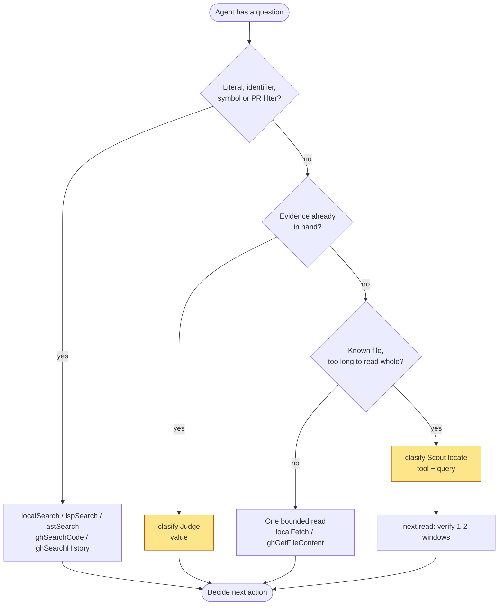
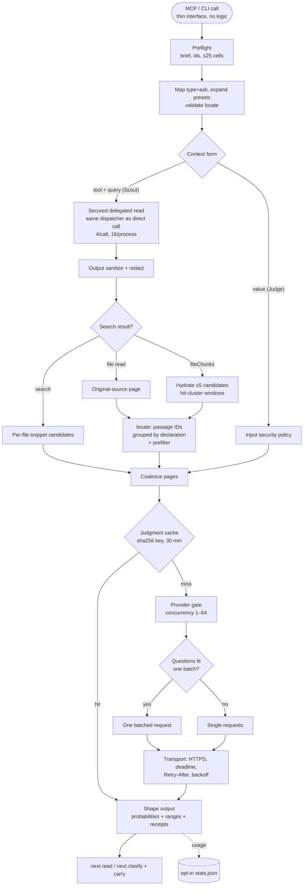
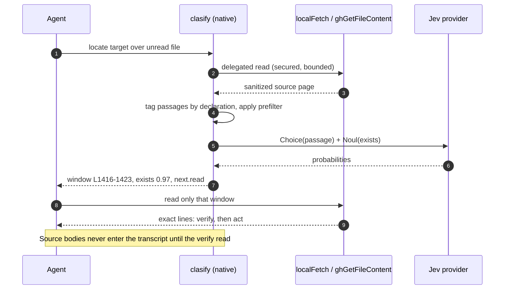
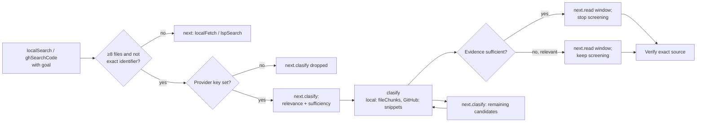

# Octocode Clasify

`clasify` is Octocode's only semantic tool. Jev is its classification provider, not a second tool.

Clasify has two modes:

- **Scout** executes an unread read-tool request, sanitizes the result, and returns typed judgments plus source receipts without returning source bodies.
- **Judge** classifies caller-supplied state in a resource's `value`; it performs no retrieval.

Clasify routes work. It does not prove source facts, global absence, symbol identity, reachability, or edit safety. Read the deciding source after a judgment.

## What Clasify does, and why

Every step below exists for one reason: move a *semantic routing decision* out of the host transcript, then hand the host a small, exact read that proves (or disproves) it.

| # | Step | What happens | Why | Code |
|---|---|---|---|---|
| 1 | Availability gate | Without a provider key MCP does not register `clasify`; every cross-tool `next.clasify` is dropped; CLI fails with `missingConfiguration` (exit 5) | Agents never see a route they cannot run | `runtime/continuations.rs` (`filter_unavailable_cross_tool_next`), `octocode-mcp/src/native` |
| 2 | Preflight | Requires nonblank `goal`/`reasoning` (≤500 chars), 1–25 resources × questions (≤25 cells), optional object `carry` | Reject bad matrices before any read or provider token is spent | `tools/clasify/mod.rs` `preflight` |
| 3 | Question expansion | Unified `type`+`ask` questions map onto their nested form (`relevant`→`contribution`, `supports`→`supportsClaim`, `adds`→`addsEvidence`, `yesno`→`noul`, `labels`→`criteria`); research presets expand from contract templates into Noul questions; `locate` accepts only its target; custom questions pass unchanged | One authored wording (core) instead of ad-hoc prompts per agent | `tools/clasify/aliases.rs`, `tools/clasify/questions.rs` |
| 4 | ID normalization | Flat questions and omitted IDs get stable internal IDs | Deterministic output rows and cache keys | `runtime/clasify_batch.rs` `normalize_ids` |
| 5 | Context form | Each resource is **Judge** (`value`, no retrieval) or **Scout** (`tool`+`query`, delegated read); the nested `context` form is equivalent | Judge reuses evidence already held; Scout judges source the host never reads | `runtime/clasify_context.rs` `prepare` |
| 6 | Secured delegated read | The read query passes the input security policy, runs through the normal dispatcher, and its output is sanitized/redacted like any direct call; 4 concurrent reads per call, 16 per process | Clasify can never read more, or leak more, than the host could with the same tool | `clasify_context.rs`, `clasify_batch.rs` `secured_read`, `ReadLimiter` |
| 7 | Candidate evidence | Search results split into per-file candidates: snippets (`search`) or bounded hydrated reads (`fileChunks`, ≤5 candidates) at hit-cluster windows, merged when near; a window larger than its byte share is re-read narrower around its hit | Judge each file on real surrounding code, not a 1-line snippet, inside a fixed budget; every capture path counts evidence one way against `maxChars` | `clasify_batch.rs` `hydrate_candidates`, `hit_cluster_windows`, `merge_near_windows`; budget rules in `clasify_budget.rs` |
| 8 | Locate tagging | One contiguous original-source page is split into passage IDs grouped by innermost declaration (doc comment included); `prefilter` literals narrow the windows | A choice over exclusive passages = P(answer is in that declaration), so the reply is a line range, not prose | `runtime/clasify_locate.rs`; `prefilter_windows` in `clasify_batch.rs` |
| 9 | Page coalescing | Adjacent ready pages merge up to 24 KiB of state; failed pages split runs | Fewer provider calls without hiding failures | `clasify_batch.rs` `coalesce_pages` |
| 10 | Judgment cache | SHA-256 key of endpoint + model + state + questions; 256 entries / 8 MiB / 30 min TTL; stores only successful complete answer sets; single-flight per key; process-local | Identical re-asks inside one MCP process are free and never double-billed | `tools/clasify/cache.rs`, `assess_provider_page` |
| 11 | Provider gate + batching | Process-wide concurrency gate per endpoint (default 10, 1–64): a throttle halves the limit and 4 successes restore one permit; 5 consecutive failures open the circuit for 10 s. Multi-question pages go as one batch when they fit (72 KiB per question, 120 KiB per group), else singles | Shared state is sent once (measured −62% provider input for 5×3) | `providers/classification/gate.rs`, `tools/clasify/batch.rs` |
| 12 | Transport | HTTPS (HTTP only for `localhost`, `127.0.0.0/8`, `[::1]`), 4 MiB body cap, deadline + cancellation, `Retry-After` honoured, jittered backoff 0.5–8 s | Bounded latency; no hot loops or unbounded provider responses | `tools/clasify/transport.rs` |
| 13 | Locate projection | Distribution → declaration-aligned verification window (±2 lines; a doc-comment hit shows 3 lines above to 4 below the declaration name); runner-up window when it reaches 50% of the winner and `exists ≥ 0.5`; overlapping windows merge into one | Host reads 1–2 small windows; a near-tie is shown instead of guessed | `clasify_locate.rs` (`RUNNER_UP_SHARE`) |
| 14 | Output shaping | Collapse shared failures, merge receipts/scopes, hoist limitations, literal-target hint (plus `next.localSearch` over local resources); continuations are compacted to non-default fields | Short, typed rows: IDs + probabilities + source ranges, no source bodies | `runtime/clasify_output.rs`; literal hint from `clasify_batch.rs` via `clasify_locate.rs` |
| 15 | Continuations | `next.read` (`localFetch` / `ghGetFileContent` at the returned range; a delegated file page not judged a confident "no" reads exactly its judged lines, or its byte page for a byte-chunked read), `next.clasify` with `carry`, `next.localSearch` for an identifier target, source tool follow-ups | Every judgment ends in an executable verification step | `clasify_batch.rs`, `continuations.rs` |
| 16 | Search handoff | A semantic `localSearch`/`ghSearchCode` page with ≥8 files proposes `relevant` + `sufficient` over the search resource (unified input shape); `localSearch` screens hydrated `fileChunks`, `ghSearchCode` screens snippets | Screen every reachable candidate before deciding which source to read | `runtime/clasify_handoff.rs` |
| 17 | Usage telemetry | Provider calls and billed tokens aggregate into opt-in `<home>/stats.json` | Provider cost is tracked separately from host context | `runtime/session_stats.rs` |

With `OCTOCODE_ENABLE_STATS=true` and persistent storage, `stats.clasify` records
successful provider request groups once: `calls`, `input_tokens`, `output_tokens`,
`known_usage_calls`, and `unknown_usage_calls`. Cached judgments add no provider
usage. Reported zero tokens count as known; missing or invalid token fields and
historical calls without completeness counters remain unknown. Token totals
retain reported values and may be partial when unknown calls exist. Current Jev
responses require both token fields; missing usage is a provider error. Failed
attempts have no billed-token receipt, so successful counters alone cannot prove
complete cost after a failure. Prices and provider request IDs are not exposed
by this accounting surface. For an isolated benchmark session, use a unique
`OCTOCODE_HOME` and collect its stats after the calls complete; keep provider
usage separate from host-model tokens and costs.

### When to call it



Why: literal routes are 3–10× cheaper and ~5× faster than a provider round-trip, so Clasify is reserved for questions no literal can answer.

### Known gaps

- The judgment cache is process-local: separate CLI invocations never share it; only a long-lived MCP process benefits.
- `next.localSearch` for identifier targets is emitted only for local resources and only for the first identifier target; GitHub resources keep the string hint because `ghSearchCode` covers only the default branch.
- A `locate` matrix whose every question targets a single bare identifier token over local resources is short-circuited: no read or provider call runs, and the result carries `hints` plus `next.localSearch` with exit 0.
- The `ghSearchCode` handoff still screens snippets: hydration showed no measured gain, would spend GitHub API budget, and recall (which files the search returns) is the limit there.

## Admission

Use Clasify for an explicit classification request, a supplied-state judgment, or unread-resource screening when the answer changes which items to read. Use `contribution` plus `sufficient` to identify relevant candidates still missing deciding facts; verify consequential facts in source. Use `type:"locate"` over unread known files when the target is semantic and no useful literal is known, or use `prefilter` literals to focus a large file. Direct search and bounded reads remain the default for literals, symbols, and already-known anchors.

In the bounded A/B runs on 2026-09-30, explicit list classification, prefilter locate, and absence screening were useful routes. To locate behavior, guess one literal and search it first; Clasify cost 2.6× the bytes when a literal was guessable and 22× for a literal target in those cases. Skip it for exact identifiers, literals, and PR filters (`fileFilter`, `matchString`). These measurements do not calibrate a universal score threshold. Verify deciding source regardless of score; an absence judgment does not prove absence without complete relevant coverage.

The target budget is host-model context. Provider tokens are cheaper and tracked
separately; they may increase when private assessment prevents larger source
bodies from entering the host transcript. Do not optimize provider usage at the
cost of more host reads or weaker routing.

Skip Clasify when an exact lookup, existing evidence, direct reasoning, or one cheap read decides the next action. File count, file size, ambiguity, one search miss, or a shorter response alone are not admission reasons. Every call adds provider tokens, latency, and verification work.

Generic hydrated Scout remains experimental. Five held-out bug-fix tasks improved top-three routing recall but used 2.17× the complete-task host tokens and did not improve aggregate patch quality. Locate fixes the specific double-work defect: Jev now identifies an original-source range, so the host verifies that range without running a second search. Current evidence and limitations are preserved in [`.octocode/JEV.md`](../.octocode/JEV.md).

The external-doc locate run used four unread files × two independent semantic targets. It returned both deciding ranges correctly, then exact verification used 4,708 host-visible response bytes versus 5,915 for the search-first route, a 20.4% reduction. Provider work rose to 16,514 input and 3,172 output tokens, and final-run wall time rose from 461 ms to 3,597 ms. An earlier run took 1,486 ms, confirming network-sensitive latency while remaining slower than search. This proves transport leverage for this bounded workflow, not a broad agent-token or latency win; keep the route narrow and retain the five-bug A/B as the broader gate. Reproducible artifacts live under [`.octocode/octocode-eval-benchmark/clasify-external-corpus/`](../.octocode/octocode-eval-benchmark/clasify-external-corpus/).

Once a call is admitted, shared-state batching is proven useful. A real local
5-candidate × 3-question run used 6,415 provider input tokens in one matrix,
versus 16,715 for three one-question matrices (61.62% less), with no threshold
decision disagreements across 15 cells and three repeats. This optimizes an
admitted Clasify call; it does not establish an end-to-end research win. The
reproducible report is
[`.octocode/benchmarks/clasify-multi-question/REPORT.md`](../.octocode/benchmarks/clasify-multi-question/REPORT.md).
An external `tokio-rs/tokio` replay measured a 66.02% provider-input reduction
for the same shared-matrix shape and preserved commit-pinned verification reads.

## Architecture

### Pipeline



### One locate call



### Search handoff and availability



The core package owns the schema, descriptions, limits, and instructions. The native runtime validates the generated contract, executes delegated reads, sanitizes evidence, enforces capture/provider limits, and shapes continuations. CLI and MCP expose the same contract.

Delegated reads share a limit of four concurrent reads per call and sixteen per process. Search candidates hydrate concurrently inside those bounds. Provider judgments run independently through the provider's configured concurrency gate. Candidate order in the output remains deterministic.

## Availability

Clasify needs a classification provider key: `OCTOCODE_CLASSIFICATION_API` (Jev alias `OCTOCODE_JEV_KEY`), with an optional `OCTOCODE_CLASSIFICATION_API_HOST` API root (default `https://api.typesafe.ai`; HTTPS except loopback; home-trusted, never from a workspace). Key setup, source order, and the blank-value kill switch are in [AUTHENTICATION.md](AUTHENTICATION.md#classification-key-clasify); every setting is in [CONFIGURATION.md](CONFIGURATION.md).

- Without a key, MCP does not register `clasify`, and every cross-tool `next.clasify` is dropped. Restart MCP after changing the key; the catalog is fixed at startup.
- The CLI still lists it in `octocode scheme` with `availability.enabled:false` and the env hint; a direct call fails with `missingConfiguration` (exit `5`).
- Provider concurrency: `OCTOCODE_CLASSIFICATION_CONCURRENCY` / `classification.maxConcurrency` (default 10, 1–64). The resolved model and usage stay internal telemetry.

```bash
npx octocode config --check OCTOCODE_CLASSIFICATION_API
npx octocode scheme clasify --view query --compact
```

## Input

One semantic matrix contains:

| Field | Meaning |
|---|---|
| `id` | Stable query correlation ID |
| `reasoning` | Required, at most 500 characters. Sent in each page's evidence state. Say what the next read depends on |
| `goal` | Required, at most 500 characters. Sent with every question and in each page's evidence state. Say what a useful file must contain |
| `resources[]` | Independently captured state or unread read requests |
| `questions[]` | Caller-authored questions applied to every resource page |

Put all independent questions that use the same evidence in one matrix, and put
every candidate in `resources`. Each resource is captured once, and the runtime
batches all fitting questions for its page. Jev does not see the caller
transcript: required `goal` travels with every question and in each page's evidence state, and required `reasoning` travels in that same state. Use root `queries[]` for independent matrices whose resource cross-product
would be wrong. Use a later call only when an earlier answer changes the evidence
or available options. Resource and question IDs must be unique inside their
query.

A resource is either held state or one unread read:

```json
{"id":"held","value":{"claim":"...","evidence":["..."]}}
```

```json
{"id":"unread","tool":"localFetch","query":{"path":"/abs/repo/src/file.ts","startLine":40,"endLine":100}}
```

The read query follows that read tool's own schema and inherits the matrix `goal`/`reasoning`. A file read without a range, match, or view reads the whole file; a `localSearch`/`ghSearchCode` resource in a matrix with a `locate` question hydrates file chunks (`candidateEvidence:"fileChunks"`, which may also be set explicitly). The older nested form (`context:{value}` / `context:{tool,query,candidateEvidence}`) remains valid for one release and executes identically. Use the live schema for each read tool rather than copying old examples.

### Questions

Each question is `{id?, type, ask}` and uses one primitive:

| `type` | Meaning |
|---|---|
| `yesno` | Probability of “yes” for one proposition (optional `labels:{true,false}`) |
| `choice` | One caller-defined label from `labels:{label: meaning}`, with the probability map when uncertain |
| `score` | Expected zero-based level on `labels:[low … high]` |

Choice and Score confidence measures probability concentration, not correctness. Add an explicit `insufficient` label when substantive labels may not fit. There is no universal score or confidence threshold for discarding candidates.

Research types are `locate`, `relevant`, `sufficient`, `adds` (requires `known`), and `supports`. `sufficient` asks whether the captured page already states the answer, so the host can stop screening. The judged evidence reached the provider, not the host: unless it was a supplied `value` or a snippet already in context, run the page's `next.read` to obtain and cite the deciding lines. The older forms — `questionType` (`contribution`, `supportsClaim`, `addsEvidence`+`knownEvidence`, `sufficient`, `locate`) with `target`, and `type` (`noul`/`choice`/`score`) with `instructions`/`criteria` — still validate; do not mix fields of two forms in one question.

`locate` accepts only its `ask` and applies to a contiguous original-source `localFetch` or `ghGetFileContent` page. The runtime tags small source passages, asks Jev a Choice question to rank them and a Noul question to estimate whether an answer exists, then projects the answer back to original line numbers. Where the engine outlines the language, passages are grouped by their innermost declaration (leading doc comment included) and a doc-comment hit shows the declaration line. The answer is `{exists,matches:[{startLine,endLine,probability}]}` with one match, or two when the page answers (`exists` ≥ 0.5) and the runner-up holds at least half the winner's probability. Each query's `best[questionId]` lists only answering windows (`exists` ≥ 0.5) across pages, at most three, as `{lines:[start,end], exists, p}` (`r`/`path` only when the matrix has several resources or the window's file differs from the resource path); a finished walk with none lists its single closest passage instead. Rows are ranked by `exists`, and `p` orders rows with equal `exists`. The query's `next.read` is an exact `localFetch` or `ghGetFileContent` call for the top row through the page that assessed it (its snapshot included; GitHub reads name `owner`, `repo`, `path`, and the requested branch or returned commit), so run it unchanged; read other rows by their `lines`. `carry` always keeps the full top three in the same row form, copied unchanged (the older `{resourceId,startLine,endLine,probability}` rows are still accepted). While a continuation remains and no window answers, `best` is omitted and the ranking travels only in `carry`, so follow the continuation instead of reading the closest non-answer. The last call ranks the whole file. Identifier-like targets add a `hints` entry pointing to localSearch; when every resource is a local `localFetch`/`localSearch`/`structureSearch`/`astSearch` read, the query also gains `next.localSearch`, an executable literal search (`regex:"literal"`) for the first identifier, scoped to that resource path or the deepest directory the resources share. GitHub resources get the hint alone. A `localFetch`/`ghGetFileContent` resource may add `prefilter:[terms]` (at most 8 rare literals); any other resource with `prefilter` is rejected. The runtime probes the file with a case-insensitive literal match (up to 20 match pages) and judges up to three 600-line windows around the hits: the densest when every hit fits, otherwise the first three in file order, with `next.clasify` resuming after the last. No hits falls back to the original read. When terms occur throughout the file, a distinctive search is cheaper. A finished ranking always has a winner; low `exists` means the returned range is merely the closest passage.

For `locate`, request unminified file reads (`minify` omitted or `"none"`), or use a `localSearch`/`ghSearchCode` resource (file chunks are hydrated for locate). Hydrated chunks can still have gaps; those pages remain unsupported. Plain search snippets, repository/tree listings, AST/LSP results, history, and package metadata support the other question types. A matrix combining `locate` with an incompatible tool resource is rejected before retrieval or provider calls; split it into separate matrices. Supplied values and captured pages still undergo source-line validation.

`best` rows (and, with `debug:true`, each page's `matches`) provide source coordinates once. These are verification windows around ranked passages, not guaranteed complete declarations or answers. Batch the windows into one read call (up to five queries); expand or follow the source if the deciding statement is absent. Even a high score needs source verification. Results contain hints, never captured bodies. MCP returns the structured payload and mirrors it as JSON in the text content.

Each question must describe one source-local fact. Split lists, conjunctions, and
facts expected in distant sections into separate questions over the same capture.
Add several questions when every answer changes a route, threshold, read, test,
or edit. Cheap questions still consume cells, question tokens, and host-visible
output; they cannot repair an irrelevant candidate set.

## Research flows and intent boundaries

| Intent | Use Clasify when | Keep direct Octocode evidence when |
|---|---|---|
| Locate an answer inside unread known files | The target is semantic, several candidate files or questions share the same capture, and the result routes exact line reads | A literal, regex, symbol, AST shape, or line anchor expresses the target directly |
| Route search candidates | Scope and lexical repair already produced a bounded ambiguous shortlist, and the result selects an exact read | Paths, snippets, AST, or LSP already identify the deciding file |
| Map several properties over candidates | Up to 25 independent source-local questions all apply to the same unread pages; put them in one matrix | Each property needs different search terms, files, ranges, or later evidence |
| Triage history | Several unread PR, issue, commit, or diff candidates need the same relevance/support check before an exact history read | The number/ref is known or one diff answers the question |
| Check held evidence | A small supplied evidence set needs a typed supported/contradicted/conflicting/insufficient disposition that changes the next action | The source already states the answer or the agent merely wants a summary |
| Detect incremental evidence | `addsEvidence` can distinguish a new fact, exception, or contradiction from current `knownEvidence` | Exact duplicate identity or location is mechanically decidable |
| Choose a hypothesis/test | A closed Choice, including `insufficient`, selects a discriminating next test | The task needs open-ended causal reasoning or a new hypothesis |
| Rank one ordered dimension | A Score rubric is explicit and a threshold drives routing | “Correctness,” relevance, or severity has no calibrated rubric or action policy |
| Prove identity, reachability, absence, or edit safety | Never | Use LSP, AST/topology, exact reads, tests, and coverage appropriate to the claim |

The useful research placement is **retrieve → classify the bounded ambiguous
set → verify the deciding source**. Classification before retrieval has no state
to judge. Classification after the host has already read every body cannot save
host context. Adding questions after retrieval helps only when the same captured
state can answer them independently.

Measure the complete conversion:

```text
host leverage = direct-workflow host tokens
              - Clasify-workflow host tokens

Clasify-workflow host tokens include tool results, repair calls, selected reads,
uncertainty reads, and final answer generation. Provider input/output tokens and
latency are reported separately.
```

For a quick diagnostic before a full agent A/B, replace host tokens with
host-visible response bytes and divide the bytes avoided by provider input
tokens. This is a transport proxy, not proof of model-context savings.

## Search → clasify → read handoff

A paged `localFetch` or `ghGetFileContent` read of a file of at least 2,000 lines without `matchString`, a line range (`startLine`/`endLine`, `ranges`), or a view can carry `next.clasify`: one whole-file resource with a `locate` question whose `ask` is the read's goal (`runtime/clasify_handoff.rs` `large_read_handoff`). An unanchored first read of such a file returns only its head, so the handoff arrives before a full page is paid for; identifiers the goal names (`snake_case`, `camelCase`, `Type::name`, at most three) become the resource's `prefilter`. A goal that is a bare identifier (`MAX_CALL_CAPTURES`, `newElementWith()`) gets no offer: clasify would route it straight to a literal `localSearch`, so search it directly. A semantic `localSearch` or `ghSearchCode` page with at least eight files carries `next.clasify` in the unified input shape: one unread flat search resource (`tool`/`query`) with `relevant` and `sufficient` questions whose `ask` is the search goal. A `localSearch` handoff sets the resource's `candidateEvidence:"fileChunks"`, so each candidate is judged on hydrated code around its hit clusters (a window edge that cuts a nearby declaration grows to that declaration's boundary when the grown window fits one page, and its `next.read` covers the same span) (at most five candidates per call, the rest through `next.clasify`); a one-line hit of the searched phrase carries only that phrase, so snippet scores stay flat (measured 0.16–0.38). A `ghSearchCode` handoff stays on snippets: hydration showed no measured gain, would spend GitHub API budget, and recall is the limit. The handoff preserves the search goal, reasoning, filters, view, and starting candidate. Clasify uses a smaller aligned page when the original page size exceeds its cell budget. Clasify bounds the candidate page to its cell budget and returns remaining candidates through `next.clasify`; it does not select only the first three files or fetch their whole bodies. Run the handoff unchanged, compare each candidate's relevance and sufficiency, and read relevant candidates through `next.read`; a sufficient one ends screening but is still read to verify. The handoff's question target is the search `goal`, so a vague goal gives flat scores: on `modelcontextprotocol/typescript-sdk` (10 candidates), "Find how invalid tool arguments are rejected" scored every file 0.82–0.95 relevant and an example client 0.71 sufficient, while naming the artifact ("the SDK server code that rejects…") ranked the implementation first at 0.94 (next 0.72), with sufficiency above 0.12 only for it. Name the artifact kind in the search goal. Follow `next.clasify` when the remaining candidates can change the decision.

Narrow pages, identifiers, single-token anchors, quoted literals, paths, regexes, `wholeWord` searches, and non-hit views (`filesWithout`, `countLines`, `countMatches`, `matchOnly`, `invertMatch`) carry no automatic handoff. File count alone never triggers classification. The availability filter drops the handoff when Clasify is disabled. Metadata-only search views use a routing `yesno` question for relevance rather than asking bare paths to support a content claim. Compact GitHub `owner/repo:path` rows retain per-file identities and reads. Manual Scout and Locate remain available when an unresolved semantic decision justifies them.

Provider judgments use a process-local cache keyed by a SHA-256 of endpoint, model, evidence state, and questions (256 entries, 8 MiB, 30-minute TTL). Only complete successful answer sets are stored, so any change to evidence, brief, or question misses. Identical requests in flight at once share one provider call. The cache lives in the MCP process; each CLI invocation starts empty. Within a call a resource's capture is reused for all its questions, a continuation that repeats is stopped as a loop, and duplicate paths in one search page collapse; identical resources listed twice are read twice. GitHub reads use the same cache as direct calls.

## Scout over list candidates

One unread list resource fans its returned candidates into independent pages. Each page carries its identity and `next.read`, the executable fetch for that one candidate:

| Resource | One page per | `source` | `next.read` |
|---|---|---|---|
| `localSearch`, `ghSearchCode` | file | `path` | `localFetch` window around the densest match cluster / `ghGetFileContent` anchored on the match |
| `astSearch` `match` / `symbols` | file (a directory outline is already grouped per file) | `path` | `localFetch` window around the matched lines |
| `lspSearch` locations (references, definitions, implementations, …) | file (locations grouped) | `path` | `localFetch` window around the locations |
| `ghSearchRepo` | repository | `item` `owner/repo` | `ghStructure` |
| `ghSearchHistory` | pull request / issue / commit | `item` `owner/repo#n` or `owner/repo@sha` | `ghGetHistoryItem` |
| `artifactSearch` keyword discovery | package | `item` `type:name` | `artifactSearch` exact lookup |

Bare path lists (`structureSearch` `files`/`tree`, `ghStructure`) and `astTopology` results (a context tool only when beta is enabled) stay one page: a name alone is judged better comparatively, so ask a `choice` over the listed paths (measured: judged one by one, every file scored 0.16–0.20 on content questions). Cells are pages × questions (≤25), so for paged lists (`localSearch`, `ghSearchCode`, `astSearch` `match`, `ghSearchRepo`, `ghSearchHistory`, `artifactSearch` keywords) clasify lowers `pageSize` to fit; later pages continue through `next.clasify`.

### Sufficiency first: read only what is missing

Match the question to what a page carries. Content (snippets, symbols, references, PR or commit text, package descriptions) suits `contribution` + `sufficient`. Bare metadata (repository names, titles) suits a routing `noul` such as "this repository likely implements X", compared across pages. Measured on the MCP TypeScript SDK search: `contribution` over repository metadata scored the official SDK 0.17, the same as unrelated repositories. Over package descriptions, it put `ajv` first at 0.78.

Ask relevance and sufficiency in one matrix, then act per page:

- `sufficient` high: the judged evidence states the answer. That evidence reached the provider, not the host: unless it was a supplied `value` or a snippet already in your context, run the page's `next.read` (bounded to the judged lines or candidate anchor) to obtain the deciding fact before answering, and stop screening further candidates.
- relevant (`contribution`/custom `noul`) high and `sufficient` low: run `next.read` unchanged and keep screening.
- relevance low: skip the candidate. A low score is not absence; widen the search before concluding.

The same check works before a large fetch: send the `localFetch`, `ghGetFileContent`, or `ghGetHistoryItem` request as the resource with `sufficient` plus the deciding question. Clasify reads it and returns the verdict (and locate windows when asked). Every judged file page whose verdicts are not all a confident "no" (P(yes) below 0.36) carries `next.read` for exactly its judged lines (its byte page when the read is byte-chunked), so a `sufficient` page is one bounded read from the deciding fact instead of the whole fetch.

```json
{"goal":"Find how the SDK rejects invalid tool arguments.","reasoning":"Pick which PRs to read.",
 "resources":[{"id":"prs","tool":"ghSearchHistory","query":{"operation":"pullRequest","owner":"modelcontextprotocol","repo":"typescript-sdk","keywords":["validation"],"pageSize":5}}],
 "questions":[{"id":"rel","type":"relevant","ask":"Runtime validation of tool call arguments"},
              {"id":"enough","type":"sufficient","ask":"How invalid tool arguments are rejected"}]}
```

### Search file chunks

For `localSearch` and `ghSearchCode`, file entries can also be hydrated into bounded chunks.

- Screening questions judge only returned paths, snippets, and metadata (`candidateEvidence:"search"`).
- A `locate` question, or `candidateEvidence:"fileChunks"`, hydrates file chunks when snippets cannot route the next read; the `localSearch` handoff sets it automatically.
- File-chunk mode hydrates at most five candidates on the current search page.
- Each candidate contributes at most 12,000 sanitized characters.
- Candidate chunks are judged independently; one candidate is never visible to another.
- The output contains no source body.

```json
{
  "id":"candidate-screen",
  "goal":"Find where handler registration is implemented.",
  "reasoning":"Test whether bounded hydration improves the next-read decision.",
  "resources":[{
    "id":"hits",
    "tool":"localSearch",
    "candidateEvidence":"fileChunks",
    "query":{
      "path":"/abs/repo",
      "searchText":"registerHandler",
      "include":["src/**"],
      "pageSize":5
    }
  }],
  "questions":[{
    "id":"contribution",
    "type":"relevant",
    "ask":"Where is handler registration implemented?"
  }]
}
```

Each usable hydrated page includes `next.read`, an exact `localFetch` or `ghGetFileContent` request for verification. A malformed or failed candidate may not have one. `next.clasify` continues the underlying search; copy it unchanged.

### Large local repositories

Constrain the search before classification:

1. Use an absolute root and the narrowest useful `include`, `excludeDir`, language, and lexical anchor.
2. Keep `pageSize` at five or below for file-chunk mode.
3. Use direct `localSearch`, AST, or LSP evidence when syntax or symbol identity already decides the file.
4. Follow `next.clasify` only when later search pages remain relevant to the stated decision.
5. Execute `next.read` for the candidate that changes the action; a bounded chunk does not cover the rest of the file.

Local hydration reads a bounded region around the densest cluster of matches. If no stable anchor exists, the page records that only the opening chunk was assessed.

### Large GitHub repositories

GitHub code search is index-limited and cannot establish global absence. Narrow by owner/repository, filename, extension, language, and useful keywords before classification.

File-chunk mode performs bounded candidate fetches concurrently. Each exact-read continuation is pinned to the observed commit SHA when the provider returned one, so verification reads the assessed revision rather than a mutable branch. Continue search coverage with `next.clasify`; do not infer repository-wide absence from one page or one score.

## Judge supplied state

Judge is appropriate when the caller already holds a small, sufficient evidence set and needs an explicit classification whose result changes the next read, test, or edit.

```json
{
  "id":"claim-review",
  "goal":"Decide whether the abort claim holds.",
  "reasoning":"Classify how the held evidence bears on the exact claim.",
  "resources":[{
    "id":"evidence",
    "value":{
      "claim":"Aborting a queued task guarantees it never starts.",
      "observations":[
        "Waiting tasks may be removed by an abort signal.",
        "Tasks already started continue after abort."
      ]
    }
  }],
  "questions":[{
    "id":"support",
    "type":"choice",
    "ask":"Classify support for the exact claim.",
    "labels":{
      "supported":"Evidence covers the complete claim.",
      "contradicted":"Evidence conflicts with the claim.",
      "conflicting":"Evidence supports and conflicts with the claim.",
      "insufficient":"A deciding condition is missing."
    }
  }]
}
```

Do not copy unread bodies into `value`; use an unread read request so the host does not first pay to consume that source.

## Limits

| Limit | Value |
|---|---:|
| Queries per call | 5 |
| Resources per query | 25 |
| Questions per query | 25 |
| Expanded cells per query | 25 |
| Total caller cells per call | 50 |
| Default `maxChars` per resource | 80,000 |
| Hydrated candidates per search page | 5 |
| Sanitized characters per hydrated candidate | 12,000 |
| `maxChars` per resource (maximum) | 80,000 |
| Captured pages per resource per call | 100 |
| `prefilter` terms | 8 |
| Choice labels / Score levels | 2–255 / 2–10 |
| Resource / question ID length | 1–64 (`[A-Za-z0-9][A-Za-z0-9._-]*`) |
| `carry` rows per question | 3 |
| Provider request body | 4 MiB |

`maxChars` bounds the sanitized evidence a resource submits, on every path: file pages, search snippets, hydrated chunks, and list items. Search and list candidates are kept in page order while they fit. A candidate larger than the whole `maxChars` fails with `classificationContextTooLarge` and keeps its `next.read`; the first candidate that only overflows what the call has left resumes through `next.clasify` (search pages restart at that file row), or, when no continuation can address it, fails with `classificationBudgetSpent` and its `next.read`. Hydrated chunk reads share the budget equally. A file page over the whole `maxChars` is re-read at the same start in smaller chunks (up to four attempts; an unpaged whole-file read becomes line chunks from line 1, and `next.clasify` walks the rest); a page that fits a fresh call but not the remainder of this one is deferred to `next.clasify`. A single smallest unit that still exceeds `maxChars` fails with `classificationContextTooLarge` and no continuation. A replay whose source changed fails with `staleSnapshot` instead of restarting on the new version.

Search fan-out is included in the 25-cell limit; a `fileChunks` resource (including a search resource with a `locate` question) counts as five resources in both the 25- and 50-cell checks. Twenty-five questions fit only with one resource, because resources × questions must stay at or under 25 cells. Calls that exceed the dynamic expanded-cell bound fail before provider work rather than silently dropping candidates.

## Output and verification

Results are ordered as `queries[] → resources[] → pages[] → answers[questionId]`. By default each resource states its file `path` and `totalLines` once (when every page shares them) and each page is `{lines:[start,end], answers}`: `answers` maps every question id to a bare verdict — locate `exists`, yesno/research P(yes), a choice label, or a score level. A choice or score whose top probability is below 0.9 keeps `{choice|score, confidence, probabilities}`. A resource with one plain page (a supplied value) carries `answers` itself. Pages from other files, byte or disjoint scopes, transformed views, limitations, candidate `next.read`, and typed errors stay on the page. Measured on a single-file locate (redis `server.c`): about 4.0 KB → ~1.2 KB; a five-row choice judgment 902 B → ~0.26 KB.

`debug:true` on a matrix returns the full per-page receipt instead: `source`, `scope`, runner-up `matches`, page `next.read`, plus provider `usage` (`calls`, `inputTokens`, `outputTokens` when reported) on each page and for the matrix (with `ms`). Its `next.clasify` keeps `debug:true`, so a walk keeps one receipt shape.

Each resource reports `coverage` only when it is `partial` or `error`; no `coverage` means every captured page in this call was judged. It does not mean an entire file, search result set, or repository was read. Page limitations name unread content.

Rules:

- Execute `next.clasify` unchanged when more selected coverage is needed. `best` lists only answering windows (`exists` ≥ 0.5), or a finished walk's single closest passage; read the top row by running the query's `next.read` unchanged and other rows by their `lines`. A non-answering window on an open walk is withheld from `best` and kept in `carry`, which always holds the full top three.
- Execute a deciding `next.read` unchanged and cite the original source, not the score.
- Treat `partial`, `error`, `insufficient`, content-firewall rejection, and mid-band scores as unresolved.
- Preserve disjoint ranges; transformed-view positions are not source coordinates.
- Source versions are observations; verify mutable source before asserting.
- Do not average page scores or synthesize a global verdict unless the caller explicitly owns that policy.

## CLI

```bash
npx octocode scheme clasify --view query --compact
npx octocode clasify --input request.json
npx octocode clasify --input request.json --pretty
```

In this repository:

```bash
node packages/octocode/out/octocode.js clasify --input request.json
```

Exit codes: `0` judged, `6` continuation available, `2` invalid input (including every resource rejected as a caller error, such as `classificationLocateUnsupported` or a path outside the allowed roots). When every read failed the same way, clasify exits like that read: `3` not found (such as a missing local file or GitHub path), `4` authentication, `7` rate limited, `5` any other read or provider failure; `5` also means no key (`missingConfiguration`). When some resources succeed, a failed resource reports `coverage:"error"` in-band and the call exits `0`, as other tools do. The full table is in [OCTOCODE_PROTOCOL.md](OCTOCODE_PROTOCOL.md#38-next-steps-and-failure-hints).

## Removed names

`semanticAssess`, `semanticRerank`, `jev`, `jevScout`, and `jevReasoning` are not public tools or aliases. Use `clasify` and `next.clasify`. Historical evaluations live under `.octocode`; they are evidence, not current call instructions.

The live schema is authoritative. Inspect it before hand-authoring a request.
