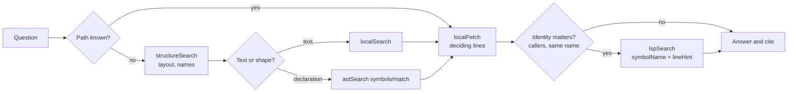
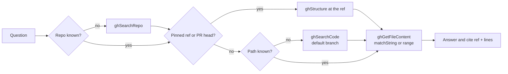
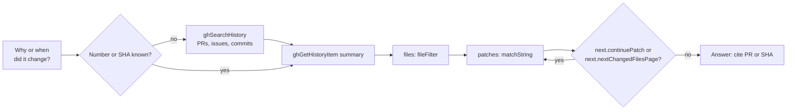
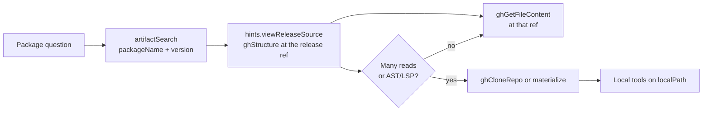
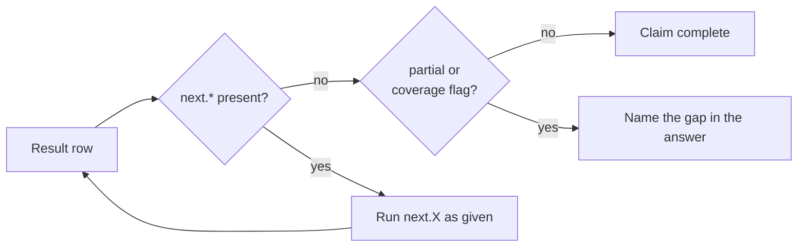
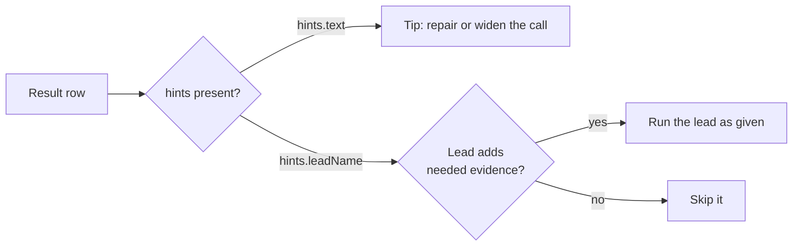
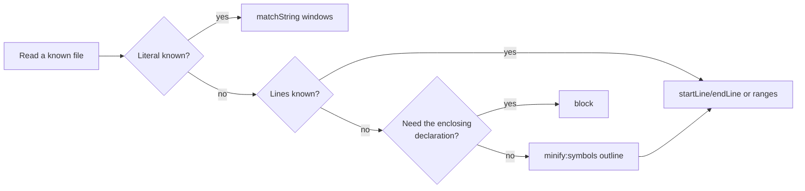
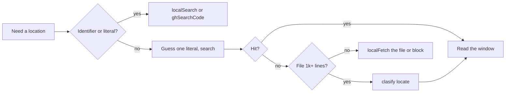
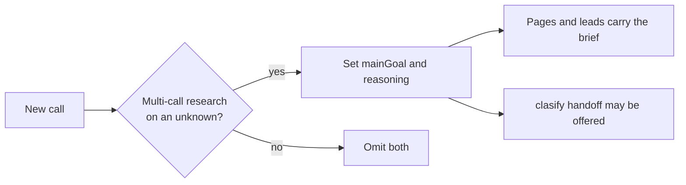
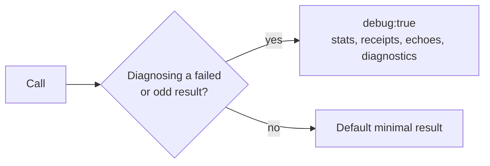

# Octocode workflows

This page is the flow map for agents. Each flow has one diagram and a short list of decidable rules. The MCP server instructions compress these flows into a few lines; this page is the long form.

Owners of related detail:
- Tool fields, limits, and results: [OCTOCODE_TOOLS.md](OCTOCODE_TOOLS.md).
- Evidence boundaries per tool: [OCTOCODE_RESEARCH_MANIFEST.md](OCTOCODE_RESEARCH_MANIFEST.md).
- The request and result envelope: [TOOL_DATA_CONTRACT.md](TOOL_DATA_CONTRACT.md).
- Why the protocol has this shape: [OCTOCODE_PROTOCOL.md](OCTOCODE_PROTOCOL.md).

- [Choose the first tool](#choose-the-first-tool)
- [Local research](#local-research)
- [GitHub research](#github-research)
- [History](#history)
- [External to local](#external-to-local)
- [Pages: `next`](#pages-next)
- [Hints: leads and tips](#hints-leads-and-tips)
- [Minification: read less](#minification-read-less)
- [clasify gate](#clasify-gate)
- [Briefs: `mainGoal` and `reasoning`](#briefs-maingoal-and-reasoning)
- [debug](#debug)
- [Where each rule lives](#where-each-rule-lives)

## Choose the first tool

| The question needs | First tool | Never |
|---|---|---|
| Local layout or file names | `structureSearch` | `localSearch` for paths |
| Local text, errors, config keys | `localSearch` | — |
| Local declarations or code shape | `astSearch` | text hits as identity |
| Callers, references, or which same-name symbol | `lspSearch` (after a line anchor) | text hits as proof |
| A known local file | `localFetch` with `matchString` or a range | a whole large file |
| An unknown GitHub repository | `ghSearchRepo` | a guessed `owner/repo` |
| GitHub layout or paths at a ref | `ghStructure` | — |
| GitHub code on the default branch | `ghSearchCode` | at a pinned ref or a PR head |
| A known GitHub file | `ghGetFileContent` | — |
| PRs, issues, commits | `ghSearchHistory` → `ghGetHistoryItem` | — |
| Package versions, dependencies, release source | `artifactSearch` | an answer from memory |
| A described target in a large file, no literal | `clasify` | identifiers or literals |

## Local research

- If you know the path, read it with `localFetch`. Do not search first.
- If you do not know the path, run `structureSearch` (`operation:"files"` with `names`, or `tree`).
- For text, run `localSearch`. For declarations or code shape, run `astSearch`.
- Read each hit with `localFetch` and `matchString` or a line range. Read only the lines that decide the claim.
- If the question is about callers or references, use `lspSearch`.
- If a name has more than one declaration, use `lspSearch`. Text hits show where a name occurs, not which symbol it is.
- An `astSearch` symbols row gives `name` and `line`. Send them to `lspSearch` as `symbolName` and `lineHint` without change.

## GitHub research

- If you do not know the repository, run `ghSearchRepo`.
- `ghSearchCode` searches only the indexed default branch.
- If the question names a tag, a SHA, a release, or a PR head, do not use `ghSearchCode`. Run `ghStructure` at that ref, then `ghGetFileContent` at that ref.
- Read a known path with `ghGetFileContent`. Set `branch` to the ref. Use `matchString` or a line range.
- To grep a tree at a ref, run `ghStructure` with `materialize`, then run `localSearch` at `location.localPath`.
- A 404 at one ref is not a reason to read another ref.

## History

- If you do not know the number or SHA, run `ghSearchHistory`. Then read the item with `ghGetHistoryItem`.
- Start with the PR summary. Then ask for the files you need with `fileFilter`, and the hunks you need with `matchString`.
- If you have a literal or a path, ask the PR for it directly. Use the full file inventory only when you have neither.
- Review an open PR at `sourceSha`. Review merged behavior at `mergeCommitSha`. If the head changes, review again.
- For an issue, read `closedBy` to find the fix PR.
- Patches and changed files page separately. Follow each `next.continuePatch` and `next.nextChangedFilesPage`.
- An issue is a claim. The code at a ref is the evidence.

## External to local

- For a package version, a dependency, or a release fact, run `artifactSearch`. Do not answer from memory.
- Run `hints.viewReleaseSource` as given. It opens the source at the release ref.
- If the registry cannot select the version, read the project file at the release tag with `ghGetFileContent`.
- For one or two files, read them with `ghGetFileContent`.
- For many reads, or for AST or LSP work, use `ghCloneRepo` (CLI) or `ghStructure` `materialize`. Then run the local tools on `localPath`.
- Registry metadata does not prove source behavior. Read the source at the release ref.

## Pages: `next`

- `next` holds pages. A page is the rest of the same result. The response is incomplete without it.
- Before you claim completeness, run every `next.*` page that the answer needs.
- Run a page as given. Do not edit its query or compute an offset.
- If you stop before the last page, name what stays unread in the answer.
- A warning such as `7 more changed files: follow next.nextChangedFilesPage` tells you the count that stays unread.
- If `next` is absent but the row has a partial or coverage flag, name the gap.
- An empty result proves absence only after you check scope, spelling, ref, and index.
- CLI exit code 6 means a page is available.

## Hints: leads and tips

- `hints` holds optional guidance. Skipping a hint never leaves a result incomplete.
- `hints.text` holds prose tips. They appear on empty or failed rows.
- Every other entry under `hints` is a lead: a ready call such as `readTopMatch`, `viewRepo`, `readFixPr`, or `clasify`.
- A row has at most two leads.
- Run a lead only if it adds evidence that the question needs. Run it as given.
- A tip that a successful row needs, such as a clamp or a skipped scope, is a `warnings` entry, not a hint.

## Minification: read less

- With a literal, read `matchString` windows.
- With line numbers, read `startLine`/`endLine`, or up to ten `ranges`.
- For the function or class around a line, use `block`.
- For the shape of an unknown file, use `minify:"symbols"`. Then read the lines you need.
- Quote and cite only `minify:"none"` reads or search hits. Positions in a transformed view are not source lines.

## clasify gate

- Use `clasify` for a described target in a large file after one guessed literal misses.
- Use `clasify` to judge supplied state, or to classify an explicit list.
- Do not use `clasify` for identifiers, literals, or small files.
- A `clasify` score is a hint. Read the deciding lines before you claim a fact.
- `clasify` appears only when you configure a classification key.

## Briefs: `mainGoal` and `reasoning`

- Set `mainGoal` and `reasoning` only in multi-call research on an unknown.
- Omit them on lookups, reads, listings, and pages.
- A page or lead carries the brief only if its source call sent one.
- A `hints.clasify` handoff needs `mainGoal`.

## debug

- Responses are minimal by default.
- Set `debug:true` only to diagnose a failed or unexpected result. It adds scan stats, receipts, echoes, and diagnostics.
- Evidence, pages, warnings, and coverage flags appear without `debug`.

## Where each rule lives

| Layer | Reader acts on it when | Owns |
|---|---|---|
| MCP instructions (core `instructions.ts`) | before the first call | routes per family, the page rule, the clasify gate, evidence, and stop rules |
| Tool descriptions (core `descriptions.ts`) | choosing a tool | use when, not when, next tool |
| Published field notes (core `publishedSchema.ts`) | filling a call | field meaning and limits |
| Result `next`, `hints`, `warnings` | reading a result | the next call for this result |
| This page | learning or auditing the flows | the full map with diagrams |

The instructions have a guide variant with one extra line per flow. It is off by default. The config setting `mcp.instructions` (`OCTOCODE_INSTRUCTIONS=guide`) selects it for measured runs; see [CONFIG_SETTINGS.md](generated/CONFIG_SETTINGS.md).
