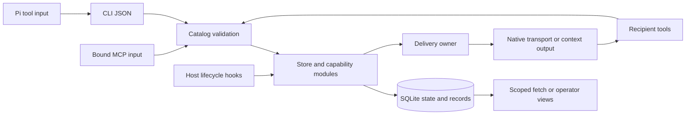

# Communication runtime

CLI, MCP, hooks, and host adapters share one Python store and SQLite protocol.
The npm package contains a cross-platform Node launcher and the Python runtime. Portable archives contain `OPERATING.md` and `scripts/`.
The separate skill under `skills/` contains guidance only and directs operations to the npm CLI.
JavaScript adapters and the npm launcher require Node.js; direct Python CLI/MCP do not.

## Boundaries and owners

CLI and MCP converge at `Store.call`; MCP does not execute the CLI dispatcher.
Pi bound tools launch the CLI. Host hooks also use lifecycle and delivery methods directly.

| Owner | Responsibility and contract |
| --- | --- |
| `catalog.json`, `catalog.py`, `validation.py` | Command inputs, record payload schemas, tool profiles, discovery, and validation |
| `cli.py`, `mcp.py` | Bounded ingress, command routing, output framing, and bound MCP identity; managed MCP owns its lifecycle |
| `store.py` and capability modules | Workspace/identity checks, current state, messaging, leases, documents, health, and scoped history |
| `schema.sql`, `database.py` | Storage identity/fingerprint, transactions, constraints, indexes, and atomic event triggers |
| `records.py` | Unified envelopes, visibility, indexed filters, fixed-ceiling pagination, and generic memory/event writes |
| `dispatch.py`, `transport.py` | Attempt tokens and delivery ownership; native I/O and transport-specific receipts |
| `proxy.py` | Requested worker lifecycle and host process supervision |
| `host_hooks.py`, Pi modules, `hooks/` | Host events, context budgets, durable Pi receipts, and optional structured-edit admission |
| `view.py`, `view_data.py`, `dashboard/` | Local read-only operator views and bundled UI; no frontend build |

`catalog.json` owns public field definitions; `catalog.py` owns the tool profile presets. `schema.sql` owns persisted structure and invariants.
Discovery combines these sources; no interface maintains a second command or record schema.
The shared config copy is the only refreshed runtime module: `src/build.mjs` copies `scripts/octocode_config.py` from the config package.

## Three representative flows

### Request and final reply

`CLI/MCP input → catalog validation → Store.send → one write transaction → message, recipients, and record triggers → send receipt`.

The transaction validates live sender identity, repository coordination scope, routing, retry key, and reply policy.
`complete` with `reply` creates the correlated final answer and parent acknowledgement atomically.
FYI completion acknowledges received IDs without creating a reply. A failed transition rolls back.

### Delivery and handling

`delivery owner → prepare → stage/token commit → host I/O → submitted or uncertain receipt → recipient complete`.

External I/O occurs outside the staging transaction. One-time submission and recipient acknowledgement are separate states.
Ambiguous/staged attempts require inspected recovery; expiry or restart does not authorize replay.
Hooks emit full envelopes or fetch references within the host budget. Deferred rows remain eligible for later events.
Pi reconciles receipt tokens with its durable host ledger before confirmation.

### Scoped history and operator audit

`bound fetch → read snapshot → repository/participant visibility → indexed query → resolved envelope → executable continuation`.

Message bodies live once in immutable `messages`; `records.py` resolves them into `data`.
The append-only `records` stream uses `{recordId,path,from,to,type,timestamp,branch?,data}`.
Operational tables enforce current presence, leases, recipients, replies, and attempts; hot inbox checks require no event replay.
FTS5 is derived searchable content. Generic JSON nulls remain intact; shared records retain `to:null`.
Participant fetch and workspace-wide operator dashboards/exports have different visibility boundaries.

## Preservation and compatibility

All participants share a local database. Each identity retains its canonical checkout workspace.
The `workspaces` table maps each workspace to its `coordinationScope`.
Git scopes use the canonical common directory; non-Git scopes use the canonical workspace.
Peer discovery, messages, documents, and shared records use repository coordination.
Leases, Git activity, and native receiver checks use the actual worktree.
Context discovery shares matching relative-path notes and preserves each note’s worktree and branch origin.
Session IDs route cooperating same-user processes; they are not credentials or filesystem isolation.
Leases use canonical paths and frozen Unicode case folding. They are advisory; guards cover only reported operations.

The runtime rejects unknown schema fingerprints.
Migration accepts pinned v1/v2/v3 stores, publishes a verified backup, and upgrades atomically to v4.
Retained history keeps original IDs and historical payloads; missing old fields remain unknown.
Migration does not recreate identity snapshots from current state.

## Documentation and verification

[README.md](README.md) is the human entry point. [OPERATING.md](OPERATING.md) is the runtime operating workflow and canonical managed-worker instruction source.
[Installation](scripts/docs/INSTALLATION.md) owns bundle setup and raw bindings.
[Commands](scripts/docs/COMMANDS.md) and [records](scripts/docs/RECORDS.md) own on-demand reference tables.
[Workflow details](scripts/docs/WORKFLOW.md) owns message examples, limits, and retries.
[Host setup](scripts/docs/HOST_SETUP.md) owns host configuration; [DB.md](scripts/docs/DB.md) is served by `db protocol`.
[Service protocol](scripts/docs/SERVICE_PROTOCOL.md) owns native receipt semantics; [hooks](scripts/docs/HOST_HOOKS.md) and [guards](scripts/docs/HOST_LEASE_GUARDS.md) own host events/admission.
[Operations](scripts/docs/OPERATIONS.md) owns recovery and preservation procedures.

Edit canonical sources. The package manifest owns build, syntax, link, regression, smoke, and packing commands.
`src/pack-runtime.mjs` verifies the extracted archive; `src/release-smoke.mjs` exercises actual CLI/MCP replies, leases, and recovery.
Checks prove their named paths and platform. They do not certify arbitrary vendor versions or OS isolation.

## npm interfaces

The default npm executable serves MCP stdio. The `/cli` route and package subpath use `octocode-mcp-cli` for schema validation, typed flags, complete output and contextual help. Both entries launch the same Python operation runtime. CLI execution keeps existing identities and leases alive; managed MCP owns connection cleanup. The shared CLI is bundled at build time and is not a published dependency.

The full 18-tool MCP discovery budget is 18 KiB, including field descriptions. Tool profiles reduce discovery cost without removing operation data. The full catalog has 50 operations; the CLI also exposes two record-type discovery routes.
