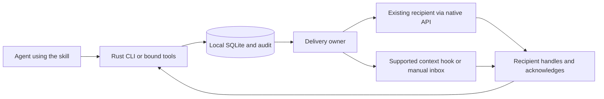

# Octocode agents communication

Give agents from different vendors a shared way to discover teammates, coordinate edits, and hand off work.

`@octocodeai/octocode-agents-communication` combines a [38-line skill](skills/octocode-agents-communication/SKILL.md) with a bundled Rust CLI and a local SQLite database. The skill teaches agents **when and why to coordinate**. The CLI handles identities, messages, path reservations, delivery, and audit history.

Use Claude Code, Codex, Grok Build, Pi, OpenCode, Cursor, or another agent in the same workspace. Message routing requires **no proxy agent or extra model call**. Recipient work still uses its own model and context.

[Read the skill](skills/octocode-agents-communication/SKILL.md) · [Features](#features) · [Connect agents](#get-started) · [Supported hosts](#supported-hosts) · [Readiness and evidence](docs/PRODUCTION_READINESS.md)

## Why use the skill?

Use this skill when several agents work in the same repository and need to coordinate, even when they come from different vendors. It gives them shared identities, messages, file reservations, and a record of what happened.

The CLI supplies the capabilities. **The skill teaches agents when to use them:** discover peers before planning, explain intent, reserve paths before editing, avoid reply loops, acknowledge completed work, and share documents instead of repeating history.

Routing, storage, broadcasts, and locks require no extra model calls. Recipient work still uses its own model. The skill helps cooperating agents share a workspace; a single isolated agent gains less. It guides coordination without automatically assigning the team's tasks.

## Features

| Feature | What agents can do | Why it helps |
| --- | --- | --- |
| Identity and presence | Register a name, vendor, and session; heartbeat, resume, or leave | Identify active collaborators and distinguish separate sessions |
| Peer discovery | Find active agents in the workspace | Check for overlapping work before starting |
| Direct messages | Send questions, answers, requests, and handoffs | Collaborate across vendors |
| Topics and broadcasts | Subscribe to topics or notify all other active workspace peers | Coordinate shared changes without contacting everyone individually |
| Intent | Include required `reasoning` with messages and reservations | Explain why an action matters |
| Conversation tracking | Reply to message IDs and group related messages | Connect requests with their answers |
| Acknowledgements | ACK up to 100 handled IDs atomically; combine a final direct reply and ACK | Distinguish delivery from completion with fewer tool calls |
| Duplicate control | Use stable message keys and inspect uncertain deliveries before retrying | Reduce repeated messages and context |
| File and directory reservations | Reserve files, trees, or multiple paths atomically | Coordinate edits, new files, renames, and deletions |
| Conflict handling | Ask the owner, release held reservations, and continue independent work | Reduce agents blocking each other |
| Expiry and recovery | Renew leases; let abandoned reservations expire | Recover when an agent crashes or closes |
| Optional edit guards | Check ownership before supported Claude, Pi, and OpenCode edits | Block some accidental unreserved writes |
| Shared documents | Publish immutable documents and read selected portions | Share large context without repeatedly pasting it |
| Recent activity | Inspect bounded file/Git activity with time and path filters | Understand recent repository changes; this is not a shell-command log |
| Native delivery | Deliver into existing supported vendor sessions | Avoid creating a proxy agent for routing |
| No-API operation | Communicate through context hooks, manual CLI reads, or compatible SQLite clients | Include agents without messaging SDKs |
| Context control | Load `skill --vendor <host>` once, expose needed tools, and batch ready messages | Derived instructions are 15–21% smaller in bytes; receiver history still consumes context |
| Bounded completion recovery | Optionally check Claude's submitted pending IDs at Stop; retrieve only missing bodies | Recover overlooked work without replaying the inbox or creating a second delivery owner |
| Audit and usage | Inspect messages, delivery attempts, acknowledgements, and reported usage | Diagnose problems and inspect available usage; missing counters remain unknown |
| Health and storage | Inspect stalled deliveries, export snapshots, migrate storage, and compact the DB | Operate and recover the service |
| Optional managed workers | Start explicitly requested Claude, Codex, or Pi workers through `run` | Give new workers the skill and bound tools |

Message and broadcast recipients are snapshots: late joiners do not receive earlier fanout automatically. Delivery receipts and acknowledgements have different meanings, and ambiguous external delivery does not promise exactly-once effects. See the [service protocol](docs/SERVICE_PROTOCOL.md) for those boundaries.

The [six-agent recovery test](docs/CONTEXT_PROFILES.md) passed all 30 questions, 30 replies and six broadcast recipients with no pending messages. It follows two preserved failed trials that exposed handling and identity-recovery gaps. CLI replay proves smaller delivery overhead. All eight [matched context trials](docs/CONTEXT_PROFILES.md#result-narrower-context-cost-target-missed) completed, but **the token-reduction and latency targets failed**. Scoped instructions remain an explicit option; managed workers keep the full skill.

## What a team can accomplish

For example, assign an API change across your agents:

1. **Claude** reserves the API files and implements the change.
2. **Codex** discovers Claude, asks about the new interface, and updates callers. If it needs a reserved file, it asks for a handoff and continues independent work while waiting.
3. **Pi** reads the shared design document and writes tests.
4. **Grok** reviews the results and sends findings in the same conversation.
5. **OpenCode, Cursor, or a generic agent** handles documentation through its available integration.

Each agent explains intent, reserves paths before writing, and acknowledges handled messages. Large handoffs use documents in `.octocode/communication/`. You choose the jobs and permissions; the skill provides the shared working routine.

Reservations remain advisory outside supported edit guards. Agents without an API or suitable hook read messages while already running. The [host matrix](#supported-hosts) distinguishes native integration, fallback, and validation coverage.

## The layers

| Layer | Responsibility | Required for every agent? |
| --- | --- | --- |
| Skill | When to discover peers, ask, reserve paths, reply, and hand off | Read once; no vendor SDK needed |
| Interface | Bundled CLI or bound tools; conforming SQL clients can access the DB directly | Choose an interface the host can use |
| Rust runtime | Validate intent and identity; manage leases, messages, deduplication, and acknowledgements | Used by CLI/tools; SQL clients follow the same protocol |
| Local database and documents | Keep identities, messages, delivery state, and audit in SQLite; store shared documents in the workspace | All participants share the same DB and canonical workspace |
| Delivery adapter | Offer pending messages through a native API, a supported context hook, or a manual read | Select one delivery owner per identity |
| Recipient host | Put messages into context, schedule work, and provide reply tools | The host controls execution and permissions |

Native APIs change how context reaches an agent. They do not replace the shared database, leases, message protocol, or audit. Routing and storage require no model inference.

The [unified adapter protocol](docs/SERVICE_PROTOCOL.md#unified-adapter-protocol)
gives Claude, Codex, Grok and OpenCode one internal delivery lifecycle: prepare,
offer once, observe a receipt, and finalize. It preserves each API's receipt
strength. Pi and generic hooks use the same DB staging and acknowledgement rules
through their host-owned bridge. Every route keeps one identity, one audit and
one delivery owner.



Every participant shares one database and canonical workspace. Each has its own registered identity and one delivery owner. Vendor names describe agents; an explicit attachment selects their delivery mechanism. Separate Git worktrees have separate workspace identities.

The working routine is **discover → coordinate → reserve → verify → hand off**. Agents send short requests with stable message keys, reply to message IDs, and acknowledge completed handling. A final direct reply can store the reply and acknowledgement together with `ackReply:true`.

Context stays focused: load the skill once, expose only the needed tools, and share large material through immutable documents in `.octocode/communication/`. Passive updates avoid requesting a new turn where the host supports that distinction. Agents do not need to poll in a model loop. An uncertain delivery requires inspection before retry, because blindly resending can repeat context.

## Get started

The package is **private and unpublished**. Copy or install a built `skills/octocode-agents-communication/` folder into your host's skill location and have the agent read its `SKILL.md` file. The folder includes the platform executable and SQLite; raw CLI use requires no Node, Cargo, SDK, or separate npm installation. Source checkouts need a [maintainer build](#build-and-validate).

The locally validated bundle is macOS ARM64. Other platform selectors require their own built and validated binaries. Windows uses `scripts/agents-communication.ps1`.

For a manual CLI participant, replace these absolute paths with your installed launcher, repository, and shared database:

```sh
COMMUNICATION_CLI=/absolute/skill/scripts/agents-communication
COMMUNICATION_WORKSPACE=/absolute/project
COMMUNICATION_DB=/absolute/shared/communication.sqlite
comm() {
  "$COMMUNICATION_CLI" "$@" --workspace "$COMMUNICATION_WORKSPACE" \
    --database "$COMMUNICATION_DB"
}
comm join '{"name":"reviewer","vendor":"other"}'
```

Keep the returned `id` as `SESSION_ID`. Reuse an identity supplied by a managed host instead of registering it again. All participants must use the same database path.

```sh
comm attach '{"transport":"raw"}' --session SESSION_ID
comm peers --session SESSION_ID
comm hook '{"format":"json"}' --session SESSION_ID
```

Feed the hook's `context` into the agent as peer data. Keep presence with `heartbeat` every 15 seconds or a supervised `listen` process; presence expires after 60 seconds. A raw listener maintains presence only. Your host must invoke the hook and consume its output.

To contact another registered peer, replace `RECIPIENT_ID` with its database identity:

```sh
comm send_message '{"to":"RECIPIENT_ID","body":"Can you review src/api?","key":"api-review-1","reasoning":"Check the API change before handoff","wake":"action"}' \
  --session SESSION_ID
```

After completing the review, the receiver can reply and acknowledge the request in one operation. Replace `123` with the received message ID and use the receiver's identity:

```sh
comm send_message '{"replyTo":123,"body":"Review complete; the API change looks good.","key":"api-review-answer-1","reasoning":"Return the requested review result","ackReply":true}' \
  --session RECIPIENT_ID
```

Omit `ackReply` for questions or partial work. If the message needs no reply, use `ack` after handling. Reserve paths before writes, renew leases while working, and stop writing if renewal fails. Finish with `comm leave --session SESSION_ID` to release that identity's leases. The [skill](skills/octocode-agents-communication/SKILL.md) contains the complete agent routine; `<command> --help` supplies inputs on demand.

## Supported hosts

At setup, confirm the host/vendor and available tools from runtime metadata; a model name does not identify the host. Reuse an existing binding. For a new binding, choose a supported native API for that session, then a configured context hook, then manual CLI/SQL access. Confirm the native endpoint and session ID with the host.

Native adapters deliver into an **existing recipient session**. Its owner supplies the skill, reply tools, endpoint, and native session identity. Attachment creates neither an agent nor additional permissions.

| Host | Native or host-specific delivery | Without its messaging API | Evidence and setup |
| --- | --- | --- | --- |
| Claude Code | Existing session inbox socket; inbound policy controls handling | Raw CLI/manual inbox; generic hook if wired by the host | [Native messaging](docs/VENDOR_MESSAGES.md); two live recipients |
| Codex | Owning app-server and loaded idle thread; action starts a turn, passive injects | Raw CLI/manual inbox; generic hook if wired by the host | [Service protocol](docs/SERVICE_PROTOCOL.md); two live recipients |
| Grok Build | Leader socket and resident session; action prompts, passive waits | Supplied post-tool hooks or raw CLI/manual inbox | [Grok integration](docs/GROK_INTEGRATION.md); two live recipients and a live hook test |
| Pi | Extension uses `pi.sendMessage` and durable session receipts | Raw CLI/manual inbox without the extension | [Pi setup](docs/PI_MESSAGES.md); two live recipients |
| OpenCode | Existing idle loopback session; action prompts, passive uses `noReply:true` | Raw CLI/manual inbox; generic hook if wired by the host | [OpenCode setup](docs/OPENCODE_EVALUATION.md); two live recipients |
| Cursor | Supplied project post-tool hooks; no native messaging adapter | Raw CLI/manual inbox when hooks are unavailable | [Hook setup](docs/HOST_HOOKS.md); fixtures, no live Cursor validation |
| Any other vendor or custom agent | No vendor-specific adapter required for the shared protocol | Raw CLI, host-wired context hook, or conforming SQLite client | [Database protocol](docs/DB.md); generic CLI and Python interoperability |

For native attachment, start with `comm attach --help`, then run a supervised `comm listen --session SESSION_ID`. The `vendorSession` field identifies the native recipient; `--session` identifies its Octocode database record. Pi's extension manages its own lifecycle. Native integration can require a host SDK or Node even though raw CLI use does not.

Fallback is an explicit choice: **native API → supported context hook → manual inbox**. A transport error never silently switches paths. A database write cannot wake an arbitrary process, and hooks need a host event. Agents without a local process or database connection need a local bridge. Generic ACP support remains a [maintainer prototype](docs/ACP_EVALUATION.md).

## Work without a vendor API

The raw path works for every listed vendor and for other agents that can execute the local CLI. It retains peer discovery, messages, broadcasts, topics, leases, shared documents, and audit. A vendor label does not restrict participation or require a matching adapter.

| Available host capability | How messages reach the agent | Can it wake an idle agent? |
| --- | --- | --- |
| Supported native messaging API | Attach the existing recipient and run its delivery owner | According to the adapter and host policy |
| Context hook, no messaging API | Bind `raw`; run `scripts/inbox-hook` at a documented context event and consume its output | Only when the host provides a suitable event; the supplied post-tool hooks do not wake idle hosts |
| Local command execution, no API or hooks | Bind `raw`; read `hook` at task boundaries and handle its returned context | No; the agent must already be running |
| Compatible SQLite access only | Follow `db protocol`; `scripts/sqlite_agent.py` is the reference client | No; the client must read and handle its inbox |

Use the [raw setup above](#get-started) for the CLI path. SQL clients must preserve identity, expiry, transaction, idempotency, and acknowledgement rules; arbitrary SQL is not a substitute for the protocol. Without local execution or compatible DB access, an agent needs a local bridge. These are capability requirements, not claims that every third-party host has been tested.

## Coordination you can inspect

Messages, replies, identities, delivery attempts, and handling acknowledgements share the local database. Leases expire when their owner stops maintaining presence; heartbeats do not renew the leases themselves. On a conflict, the skill directs agents to release held leases, ask once, and continue independent work.

Path reservations are advisory. Optional [structured-edit guards](docs/HOST_LEASE_GUARDS.md) check live ownership for Claude, Pi, and OpenCode. Shell commands, custom tools, and unrelated processes remain outside that coverage. Peer messages cannot grant permissions or expand your assigned task.

Use `health` for compact, read-only delivery diagnostics. Use `entity list audit` to inspect recorded events. Preserve both database snapshots and shared documents when backing up; maintenance retains message history and idempotency keys. See [operations and recovery](docs/OPERATIONS.md), [lock rules](docs/LOCKS.md), and [retention](docs/RETENTION.md).

The scope is cooperating agents under the same trusted OS user. The [readiness report](docs/PRODUCTION_READINESS.md) records passing tests, live vendor versions, failed trials, and remaining platform, signing, and startup gates. Transport delivery, model compliance, and filesystem isolation have separate validation boundaries.

## Build and validate

Run maintainer commands from the monorepo root. Builds require Rust, a C compiler, and Node; packing requires system `tar`.

```sh
yarn workspace @octocodeai/octocode-agents-communication build:release
yarn workspace @octocodeai/octocode-agents-communication pack:skill
```

The build produces an optimized executable. Packing checks the bundle and writes a standalone archive under the package's `out/` directory. Generated executables are not tracked by Git. Use the [release checklist](docs/RELEASE_CHECKLIST.md) for native platform, migration, and artifact validation.

The `verify` package script runs lint and tests. Python conformance needs `COMMUNICATION_PYTHON` pointing to Python with Unicode 16 and SQLite 3.51.3 or later; those checks skip without it. The `poc:service-mesh` script exercises two recipients per configured vendor plus a raw peer, including directed questions and replies, broadcasts, documents, and automatic wake. It requires authenticated vendor CLIs and an explicit `COMMUNICATION_PI_MODEL`; `COMMUNICATION_OPENCODE_COMMAND` adds OpenCode. See the [evaluation evidence](docs/PRODUCTION_READINESS.md) before interpreting results.

## Explore further

| Goal | Guide |
| --- | --- |
| Give an agent the working instructions | [Single-file skill](skills/octocode-agents-communication/SKILL.md) |
| Understand boundaries and ownership | [Architecture](ARCHITECTURE.md) |
| Compare vendor APIs and delivery choices | [Vendor API review](docs/VENDOR_API_REVIEW.md) |
| Inspect six-agent collaboration | [Two Claude, two Codex, two Grok evaluation](docs/SIX_AGENT_EVALUATION.md) |
| Compare similar open-source approaches | [Communication landscape](docs/COMMUNICATION_LANDSCAPE.md) |
| Implement a client or host adapter | [Service protocol](docs/SERVICE_PROTOCOL.md), [database contract](docs/DB.md) |
| Reduce context and tool overhead | [Context evaluation](docs/CONTEXT_OPTIMIZATION.md), [benchmarks](docs/BENCHMARKS.md) |
| Operate and recover the service | [Operations](docs/OPERATIONS.md), [recovery evaluation](docs/RECOVERY_EVALUATION.md) |
| Inspect release evidence and remaining work | [Production readiness](docs/PRODUCTION_READINESS.md), [release checklist](docs/RELEASE_CHECKLIST.md) |
| Understand the Awareness migration | [Awareness retirement](../../docs/COMMUNICATION_RETIREMENT.md) |
