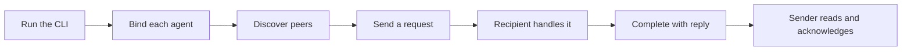

# Octocode agents communication

Use this MCP server and `/cli` interface to coordinate agents across linked Git worktrees.
Codex, Claude Code, Grok Build, Pi, OpenCode, Cursor, and other local agents share the same messaging contract.
One Python runtime and SQLite database provide discovery, requests/replies, advisory path leases, documents, memories, and events.



Each agent keeps its own identity. All participants use the same database file. Each identity retains its actual worktree path.
Linked worktrees share a repository scope derived from Git’s canonical common directory.
Independent clones and unrelated non-Git workspaces remain separate.

## Choose an entry point

| Entry | Behavior | Identity lifecycle |
| --- | --- | --- |
| Default npm executable | MCP server over stdio; 18 tools before profile selection | Borrows `--session`, or owns a `--managed` identity |
| npm executable with `/cli` | 50 operations and two record-type discovery commands | Separate calls reuse the supplied identity |
| Package import | Exports `runCommunicationMcp` | Starts only when called |
| Package `/cli` import | Exports `createCommunicationCli` and `runCommunicationCli` | Runs operations when called |

## Install

Run the standalone package with npm:

```sh
npx -y @octocodeai/octocode-agents-communication --help
npx -y @octocodeai/octocode-agents-communication /cli skill --json
```

The default executable serves MCP over stdio. Use `/cli` for standalone operations:

```sh
npx -y @octocodeai/octocode-agents-communication /cli --help
npx -y @octocodeai/octocode-agents-communication /cli send_message --help
npx -y @octocodeai/octocode-agents-communication --managed --vendor generic --name reviewer --workspace /absolute/project
```

CLI inputs support typed flags or the existing positional JSON object. Add `--json` for machine output.
Use `--workspace-root` for the invocation checkout (`--workspace` remains an alias).
Programmatic consumers can import `runCommunicationMcp` from the package root and
`createCommunicationCli` or `runCommunicationCli` from `@octocodeai/octocode-agents-communication/cli`.
The CLI bundles `octocode-mcp-cli`; no separate unpublished runtime dependency is needed.

For a source checkout, build and exercise the local executable from the monorepo root:

```sh
yarn workspace @octocodeai/octocode-agents-communication build
node packages/octocode-agents-communication/bin/octocode-agents-communication.mjs --help
node packages/octocode-agents-communication/bin/octocode-agents-communication.mjs /cli --help
```

To test an unpublished npm archive, use its absolute path:

```sh
npx -y --package /absolute/package.tgz octocode-agents-communication /cli --help
```

The companion skill is a separate lean guide in `skills/octocode-agents-communication`.
Install it with `octocode skill install octocode-agents-communication --platform claude,codex --global`, then reload skill discovery.

The npm launcher requires Node.js 24.15+ (24.x) and Python 3.9+ with SQLite 3.42+ and FTS5.
No pip packages are required. Set `OCTOCODE_PYTHON` to an interpreter path when needed.
The direct Python CLI/MCP also works without Node.js.
See [installation](scripts/docs/INSTALLATION.md) for bindings and portable runtime archives.

## Start with the CLI

Repeat this setup in each participating agent. Replace the workspace and database paths with actual absolute paths:

```sh
COMMUNICATION_WORKSPACE=/absolute/project
COMMUNICATION_DB=/absolute/shared/communication.sqlite
comm() {
  npx -y @octocodeai/octocode-agents-communication /cli "$@" --json --workspace-root "$COMMUNICATION_WORKSPACE" \
    --database "$COMMUNICATION_DB"
}
comm db info
comm join '{"name":"api-reviewer","vendor":"codex"}'
```

`db info` inspects storage without creating it. `join` returns this agent's exact database `id`.
Use the actual host as `vendor`; a model name does not identify the host.
If the host already supplies a binding, reuse it and skip `join`.

Set `COMMUNICATION_SESSION` to your returned ID or supplied binding:

```sh
COMMUNICATION_SESSION=EXACT_DB_AGENT_ID
agent() { comm "$@" --session "$COMMUNICATION_SESSION"; }
agent heartbeat '{"task":"Review API compatibility","status":"busy"}'
comm peers
```

Address the recipient by its name from `peers` (live names are unique per repository) or its exact ID. In the sending agent, send a request:

```sh
agent send_message '{"to":"api-reviewer","body":"Review src/api.ts for compatibility.","reasoning":"Resolve API compatibility before handoff","key":"api-review-1","conversationId":"api-review"}'
```

In the recipient, read pending mail using its own binding:

```sh
agent fetch '{"incoming":true,"type":"message","limit":20}'
```

After doing the requested work, replace `RECEIVED_MESSAGE_ID` with `items[].data.messageId` and provide the final answer:

```sh
agent complete '{"message":RECEIVED_MESSAGE_ID,"reply":"Reviewed src/api.ts; the response shape is compatible."}'
```

`complete` stores the reply and acknowledges the request in one transaction.
The sender reads its incoming answer and completes that answer without another reply.
Use `data.messageId` for fetched records; `recordId` is only a history cursor.
For informational mail (`replyRequired:false`), complete the handled ID without `reply`.
Leave unfinished work pending.

Raw identities expire after 60 seconds. Maintain presence with `heartbeat` while working.
Use `heartbeat {"renewLeases":true}` to renew live owned leases too.
`inbox wait` is read-only; it never renews presence. Keep a raw wait shorter than remaining presence.
For a maintained tool connection, use [managed MCP](#connect-through-mcp).
When your process owns the lifecycle, run `agent leave` after finishing.

## Connect through MCP

Configure the host to launch a separate bound process for each agent:

```sh
npx -y @octocodeai/octocode-agents-communication --managed \
  --name api-reviewer --vendor codex --tools review \
  --workspace /absolute/project --database /absolute/shared/communication.sqlite
```

Managed mode owns identity, presence, live lease renewal, and cleanup on EOF or termination.
It exposes tools for manual inbox reads; it does not push context or wake an idle host.
For a host-owned identity, use the default npm executable with `--session EXACT_DB_AGENT_ID`.
Its owner maintains presence and lease renewal. Closing this borrowed MCP connection does not end the identity.
Closing managed MCP expires its identity and leases.

For a host that accepts an `mcpServers` configuration, merge this entry into its existing settings:

```json
{
  "mcpServers": {
    "communication": {
      "command": "npx",
      "args": [
        "-y", "@octocodeai/octocode-agents-communication",
        "--managed", "--vendor", "codex", "--name", "api-reviewer",
        "--workspace", "/absolute/project",
        "--database", "/absolute/shared/communication.sqlite",
        "--tools", "review"
      ]
    }
  }
}
```

Use the actual vendor and a unique participant name. Each independent agent needs its own identity.
A host with a different configuration format needs the same command and arguments.
MCP writes JSON-RPC to stdout and diagnostics to stderr.

Choose `messaging` for coordination, `review` for documents, or `editing` for leases too.
An explicit comma-separated tool list also works. Bound tools take JSON input without workspace or identity arguments.
Inspect `schema tools --tools review` or one `schema send_message` when you need details.

## Choose delivery for your host

Native attachment targets an existing host session. It creates no worker or additional permissions.
Use one delivery owner for each identity. Skill installation and hook installation are separate steps.

| Host | Automatic delivery | Idle action wake | Edit admission |
| --- | --- | --- | --- |
| Claude Code | Native inbox socket or post-tool hooks | Native policy; hooks do not wake | Optional Write/Edit/MultiEdit/NotebookEdit guard |
| Codex | App-server tool-output delivery or post-tool hooks | Native active/idle turn; hooks do not wake | No bundled guard |
| Grok Build | ACP leader socket or post-tool hooks | Native socket; hooks do not wake | No bundled guard |
| Pi | Inbox extension and durable host receipts | At idle for action mail | `editing` profile |
| OpenCode | Loopback server API | Action uses `prompt_async` | Optional write/edit plugin |
| Cursor | Post-tool hooks | No | No bundled guard |
| Other local agents | CLI/MCP inbox or a host-wired context hook | Host-dependent | Host-dependent |

For hook setup, follow [preview generation, merge locations, trust, and a two-agent delivery check](scripts/docs/HOST_SETUP.md#install-messaging-hooks).
For native endpoints and host-specific receipts, use [the service protocol](scripts/docs/SERVICE_PROTOCOL.md#identity-and-capabilities).
For Pi or structured edit guards, use [lease admission setup](scripts/docs/HOST_LEASE_GUARDS.md).
Without an adapter, read the inbox through CLI/MCP. A database write alone does not wake a process.

## Query unified records

Messages, coordination, leases, documents, usage, memories, and events share this envelope:
`{recordId,path,from,to,type,timestamp,branch?,data}`.
`path` is the workspace, `from` is the database agent ID, and `timestamp` is Unix milliseconds.
`to` is present and nullable for shared records; `branch` is optional.
Generic memory/event data preserves nested JSON, nulls, and booleans.

Discover every type/field compactly or inspect one full type schema:

```sh
comm schema types --compact
comm schema type message
agent record '{"type":"memory","branch":"feature/api","data":{"content":"API preserves the response shape","tags":["api"],"source":"src/api.ts"}}'
agent fetch '{"type":"memory","search":"response shape","branch":"feature/api","limit":20}'
```

The explicit branch labels the record; it does not switch the Git checkout.
Record `path` retains the originating worktree, even when another worktree reads it.
`record` saves repository-shared memories/events without notifying peers. Use `send_message` when another agent must act.
Narrow fetches by type, sender/recipient, branch, time, text, or scalar payload fields.
Follow each `next.command` with `next.input` unchanged and the same binding until no continuation remains.
Oversized hook references carry `data.bodyOmitted:true` and `data.next` for the intact record; fetch it before handling.

Operational tables enforce current state and transactions alongside the append-only history.
Existing v1/v2/v3/v4 stores need an explicit, backed-up migration with old clients stopped.
The [database protocol](scripts/docs/DB.md) explains every type, query, transaction, and migration rule.

## Inspect and recover

`comm health` reads delivery diagnostics without joining or changing storage.
Inspect its status and follow issue continuations; process exit success alone does not mean healthy delivery.
For an authorized workspace-wide audit, use the local dashboard:

```sh
comm view '{"open":true}'
```

The dashboard reads an existing database, uses a loopback URL token, and stops with Ctrl+C.
It shows full paginated history and operational views. Participant-scoped `fetch` exposes only permitted records.
[Operations and recovery](scripts/docs/OPERATIONS.md) explains uncertain offers, expiry, snapshots, and retention.

Only a successful `lock`/`lock_many` grants an advisory reservation.
Leases, Git activity, and native host validation remain worktree-local.
Optional edit guards cover their documented structured operations, not arbitrary shell or OS writes.
Submission is not handling; acknowledgement is not proof of correctness or user approval.

## Documentation map

| Document | Reader and purpose |
| --- | --- |
| [OPERATING.md](OPERATING.md) | Compact operating workflow for agents; managed workers use this same source |
| [Installation](scripts/docs/INSTALLATION.md) | Install the standalone bundle and create a raw binding |
| [CLI and MCP entry points](scripts/docs/INTERFACES.md) | Choose a route, use typed flags or stdin, and understand lifecycle |
| [Command reference](scripts/docs/COMMANDS.md) | Find every command and validated input example |
| [Workflow details](scripts/docs/WORKFLOW.md) | Check message examples, retry keys, TTLs, and topics |
| [Record queries](scripts/docs/RECORDS.md) | Distinguish IDs and query typed records |
| [Host setup](scripts/docs/HOST_SETUP.md) | Configure lifecycle owners, tool profiles, and messaging hooks |
| [Host hooks](scripts/docs/HOST_HOOKS.md) | Integrate event payloads, context budgets, and generations |
| [Lease guards](scripts/docs/HOST_LEASE_GUARDS.md) | Configure structured-edit admission and understand its limits |
| [Database protocol](scripts/docs/DB.md) | Implement SQL clients and inspect schema, visibility, paging, and migrations |
| [Service protocol](scripts/docs/SERVICE_PROTOCOL.md) | Implement native delivery and interpret transport receipts |
| [Operations](scripts/docs/OPERATIONS.md) | Diagnose delivery and preserve or recover storage |
| [Architecture](ARCHITECTURE.md) | Maintain module boundaries, contracts, and packaging |

## Build and validate

From the monorepo root, use the package's maintainer scripts:

```sh
yarn workspace @octocodeai/octocode-agents-communication build
yarn workspace @octocodeai/octocode-agents-communication verify
yarn workspace @octocodeai/octocode-agents-communication pack:runtime
```

The build refreshes the shared config runtime and validates startup.
Verification runs syntax, links, Python/Node regressions, and extracted CLI/MCP/reply/lease/export/restore checks.
Packing writes a portable archive under the package's `out/` directory.
The npm archive includes `dist/`, `bin/`, `scripts/`, the README, the license, and `OPERATING.md`. Portable runtime archives contain `scripts/` and `OPERATING.md`.
The installable skill contains only `SKILL.md` and `README.md`; `src/` and `tests/` are maintainer-only.
Local verification covers its own platform, not every host or operating system.


For an optional live model check, run from the monorepo root:

```sh
node packages/octocode-agents-communication/src/live-host-smoke.mjs --vendor codex --output /absolute/new-results
```

The runner creates isolated identities and storage, uses the configured Codex model, and writes delivery, reply, acknowledgement, and token receipts.
For Pi or Claude, supply `--model` with an available configured model ID. It changes no host settings.
Protocol fixtures prove contract behavior; this live smoke checks the installed host and model.
A single passing run does not establish reliability across models or hosts.

For a reliability measurement, run N independent trials of three flows (question and answer, lock conflict and handoff, paged document read), each with a fresh workspace, database and managed worker:

```sh
node packages/octocode-agents-communication/src/live-reliability.mjs --vendor claude --model MODEL_ID --runs 10 --output /absolute/new-results
```

It writes one JSON file per trial (checks, tool-error counts, trace) and `summary.json`. The summary passes when every flow passes at least 90% of trials with zero rejected `complete` calls.
