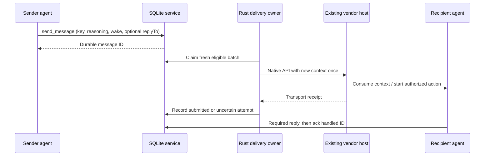

# Native Grok delivery and cross-vendor wake

Grok joins the same SQLite identity, message, lease and audit protocol as Claude,
Codex, Pi and raw clients. Its native adapter sends new peer context to an existing
resident session. It creates no sender model, proxy agent, leader or recipient.
The implementation was checked against Grok Build CLI 1.0.41 (4220f3b224a6) on
macOS arm64. The same-user Unix socket transport is not a Windows transport.

## Layer contract



SQLite is the common protocol, not a competing vendor conversation store. API
receipts and handling acknowledgements remain separate. An acknowledgement may
arrive before a vendor finishes its turn. An ambiguous delivery is never replayed
automatically; inspect the existing recipient and dispatch audit first.

## Binding an existing Grok recipient

Register the agent using `join`, then bind its DB identity using:

```sh
agents-communication attach '{"transport":"grok","endpoint":"/absolute/leader.sock","vendorSession":"EXISTING-SESSION-UUID"}' --session DB-SESSION-ID
agents-communication listen --session DB-SESSION-ID
```

Use the same explicit `--workspace` and `--database` binding across participants.
The owner must already have configured the recipient's Octocode CLI/MCP tools.
`attach` does not install tools, grant permissions, or discover unrelated sessions.
One delivery owner per DB identity is required. `dispatch` waits for one submitted
batch; `listen` services further arrivals and renews presence while waiting.

The adapter validates a non-symlink socket owned by the OS user, a UUID session,
leader IPC version 1 and ACP version 1. Frames are length-prefixed JSON, limited to
8 MiB. Partial reads survive timeouts. Registration/initialization share a
10-second deadline; prompt completion has a 300-second deadline and bounded polls.
Disconnects, invalid receipts and shutdown after staging become uncertain attempts.

It invokes **`session/prompt` directly**, with a dispatch token as `promptId` and
`verbatim:true`. It never calls `session/new`, `session/resume` or `session/load`.
Source inspection and a live second-connection probe found that resume can replace
the resident session's MCP server configuration. Direct prompt preserved the
owner's MCP receipt tool and executed it exactly once.

Passive-only mail stays in SQLite for Grok and Claude. An actionable batch permits
the existing recipient to run. Codex checks that its thread is loaded and idle,
then uses `turn/start` with context once; passive delivery uses `thread/inject_items`.
Pi injects canonical Rust-rendered context with `pi.sendMessage`, wakes only for a
new action batch at idle, and confirms its durable native message record. Busy
recipients defer delivery; no new routing agent or duplicate history is needed.

Grok hooks remain a fallback: `PostToolUse` can inject context during active work,
but a hook cannot independently wake an idle process. Generic agents use a native
host injection hook when available, otherwise explicit CLI/SQLite inbox reads.
No database write alone can wake an arbitrary program. See [HOST_HOOKS.md](HOST_HOOKS.md).

## Verification and limits

`tests/grok-transport.test.mjs` covers delivery, passive gating, reply correlation,
ambiguous receipts, retries and protocol errors. Rust tests cover framing and
receipt handling; `tests/pi-inbox.test.mjs` covers idle/busy/startup and durability
races. The opt-in `scripts/service-mesh.mjs` uses two real agents per vendor plus a
raw client, sends every ordered pair a question, verifies tool-read document
evidence, correlates one reply per question, broadcasts, and checks all DB acks.
It retains native traces, executable/skill/harness hashes and a DB snapshot.

The harness allows startup prompts only; production listeners and the Pi extension
must wake recipients afterward. It also verifies passive messages start no turns.
Model usage is reported only where the native host provides counters; missing
counters are unknown. Persistent recipient conversations still consume context.
Zero routing inference does not mean zero recipient inference or unlimited cache.

Grok completion `_meta.usage` contains prompt aggregates; the outer metadata
contains last-request counters and is not substituted. The dispatcher records one
idempotent usage audit per completed batch with `scope:turn`, preserving observed
input/output/cache-read/cache-write fields. It never invents missing counters.

### Final validation — 2026-09-25

The release artifact `53208c17929a5d9ffdc5c6b4eb06a603af2024cc45a8274e186d79968a664890`
passed the [final native matrix](../../../.octocode/benchmarks/communication-service-mesh/results/2026-09-25T14-16-17.162Z/result.json).
The preceding successful matrix and the initial failed Grok receipt-format grader
are retained separately; no failed result was overwritten.

| Gate | Observed result |
| --- | --- |
| Real participants | Two each Claude Haiku, Codex Luna, Grok Build Fast and Pi Haiku, plus raw |
| Ordered question/reply pairs | 72 / 72, exactly one correlated answer each |
| Stored messages / handled deliveries | 154 / 162; zero pending or duplicate replies |
| Broadcast | All nine participants handled it |
| Native document reads | All eight model agents successfully read the shared document |
| Automatic wake | Zero host prompts after startup; passive messages started zero turns |
| Routing inference | Zero model calls; existing recipients performed the work |
| Question round | 45.22 seconds in this local integration run |
| Usage audit | Pi 41 request records; Grok 10 turn records; Claude 6 turn records; Codex 2 cumulative records |
| Verification | 140 JavaScript tests, zero skips (Python 3.14); 30 Rust tests; format and strict Clippy pass |
| Build/package | Full workspace development build; release skill build and portable skill archive pass |
| Shutdown | All test-owned child processes reaped; DB and documents preserved |

The [60-sample service benchmark](../../../.octocode/benchmarks/communication-service/results/2026-09-25T14-17-22.571Z/result.json)
measured warm MCP send median **0.33 ms**, p95 **3.85 ms**; fresh CLI send median
**12.72 ms**, p95 **16.04 ms**. These measure durable storage receipt, excluding
recipient inference. Concurrent local load was uncontrolled; this run establishes
no comparative speedup. The skill is 35 lines / 6,464 bytes, with command details
served on demand. Byte counts are not tokenizer measurements.

Context checks establish no duplicate delivery, unsolicited startup messages,
reply loops, replayed history, or manual inbox bypass in this matrix. They do not
prove vendor internals are minimal: Grok additionally discovered tools once per
session, and every recipient keeps its own conversation. Cross-platform behavior,
future vendor versions and disconnected/remote hosts remain outside this live test.

## Upstream evidence

- [Grok agent-mode guide](https://github.com/xai-org/grok-build/blob/main/crates/codegen/xai-grok-pager/docs/user-guide/15-agent-mode.md)
- [Versioned leader IPC contract](https://github.com/xai-org/grok-build/blob/f0e3be1100ef5252488e3be8bb0e91cf68d8c305/crates/codegen/xai-grok-shell/src/leader/protocol.rs)
- [Resume/session configuration](https://github.com/xai-org/grok-build/blob/f0e3be1100ef5252488e3be8bb0e91cf68d8c305/crates/codegen/xai-grok-shell/src/agent/mvp_agent/session_setup.rs#L1290)
- [Resident-session prompt path](https://github.com/xai-org/grok-build/blob/f0e3be1100ef5252488e3be8bb0e91cf68d8c305/crates/codegen/xai-grok-shell/src/agent/mvp_agent/acp_agent.rs#L997)
- [Per-prompt usage versus last-request usage](https://github.com/xai-org/grok-build/blob/f0e3be1100ef5252488e3be8bb0e91cf68d8c305/crates/codegen/xai-grok-shell/src/agent/mvp_agent/acp_agent.rs#L1579)
- [Codex app-server API](https://learn.chatgpt.com/docs/app-server)
- [Pi agent-session API](https://github.com/earendil-works/pi/blob/main/packages/coding-agent/src/core/agent-session.ts)
