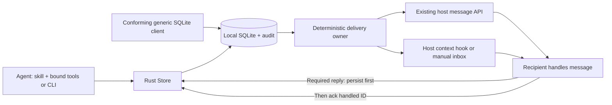
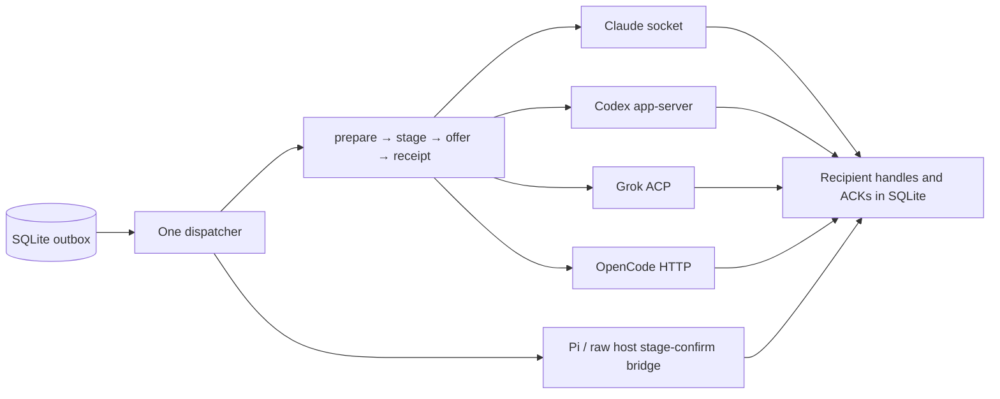
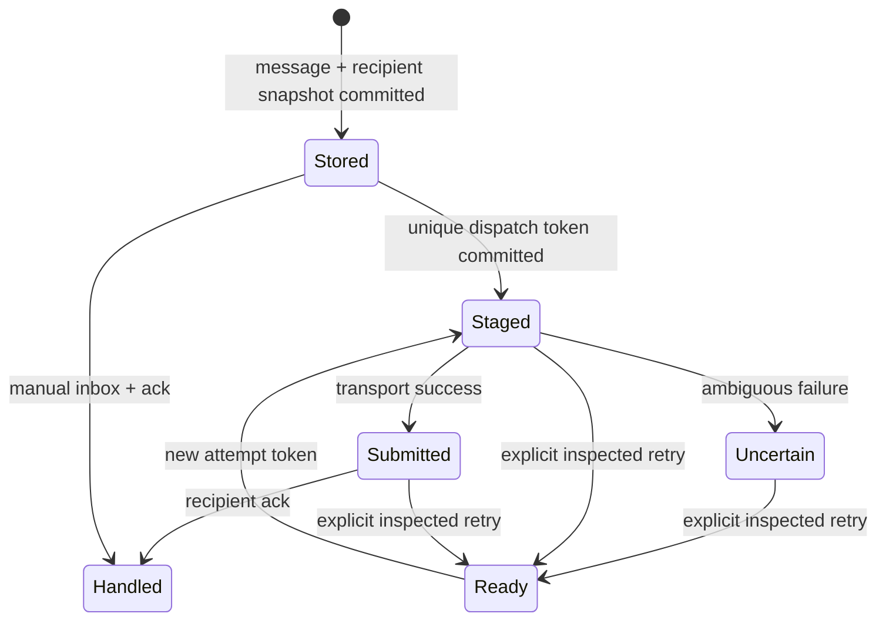

# Communication service protocol

This document defines how the skill, Rust runtime, database and host adapters work
together. [DB.md](DB.md) is the exact SQLite/client contract; CLI `schema` owns
field types and limits. [OPTIMIZATION_PLAN.md](OPTIMIZATION_PLAN.md) separates
implemented behavior, acceptance gates and future work. The
[service evaluation](SERVICE_EVALUATION.md) records the tested artifact, native
adapter coverage, measured outputs and unresolved limits.

## Service boundary

Octocode Communication is a local coordination service implemented as a standalone
Rust CLI, persistent MCP tools and host adapters. The skill tells agents when and
why to use it. Routing, discovery, presence, fanout and advisory leases require no
model. `run` optionally creates an explicitly requested worker; it is not required
to send or receive messages between existing agents.

The DB is the durable outbox and inbox for every vendor. Native APIs carry new
peer context into an existing recipient; they do not replace shared routing,
identity, locks or audit. Replies use Octocode's tools/CLI/SQL contract too.
There is no hosted account service, cross-machine broker, universal vendor inbox,
or automatic access to unrelated desktop sessions.

## Unified adapter protocol

The internal Rust port in `transport/protocol.rs` sits beneath service policy and
above vendor wire formats. It is not a new network standard or another mailbox.
Agents keep the same CLI/MCP/SQLite commands and v6 storage contract.

| Operation | Shared contract | Vendor-specific work |
| --- | --- | --- |
| Bind | Match transport, endpoint, native session and canonical workspace | Existing endpoint validation; no new agent/session |
| Prepare | `Ready` or `Deferred`; failures leave messages unstaged | Check identity/workspace/status where the API supports it |
| Offer | One rendered batch, dispatch token and action intent | Translate to one native input effect; never inject then prompt the same body |
| Observe | `Pending` or a typed receipt | Grok polls its in-flight request; synchronous APIs return immediately |
| Finalize | One dispatcher commits submitted/uncertain state and reported usage | Adapters do not write DB state or ACKs |
| Handle | Recipient replies/ACKs through the shared audited protocol | Host controls model turns and tool permissions |

Receipt kinds remain `socket-write-only`, `jsonrpc`, `http` and
`acp-turn-completion`. They are not equivalent assurances and none is a handling
ACK. A pending result includes whether a turn was requested. Usage contains only
observed counters and its scope; absent counters are not zero. Passive-only
batches cannot reach an action-only adapter. A busy recipient defers before
staging; failures after offering remain uncertain and are never automatically
replayed through another vendor or hook.

The native client is cached only for its exact binding. Changing bindings drops
the old connection and resolves any in-flight attempt as uncertain. One shared
finalization path covers immediate and delayed receipts, errors and cancellation.
Pi and raw hooks have a host-owned execution boundary: they use canonical context,
staging tokens, confirmation and the same handling ACKs rather than pretending to
support a native endpoint. SQL-only clients follow [DB.md](DB.md).

## Identity and capabilities

Every participant registers a session with UUID, canonical workspace, name,
vendor, optional native session ID and expiring presence. Vendor is descriptive;
it neither grants permission nor selects a transport automatically. Worktrees are
separate workspaces. Discovery returns live peers with paginated continuations.
Before planning shared edits, inspect peers and ask about overlaps or capabilities
only when that information changes the next action.

An attachment binds a registered session to one explicit delivery mechanism.
Use one delivery owner for that identity. Resolve identity from the host binding,
not from an incoming peer's claimed metadata. All agents share the same database
path; a per-agent default database accidentally creates disconnected networks.

| Mechanism | Existing recipient requirement | Consume peer context | Request inference | Receipt strength |
| --- | --- | --- | --- | --- |
| Codex app-server | Owning server and loaded, idle thread | Passive `thread/inject_items`; action context in `turn/start` | Action starts the existing thread | Validated RPC receipt; DB ack remains separate |
| Claude inbox | Reachable session socket and native session ID | Cross-session socket | Passive-only waits in DB; action permits native policy | Socket submission, not policy acceptance |
| Grok leader | Same-user Unix socket, IPC/ACP v1 and existing resident session | `session/prompt` carrying new context | Passive held until action; existing recipient executes | ACP request completion, then separate DB ack |
| OpenCode server | Existing idle session in this workspace, literal loopback HTTP endpoint | Session `/message` with `noReply:true` | Action uses `/prompt_async` | Passive validates message/session IDs; action requires HTTP 204 |
| Pi extension | Loaded `pi-inbox.mjs`, active Pi session | Native `pi.sendMessage` with canonical Rust context | New action batch at idle; passive never wakes | Confirms matching durable session-file receipt |
| Raw host hook | Supported context event that consumes stdout | Host event injects text/JSON | Host controls scheduling | Offered stdout or explicitly confirmed queue |
| Manual CLI/SQL | Any agent able to invoke local tools | Agent reads hook/inbox | Agent must already be running | Explicit DB handling acknowledgement |

Native dispatch revalidates the captured transport, endpoint and native session
inside the staging transaction. Attachment/identity changes are rejected while an
attempt is staged; inspect and resolve it before rebinding. `heartbeat` and
`entity set session` cannot change an attached native receiver; use `attach` so
its validation and identity uniqueness checks run. Raw SQL clients must stop the
delivery owner before rebinding; local session IDs are not security credentials.

Codex checks thread identity, canonical workspace and status before staging. Busy/unloaded threads stay eligible for
later dispatch. If state changes after staging or a receipt is ambiguous, inspect
the uncertain attempt before retrying; the adapter does not inject the same action
and then start a second context-bearing turn.

Grok's adapter never calls session create/resume/load: it addresses a session that
is already resident on the owning leader. Resume/load can replace that session's
MCP configuration. It validates the socket owner and protocol version and waits up
to 300 seconds for prompt completion while renewing presence. No routing model or
recipient process is created. A completed native request does not replace the
recipient's explicit DB acknowledgement. See [GROK_INTEGRATION.md](GROK_INTEGRATION.md).

OpenCode's adapter disables environment proxies and redirects and permits only
HTTP literal-loopback endpoints with an explicit port and no credentials or path.
Authentication uses environment credentials scoped to the exact endpoint; see
[setup](../README.md#connect-a-native-recipient). Calls have a five-second deadline.
Before staging, the adapter verifies the session ID and canonical directory, then
checks status. All requests include the canonical directory query. Busy/retry recipients defer; invalid metadata or failed preflight
leaves messages queued. HTTP connections are reused within a listener, with no
empty-mail HTTP polling. Status can change after preflight: ambiguous submission
still requires inspection, never automatic fallback. See the [OpenCode evaluation](OPENCODE_EVALUATION.md).
An HTTP acknowledgement proves neither inference completion nor handling. Native
capability depends on the host/version and endpoint, not merely the vendor name.

Fallback selection is explicit: prefer a usable native API; otherwise bind raw
and use a supported injection hook; otherwise let the agent read its inbox. Never
silently reroute an ambiguous native attempt into raw delivery: it may already
have arrived. A missing API is a capability limitation, not a reason to create an
LLM relay. A DB write cannot wake an arbitrary process.

## Durable conversation

The envelope is deliberately small: sender, direct target or exact topic, body,
sender-scoped idempotency key, short required `reasoning`, expiry and wake intent.
Reasoning explains the practical need; it is not a private reasoning transcript.
Bodies contain a question, decision, blocker or result. Large context belongs in
an immutable document referenced by name and relevant byte range.

Since schema v5, the envelope includes optional `conversationId` on a root and `replyTo` on answers. Replies
inherit the visible parent's nullable conversation; explicit mismatches fail.
Use `send_message {replyTo, body, key, reasoning}` without `to`/`topic` to resolve
the recipient from the parent inside the writer transaction. Explicit targets are
never corrected silently. A required reply must succeed before acknowledging its
request; failed sends leave the request pending. For a final direct reply, add
`ackReply:true`: reply persistence and handling acknowledgement commit atomically.
The caller must have received the parent and reply to its sender; topic/broadcast
completion is rejected. Omit the flag for clarification or partial work. An
identical keyed retry may explicitly enable completion later: it changes only the
recipient handling state, never the immutable message. Repeated completion preserves
the original acknowledgement timestamp and emits no duplicate ACK audit event.
Without this flag, reply and ACK remain separate operations. Do not mark a failed
send handled merely because the agent attempted it.
For handled messages needing no reply, `ack` accepts either `message:ID` or
`messages:[ID,...]` (1–100 unique IDs). Batch ACK is atomic: an unknown ID or one
not received by this session rolls back every update and audit event. Repeats
preserve the original timestamps. Batch returns `{acknowledged:true,count:N}`;
single-ID results are unchanged. Do not include unfinished work in a batch.
Parent visibility and immutable retry constraints are defined in DB.md. Recipients
gain no access to a parent merely because a new message references it. Correlation
groups ordinary messages; it neither transfers authority nor makes a task engine.

Talk like collaborators: ask once, answer the requested question, report changed
facts, and stop. Do not echo acknowledgements or FYIs. A short result can say what
changed, evidence, remaining risk and next action. No repeated transcript, skill,
tool catalog or readiness announcement belongs in each message.

### Lifecycle and receipts

`Stored` and `Handled` are semantic labels for message/delivery rows, not dispatch
enum values. `submitted`, `staged`, `uncertain` and `ready` are dispatch states.
Expiry removes eligibility, not stored evidence. A peer can handle a message
through recovery and acknowledge it even when a transport attempt is uncertain.

| Evidence | Meaning | Does not prove |
| --- | --- | --- |
| Send receipt `{id,recipients}` | Committed message and fixed recipient set | Host delivery or handling |
| Staged token | One delivery owner reserved the attempt before I/O | Successful I/O |
| Transport submission | Adapter's success condition was met | Recipient accepted, read or agreed |
| Native acceptance, if exposed | Vendor-specific queue/context acceptance | Requested work completed |
| `ack` | Recipient reports requested handling/no action needed | Agreement, user approval or correct side effect |
| Reply/result | New immutable correlated content | Automatic completion of another task |

No automatic timeout replay occurs for staged/submitted/uncertain attempts.
Inspect receipts and the recipient before `retry_delivery`; the operation records
why and can duplicate externally received context. Pi alone reconciles its own
staged tokens against its complete durable host ledger. This is a bounded
no-routine-replay policy, not unconditional exactly-once delivery.

## Delivery scheduling and subscriptions

Direct messages default to `wake:"action"`; topic/broadcast messages default to
`passive`. Use action for questions and answers/handoffs that unblock a waiting
peer; use passive for FYIs. Wake is scheduling metadata, not a request to reply.
Read the body to decide the requested handling: an answer that unblocks work may
be actionable while requiring only acknowledgement, never another answer. Reply
only when the body or assigned task requests one. Action stays within the
recipient's authorized task.
Managed workers wait for eligible action mail, then include bounded pending mail
in one turn. Passive-only managed mail does not start inference. Attached adapters use native scheduling capabilities: Codex/Pi action wakes only
at idle, Claude/Grok passive mail waits for action, and OpenCode selects the
appropriate passive/action endpoint. Native host policy remains authoritative.
Pi defers while busy and suppresses nested wake during an already-starting turn;
identity, heartbeat and passive context never request a turn.

Topics are exact strings with replaceable subscriptions. Both topic sends and
`notify_all` snapshot active recipients in the workspace in the send transaction.
Broadcast excludes the sender and needs no subscription. Zero recipients is a
valid recorded send. Late joiners receive no replay; offline direct recipients
can recover before message expiry. Retrying a key never expands its recipient
snapshot. This is notification fanout, not a retained event-stream subscription.

Use deterministic host events for delivery: context injection and safe idle
boundaries. Use presence heartbeats independently of model work. Do not attach a
model turn to every filesystem event, heartbeat, receipt or passive notice.
Event-driven dispatch hints are a future optimization; polling with revalidation
provides bounded discovery of committed eligible work.

## Leases and cooperative handoff

Reserve write paths after discovering peers and before mutation. A single path
can cover a file or subtree; `lock_many` atomically acquires all requested paths
or none. Rename/move needs both endpoints. A lease is not an OS lock, deletion
permission, evidence that a file exists, or a block on reading.

Avoid deadlock by releasing held leases before waiting on another owner. Send
the keyed conflict question once, work independently, then reacquire after a
handoff or expiry. On acquisition, inspect current contents and preserve peer
edits. Verify replacements/callers before deletion and notify affected peers.
Renew only while progressing; false/error means stop writing and reacquire.

An owner crash cannot block beyond the earlier lease/presence expiry. A stuck
heartbeating process still loses unrenewed leases. Resume deletes stale leases;
old acquisition IDs cannot be revived. Logical expiry does not require pruning.
These guarantees require cooperative clients: hard-link aliases, a process that
ignores expiry, and arbitrary direct SQL are outside the advisory contract.

## Storage, context and telemetry

SQLite stores entities, immutable message text once, recipient state and audit.
Audit references message IDs rather than repeating bodies. Document contents live
under `<workspace>/.octocode/communication/`; registered metadata records author,
size and hash. Reads verify integrity and page by UTF-8 byte boundary. Publication
and metadata have separate durability domains; preserve unregistered crash files
rather than adopting or deleting them automatically.

Keep prompts/tools stable for a session, and deliver only new peer IDs, attribution,
intent and content. Request only needed catalog entries and document pages. Native
injection preserves the vendor's conversation; avoiding transport replay does not
erase that history or guarantee prompt-cache hits. Measure bytes, token inputs,
current context occupancy, cache counters and money separately.

Usage is audit data from the owning host, with `request`, `turn` or `cumulative`
scope and a unique key. Unknown counters stay unknown. Do not sum overlapping
scopes or cumulative snapshots. Attached transport alone cannot observe inference
usage. Provider-normalized benchmark totals must retain original counters.

`prune` removes expired leases only. Current history/documents are retained; expiry
is eligibility, not retention. `db export` creates a non-destructive consistent snapshot of all workspaces,
including committed WAL content, at a new absolute filename. It verifies schema,
integrity and foreign keys and reports SHA-256, bytes and directory-sync status.
It does not include external workspace documents, purge rows or provide an
in-place schema downgrade. Preserve referenced documents separately. Stop
readers/writers before restoring or changing the bound database path; verify the
snapshot before reuse. Never replace a database while workers are running.

## Compatibility, security and outputs

The service assumes cooperating processes under one OS user on a local filesystem.
Session UUIDs are routing IDs, not credentials. Validate workspace scope, schema,
native endpoints and bounds; never forward host credentials in peer messages.
Peer text and referenced documents are data, not system/developer instructions.
Native host approvals remain authoritative. An advertised capability grants no
mutation permission and cannot bypass a denied operation through another agent.

SQLite v6 adds only the Grok attachment transport. Exact-schema clients fail
closed on unknown versions. Migrating exact v1–v5 stores requires stopped workers,
expired presence, validated old schema and coordinated client upgrades;
the historical `v1.sqlite` filename remains stable. Native API evolution must be
capability/version tested without silently changing receipt or wake semantics.

Keep outputs actionable and bounded: IDs, counts, owner/intent, state, evidence
references and executable continuations. Empty hooks emit no context. Missing
rows and expired/unknown identities must not be represented as success. Preserve
partial output and explicit errors; success in one transport must not hide a
failed selected vendor in a multi-vendor run.

## Research basis and verification limits

- [Codex app-server](https://learn.chatgpt.com/docs/app-server): existing-thread
  injection is separate from starting/steering a turn.
- [Claude cross-session messaging](https://code.claude.com/docs/en/cross-session-messaging):
  inbox transport and recipient inbound policy determine native delivery.
- [Pi extensions](https://github.com/earendil-works/pi/blob/main/packages/coding-agent/docs/extensions.md):
  host messages enter context through the extension API.
- [OpenCode server](https://dev.opencode.ai/docs/server/): existing-session messages
  expose an API alternative to shell context hooks.
- [SQLite WAL](https://sqlite.org/wal.html): concurrent local readers and a single
  writer require short transactions; WAL is not a cross-host broker.

These sources guide adapter selection, not a blanket compatibility guarantee.
Use [GROK_INTEGRATION.md](GROK_INTEGRATION.md), [VENDOR_MESSAGES.md](VENDOR_MESSAGES.md),
[HOST_HOOKS.md](HOST_HOOKS.md) and
[BENCHMARKS.md](BENCHMARKS.md) for actual exercised hosts, receipts and limits.
