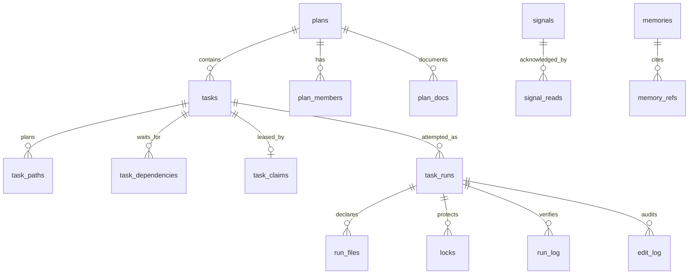

# Awareness Database

Canonical store: `~/.octocode/memory/awareness.sqlite3`, or
`$OCTOCODE_MEMORY_HOME/awareness.sqlite3`. Foreign keys are always enabled.
The runtime requires Node.js 22.13.0 or newer (`node:sqlite` without a flag).
Awareness uses WAL only when the embedded SQLite contains the concurrent reset-race
fix (3.44.6, 3.50.7, 3.51.3, or a newer fixed release); affected versions use
rollback journaling instead. `src/db.ts` is the only schema source. The
canonical identity is SQLite
`application_id = 0x4f435431` (ASCII `OCT1`) and `user_version = 1`.

`<workspace>/.octocode/` is not the database. It contains generated projections and
authored plan documents.

The runtime/version rationale and primary SQLite/Node sources are mapped in
[REFERENCES.md](REFERENCES.md).

## Collaboration Graph

```text
plans -> plan_members / plan_docs / tasks
tasks -> task_paths / task_dependencies / task_claims / task_events / task_runs
task_runs -> run_files / locks / run_log / edit_log / harness_log
agents -> sessions / plans / claims / runs / memories / signals
```



## Plans And Tasks

`plans` stores name, objective, lead, status, workspace/artifact scope, managed
`doc_dir`, and timestamps. Status is `DRAFT|ACTIVE|PAUSED|COMPLETED|CANCELLED`.
The lead is also the first `plan_members` row. `plan_docs` registers `PLAN.md` and
supporting files inside `.octocode/plan/<timestamp-name>/`, created under the exact
workspace path passed to `plan create` (the repo root when none is passed); the plan
row itself is always scoped to the normalized repo root.

`tasks` stores the single durable work queue: plan, title, required reasoning,
acceptance criteria, priority, creator, timestamps, and status
`OPEN|IN_PROGRESS|BLOCKED|VERIFY|DONE|FAILED|CANCELLED`.

`task_paths` is non-exclusive planning scope. `task_dependencies` is an acyclic
same-plan graph. Readiness is derived: `OPEN`, no live claim, and every dependency
`DONE`. There is no `READY` status or “today's tasks” table.

`task_claims` leases one run/agent per task under `BEGIN IMMEDIATE`. Claim heartbeat
and expiry are independent from file presence. Expiry fails the abandoned run,
returns the task to `OPEN`, closes its file work/locks, and emits an event.

## Runs

`task_runs` is one attempt:

| Column | Meaning |
|---|---|
| `run_id` | Stable `run_...` identifier. |
| `task_id` | Nullable durable task; null for standalone WORK or hook fallback. |
| `origin` | `TASK`, explicit `WORK`, or automatic `HOOK`. |
| `agent_id`, `session_id` | Actor and optional host session. |
| `rationale`, `test_plan`, `context_ref` | Attempt intent and verification. |
| `status` | `ACTIVE`, `PENDING`, `SUCCESS`, or `FAILED`. |
| `workspace_path`, `artifact` | Operational scope. |
| timestamps | Creation/update. |

Task reasoning/test criteria are copied into a run as an attempt snapshot. A host
session never defines a reusable work unit; only task claim or explicit `work start`
does.

```text
TASK: OPEN -> IN_PROGRESS -> VERIFY -> DONE|FAILED
                       \-> OPEN|BLOCKED on release
RUN:  ACTIVE -> PENDING -> SUCCESS|FAILED
```

## Run Files: Mandatory Advisory Presence

`run_files` replaces `task_runs.files_json`:

| Column | Meaning |
|---|---|
| `(run_id,file_path)` | Primary key; normalized absolute path. |
| `reason_override` | Optional file-specific reason; otherwise use run/task reason. |
| `source` | `EXPLICIT` or `HOOK`. |
| `started_at`, `heartbeat_at`, `expires_at` | Presence lifecycle. |
| `ended_at` | Null while active. |

Active presence requires `ended_at IS NULL`, unexpired `expires_at`, and an ACTIVE
run. Multiple runs may be active on one ordinary path. Display context is derived:

```text
run_files -> task_runs(agent,session,reason) -> tasks -> plans
```

Do not copy agent/task/plan/general reason into `run_files`.

## Exclusive Locks

`locks(lock_id,file_path,run_id,acquired_at,expires_at)` contains only exclusive
protection. Agent/session come from `task_runs`; no lock type column exists.

- Advisory start conflicts only with another run's active lock.
- Exclusive acquisition conflicts with any other active run-file presence.
- A run may upgrade its own presence.
- TTL removes stale protection; it does not change TASK/WORK success.

See [LOCKS.md](LOCKS.md) for command behavior.

## Delivery State

`delivery_state(consumer_id,channel,scope_key,fingerprint,delivered_at)` suppresses
unchanged hook briefings and peer-state messages. It is delivery bookkeeping, not
signal acknowledgement: only `signal ack` writes `signal_reads`.

## Knowledge, Communication, Audit

| Table | Purpose |
|---|---|
| `agents`, `sessions` | Stable identity, scope, contiguous host activity. |
| `memories`, `memories_fts`, `memory_refs` | Durable lessons, lexical search, provenance, validity/supersession. |
| `signals`, `signal_reads` | Typed peer threads and explicit acknowledgement. |
| `refinements` | Owned follow-up/handoff/instruction feedback; not a task queue. |
| `run_log`, `task_events` | Verification and planning lifecycle history. |
| `edit_log` | Completed file edit audit. |
| `harness_log` | Reflection/harness lifecycle audit. |

JSON file lists remain on signals/refinements because they are message snapshots,
not normalized active run state.

Memory correction is append-only: `superseded_by` identifies immutable replacement
history. Reversible archive uses `state='SUPERSEDED'` plus `expired_at` with no
`superseded_by`; `memory restore` may reactivate only that archived shape. `memory
forget` and age-based digest purge remain irreversible and require review/dry-run.

## Scope

Use one normalized `workspace_path` across attend, plans, tasks, work, locks,
verification, signals, and handoff. `artifact` optionally narrows a workspace;
memory/signals/refinements may also use repo/ref.

Task paths are workspace-relative planning scope. Run-file and lock paths are
normalized absolute operational paths.

## Query Views

| View | Content |
|---|---|
| `plans`, `tasks`, `runs` | Planning and attempt lifecycle. |
| `work list|show` | Flat active run-file rows for focused CLI inspection. |
| FilesUnderWork | Workboard paths grouped with peers, reason, task/plan, and exclusive state. |
| `locks` | Live exclusive rows joined to run identity. |
| `workboard` | Inbox, Verify, Ready, Claimed, FilesUnderWork, RecentDone, review/health lanes. |
| `files`, `activity` | Historical references and edit/audit views. |

Compact views cap detail and expose omitted counts. Full rows are explicit.

## Migration

Canonical v1 is a clean contract identity, not the first historical layout. The
previous unbranded layouts used `user_version` 0-3 and are migration inputs only;
no second schema initializer remains.

### Legacy generation 1

Legacy execution `tasks` became `task_runs`; `task_log` became `run_log`; related
foreign keys were renamed. Migrated attempts were standalone.

### Legacy generation 2/3

- Add `origin` and infer `TASK` when `task_id` exists, otherwise `HOOK`.
- Backfill `run_files` from `files_json` and lock rows.
- Rebuild `task_runs` without `files_json`.
- Rebuild locks as exclusive-only without duplicated agent/session/type fields.
- Add `delivery_state` and the remaining production relations/columns.

### Unversioned legacy relations

- Import `agent_intents` into standalone `task_runs` and `run_files`.
- Import `intent_events` into `run_log`.
- Import legacy memories, file locks, notifications, and read receipts when rows
  exist.
- Drop the legacy relation names only after exact copy counts pass inside the
  migration transaction.
- Rebuild FTS from canonical memories instead of copying virtual/shadow tables.

### Canonical v1 cutover

Startup classifies a store as empty, canonical v1, recognized legacy Awareness,
or unsupported. Recognition requires only known relation names plus valid
Awareness sentinel columns; `user_version` alone is never trusted. Unrelated,
future, staged `OCT4`, and structurally drifted canonical stores fail before
journal or data writes.

For a file-backed legacy store, `connectDb` first creates
`awareness.sqlite3.pre-v1-<timestamp>-<pid>.sqlite3` with SQLite `VACUUM INTO`, so
WAL-visible rows are included. The complete import/rebuild then runs under one
`BEGIN IMMEDIATE`; `application_id=OCT1` and `user_version=1` are written last.
Every ordinary table is rebuilt from the one DDL so PK/FK/UNIQUE/CHECK drift
cannot survive. The canonical fingerprint covers tables, named indexes, views,
triggers, and optional FTS; `integrity_check` and `foreign_key_check` also gate
the cutover.

The complete migration runs under one `BEGIN IMMEDIATE` transaction. Concurrent first
openers wait for the winner, then observe canonical v1; detection, DDL, indexes,
identity, and data cannot interleave. The migration is idempotent and preserves
run IDs and audit history. Old unbranded clients reject the OCT1 file; rebuild and
reinstall the bundled CLI/hooks together. Retain the pre-v1 backup until the new
CLI has passed smoke tests and a second reopen.

## Operations

- `maintenance init`: create/migrate.
- `workspace status`: operational counts and live state; compact output reports
  exact lock totals/omissions and only one lean lock lead.
- `work list|show`: current file awareness.
- `query workboard`: derived action queue.
- `maintenance digest --dry-run`: report bounded cleanup; only terminal refinements are age-pruned.
- `repo inject`: regenerate revisioned projections, preview/prune prior manifest-owned orphans, and preserve plan/user files.
