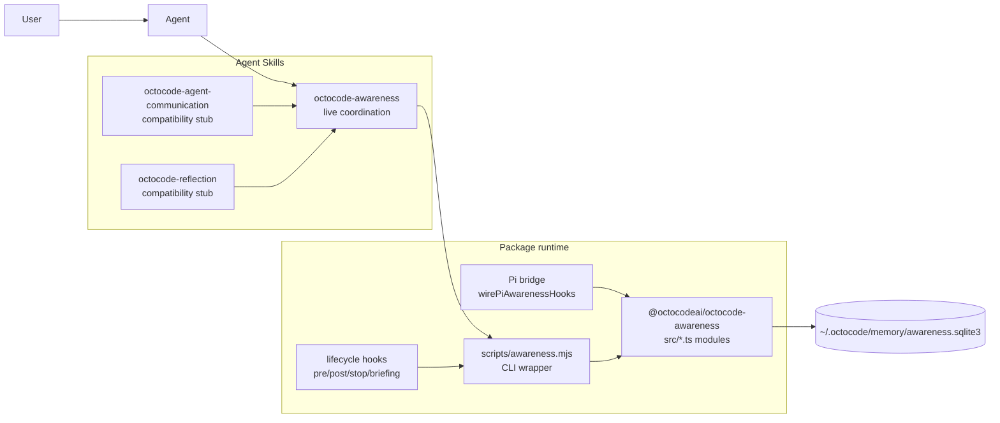
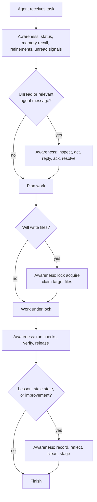
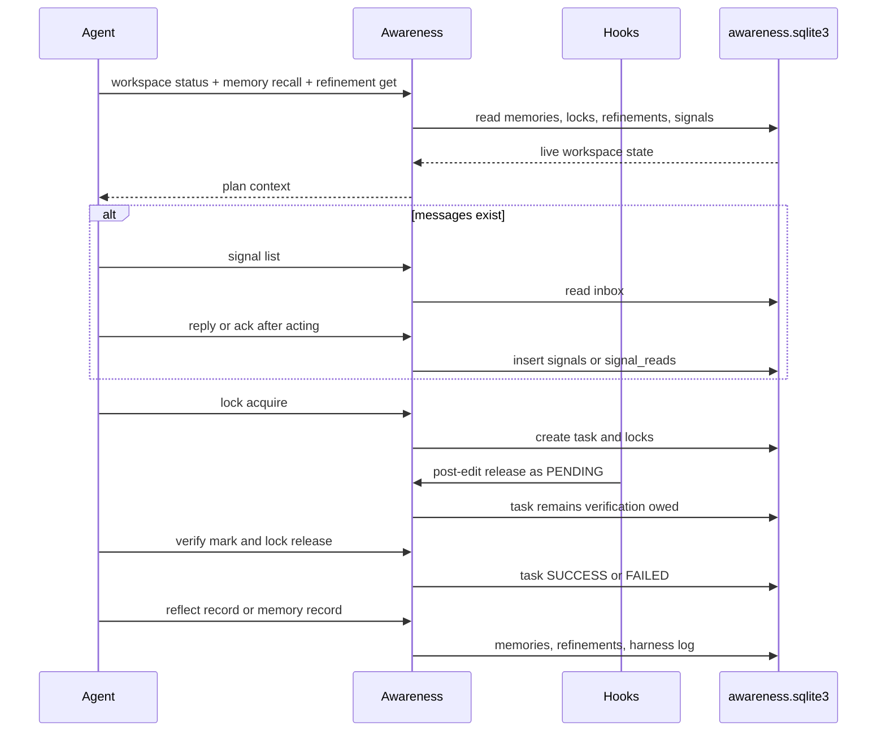
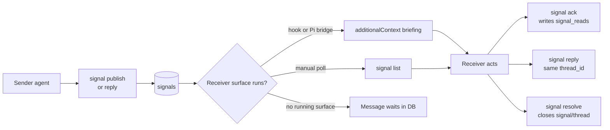
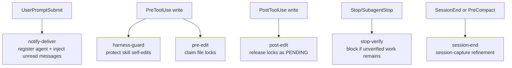
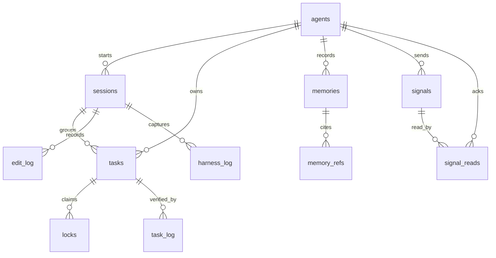
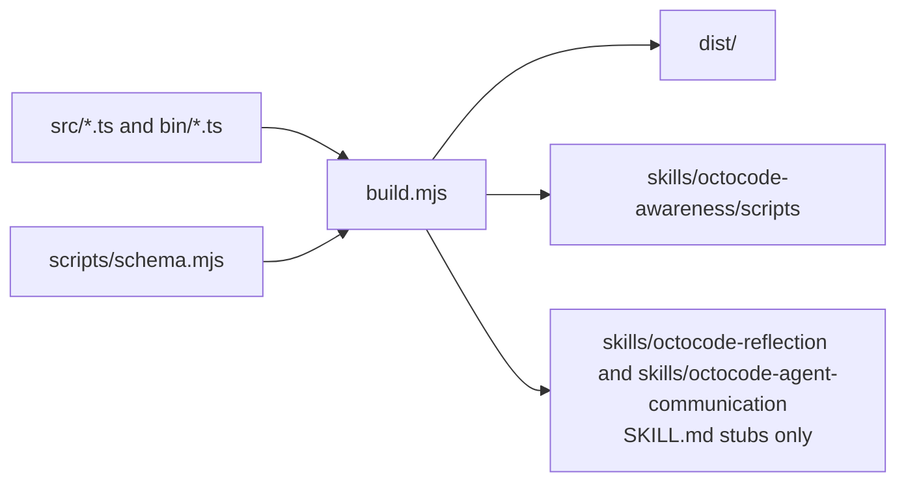

# Octocode Awareness Skills

This package ships one primary Agent Skill plus two compatibility stubs that share one runtime and one SQLite store:

- `octocode-awareness`: live workspace awareness, locks, recall, refinements, signals/messages, verification, reflection, learning, cleanup, and hooks.
- `octocode-agent-communication`: transition stub for older installs; routes message work back to `octocode-awareness`.
- `octocode-reflection`: transition stub for older installs; routes learning and cleanup work back to `octocode-awareness`.

Together they form one operating model for agents in a shared workspace. Awareness keeps work safe while it is happening, moves live messages between agents, and decides what should persist after the work is done. The old skill names remain for one transition release so existing prompts and installs do not fail silently.

## Skill Map

| Skill | Path | Primary job | Load it when |
|---|---|---|---|
| Awareness | `skills/octocode-awareness` | Attend, recall, claim files, signal agents, verify, reflect, clean, run hooks | Starting work, planning edits, checking locks, handling signals, learning from outcomes, or finishing work |
| Communication stub | `skills/octocode-agent-communication` | Route old message-skill references to Awareness | An older prompt explicitly names this skill |
| Reflection stub | `skills/octocode-reflection` | Route old reflection-skill references to Awareness | An older prompt explicitly names this skill |



## How The Skills Combine

Use `octocode-awareness` as the primary workflow. The compatibility stubs are aliases, not separate checklists.

1. Start with `octocode-awareness`.
2. If awareness status, `notify-get`, `signal list`, or hook-injected briefing shows a message, handle it with the Awareness signal commands.
3. If work is finished or a reusable lesson exists, record it with Awareness memory/reflection commands.
4. Keep every command scoped to the same DB, workspace, artifact, repo, and ref.



## Agent Lifecycle



## User View

Users get three practical benefits:

- Safer multi-agent edits: file claims and verification gates make collisions visible.
- Better continuity: memories, refinements, and session captures keep useful context out of the model prompt until needed.
- Agent messaging: signals give agents a local mailbox with threads, broadcast, targeted delivery, ack, and resolution.

Users usually do not call every command manually. They install or preview hooks, then agents call the skill scripts as needed.

```bash
node packages/octocode-awareness/skills/octocode-awareness/scripts/awareness.mjs hooks install --host codex --dry-run
node packages/octocode-awareness/skills/octocode-awareness/scripts/awareness.mjs workspace status --workspace "$PWD"
node packages/octocode-awareness/skills/octocode-awareness/scripts/awareness.mjs signal list --agent-id "$USER" --workspace "$PWD"
```

## Agent View

Agents should treat the skills as progressive disclosure:

- Read `SKILL.md` first.
- Load a reference only when the routed condition matches.
- Use `scripts/schema.mjs` before building wrappers or Pi adapters.
- Use `scripts/awareness.mjs` for deterministic behavior.
- Treat memory and signals as leads. Verify current code, files, and command output before relying on them.

## Tool Surface

The primary skill calls the generated `scripts/awareness.mjs`. Compatibility stubs contain no operational scripts and route old skill names back to Awareness.

### Memory And Recall

| Schema name | CLI command | Owner skill | Purpose |
|---|---|---|---|
| `tell_memory` | `memory record` (`tell-memory`) | Awareness | Store a durable reusable lesson, decision, gotcha, or observation |
| `get_memory` | `memory recall` (`get-memory`) | Awareness | Recall scoped memories by query, labels, tags, files, references, repo, and ref |
| `memory_index` | `memory index` (`memory-index`) | Awareness | Export a compact `MEMORY.md` style index from top active memories |
| `forget_memory` | `memory forget` (`forget`) | Awareness | Delete memories by id, tag, age, or importance ceiling |

### Repo Context Projections

| Schema name | CLI command | Owner skill | Purpose |
|---|---|---|---|
| `query` | `query <view>` | Awareness | Read normalized DB views (`memories`, `gotchas`, `lessons`, `tasks`, `locks`, `agents`, `signals`, `refinements`, `files`, `activity`, `repo-profile`, `all`) as JSON/table/CSV/Markdown |
| `view` | `view [view]` | Awareness | Write a static HTML browser view over the same query engine |
| `repo_inject` | `repo inject` (`inject`) | Awareness | Generate `.octocode/AGENTS.md`, memory/gotcha/learning docs, CSV projections, references, manifest, and optional HTML without editing `.gitignore` |

### Workspace And Locks

| Schema name | CLI command | Owner skill | Purpose |
|---|---|---|---|
| `status` | `status` | Awareness | Show DB health, memory counts, locks, refinements, and pending verification |
| `workspace_status` | `workspace-status` | Awareness | Pi-style status alias for workspace state |
| `pre_flight_intent` | `lock acquire` (`pre-flight-intent`) | Awareness | Create an edit task and acquire file locks |
| `wait_for_lock` | `lock wait` (`wait-for-lock`) | Awareness | Poll until target file locks clear without acquiring them |
| `prune_stale_locks` | `lock prune` (`prune-stale-locks`) | Awareness | Delete expired or age-stale locks; affected tasks become `PENDING` |
| `release_file_lock` | `lock release` (`release-file-lock`) | Awareness | Release locks as `SUCCESS`, `FAILED`, or `PENDING` |
| `verify` | `verify mark` (`verify`) | Awareness | Record that declared verification actually ran |
| `audit_unverified` | `verify audit` (`audit-unverified`) | Awareness | List pending or stale work that blocks clean conclusion |

### Refinements And Handoffs

| Schema name | CLI command | Owner skill | Purpose |
|---|---|---|---|
| `refinement` | `refinement set` (`refine-set`) | Awareness | Save workspace work state for the next agent |
| `refine_query` | `refinement get` (`refine-get`) | Awareness | Read unfinished or filtered refinements |
| `refine_delete` | `refinement delete` (`refine-delete`) | Awareness | Hard-delete stale refinements by id |

### Communication

| Schema name | CLI command | Owner skill | Purpose |
|---|---|---|---|
| `agent_registry` | `agent register|list` (`agent-registry`) | Awareness | Register or list agent identities in the shared DB |
| `agent_signal` | `signal publish|list|reply|ack|resolve` (`agent-signal`) | Awareness | Publish, list, reply, ack, and resolve signals |
| `notify` | `notify` | Awareness legacy alias | Publish a typed signal |
| `notify_query` | `notify-get` | Awareness hooks | Read inbox messages; hooks use `--format hook` and do not mark read |
| `notify_resolve` | `notify-resolve` | Awareness | Resolve a signal or whole thread |
| `notify_prune` | `signal prune` (`notify-prune`) | Awareness | Delete selected resolved, old, or explicit signals |

### Reflection And Harness

| Schema name | CLI command | Owner skill | Purpose |
|---|---|---|---|
| `reflect` | `reflect record` (`reflect`) | Awareness | Record outcome, lesson, failure signature, and staged improvement hints |
| `export_harness` | `reflect export-harness` (`export-harness`) | Awareness | Preview AGENTS.md or harness guidance candidates from top lessons |
| `digest` | `maintenance digest` (`digest`) | Awareness | Preview or run memory/signal/refinement cleanup |
| `mine_weakness` | `reflect mine-weakness` (`mine-weakness`) | Awareness | Cluster repeated failure signatures |
| `doc_staleness` | `docs staleness` (`doc-staleness`) | Awareness | Find docs likely stale from edit log activity |
| `session_capture` | `session capture` (`session-capture`) | Awareness hooks | Write a session handoff refinement from lock and git state |
| n/a | `maintenance init` / `maintenance self-test` (`init` / `self-test`) | Runtime | Initialize or smoke-test the shared DB |

### Pi Tool Mapping

| Pi-facing tool | CLI/runtime equivalent |
|---|---|
| `workspace_status` | `workspace status` (`status` / `workspace-status`) |
| `memory_recall` | `memory recall` (`get-memory`) |
| `memory_record` | `memory record` (`tell-memory`) |
| `memory_refine_get` | `refinement get` (`refine-get`) |
| `agent_signal` | `signal publish|list|reply|ack|resolve` (`agent-signal`, `notify`, `notify-get`) |
| `file_lock type:lock` | `lock acquire` (`pre-flight-intent`) |
| `file_lock type:release` | `lock release` (`release-file-lock`) |
| `memory_verify` | `verify mark` (`verify`) |
| `memory_audit_unverified` | `verify audit` (`audit-unverified`) |
| `memory_reflect` | `reflect record` (`reflect`) |
| `memory_export_harness` | `reflect export-harness` (`export-harness`) |

## Communication Model

Communication is local-first. The SQLite DB is the broker. Hooks, Pi bridge, and CLI calls are delivery surfaces.



Important semantics:

- `to_agent = NULL` is broadcast.
- `thread_id` is the topic/thread. Do not add a second topic store unless a real need appears.
- Hook delivery does not mark read. Agents ack only after acting.
- A message cannot be pushed into an agent that has no hook, no Pi bridge, and no polling run. It remains durable until a surface reads it.
- A2A-style mapping is local: `agents` is identity, `signals` is message/task state, `signal_reads` is acknowledgement, and `thread_id` groups a task or discussion. This package does not expose a public A2A server.

## Hook Model

Hooks turn guidance into lifecycle enforcement where the host supports them.



Codex does not run standalone `SKILL.md` hook frontmatter. Install Codex hooks with `.codex/hooks.json`, inline `[hooks]` config, or plugin hooks. Claude-style hosts may execute skill frontmatter. Pi uses `wirePiAwarenessHooks(pi)`.

## Data Model



| Table | Used by | Meaning |
|---|---|---|
| `agents` | Communication, hooks, Pi | Stable agent id, display name, context, last-seen scope |
| `sessions` | Awareness, hooks | Contiguous agent work period |
| `memories` | Awareness, Reflection | Durable lessons and observations |
| `memory_refs` | Reflection | Structured provenance for memories |
| `tasks` | Awareness | Declared edit intent and verification plan |
| `locks` | Awareness hooks | Per-file lock rows tied to tasks |
| `task_log` | Awareness | Verification events |
| `refinements` | Awareness, Reflection | Workspace work state and handoffs |
| `signals` | Communication | Typed live messages, replies, threads, and status |
| `signal_reads` | Communication | Idempotent per-agent acknowledgements |
| `edit_log` | Reflection harness | Optional edit audit trail |
| `harness_log` | Reflection harness | Self-improvement and capture events |

All rows are scoped primarily by `workspace_path`, with optional `artifact`, `repo`, and `ref`. That lets one DB serve a whole machine while still isolating packages, branches, and projects.

## Implementation

The package runtime is TypeScript plus Node's built-in SQLite.

| Module | Role |
|---|---|
| `src/db.ts` | DB path resolution, schema DDL, migration, FTS setup, WAL mode |
| `src/memory.ts` | Memory insert, recall, scoring, FTS, embeddings, weakness mining |
| `src/intents.ts` | File lock acquisition and release |
| `src/verify.ts` | Verification audit and task log updates |
| `src/refinements.ts` | Handoff/work-state CRUD |
| `src/notifications.ts` | Signals, inbox reads, ack, resolve, prune, `agentSignal` facade |
| `src/agents.ts` | Agent registry, display names, last-seen updates |
| `src/maintenance.ts` | Status, smart briefing, digest, session capture, harness export |
| `src/reflect.ts` | Reflection memories and staged improvement signals |
| `src/sessions.ts` | Session lifecycle |
| `src/audit.ts` | Edit and harness logs |
| `src/docs.ts` | Doc staleness mining |
| `src/pi-hooks.ts` | Pi bridge, write-path extraction, hook wiring |
| `bin/awareness.ts` | CLI flag parsing and command dispatch |
| `bin/hook-runner.ts` | Shell hook dispatcher for lifecycle events |
| `scripts/schema.mjs` | Zod schemas, examples, validation, JSON Schema export |

Build output is copied into the primary awareness skill's `scripts/` directory. Compatibility stubs contain no operational scripts; they route older skill names back to the primary skill while sharing the same package-owned source.



## Choosing The Right Skill

| Situation | Skill | First action |
|---|---|---|
| Starting or planning work | Awareness | `workspace status`, `memory recall`, `refinement get`, inbox check |
| Editing files | Awareness | `lock acquire` before edits, `verify mark` before finishing |
| A message appears in status or hook context | Awareness | `signal list`, then act, reply, ack, resolve |
| Need to ask another agent something | Awareness | `agent list`, then `signal publish` |
| Finished work produced a reusable lesson | Awareness | `reflect record` or `memory record` |
| Old memory, signal, refinement, or pending task looks stale | Awareness | Use dry-run cleanup first |
| Skill or harness should improve itself | Awareness | Stage a proposal with evidence and rollback |

## Practical End-To-End Recipe

```bash
# 1. Attend
node skills/octocode-awareness/scripts/awareness.mjs workspace status --workspace "$PWD"
node skills/octocode-awareness/scripts/awareness.mjs memory recall --query "current task" --workspace "$PWD" --smart

# 2. Communicate when needed
node skills/octocode-awareness/scripts/awareness.mjs agent list --workspace "$PWD"
node skills/octocode-awareness/scripts/awareness.mjs signal list --agent-id "$OCTOCODE_AGENT_ID" --workspace "$PWD"

# 3. Claim and work
node skills/octocode-awareness/scripts/awareness.mjs lock acquire \
  --agent-id "$OCTOCODE_AGENT_ID" \
  --workspace "$PWD" \
  --rationale "Make the requested change" \
  --test-plan "Run the focused test" \
  --target-file "$PWD/path/to/file"

# 4. Verify and release
node skills/octocode-awareness/scripts/awareness.mjs verify mark \
  --agent-id "$OCTOCODE_AGENT_ID" \
  --workspace "$PWD" \
  --all-pending \
  --message "Focused tests passed"

# 5. Reflect after the outcome is known
node skills/octocode-awareness/scripts/awareness.mjs reflect record \
  --agent-id "$OCTOCODE_AGENT_ID" \
  --task "Describe the work" \
  --outcome worked \
  --lesson "Reusable lesson for next time"
```

## Verification Expectations

Before changing any skill or runtime code:

1. Use awareness to claim target files.
2. Run `yarn workspace @octocodeai/octocode-awareness build` so generated skill scripts refresh.
3. Run focused tests for the changed behavior.
4. Run `yarn workspace @octocodeai/octocode-awareness test:quiet` for shared runtime changes.
5. Run skill lint when `SKILL.md` or references change.
6. Use `git diff --check`.
7. Record verification with `verify` and release locks.
