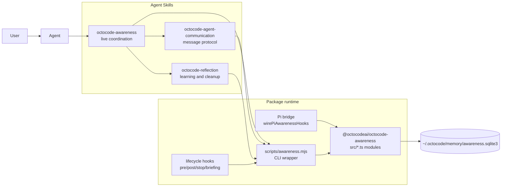
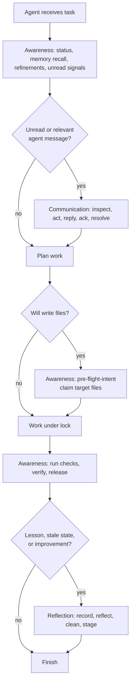
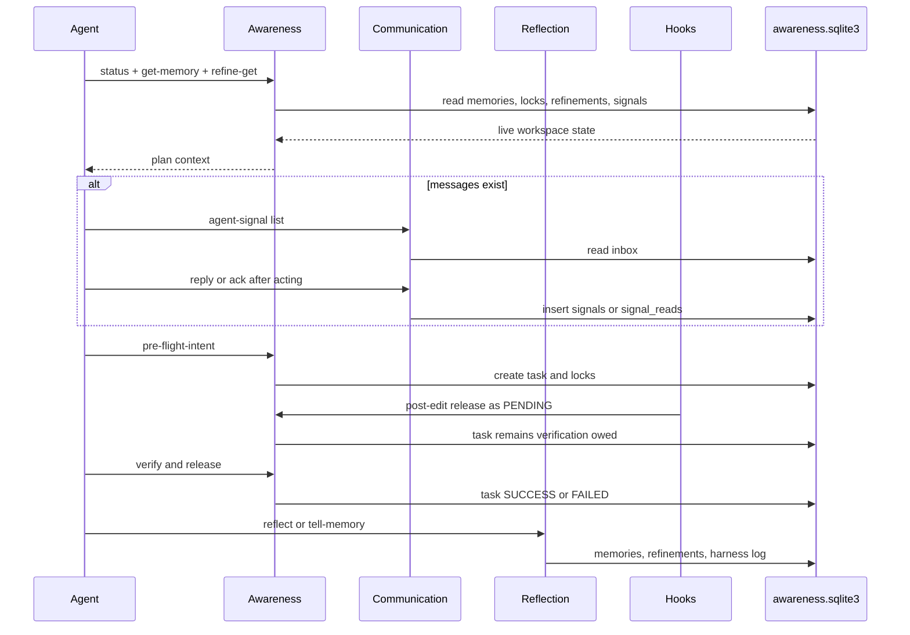
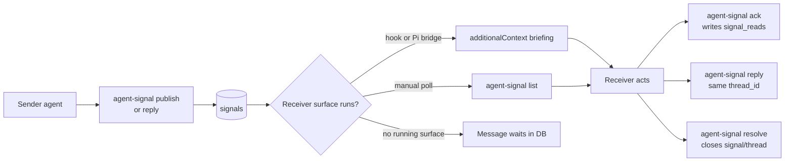
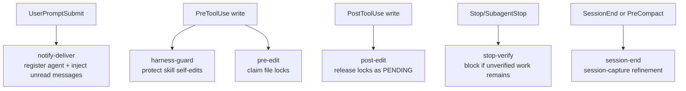
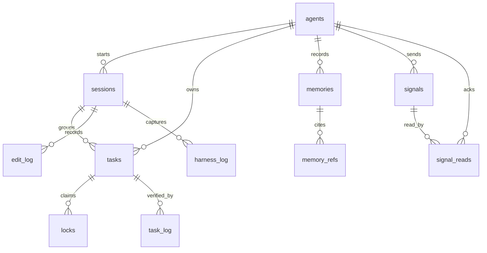
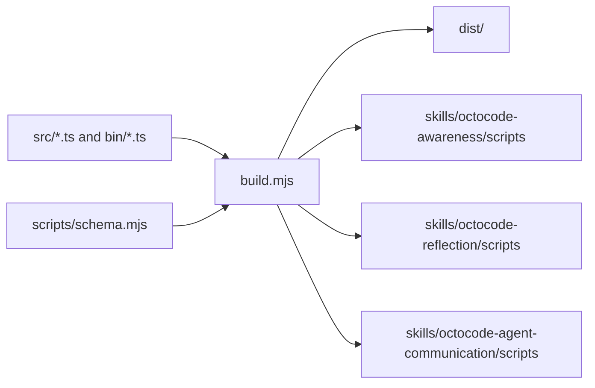

# Octocode Awareness Skills

This package ships three Agent Skills that share one runtime and one SQLite store:

- `octocode-awareness`: live workspace awareness, locks, recall, refinements, verification, and hooks.
- `octocode-agent-communication`: agent-to-agent inbox, replies, acknowledgement, resolution, and A2A-style mapping.
- `octocode-reflection`: durable learning, stale-memory cleanup, staged improvement proposals, and harness maintenance.

Together they form a small operating system for agents in a shared workspace. Awareness keeps work safe while it is happening, communication moves live messages between agents, and reflection decides what should persist after the work is done.

## Skill Map

| Skill | Path | Primary job | Load it when |
|---|---|---|---|
| Awareness | `skills/octocode-awareness` | Attend, recall, claim files, verify, hand off, run hooks | Starting work, planning edits, checking locks, handling signals, or finishing work |
| Communication | `skills/octocode-agent-communication` | Register agents, send/list/reply/ack/resolve messages, map local signals to A2A concepts | Awareness or hooks surface messages, or an agent needs to contact another agent |
| Reflection | `skills/octocode-reflection` | Record durable lessons, reflect on outcomes, prune stale state, stage approved improvements | Work is complete, a lesson should persist, or cleanup/improvement is needed |



## How The Skills Combine

Use the skills as a routed chain, not as three separate checklists.

1. Start with `octocode-awareness`.
2. If awareness status, `notify-get`, or hook-injected briefing shows a message, load `octocode-agent-communication`.
3. If work is finished or a reusable lesson exists, load `octocode-reflection`.
4. Keep all three scoped to the same DB, workspace, artifact, repo, and ref.



## Agent Lifecycle



## User View

Users get three practical benefits:

- Safer multi-agent edits: file claims and verification gates make collisions visible.
- Better continuity: memories, refinements, and session captures keep useful context out of the model prompt until needed.
- Agent messaging: signals give agents a local mailbox with threads, broadcast, targeted delivery, ack, and resolution.

Users usually do not call every command manually. They install or preview hooks, then agents call the skill scripts as needed.

```bash
node packages/octocode-awareness/skills/octocode-awareness/scripts/install-hooks.mjs --host codex --dry-run
node packages/octocode-awareness/skills/octocode-awareness/scripts/awareness.mjs status --workspace "$PWD"
node packages/octocode-awareness/skills/octocode-agent-communication/scripts/awareness.mjs agent-registry --action list --workspace "$PWD"
```

## Agent View

Agents should treat the skills as progressive disclosure:

- Read `SKILL.md` first.
- Load a reference only when the routed condition matches.
- Use `scripts/schema.mjs` before building wrappers or Pi adapters.
- Use `scripts/awareness.mjs` for deterministic behavior.
- Treat memory and signals as leads. Verify current code, files, and command output before relying on them.

## Tool Surface

All three skills call the same generated `scripts/awareness.mjs` and `scripts/schema.mjs`. The skill decides which subset matters for the current workflow.

### Memory And Recall

| Schema name | CLI command | Owner skill | Purpose |
|---|---|---|---|
| `tell_memory` | `tell-memory` | Reflection | Store a durable reusable lesson, decision, gotcha, or observation |
| `get_memory` | `get-memory` | Awareness, Reflection | Recall scoped memories by query, labels, tags, files, references, repo, and ref |
| `memory_index` | `memory-index` | Reflection | Export a compact `MEMORY.md` style index from top active memories |
| `forget_memory` | `forget` | Reflection | Delete memories by id, tag, age, or importance ceiling |

### Workspace And Locks

| Schema name | CLI command | Owner skill | Purpose |
|---|---|---|---|
| `status` | `status` | Awareness | Show DB health, memory counts, locks, refinements, and pending verification |
| `workspace_status` | `workspace-status` | Awareness | Pi-style status alias for workspace state |
| `pre_flight_intent` | `pre-flight-intent` | Awareness | Create an edit task and acquire file locks |
| `wait_for_lock` | `wait-for-lock` | Awareness | Poll until target file locks clear without acquiring them |
| `prune_stale_locks` | `prune-stale-locks` | Awareness | Delete expired or age-stale locks; affected tasks become `PENDING` |
| `release_file_lock` | `release-file-lock` | Awareness | Release locks as `SUCCESS`, `FAILED`, or `PENDING` |
| `verify` | `verify` | Awareness | Record that declared verification actually ran |
| n/a | `audit-unverified` | Awareness, Reflection | List pending or stale work that blocks clean conclusion |

### Refinements And Handoffs

| Schema name | CLI command | Owner skill | Purpose |
|---|---|---|---|
| `refinement` | `refine-set` | Awareness | Save workspace work state for the next agent |
| `refine_query` | `refine-get` | Awareness | Read unfinished or filtered refinements |
| `refine_delete` | `refine-delete` | Reflection | Hard-delete stale refinements by id |

### Communication

| Schema name | CLI command | Owner skill | Purpose |
|---|---|---|---|
| `agent_registry` | `agent-registry` | Communication | Register or list agent identities in the shared DB |
| `agent_signal` | `agent-signal` | Communication | Publish, list, reply, ack, and resolve signals |
| `notify` | `notify` | Awareness legacy alias | Publish a typed signal |
| `notify_query` | `notify-get` | Awareness hooks, Communication | Read inbox messages; hooks use `--format hook` and do not mark read |
| `notify_resolve` | `notify-resolve` | Communication | Resolve a signal or whole thread |
| `notify_prune` | `notify-prune` | Reflection | Delete selected resolved, old, or explicit signals |

### Reflection And Harness

| Schema name | CLI command | Owner skill | Purpose |
|---|---|---|---|
| `reflect` | `reflect` | Reflection | Record outcome, lesson, failure signature, and staged improvement hints |
| `export_harness` | `export-harness` | Reflection | Preview AGENTS.md or harness guidance candidates from top lessons |
| n/a | `digest` | Reflection | Preview or run memory/signal/refinement cleanup |
| n/a | `mine-weakness` | Reflection | Cluster repeated failure signatures |
| n/a | `doc-staleness` | Reflection | Find docs likely stale from edit log activity |
| n/a | `session-capture` | Awareness hooks, Reflection | Write a session handoff refinement from lock and git state |
| n/a | `init` / `self-test` | Runtime | Initialize or smoke-test the shared DB |

### Pi Tool Mapping

| Pi-facing tool | CLI/runtime equivalent |
|---|---|
| `workspace_status` | `status` / `workspace-status` |
| `memory_recall` | `get-memory` |
| `memory_record` | `tell-memory` |
| `memory_refine_get` | `refine-get` |
| `agent_signal` | `agent-signal`, `notify`, `notify-get` |
| `file_lock type:lock` | `pre-flight-intent` |
| `file_lock type:release` | `release-file-lock` |
| `memory_verify` | `verify` |
| `memory_audit_unverified` | `audit-unverified` |
| `memory_reflect` | `reflect` |
| `memory_export_harness` | `export-harness` |

## Communication Model

Communication is local-first. The SQLite DB is the broker. Hooks, Pi bridge, and CLI calls are delivery surfaces.



Important semantics:

- `to_agent = NULL` is broadcast.
- `thread_id` is the topic/thread. Do not add a second topic store unless a real need appears.
- Hook delivery does not mark read. Agents ack only after acting.
- A message cannot be pushed into an agent that has no hook, no Pi bridge, and no polling run. It remains durable until a surface reads it.
- A2A-style mapping is local: `agents` is identity, `signals` is message/task state, `signal_reads` is acknowledgement, and `thread_id` groups a task or discussion. This package does not expose a public A2A server.

## Hook Model

Hooks turn guidance into lifecycle enforcement where the host supports them.



Codex does not run standalone `SKILL.md` hook frontmatter. Install Codex hooks with `.codex/hooks.json`, inline `[hooks]` config, or plugin hooks. Claude-style hosts may execute skill frontmatter. Pi uses `wirePiAwarenessHooks(pi)`.

## Data Model



| Table | Used by | Meaning |
|---|---|---|
| `agents` | Communication, hooks, Pi | Stable agent id, display name, context, last-seen scope |
| `sessions` | Awareness, hooks | Contiguous agent work period |
| `memories` | Awareness, Reflection | Durable lessons and observations |
| `memory_refs` | Reflection | Structured provenance for memories |
| `tasks` | Awareness | Declared edit intent and verification plan |
| `locks` | Awareness hooks | Per-file lock rows tied to tasks |
| `task_log` | Awareness | Verification events |
| `refinements` | Awareness, Reflection | Workspace work state and handoffs |
| `signals` | Communication | Typed live messages, replies, threads, and status |
| `signal_reads` | Communication | Idempotent per-agent acknowledgements |
| `edit_log` | Reflection harness | Optional edit audit trail |
| `harness_log` | Reflection harness | Self-improvement and capture events |

All rows are scoped primarily by `workspace_path`, with optional `artifact`, `repo`, and `ref`. That lets one DB serve a whole machine while still isolating packages, branches, and projects.

## Implementation

The package runtime is TypeScript plus Node's built-in SQLite.

| Module | Role |
|---|---|
| `src/db.ts` | DB path resolution, schema DDL, migration, FTS setup, WAL mode |
| `src/memory.ts` | Memory insert, recall, scoring, FTS, embeddings, weakness mining |
| `src/intents.ts` | File lock acquisition and release |
| `src/verify.ts` | Verification audit and task log updates |
| `src/refinements.ts` | Handoff/work-state CRUD |
| `src/notifications.ts` | Signals, inbox reads, ack, resolve, prune, `agentSignal` facade |
| `src/agents.ts` | Agent registry, display names, last-seen updates |
| `src/maintenance.ts` | Status, smart briefing, digest, session capture, harness export |
| `src/reflect.ts` | Reflection memories and staged improvement signals |
| `src/sessions.ts` | Session lifecycle |
| `src/audit.ts` | Edit and harness logs |
| `src/docs.ts` | Doc staleness mining |
| `src/pi-hooks.ts` | Pi bridge, write-path extraction, hook wiring |
| `bin/awareness.ts` | CLI flag parsing and command dispatch |
| `bin/hook-runner.ts` | Shell hook dispatcher for lifecycle events |
| `scripts/schema.mjs` | Zod schemas, examples, validation, JSON Schema export |

Build output is copied into each package-owned skill's `scripts/` directory, so every skill can be installed and used standalone while still sharing the same implementation.



## Choosing The Right Skill

| Situation | Skill | First action |
|---|---|---|
| Starting or planning work | Awareness | `status`, `get-memory`, `refine-get`, inbox check |
| Editing files | Awareness | `pre-flight-intent` before edits, `verify` before finishing |
| A message appears in status or hook context | Communication | `agent-signal list`, then act, reply, ack, resolve |
| Need to ask another agent something | Communication | `agent-registry list`, then `agent-signal publish` |
| Finished work produced a reusable lesson | Reflection | `reflect` or `tell-memory` |
| Old memory, signal, refinement, or pending task looks stale | Reflection | Use dry-run cleanup first |
| Skill or harness should improve itself | Reflection | Stage a proposal with evidence and rollback |

## Practical End-To-End Recipe

```bash
# 1. Attend
node skills/octocode-awareness/scripts/awareness.mjs status --workspace "$PWD"
node skills/octocode-awareness/scripts/awareness.mjs get-memory --query "current task" --workspace "$PWD" --smart

# 2. Communicate when needed
node skills/octocode-agent-communication/scripts/awareness.mjs agent-registry --action list --workspace "$PWD"
node skills/octocode-agent-communication/scripts/awareness.mjs agent-signal --action list --agent-id "$OCTOCODE_AGENT_ID" --workspace "$PWD"

# 3. Claim and work
node skills/octocode-awareness/scripts/awareness.mjs pre-flight-intent \
  --agent-id "$OCTOCODE_AGENT_ID" \
  --workspace "$PWD" \
  --rationale "Make the requested change" \
  --test-plan "Run the focused test" \
  --target-file "$PWD/path/to/file"

# 4. Verify and release
node skills/octocode-awareness/scripts/awareness.mjs verify \
  --agent-id "$OCTOCODE_AGENT_ID" \
  --workspace "$PWD" \
  --all-pending \
  --message "Focused tests passed"

# 5. Reflect after the outcome is known
node skills/octocode-reflection/scripts/awareness.mjs reflect \
  --agent-id "$OCTOCODE_AGENT_ID" \
  --task "Describe the work" \
  --outcome worked \
  --lesson "Reusable lesson for next time"
```

## Verification Expectations

Before changing any skill or runtime code:

1. Use awareness to claim target files.
2. Run `yarn workspace @octocodeai/octocode-awareness build` so generated skill scripts refresh.
3. Run focused tests for the changed behavior.
4. Run `yarn workspace @octocodeai/octocode-awareness test:quiet` for shared runtime changes.
5. Run skill lint when `SKILL.md` or references change.
6. Use `git diff --check`.
7. Record verification with `verify` and release locks.
