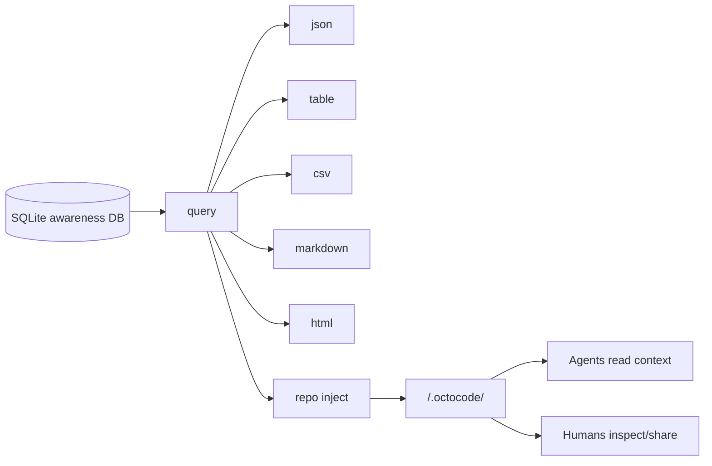

# LLM Wiki And Repo Context

**Audience**: agents, maintainers, and technical users who want readable repo context from awareness data.

The LLM Wiki is the generated workspace `.octocode/` projection over the awareness database. It makes selected memory, task, signal, refinement, and activity data readable as Markdown, CSV, HTML, and JSON manifest files.

The SQLite DB in the global Octocode home remains canonical. The wiki is a repo-local projection.

## Location Model

| Location | Role |
|---|---|
| `~/.octocode/memory/awareness.sqlite3` | Canonical global awareness DB, shared across local agents and scoped by workspace. |
| `<repo>/.octocode/` | Generated LLM Wiki for one repo/workspace. It contains memories-about-the-repo as Markdown/CSV/HTML projections, not the canonical DB rows. |

Use `query <view>` for live DB reads. Use `repo inject --workspace <repo> --out <repo>/.octocode` to publish a refreshed repo view.

## Why It Exists

LLMs and humans need quick repo context without querying SQLite directly. The wiki gives them:

- concise agent briefing material,
- memory and gotcha indexes,
- CSV exports for filtering,
- a static HTML browser view,
- a manifest describing generation and sharing policy,
- compact reference files for repeated context.

## Live Query First

Use `query` when you need fresh data:

```bash
octocode-awareness query all \
  --workspace "$PWD" \
  --format json \
  --limit 20 \
  --compact
```

Available views:

| View | Purpose |
|---|---|
| `all` | Combined sections for broad inspection. |
| `repo-profile` | High-level repo profile from awareness data. |
| `memories` | Active memory rows. |
| `gotchas` | `GOTCHA` memories. |
| `lessons` | Decisions, architecture, workflows, improvements, docs, tests, and related labels. |
| `tasks` | Claimed and verified work. |
| `locks` | Active lock state. |
| `agents` | Agent registry and last-seen data. |
| `signals` | Messages and handoff threads. |
| `refinements` | Open/ongoing/done proposals and handoffs. |
| `files` | File activity from `edit_log` and related data. |
| `activity` | Timeline-like activity view. |

Formats: `json`, `table`, `csv`, `markdown`, `html`.

## Generate The Wiki

```bash
octocode-awareness repo inject \
  --workspace "$PWD" \
  --out .octocode \
  --mode local \
  --compact
```

When run from the workspace root, `--out .octocode` writes to `<workspace>/.octocode/`.

Modes:

| Mode | Meaning |
|---|---|
| `local` | Generate for local agent use. Usually keep uncommitted or gitignored. |
| `share` | Generate with the intent that repo owners may commit the projection. |

`repo inject` reports gitignore/share-policy warnings but never edits `.gitignore`. The default output is `<workspace>/.octocode`.

## Generated Files

| File | Contents |
|---|---|
| `.octocode/AGENTS.md` | Concise repo briefing for agents. |
| `.octocode/MEMORY.md` | Active memory index. |
| `.octocode/GOTCHAS.md` | Gotcha-focused memory projection. |
| `.octocode/LEARN.md` | Decisions, architecture notes, workflows, and reusable lessons. |
| `.octocode/awareness/csv/*.csv` | CSV exports for supported views. |
| `.octocode/awareness/index.html` | Static browser view. |
| `.octocode/awareness/manifest.json` | Generation metadata, mode, warnings, file list. |
| `.octocode/references/*.md` | Compact reference slices for agents. |

The exact file list can evolve with `repo-context.ts`; treat the manifest as the source for a generated directory.

## Data Flow



## Editing Policy

Do not hand-edit generated workspace `.octocode/` files as the source of truth. If a wiki page is wrong:

1. Fix the underlying DB row if the memory/signal/refinement is wrong.
2. Fix the source code or docs if the remembered fact is stale.
3. Regenerate with `repo inject`.

Use `memory forget`, superseding memories, or `refinement delete` for stale DB content. Use `docs staleness` when the problem is drift between code edits and documentation.

## Relation To Reflection

Reflection feeds the wiki through memories and refinements:

```text
reflect record -> memories/refinements -> query views -> repo inject -> <repo>/.octocode/
```

`reflect export-harness` can produce guidance candidates, but those are review artifacts. The wiki is the readable projection of accepted/stored awareness data, not an autonomous patcher.

## Practical Patterns

```bash
# Inspect current gotchas before a risky edit
octocode-awareness query gotchas --workspace "$PWD" --format table --limit 20

# Export all data as HTML under <workspace>/.octocode/
octocode-awareness query all --workspace "$PWD" --format html --out .octocode/awareness/index.html

# Regenerate <workspace>/.octocode/ after recording important lessons
octocode-awareness repo inject --workspace "$PWD" --mode local --compact
```

## Caveats

- Projection freshness depends on when `repo inject` last ran.
- `files` and `activity` views depend on `edit_log`; bundled shell hooks and the Pi bridge populate basic update rows, while custom hosts should call `insertEditLog()` for richer audit data.
- Generated files may contain project-specific memories. Review before committing `.octocode/` output.
- Current source and tests always beat generated context.
