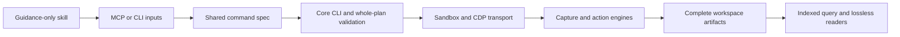

# Chrome package boundaries

The package owns execution; `skills/octocode-chrome-devtools` contains only guidance. The npm executable follows the communication package: MCP by default, `/cli` for typed commands. `/raw` reaches the same argument-oriented engine used by the adapter.

| Owner | Responsibility |
|---|---|
| `bin/octocode-chrome-devtools.mjs` | Route default MCP, `/cli`, and `/raw`; no browser logic |
| `src/adapter.ts` | CLI/MCP composition, command registration, whole-input parsing and server lifecycle |
| `@octocodeai/octocode-core` through `@octocodeai/config/schema` | Browser schemas, descriptions, instructions, output windows and the research catalog; the native sixteen-tool registry stays separate |
| `src/command-inputs.ts` | Re-export generated shared-core browser schemas and inferred input types |
| `src/invocation.ts` | Serialized child execution, deadlines, private stdout/stderr capture and engine shutdown |
| `src/engine/cli-catalog.mts`, `src/engine/cli.mts` | Command/recipe registry, core arguments and preflight routing |
| `src/engine/cdp-connection.mts` | Shared WebSocket transport, request deadlines, flattened-session events, error evidence and pending-request cleanup |
| `src/engine/scraping-bridge.mts` | Optional scraping-tool discovery and argument forwarding, shared by corpus/HAR/protocol commands |
| `src/engine/cdp-sandbox.mts`, `src/engine/cdp-runner.mts` | Permissions, target selection, connection/session routing, lifecycle and complete artifact writes |
| `src/engine/cdp-checks/`, DOM/frame/input helpers | Browser actions, captures, observation, executor references and stream draining |
| `src/engine/evidence-query.mts`, `src/engine/artifact-query.mts` | Complete filtered indexes and digest-pinned continuations |
| `src/engine/capture-result.mts`, `src/engine/flow-page.mts` | Compact verified acknowledgements, hoisted provenance, direct read pages, manifests and shared continuation routing; full source/log retention |
| `OPERATING.md`, `docs/`, `src/engine/guide.mts` | Package operating knowledge, available through CLI/MCP `skill` |
| `tools/build.mjs` | One bundled adapter runtime, thin CLI/MCP modules, and a refreshed shared config copy |
| `tests/*suite.mjs`, `tests/unit/` | Hermetic, real-browser, transport and extracted-package regression checks |

MCP and typed CLI use the same spec, delegate to the same core CLI and stop on the same failures. Browser business logic is not duplicated in the interfaces. Plan schema validation remains in the executor; raw CDP params remain open and Chrome validates them. These are package-local browser operations, not additions to the sixteen Octocode native tools.

Config comes from `@octocodeai/config`: build copies its compiled standalone module into `dist/engine/` for the sandbox and dependency-free archive, as the communication runtime does for Python. No home/env parsing is reimplemented. Only the build refreshes that generated copy.

The adapter is bundled once into `dist/runtime.js`; `dist/cli.js` and `dist/mcp.js` expose it without a duplicate bundle. Source and generated outputs are checked with `check:build`. All production sources are TypeScript (`.ts` / ESM `.mts`). `typecheck` checks all engines, then checks the adapter, command inputs, invocation, capture, registry, transport and scraping bridge with strict mode. Inherited dynamic CDP engines retain inferred checking; their protocol payloads stay open. Archives contain generated runtime/engines, the bin and operating docs. Source, tests and build tooling stay in the repository.

Within-server requests serialize. Engine deadlines and server shutdown share termination ownership: SIGTERM, then SIGKILL after five seconds if the engine remains alive. Completion clears both timers. MCP cancellation propagates to queued and active requests; partial captures survive and in-flight mutation outcomes remain uncertain. Separate servers must coordinate shared tabs. Captures are complete; pages carry executable continuations. A structural protocol inventory distinguishes advertised methods from methods actually exercised by fixtures.
