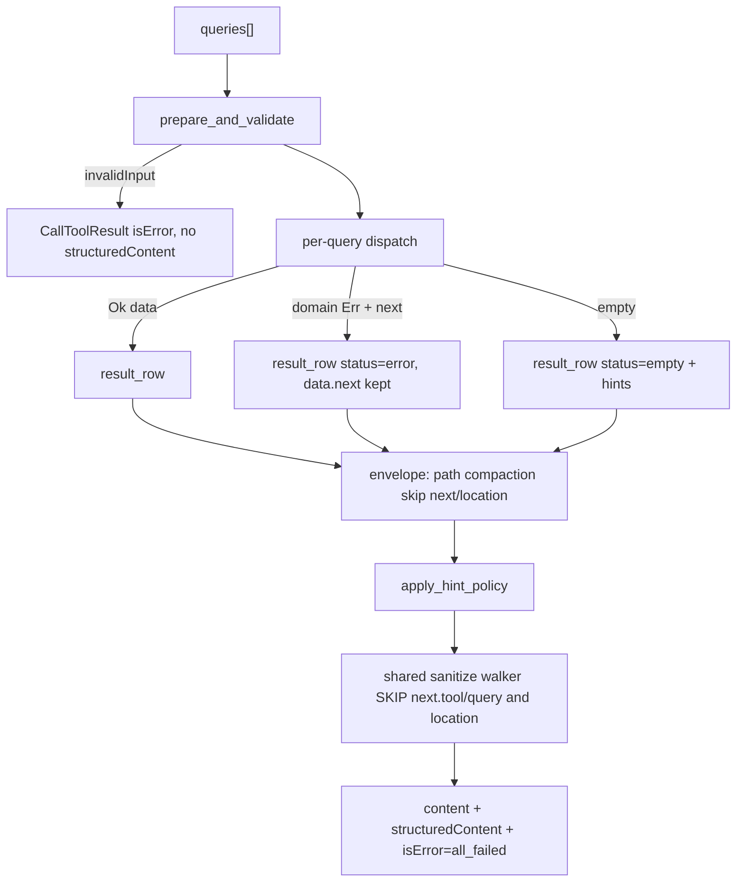
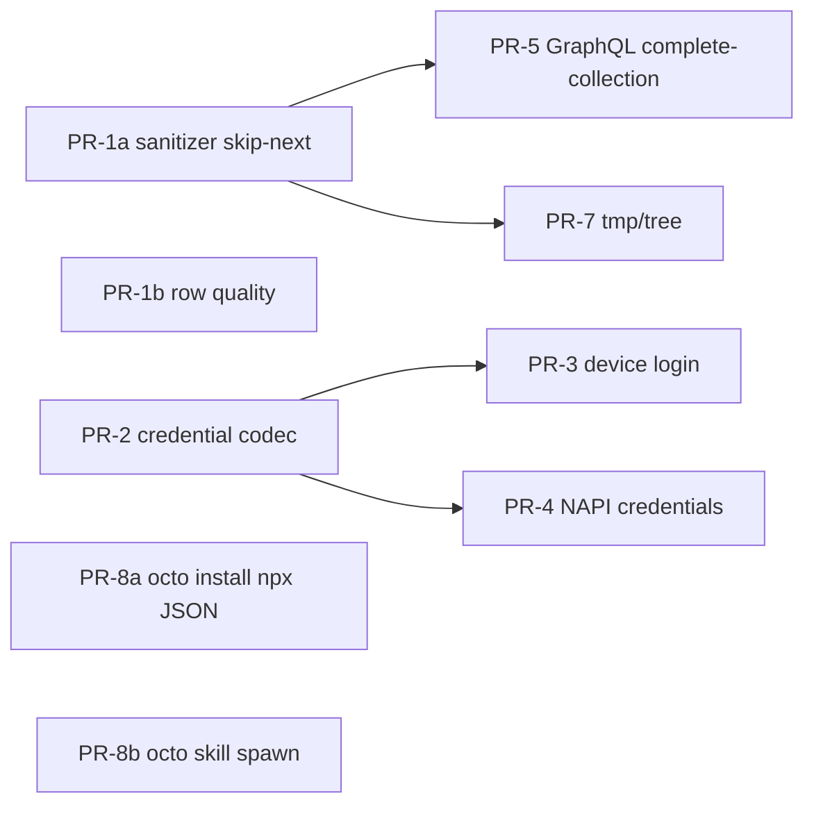

# Native Octocode Agent-Facing Tool Results and Remaining Native Capabilities

| Field | Value |
|---|---|
| **Title** | Native Octocode agent-facing Result contract + remaining native capabilities |
| **Author** | TBD |
| **Date** | 2026-09-14 |
| **Status** | Draft (revision 5) |
| **Workspace** | `/Users/bgaryy/code/octocode` |
| **Primary package** | `packages/octocode-engine-tools-core` |
| **Audience** | Senior engineers owning the native runtime, Node MCP/CLI shims, and credential surfaces |

---

## Overview

The native runtime already executes the full 11-tool catalog through one Rust path (`octo` CLI and optional NAPI addon). What agents actually consume is still uneven: `DomainResult` folds some domain failures into row `status: "error"` while keeping `next`, but other tools drop continuations, treat capped results as success, emit untyped LSP strings, and let sanitizers rewrite `next.tool` / `next.query`. Path compaction already skips `next` and `location`; the content sanitizer does not. That is hostile to agents that copy executable continuations.

This revision specifies **all remaining native/Node gaps in one document**: Layer A (11-tool Result contract), Layer B (GitHub execution: credential codec, device login, NAPI, GraphQL, tmp/tree), and Layer C (management install). Native `octo install` writes IDE MCP JSON that launches `npx -y octocode-mcp@latest` — never `{ command: "octo", args: ["mcp"] }`. Native `octo skill` is a thin spawn of Node `octocode skill` (installer of record). Node ink OAuth TUI stays Node; native owns device-flow HTTP. No 12th catalog tool, no native stdio MCP server, no Rust skill-installer rewrite, no `octo mcp`.

---

## Background & Motivation

### Current native execution path

```text
octo CLI  ──────────────┐
                        ├─ ToolRuntime (admit → validate → dispatch → envelope → sanitize → render)
Node MCP → NAPI addon ──┘
                        ├─ DomainResult { diagnostics, data, cache, status, source_digest, failure }
                        ├─ result_row → envelope (path compaction, shared hoist)
                        └─ MCP: content[] + structuredContent + isError
```

`ARCHITECTURE.md` already states the ownership split: tools own canonical operations; `runtime/response.rs` owns transport-neutral metadata and lossless path compaction; `adapter_napi.rs` is host conversion only; CLI never loads NAPI. Interactive IDE install and OAuth TUI remain Node `octocode` management.

Verified current behavior:

| Surface | File | What it does today |
|---|---|---|
| Envelope | `src/runtime/dispatch.rs` `DomainResult` | `diagnostics`, `data: Value`, `cache`, `status: Option<&str>` (`"error"` / `"empty"`), `source_digest`, `failure` |
| Local search Err | `dispatch.rs` `execute_local` `"localSearch"` | `Err` → `status: "error"` **keeping** `error.next` so the row survives the batch |
| AST Err | same | `domain_error(..., error.next)` same fold |
| Value tools | `value_result` | Reads `data.status` `"error"` / `"empty"` |
| GitHub provider Err | `src/runtime/github.rs` `provider_error` / `history_error` / `file_error` | Domain error row, **no** `next` |
| MCP isError | `src/runtime/render.rs` `mcp_result`, `engine.rs` `all_failed` | `isError` only when **every** row is `status == "error"` |
| Continuation shape | `src/tools/local_fetch/types.rs` `Continuation` | `{ tool, query, confidence, why? }` |
| Executable-call test | `src/runtime/response.rs` `has_executable_call` | Requires `tool: string` **and** `query: object` |
| Missing continuation | `pagination_codes` | `hasMore` / `isPartial` / bounded without `next.*` → `continuationMissing`; `terminalLimit` → `terminalLimitReached` |
| Path compaction | `visit_paths` / `rewrite_paths` | Skips keys `"next"` and `"location"`; test proves `next.continue.query.path` stays absolute |
| Envelope sanitizer | `sanitize_fields` | Walks **every** string, including `next.tool` and `next.query.*` (`engine.rs` runs this after tool-level sanitizers) |
| History sanitizer | `gh_get_history_item/mod.rs` `sanitize_all_strings` | Same walk; test at lines 1652–1663 **asserts** `next.tool` becomes `"[MASKED]-tool"` |
| SearchStatus | `local_search/types.rs` | `Success \| Empty \| Partial` — **Partial is unused**; executor only emits Empty vs Success. `LocalSearchResult.status` is `#[serde(skip)]` — not in `data` |
| NAPI | `adapter_napi.rs` | `catalog`, `execute`, `execute_mcp`, `cancel`, `close` — no credential APIs. `NATIVE_ABI_VERSION = 1` |
| CLI `Command` | `cli/mod.rs` 16–135 | Search/Read/Tools/Login/Logout/Skill/… — **no** `Mcp` variant; no stdio MCP server in this crate |
| Login | `cli/human.rs` `login()` | Stub: print “Set GITHUB_TOKEN…” and exit 1 |
| Logout | `logout` | `delete_platform_credential` (keychain delete exists; **write does not**) |
| Keychain load | `auth.rs` 213–214 | `SecretString::from(secret)` — blob is treated as the raw token |
| Skill | `skill()` | Stub pointing at Node `octocode skill` |
| GraphQL transport | `providers/github/transport.rs` `execute_graphql` | Exists; `history_item.rs` is REST GET only. Tool layer fans out REST collections with integer pages |
| Budget | `budget.rs` `GitHubResource` | `Core \| Search \| CodeSearch`; `/graphql` classifies as Core |
| Config env allowlist | `config/resolver.rs` `SOURCE_KEYS` | 16 keys; no `OCTOCODE_GITHUB_GRAPHQL` |
| Topology diagnostics | `ast_graph/analysis.rs` 780–788 | Already emits `next.nextDiagnostics` with `diagnosticPage` / `diagnosticSnapshot` |
| tmp/tree | native crate | **Absent** (Node `directoryFetch/` owns it) |
| `ghSearchHistory` query | `gh_search_history/mod.rs` 12–53 | List/search only: **no** `content`, **no** `prNumber`. Already attaches `next.readPr` |

### Pain points (agent-visible)

1. **Sanitizer destroys continuations.** `sanitize_all_strings` and `sanitize_fields` rewrite `next.tool` and `next.query.path`. An agent that copies `next.readPr` / `next.continue` gets a schema-invalid or semantically wrong call. Path compaction already knew not to do this; sanitizers did not. Envelope sanitizer runs **after** the history walker, so both must skip `next`/`location`.

2. **Empty ≠ Err is only half-implemented.** `localSearch` empty is `SearchStatus::Empty` → row `status: "empty"` with hints. `lspSearch` empty is `payload.kind: "empty"` **without** row status, so `value_result` treats it as success. Server start failure today returns `Ok(empty(..., server_available: false))`, not `Err`. Capped `localSearch` is `Success` even when `stats.capped` — `SearchStatus::Partial` is dead code and is not serialized into `data`.

3. **GitHub domain errors drop recovery.** `localSearch`/`astSearch` keep `error.next`. `file_error` / `history_error` / `provider_error` emit `{error}` only. Auth failures still tell the user to run `gh auth login`.

4. **Topology without `rustWorkspace: "cargo"` is hostile.** Live `astSearch` topology on `src/` without cargo produced hundreds of `unsupported Rust macro expansion: macro-generated imports are not linked` diagnostics plus `terminalLimitReached`. Diagnostic **pagination** already exists (`next.nextDiagnostics`). Missing: a single typed hint to pass `rustWorkspace: "cargo"`. Default remains syntax-only (correct for safety).

5. **Native cannot persist a login.** Keychain load/delete exist; write does not. A JSON write without a matching JSON-aware read would send `Authorization: Bearer {json...}`. Node still owns device login, refresh write, tmp/tree, and IDE install **until Layer B/C land**.

### Why this is one design (and what is not)

The Result contract is the agent API for catalog tools. GitHub execution capabilities (login so tools can authenticate, GraphQL so `ghGetHistoryItem` can batch, tmp/tree so `ghSearch` tree can materialize) must emit that same contract. Shipping GraphQL or tmp/tree before sanitizer-skip-next would give agents more rows they cannot continue.

Skill install and MCP JSON install are **CLI management**, not catalog tool rows. `ARCHITECTURE.md` assigns interactive IDE install and OAuth **TUI** to Node. This design keeps the TUI in Node, specifies native **device-flow HTTP** (not TUI), specifies **npx JSON** for IDEs (`octo install`), and specifies **thin spawn** for skills so the TS installer remains the single writer of `$OCTOCODE_HOME/skills`. User decision: document all remaining work in this one file.

---

## Goals & Non-Goals

### Goals

1. Freeze a single agent-facing Result contract for all 11 native tools: row envelope, `status`, `next.*`, empty/error/partial-as-diagnostics, sanitizer and path-compaction invariants.
2. Make every bound that truncates evidence either an executable `{tool, query, confidence}` continuation or a typed `terminalLimitReached` diagnostic — never a bare page number.
3. Land sanitizer skip-next **alone** before any new `next.*` producers; then LSP typed empty/error, internal `SearchStatus::Partial` + `terminalLimit`, and a `rustWorkspace: "cargo"` hint.
4. Port GitHub execution primitives into this crate:
   - Keychain **codec** (JSON write + JSON-aware read with raw-token fallback) then device login + refresh
   - NAPI credential APIs so Node `./credentials` can delegate without changing `getCredentials()` meaning
   - GraphQL **complete-collection fast path** inside `ghGetHistoryItem` (REST page 1 if incomplete; not a 12th tool)
   - tmp/tree directory materialization as `materialize: true` on `ghSearch` `operation: "tree"`
5. Specify Layer C management install in this document: npx-only MCP JSON (`octo install`, matching Node `octocode install`) and thin `octo skill` spawn of Node `octocode skill`. Keep Node ink OAuth TUI in Node. No native stdio MCP server. No `octo mcp`.

### Non-Goals

- A 12th catalog tool for GraphQL, materialize, login, or install.
- A native stdio MCP server or any `octo mcp` / `{ "command": "octo", "args": ["mcp"] }` (native `Command` has no `Mcp` variant; Node MCP is `octocode-mcp` over NAPI `execute_mcp`).
- Rewriting `@octocodeai/octocode-skill-installer` in Rust (Node remains installer of record; native only spawns it).
- Adding `content` / `prNumber` to native `ghSearchHistory` or porting Node PR search-hit enrichment. Agents copy `next.readPr`.
- Porting Node ink OAuth TUI. Native owns device-flow HTTP; ink may later call NAPI credential APIs.
- Replacing Node ink TUI, marketplace browse UI, or skill-catalog authoring.
- Changing `@octocodeai/octocode-core` public input schemas except additive `materialize` / `materializeOffset` on tree.
- Making `rustWorkspace: "cargo"` the default (cargo metadata executes workspace code).
- Publishing `@octocodeai/octocode-skill-installer` as a runtime package, or rewriting it in Rust in this design.
- Token revocation requiring a client secret in native login.
- Rewriting GitHub REST search; GraphQL is only a `ghGetHistoryItem` complete-collection fast path.
- Multi-PR GraphQL batching (`pullRequests(ids:)` / aliased `pr0…prN`).
- Backward-compatible shims for destroyed `next.tool` values already in the wild.
- Changing the meaning of Node `getCredentials()` to metadata-only.

---

## Key Decisions

1. **Domain errors stay inside the tool result, never as JSON-RPC / NAPI transport errors.** MCP spec: domain errors MUST set `isError` inside `CallToolResult` so the model can self-correct. Native already does this: `mcp_result` sets `isError` iff every row is `status == "error"`; `mcp_input_error` is the only path that omits `structuredContent` (schema failures). Keep that split. Do **not** put `structuredContent` only on failure paths — lean-ctx clients that render `structuredContent` *instead of* text would hide YAML on success. Always emit both `content[].text` and `structuredContent` on executed tools.

2. **Empty ≠ Err ≠ Partial.** `status: "empty"` means a well-formed query returned zero hits (hints + optional advisory `next`). `status: "error"` means the query failed (typed `errorCode`, `hints`, keep `next` when recovery exists). Partial is **not** a row status and is **not** serialized on `LocalSearchResult` (`#[serde(skip)]`). It is internal: `meta.diagnostics.partial: true` (already from `is_partial()` on `hasMore` / bounded flags) plus either executable `next.*` or `terminalLimitReached` when `build_next` is `None`. `dispatch.rs` continues to map only Empty → `"empty"`.

3. **`next.*` is always `{ tool, query, confidence }` plus optional `why`.** Never a bare `nextPage: 2`. `has_executable_call` requires `tool: string` **and** `query: object`. Pagination keys may be detected on array-valued `next` **containers**; each call’s `query` must be an object. `confidence` is `"exact" | "high" | "medium" | "low"`. `why` is recovery-only (existing `shape_next` strips it on success). Agents copy the whole call; they must not parse cursors (`artifactSearch` cursor is opaque inside `query.cursor`).

4. **Sanitizer and path compaction MUST NOT rewrite `next.tool` or `next.query`.** Path compaction already skips `"next" | "location"`. One shared walker (history + envelope) skips the `next` object except `why` on each executable call, and skips `location` entirely. Still sanitize domain content. Rationale: tool names are catalog literals; query objects are schema-valid echoes of input. Redacting them is not security (Rhumb: truncation is not security). This bugfix is PR-1a and lands **alone**.

5. **GraphQL is a complete-collection fast path inside one `ghGetHistoryItem`, not a catalog tool, not a multi-PR batcher, and not GraphQL-page-1 + REST-page-2.** REST maps better to tool schemas (Pontil). Skip GraphQL unless every requested collection page is 1 (including `collection_pages.*`), `patch_mode == "none"`, and at least two GraphQL-eligible flags are set. Inline comments stay REST even when GraphQL runs (`reviewThreads` ≠ `pulls/{n}/comments`). If a GraphQL connection `hasNextPage` or mapped fields are missing, REST-fetch **that collection from page 1** and emit REST `hasMore`/`next` as today. Never copy GraphQL `pageInfo` onto `contentPagination.hasMore` and then continue with REST `commentPage`/`filePage` 2. Independent 5 000 GraphQL points/hour plus REST 5 000 req/hour.

6. **tmp/tree is `materialize: true` on `ghSearch` `operation: "tree"`, not a new tool.** Caps copy Node’s numbers but as **per `continueMaterialize` call** (page bounds): 50 files, 5 MiB written this call, 300 KiB/file, concurrency 5. Each call copy-forwards the previous snapshot then writes this batch (do not replace the tree with only this call’s files). Result reuses `CloneResult.location` shape. Agents copy `location.localPath`. No `searchLocal` next-call. Write-cap continuation is `materializeOffset` on the current tree listing `page` — not listing `page: 2` while page-1 blobs remain.

7. **Native owns a keychain *codec* (write + JSON-aware read); Node `getCredentials()` still returns the full secret.** Today `load_platform_credential` treats the blob as the raw token (`auth.rs` 213–214). Write Node-shaped JSON; read parses JSON and returns `token.token`, falling back to the raw string. Round-trip test is part of the credential PR. Do not ship login until that read path exists. NAPI `get_credentials` returns the same full object Node already expects. Refresh NAPI methods are **async**.

8. **Native `octo login` is device-flow HTTP, not ink.** Follow goose/openfang/llmfit: POST `login/device/code`, print `user_code` + `verification_uri`, poll `login/oauth/access_token`. Client ID `178c6fc778ccc68e1d6a`, scopes `repo`, `read:org`, `gist`. Web origin for device/code; API origin for `/user`. When a `refreshToken` is present, empty-secret GitHub App refresh is the supported GA path (parity with Node `tokenRefresh.ts`). When refresh is unsupported or expired, re-device-flow is the supported path. Node ink remains optional chrome. This is **not** the OAuth TUI that `ARCHITECTURE.md` leaves in Node.

9. **MCP install is npx-only JSON write via `octo install` (Node’s command name).** There is still no native stdio MCP server. The installed server **must** be `{ "command": "npx", "type": "stdio", "args": ["-y", "octocode-mcp@latest"] }` (VS Code `MCP_ARGS` in `packages/octocode-vscode/src/mcpConfig.ts`; Node CLI currently omits `-y` — native includes `-y` so IDEs do not hang on npx confirm). **Never** write `{ "command": "octo", "args": ["mcp"] }`. Do not add a `Mcp` clap variant.

10. **Skill install: Node is installer of record.** Native `octo skill` is a thin subprocess of `octocode skill` with the same flags. Do not rewrite `@octocodeai/octocode-skill-installer` in Rust. If `octocode` is not on `PATH`, print the exact Node command and exit non-zero. Spawn must not recurse into `octo skill`.

11. **Sanitizer skip-next is PR-1a and blocks every later `next.*` producer.** PR-1b is independently reviewable and must not delay 1a. PR-8a/8b do not block 1a.

12. **`ghSearchHistory` stays lean. PR-6 enrichment stays dropped.** Native `GhSearchHistoryQuery` has no `content` / `prNumber`. Agents copy `next.readPr`. Not an open question.

13. **Node ink OAuth TUI stays Node.** Native owns device-flow HTTP write (PR-3). After PR-4, ink **may** call NAPI `store_credentials` / `get_credentials` / `refresh_auth_token` instead of the TS file store. Do not port ink.

14. **Prefer existing files over new packages.** No new workspace package. No remaining product open questions: every previously parked choice is a Key Decision plus implementable PR.

---

## Proposed Design

### Layer A — Agent-facing Result contract

#### A.1 Envelope (unchanged shape, frozen semantics)

Keep `DomainResult` as the only tool-to-runtime boundary:

```rust
// packages/octocode-engine-tools-core/src/runtime/dispatch.rs
pub(super) struct DomainResult {
    pub diagnostics: crate::tools::result::ToolDiagnostics,
    pub data: Value,
    pub cache: bool,
    pub status: Option<&'static str>, // "error" | "empty" | None
    pub source_digest: Option<String>,
    pub failure: Option<FailureKind>,
}
```

`result_row` already builds:

```json
{
  "index": 0,
  "status": "error | empty",
  "cache": 1,
  "meta": {
    "evidence": { "kind": "lexical|structural|syntactic|semantic|provider|exact", "confidence": "high|medium|low" },
    "diagnostics": { "codes": ["continuationMissing"], "partial": true, "hints": [] }
  },
  "data": { }
}
```

Batch envelope (`response::envelope`): `{ results, base?, shared? }`. One failed row does not invalidate others. MCP:

```json
{
  "content": [{ "type": "text", "text": "<yaml>" }],
  "structuredContent": { "results": [ ], "base": "..." },
  "isError": false
}
```

`isError: true` only when `all_failed`. Schema/input failures use `mcp_input_error` (`isError: true`, **no** `structuredContent`).



#### A.2 Status algebra

| Condition | Row `status` | `data` | `meta.diagnostics` | MCP `isError` |
|---|---|---|---|---|
| Hits, complete | omitted | payload | omitted unless codes | false unless sibling rows all error |
| Hits, bounded, `next.*` present | omitted | payload + `next` | `partial: true` | false |
| Hits, bounded, continuation impossible | omitted | payload + `terminalLimit: true` | `partial: true`, `terminalLimitReached` | false |
| Zero hits, query valid, server up | `"empty"` | hints, optional advisory `next` | none required | false |
| Domain failure, recovery possible | `"error"` | `error`, `errorCode`, `hints`, `next` | `errorCode` copied to codes | true only if **all** rows error |
| Domain failure, no recovery | `"error"` | `error`, `errorCode`, `hints` | codes | as above |
| Transport/cancel/timeout | NAPI/`RuntimeError` | — | — | not a domain row |

`fallback_hint` already injects one concise hint on empty rows that lack `has_recovery`. Keep it.

#### A.3 Continuation invariant

Every `data.next` value is a map of **named** calls:

```ts
type ExecutableCall = {
  tool: string;
  query: object;         // must be a JSON object, never an array
  confidence: "exact" | "high" | "medium" | "low";
  why?: string;
};
type Next = Record<string, ExecutableCall>;
```

Rules:

- `has_executable_call` (`response.rs` 92–98) is the validator: `tool` string + `query` object.
- `continuation()` also walks arrays so it can find named calls nested under array-valued containers. That does **not** allow `query: []`.
- Pagination keys start with `next` or `continue` (`nextPage`, `nextMatchPage`, `continue`, `nextDiagnostics`).
- Expansion keys (`expandLimit`, `retry`, `restart`, `readPr`, `searchText`, …) count as recovery for `continuationMissing`.
- A numeric `pagination.nextPage` **without** `data.next.nextPage.{tool,query}` is incomplete.
- Opaque provider cursors live **inside** `query` (e.g. `artifactSearch.query.cursor`).

#### A.4 Sanitizer skip-next (PR-1a, blocking)

Two walkers today visit every string:

- `runtime/response.rs` `sanitize_fields` — envelope, including metadata; runs **after** tool sanitizers (`engine.rs` ~530)
- `tools/gh_get_history_item/mod.rs` `sanitize_all_strings` — history payload

Replace both with one shared walker in `runtime/response.rs`. History calls it; the envelope calls it. Skip keys `next` (except `why` under each executable call) and `location`. Do not introduce an unused `skip_query` flag.

```rust
pub(crate) fn sanitize_value(
    value: &mut Value,
    security: &ContentSecurity,
) -> Result<(), ExecutionError> {
    match value {
        Value::String(text) => {
            *text = security.sanitize_text(text, None).content;
            Ok(())
        }
        Value::Array(values) => {
            for v in values {
                sanitize_value(v, security)?;
            }
            Ok(())
        }
        Value::Object(map) => {
            for (key, child) in map.iter_mut() {
                match key.as_str() {
                    "location" => {}
                    "next" => sanitize_next_map(child, security)?,
                    _ => sanitize_value(child, security)?,
                }
            }
            Ok(())
        }
        _ => Ok(()),
    }
}

fn sanitize_next_map(next: &mut Value, security: &ContentSecurity) -> Result<(), ExecutionError> {
    let Some(map) = next.as_object_mut() else {
        return sanitize_value(next, security);
    };
    for call in map.values_mut() {
        let Some(fields) = call.as_object_mut() else {
            continue;
        };
        // Skip tool + query (and confidence: catalog enum). Sanitize why only.
        if let Some(why) = fields.get_mut("why") {
            sanitize_value(why, security)?;
        }
    }
    Ok(())
}
```

Named-call shape `{ continue: { tool, query, why } }` and a flat test fixture `{ next: { tool, query } }` both work: if `next` itself has `tool`/`query` keys, `sanitize_next_map` treats those keys as call names whose values are strings/objects without `why`, so they are left unchanged.

`confidence` and unknown future call fields are not sanitized (documented: they are catalog enums / non-content). Input sanitization (`security.validate_input_parameters`) is unchanged.

Tests to invert:

- History `sanitizes_every_nested_returned_string` (lines 1652–1663) currently **expects** `next.tool == "[MASKED]-tool"`. Expect `next.tool` and `next.query.path` **unchanged** while `title` / `nested.body` still mask.
- Envelope test next to `path_compaction_never_rewrites_evidence_or_executable_queries`: `next.continue.query.path` containing a secret-like token survives `sanitize_fields`.
- `location.localPath` containing a token-shaped segment survives.

#### A.5 `SearchStatus::Partial` (PR-1b, internal-only)

`local_search/types.rs` already declares `Partial`. `executor.rs` never sets it. `LocalSearchResult.status` is `#[serde(skip)]`, so wiring Partial **does not** change `data`. `dispatch.rs` already maps only Empty → row `"empty"`.

Observable PR-1b change for localSearch:

- Set internal `SearchStatus::Partial` when `stats.capped`, `pagination.has_more`, remaining per-file matches, or `error_count > 0` with some files returned.
- When Partial (or Success with `has_more`) and `build_next` returns `None` (e.g. `page >= 1000` schema max), set `data.terminalLimit = true` so `pagination_codes` emits `terminalLimitReached` instead of `continuationMissing`.
- `meta.diagnostics.partial` continues to come from `is_partial()` (`hasMore` / bounded flags). Do not add row `status: "partial"`.

#### A.6 LSP typed empty / error (PR-1b)

Today:

- Empty locations → `payload.kind: "empty"` without row status; `value_result` treats as success.
- No configured server / `client.start()` failure → `Ok(empty(..., category: "unsupportedOperation", server_available: false))` (`lsp_search/mod.rs` 79–98).
- Native syntactic fallback is **success**: `evidence_kind` maps `lsp.source` `native` | `native-graph-facts` | `markdown` to `"syntactic"`.

Do **not** add `lsp.nativeFallback` as an `errorCode`. Keep `lsp.source`.

Rules:

| Condition | Row `status` | `errorCode` | `next.searchText` |
|---|---|---|---|
| No locations, server up | `"empty"` | none | yes, `localSearch`, `confidence: "medium"` |
| No language server configured / `start()` fails | `"error"` | `lsp.serverUnavailable` | yes |
| Timeout waiting for server | `"error"` | `lsp.timeout` | yes |
| Invalid `workspaceRoot` | `"error"` | `lsp.workspaceRootInvalid` | yes |
| `symbolName`+`lineHint` missed | `"error"` | `lsp.anchorUnresolved` | yes |
| Syntactic native fallback with locations | omitted (success) | none; `lsp.source` stays | no |

Replace `Result<Value, String>` with `LspError { code, message, hints, next }` folded via `domain_error` so `next` survives. On `serverUnavailable` / `anchorUnresolved`, keep `next.searchText` and optionally `next.syntax` → `astSearch` `operation: "match"` at `confidence: "medium"`. Empty (no locations, server up) already emits `next.searchText`; add `"status": "empty"` so `value_result` maps it. `confidence` on those recovery calls is `"medium"`, not `"exact"`.

This **is** a behavior change for start failure: empty → error. Explicit: a downed rust-analyzer is not “zero hits”.

#### A.7 rustWorkspace hint (PR-1b)

Default `rustWorkspace` is syntax. Engine emits `unsupported Rust macro expansion: macro-generated imports are not linked` per file (`octocode-engine/src/signatures/graph_facts.rs`).

`ast_graph/analysis.rs` already emits `next.nextDiagnostics` with `diagnosticPage` / `diagnosticSnapshot` when `coverage.diagnosticsPagination.hasMore`. **Do not re-specify diagnostic pagination as new work.**

PR-1b work is one hint: if any diagnostic indicates unsupported Rust linking **and** `rustWorkspace` is omitted or `"syntax"`, push a single (deduplicated) hint:

`Pass rustWorkspace:"cargo" for workspace metadata linking. syntax graphs leave macro-generated imports unlinked; cargo executes workspace metadata.`

Do **not** auto-upgrade to cargo.

#### A.8 GitHub error rows keep recovery when we have it

On `NotFound` for `ghGetFileContent`, emit `next.viewTree` (already in `ADVISORY_CALLS`, so kept on error rows):

```json
{
  "tool": "ghSearch",
  "query": {
    "operation": "tree",
    "owner": "<owner>",
    "repo": "<repo>",
    "path": "<parent or \".\">",
    "branch": "<copied when the failing query had branch>"
  },
  "confidence": "low"
}
```

`path` is the parent directory of the requested file, or `"."` when the file is at repo root (empty `dirname` must not become `""`). Copy `branch` when the query had one. Keep the current string recipe as a **hint** only, not as the executable call.

On `Authentication`, keep `gh auth login` copy until PR-3, then switch the hint to `octo login, or set GITHUB_TOKEN / GH_TOKEN`.

---

### Layer B — GitHub execution capabilities (not management install)

```mermaid
sequenceDiagram
  participant Agent
  participant Octo as octo / NAPI
  participant Keychain as PlatformCredentialStore
  participant GH as GitHub login + API
  participant FS as OCTOCODE_HOME
  Agent->>Octo: octo login (device flow)
  Octo->>GH: POST {web}/login/device/code
  GH-->>Octo: user_code, verification_uri, device_code
  Octo-->>Agent: print codes (optional OS open)
  Octo->>GH: poll {web}/login/oauth/access_token
  GH-->>Octo: access_token, refresh_token?
  Octo->>Keychain: store JSON blob
  Note over Keychain: load parses token.token; raw fallback
  Note over Agent,Octo: NAPI credentials wrap the same store
  Agent->>Octo: ghGetHistoryItem (all collection pages 1, no patches)
  Octo->>GH: GraphQL complete-collection fast path
  Note over Octo,GH: hasNextPage or missing fields → REST page 1 of that collection
  Note over Octo,GH: any collection page greater than 1 → whole item REST
  Agent->>Octo: ghSearchHistory PR list
  Octo-->>Agent: hits + next.readPr (no enrichment)
  Agent->>Octo: ghSearch tree materialize:true
  Octo->>FS: tmp/tree snapshot (50 files / 5MiB / 300KiB / conc 5)
  Octo-->>Agent: location.localPath + continueMaterialize with materializeOffset
  Agent->>Octo: octo install --ide cursor
  Octo->>FS: write mcp.json npx -y octocode-mcp@latest
  Agent->>Octo: octo skill install --all --platform cursor --global
  Octo->>Octo: spawn octocode skill (Node installer of record)
```

Order after PR-1a: **credential codec → device login+refresh → NAPI credentials → GraphQL → tmp/tree**. Layer C: **PR-8a `octo install` / PR-8b `octo skill` spawn**, independent of GraphQL/tmp-tree; do not block 1a. No enrichment PR.

#### B.1 Credential codec (PR-2) — write **and** JSON-aware read

`providers/github/auth.rs` today:

- `load_platform_credential` — `SecretString::from(secret)` (raw blob)
- `delete_platform_credential`
- `LegacyCredentialStore` — read-only AES-GCM `credentials.json`
- **No `set_password`**

**Codec (single format):**

- **Write:** Node-shaped JSON (see Data Model). `store_platform_credential` → keychain `set_password`.
- **Read (tool execution):** `load_platform_credential` must:
  1. `get_password`
  2. Trim; if `serde_json::from_str` succeeds and `pointer("/token/token")` is a non-empty string, return that inner token
  3. Else treat the blob as a raw token (today’s behavior — required for any pre-JSON secrets)
- **Read (structured):** `load_stored_credential` returns the full object for refresh/NAPI. If the blob is a raw token, synthesize `StoredCredentials { token: { token, tokenType: "oauth" }, … }` with empty username/timestamps.
- **Round-trip test (blocks login):** store JSON → `load_platform_credential` / HTTP credential resolve → `Authorization: Bearer` is the **inner token**, not the JSON blob. Also: store raw string → still resolves. Do **not** ship PR-3 until this test is in PR-2.

Serde mapping (must match Node `StoredCredentials` / `OAuthToken`, not a flattened Rust struct):

```rust
#[derive(Serialize, Deserialize)]
#[serde(rename_all = "camelCase")]
pub struct StoredCredentials {
    pub hostname: String,
    pub username: String,
    pub token: OAuthToken,
    pub git_protocol: String, // "https" | "ssh"
    pub created_at: String,   // RFC3339
    pub updated_at: String,
}

#[derive(Serialize, Deserialize)]
#[serde(rename_all = "camelCase")]
pub struct OAuthToken {
    pub token: String,
    pub token_type: String, // "oauth"
    #[serde(default, skip_serializing_if = "Option::is_none")]
    pub scopes: Option<Vec<String>>,
    #[serde(default, skip_serializing_if = "Option::is_none")]
    pub refresh_token: Option<String>,
    #[serde(default, skip_serializing_if = "Option::is_none")]
    pub expires_at: Option<String>,
    #[serde(default, skip_serializing_if = "Option::is_none")]
    pub refresh_token_expires_at: Option<String>,
}
```

Zeroize token fields after use. `clippy unwrap_used = deny` — no unwrap on serde/keyring.

Read order for tool execution remains: override → env → keychain (JSON-aware) → legacy file → `gh auth token`. Write order: keychain only (do not write `credentials.json` from native). `logout` already deletes keychain and leaves env + files untouched.

Refresh helper (used by PR-3; may live in PR-2 as dead code or PR-3):

```rust
pub async fn refresh_auth_token(host: &str, client_id: &str) -> Result<StoredCredentials, ProviderError>
```

POST `{web_origin}/login/oauth/access_token` with `grant_type=refresh_token`, `client_id`, empty client secret (`clientType: github-app`, matching Node `tokenRefresh.ts`). Mask tokens in error strings.

#### B.2 Device login + refresh (PR-3)

Replace `cli/human.rs` `login()` stub. No ink. **Depends on PR-2 read path.**

Host split (copy Node `getApiBaseUrl` + native `GitHubEndpoint::credential_host`):

| `github.apiUrl` / `GITHUB_API_URL` | Web origin (device/code, access_token, refresh) | API origin (GET `/user`, REST, GraphQL) | Keychain account |
|---|---|---|---|
| `https://api.github.com` (default) | `https://github.com` | `https://api.github.com` | `github.com` |
| `https://ghe.example.com/api/v3` | `https://ghe.example.com` | `https://ghe.example.com/api/v3` | `ghe.example.com` |

Never POST `https://api.github.com/login/device/code` (404). Derive web origin: if API host is `api.github.com` → `github.com`; else use the API URL host with path `/login/device/code` (GHES serves device flow on the web host, not `/api/v3`).

Flow:

1. POST `{web}/login/device/code` — `client_id=178c6fc778ccc68e1d6a`, `scope=repo,read:org,gist`
2. Print `verification_uri` + `user_code`. Optional OS open. Failure to open is non-fatal.
3. Poll `{web}/login/oauth/access_token` at `interval`; honor `slow_down`.
4. GET `{api}/user` with the token for `username`.
5. `store_platform_credential` (JSON codec).
6. Exit 0; `--json` → `{ "success": true, "username", "hostname" }`.

**Refresh product decision (GA):**

- Token has `refreshToken` and it is not expired → empty-secret GitHub App refresh is the **supported** path (`octo login --refresh` and implicit refresh in credential resolution when `expiresAt` is past).
- No `refreshToken` (OAuth App) or refresh token expired → typed `credential.refreshUnsupported` / `credential.refreshExpired`; supported recovery is `octo login` re-device-flow. Do not delete the stored token until the user succeeds at login or the server rejects the access token on a later API call.
- Refresh HTTP 401/403 → typed `credential.refreshFailed`, keep stored token, hint `octo login`. This is not a silent fallback and not an open question.

Tests: wiremock for device/code + poll + `/user` + refresh; never hit production.

#### B.3 NAPI credentials (PR-4)

Extend `adapter_napi.rs`. Bump `NATIVE_ABI_VERSION` from 1.

```rust
#[napi] pub fn store_credentials(&self, value: Value) -> napi::Result<Value>; // sync, no network
#[napi] pub fn get_credentials(&self, hostname: Option<String>) -> napi::Result<Value>; // sync, FULL secret
#[napi] pub fn delete_credentials(&self, hostname: Option<String>) -> napi::Result<Value>; // sync, no network
#[napi] pub async fn refresh_auth_token(&self, hostname: Option<String>) -> napi::Result<Value>;
#[napi] pub async fn get_token_with_refresh(&self, hostname: Option<String>) -> napi::Result<Value>;
```

`store` / `get` / `delete` stay sync and **must not** perform network I/O (keychain only). `refresh_auth_token` and `get_token_with_refresh` are **async** (HTTP).

`get_credentials` returns Node `StoredCredentials` including `token.token`. Do **not** introduce a metadata-only getter under that name.

Node `packages/octocode-tools-core/src/shared/credentials` **signatures unchanged**:

```ts
export async function storeCredentials(credentials: StoredCredentials): Promise<StoreResult>;
export async function getCredentials(
  hostname?: string,
  options?: GetCredentialsOptions
): Promise<StoredCredentials | null>; // includes token.token
export async function deleteCredentials(hostname?: string): Promise<DeleteResult>;
export async function updateToken(hostname: string, token: OAuthToken): Promise<boolean>;
export async function refreshAuthToken(
  hostname?: string,
  clientId?: string
): Promise<RefreshResult>;
export async function getTokenWithRefresh(
  hostname?: string,
  clientId?: string
): Promise<TokenWithRefreshResult>;
```

Implementation: if the addon is present, `getCredentials` hydrates via NAPI `get_credentials` (full object). `refreshAuthToken` / `getTokenWithRefresh` keep calling `getCredentials()` to read the secret (as `tokenRefresh.ts` 41, 114 do today). File-store fallback when the addon is absent. No subprocess. A separate metadata API is not required.

#### B.4 GraphQL complete-collection fast path (PR-5)

Native `ghGetHistoryItem` already fans out REST (`pulls/{n}`, `pulls/{n}/files`, `issues/{n}/comments`, `pulls/{n}/comments`, `pulls/{n}/reviews`, `pulls/{n}/commits`) using integer `collection_page` (`filePage` / `commentPage` / `commitPage` / `reviewPage`, default 1; per_page 100 files/comments/reviews, 50 commits). Output is REST-shaped camelCase after `pr_metadata` / `shape_pr_*`. GraphQL connections use `after`/`endCursor`, not `page=N`. GraphQL `PullRequest.files` nodes have no `patch`. GraphQL `reviewThreads` is not REST `pulls/{n}/comments` (different resource, order, page size). `attach_*` already emits `nextCommentsPage` with `commentPage` and `nextFilePage` / `continuePatch` from REST.

**One rule — skip GraphQL unless all of:**

1. Operation is `pullRequest` or `issue` (commit/compare stay REST).
2. `github.graphqlEnabled` is true (default true; `OCTOCODE_GITHUB_GRAPHQL=false` disables).
3. `content` requests **two or more GraphQL-eligible** flags among `{ body, changedFiles, comments.discussion, commits, reviews }`.
4. **Every** requested collection page is 1, including defaults. Skip GraphQL (whole item REST) if **any** of `filePage`, `commentPage`, `commitPage`, `reviewPage`, or `collection_pages.*` (`changedFiles` / `discussion` / `inline` / `reviews` / `commits`, from `collection_page` in `mod.rs` 1017–1023) is `> 1`. There is no per-collection hybrid (no GraphQL body+files page 1 plus REST comments page 2 in the same call). `collection_pages.discussion: 2` with omitted `commentPage` must not hit GraphQL.
5. `patch_mode == "none"`. Native `want_files = changedFiles || patch_mode != "none"` (`mod.rs` 202). GraphQL files cannot supply `patch` for `shape_pr_files` / `continuePatch`. If `patches.mode` is `selected` or `all`, skip GraphQL for the **whole item**.
6. Inline comments (`comments.reviewInline`) are **not** GraphQL-eligible. They always use REST `GET pulls/{n}/comments` **even when GraphQL runs for other collections**. Do not put `reviewThreads` in the document (nested `comments(first: 20)` is a different list and can blow `max_body_bytes`).

This is **one history item**. Multi-PR `pullRequests(ids:)` / aliased `pr0…prN` is out of scope.

**Complete-collection fast path (not GraphQL page 1 + REST page 2)**

Keep integer pages in the public schema. GraphQL cursors never appear in `next.*.query`.

After a GraphQL response, **per included connection**:

| GraphQL result | What to emit |
|---|---|
| `hasNextPage == false` **and** mapped fields are sufficient for that collection | Use GraphQL nodes. `contentPagination.*.hasMore` is **false**. No `nextCommentsPage` / `nextFilePage` for that collection. |
| `hasNextPage == true` **or** mapped fields missing (no `patch` when patches requested — already excluded by the gate; decode holes; truncated nested lists) | **Discard** those GraphQL nodes. REST `fetch_collection` **page 1** for that collection. Emit REST `hasMore` / `commentPage` / `filePage` / `next.*` exactly as a pure-REST page-1 run would. |

Do **not** set `hasMore` from GraphQL `pageInfo` and then continue on REST page 2. That would union GraphQL’s first `first: N` with REST `?page=2` of a different ordering.

If the GraphQL HTTP call itself fails (complexity, primary rate-limit, empty `data` + `errors`): REST-fallback **this request** for all collections (existing `preserves_graphql_partial_data_and_errors` may still fill metadata from partial `data`).

**Tests (required in PR-5):**

- GraphQL connection `hasNextPage: true` → output `contentPagination` and `next.*` **match a pure-REST page-1 run** for that collection (same `hasMore`, same `commentPage`/`filePage` next query).
- Page-2 continuation is REST and the union of page 1 ∪ page 2 has no dupes and no holes relative to a pure-REST two-page run.
- Mapper tests compare GraphQL-shaped `changedFiles` (no `patch`) only against REST listing-only `changedFiles: true` with `patch_mode: none`, never against `patches.mode=all`.
- Query with `commentPage: 2` or `collection_pages.discussion: 2` (or any collection page `> 1`) never calls GraphQL.
- Query with `patches.mode=all` never calls GraphQL.
- Unused connections are omitted from the document; **never** send `first: 0`.

**Document (pull request; omit unused connections entirely)**

```graphql
query HistoryItemPr(
  $owner: String!, $name: String!, $number: Int!,
  $files: Int!, $discussion: Int!, $reviews: Int!, $commits: Int!
) {
  repository(owner: $owner, name: $name) {
    pullRequest(number: $number) {
      number title state isDraft isMerged
      author { login }
      labels(first: 20) { nodes { name } }
      baseRefName headRefName headRefOid
      createdAt updatedAt closedAt mergedAt
      comments { totalCount }
      changedFiles additions deletions
      body
      files(first: $files) {
        pageInfo { hasNextPage }
        nodes { path additions deletions changeType }
      }
      reviews(first: $reviews) {
        pageInfo { hasNextPage }
        nodes { author { login } state body submittedAt }
      }
      commits(first: $commits) {
        pageInfo { hasNextPage }
        nodes { commit { oid messageHeadline authoredDate author { user { login } } } }
      }
      commentsConn: comments(first: $discussion) {
        pageInfo { hasNextPage }
        nodes { databaseId author { login } body createdAt url }
      }
    }
  }
}
```

Issue document: `issue(number:)` + `body` + `comments` (discussion only). Variables `first` = existing per_page caps (files/discussion/reviews 100, commits 50). Build the document by **omitting** unrequested connection fields; do not pass `first: 0`.

**Mapper** (GraphQL camelCase → today’s REST-shaped fields for `pr_metadata` / `shape_pr_*`). Use GraphQL nodes **only** when the complete-collection rule above holds.

| GraphQL | Existing output field |
|---|---|
| `number` `title` `body` | `number` `title` `body` |
| `state` + `isMerged` | `state`: `"merged"` if merged else REST `open`/`closed` |
| `isDraft` | `draft` (omit when false, matching `pr_metadata`) |
| `author.login` | `author` |
| `labels.nodes[].name` | `labels[]` |
| `baseRefName` `headRefName` `headRefOid` | `targetBranch` `sourceBranch` `sourceSha` |
| `createdAt` `updatedAt` `closedAt` `mergedAt` | `createdAt` `updatedAt` `closedAt` `mergedAt` |
| `comments.totalCount` `changedFiles` `additions` `deletions` | `commentsCount` `changedFilesCount` `additions` `deletions` |
| `files.nodes[].path/additions/deletions/changeType` | Map to REST objects `{ filename, additions, deletions, status }` (`ADDED`→`added`, **no `patch`**) **before** `shape_pr_files`. That helper reads `/filename` and `/patch`, then renames `filename` → output `path` (`mod.rs` 544–574). Feeding GraphQL `path` into `shape_pr_files` would drop every file. |
| `commentsConn.nodes[]` | discussion comments (`user.login` ← `author.login`, `id` ← `databaseId`) |
| `reviews.nodes[]` | `reviews[]` |
| `commits.nodes[].commit.oid/messageHeadline/...` | `commits[]` `sha` / `message` / `author` |
| `pageInfo.hasNextPage` | **Not** copied to `contentPagination.hasMore`. Triggers REST page 1 for that collection. |

Inline comments have **no** GraphQL row. Bot filtering (`is_bot`, `includeBots`) runs on REST or mapped discussion comments, unchanged. `pr_next_menu` unchanged. Sanitizer skip-next from PR-1a is a hard dependency.

**Complexity / timeout budget**

- At most one GraphQL HTTP call per history-item query.
- Connection `first` bounded as above; at most four nested connections (files, discussion, reviews, commits). No `reviewThreads`.
- Use existing `RequestContext` deadline / `max_body_bytes`.
- Incomplete GraphQL collections cost one extra REST page-1 fetch (lossless > cheap).
- **Process-lifetime per credential host:** on GraphQL **primary** rate-limit (`RATE_LIMITED` / remaining 0 on GraphQL resource), set a flag so later history-item queries on that host skip GraphQL and use REST until process exit. This does **not** open the existing host circuit (`CIRCUIT_FAILURES=5`, 30s) by itself — REST core must keep working. GraphQL secondary rate-limit / 502 still go through `record_failure` like other provider errors.

**Config + budget (native, not `@octocodeai/config` passthrough)**

Native `SOURCE_KEYS` is a closed allowlist (`resolver.rs` 9–26). Add:

- Env `OCTOCODE_GITHUB_GRAPHQL` (`true`/`false`, default true)
- File `.octocoderc` `github.graphqlEnabled` (bool)
- Field `GitHubConfig { api_url, graphql_enabled }`

`GitHubResource` gains `Graphql`. `classify`: path contains `/graphql` → `Graphql`. `per_minute`: GraphQL 30 (conservative vs GitHub 2 000 points/min; we are connection-heavy). Search/CodeSearch unchanged. `/graphql` must **not** share the Core “unlimited” bucket.

#### B.5 PR search-hit enrichment — dropped

Native `GhSearchHistoryQuery` has no `content` and no `prNumber`. Live catalog split: list/search is `ghSearchHistory`; detail is `ghGetHistoryItem`. Native already maps hits and attaches `next.readPr` at `confidence: "low"` (line 249). Porting Node `shouldEnrichPullRequestFromSearch` without additive schema is a no-op. Adding `content` to search would blur the split.

**Keep search lean.** Agents copy `next.readPr`. No PR-6.

#### B.6 tmp/tree materialization (PR-7)

Node `directoryFetch/`: `MAX_DIRECTORY_FILES=50`, `MAX_TOTAL_SIZE=5MiB`, `MAX_FILE_SIZE=300KiB`, `CONCURRENCY=5`.

Additive input on `ghSearch` tree (core schema change, then regenerate contracts):

```json
{ "operation": "tree", "owner": "o", "repo": "r", "path": "src", "materialize": true }
```

If `materialize` is true on a non-tree operation, validation error.

Internal helper (not a catalog tool): resolve ref → SHA; cache `{OCTOCODE_HOME}/tmp/tree/{owner}/{repo}/{sha}/`; list tree entries with the existing tree `page`/`pageSize` (default 100, `attach_continuations` in `tree.rs` 702–719); fetch blobs concurrency 5; skip binaries and >300 KiB; stop at 50 **written files this call** or 5 MiB **written this call**; snapshot publish under the clone/tree lock. Persistent storage required (same gate as clone).

**Copy-previous snapshot publish** (Node `publishTreeSnapshot` in `directoryFetch/snapshot.ts` 86–112): under the tree lock, if a current snapshot exists, copy it into a staging dir; write this batch’s blobs on top of that copy; atomically publish a **new generation**; set `location.localPath` to the new generation. Do **not** replace the tree with only this call’s files (that would drop files 1–50 on call 2). Failed publish must not remove the previous generation.

**Two cursors — do not reuse listing `page` for the 50-file write cap.**

Tree `page` already pages **listing entries**. The write cap is a different bound. **Both 50 files and 5 MiB are per `continueMaterialize` call** (Node’s `MAX_DIRECTORY_FILES` / `MAX_TOTAL_SIZE` become page bounds, not a lifetime cap across continuations). 300 KiB remains per file. If page 1 listed 100 entries and wrote 50 files, `{ page: 2, materialize: true }` would start at listing entry 101 and skip blobs 51–100 of page 1.

Additive input (core schema):

```ts
materialize?: boolean;        // default false; tree only
materializeOffset?: number;   // 0-based index into this listing page's entries; resume blob writes
```

Resume rules:

1. Walk listing entries on the current `page` from `materializeOffset` (default 0) in listing order.
2. Directories are not written; they still consume offset. Binary / >300 KiB files increment `skipped` and still consume offset.
3. Stop when 50 files are **written this call**, or 5 MiB written this call, or the listing page is exhausted.
4. If the listing page still has unvisited entries (write cap hit first): `continueMaterialize` keeps the same `page`/`pageSize` and sets `materializeOffset` to the next listing index.
5. If the listing page is exhausted and tree listing `hasMore`: `continueMaterialize` sets `page: page+1`, `materializeOffset: 0`.
6. `complete: true` only when no remaining blobs in scope (this page done and listing `hasMore` is false).
7. On materialize rows, do **not** emit listing `next.nextPage` without `materialize` (that would look like a write continuation). Listing-only agents omit `materialize`.

`pagination` names which bound fired:

```json
{
  "hasMore": true,
  "reason": "writeCap",
  "page": 1,
  "pageSize": 100,
  "materializeOffset": 62,
  "written": 50
}
```

`reason` is `"writeCap"` | `"listing"` | `"totalSize"`. `hasMore` is true iff `continueMaterialize` is present.

Result:

```json
{
  "owner": "o", "repo": "r",
  "path": "src",
  "location": {
    "kind": "tree",
    "localPath": "/.../tmp/tree/o/r/sha/src",
    "source": "github",
    "cached": false,
    "commitSha": "...",
    "verified": true,
    "complete": false,
    "resolvedBranch": "main",
    "requestedPath": "src"
  },
  "skipped": { "binary": 3, "tooLarge": 1, "limit": 0 },
  "pagination": {
    "hasMore": true,
    "reason": "writeCap",
    "page": 1,
    "pageSize": 100,
    "materializeOffset": 62,
    "written": 50
  },
  "next": {
    "continueMaterialize": {
      "tool": "ghSearch",
      "query": {
        "operation": "tree",
        "owner": "o",
        "repo": "r",
        "path": "src",
        "page": 1,
        "pageSize": 100,
        "materialize": true,
        "materializeOffset": 62
      },
      "confidence": "exact"
    }
  }
}
```

**Tests (required in PR-7):** the union of materialized pages is the first 50+50 **files** under `path` (skipping binaries / too-large), not tree listing pages 1 and 2 of 100 entries. A fixture with 120 blob files **each ≤50 KiB** so the 50-file cap fires before 5 MiB: first call writes 1–50 and returns `materializeOffset` into page 1; second call writes 51–100 onto a **copy of the previous snapshot** (files 1–50 still present) with the same `page`; only then does `page` advance.

`location` is skipped by path compaction and by the sanitizer, so `localPath` stays absolute. **No `searchLocal` / `nextSearchLocal` call.** Agents copy `location.localPath` into `localSearch` / `localFetch` / `astSearch` (same as `ghCloneRepo`). Optional hint on incomplete materialize: `Copy location.localPath into localSearch.path`.

---

### Layer C — Management install (specified, not parked)

Native `Command` (`cli/mod.rs` 16–135) has `Login` / `Logout` / `Skill { action }` and **no** `Mcp` / `Install`. This crate has no `rmcp` / stdio MCP server. Node MCP is `octocode-mcp` over NAPI `execute_mcp`. Interactive ink TUI remains Node (`ARCHITECTURE.md` line 34). Layer C is **JSON + spawn**, not a new MCP server.

#### C.1 MCP JSON install — `octo install` (PR-8a)

Match Node `octocode install` (`packages/octocode/src/cli/commands/install.ts`), **not** a new `mcp` subcommand.

**Clap (additive `Command::Install`):**

```text
octo install --ide <id> [--force] [--dry-run] [--check] [--list] [--json]
             [--enable-local true|false] [--pass-env]
octo install --list
octo install --ide cursor --check
```

| Flag | Node | Native |
|---|---|---|
| `--ide` | required (TTY may open ink) | required; no ink — missing `--ide` is usage exit 2 |
| `--method` | default `npx`; only `npx` implemented | omitted; always npx |
| `--force` | overwrite existing `mcpServers.octocode` | same |
| `--list` | print supported IDE ids | same |
| `--check` | preview existing | same (no write) |
| `--dry-run` | not on Node CLI | additive: print the JSON that would be written; no write |
| `--json` | machine output | same |
| `--rollback` / `--backup-path` | Node-only | **omit** in PR-8a (Node ink/CLI keep rollback) |
| `--enable-local` | via ink env prompts → `ENABLE_LOCAL` | optional bool → `env.ENABLE_LOCAL` |
| `--pass-env` | n/a | if set, copy `ENABLE_LOCAL` and `GITHUB_TOKEN` from the process env **only when already set** (do not dump all `OCTOCODE_*`) |

**Installed server object (must):**

```json
{
  "command": "npx",
  "type": "stdio",
  "args": ["-y", "octocode-mcp@latest"]
}
```

Cite: VS Code `MCP_COMMAND = 'npx'`, `MCP_ARGS = ['-y', 'octocode-mcp@latest']` (`packages/octocode-vscode/src/mcpConfig.ts` 6–7). Node CLI `getOctocodeServerConfig` currently uses `args: ['octocode-mcp@latest']` without `-y` (`mcp-config.ts` 47–51). Native **includes `-y`** so IDE launch does not hang on npx confirm (`AGENTS.md`). Optional `env` object only for keys the user asked to pass.

**Never** write `"command": "octo"` or `"args": ["mcp"]`. Tests fail the PR if the written JSON contains those strings.

**Merge key:** `mcpServers.octocode` (Node `mergeOctocodeConfig`). VS Code also understands `servers`; native JSON IDEs use `mcpServers` only. Codex (`config.toml`) / Goose (`config.yaml`) are **out of PR-8a** — `--ide codex` / `--ide goose` print “use Node `octocode install --ide …` for TOML/YAML clients” and exit 2. JSON clients in `DETECTABLE_MCP_CLIENTS` that use `mcp.json` / `*_config.json` / `settings.json` with `mcpServers` are in scope.

**Editor targets and paths** (copy `getMCPConfigPath` in `mcp-paths.ts`; HOME / Application Support / AppData):

| `--ide` | Config path (macOS / Linux; Windows as in `mcp-paths.ts`) |
|---|---|
| `cursor` | `~/.cursor/mcp.json` |
| `claude-desktop` | `~/Library/Application Support/Claude/claude_desktop_config.json` |
| `claude-code` | `~/.claude.json` |
| `windsurf` | `~/.codeium/windsurf/mcp_config.json` |
| `trae` | `~/Library/Application Support/Trae/mcp.json` |
| `antigravity` | `~/.gemini/antigravity/mcp_config.json` |
| `vscode-cline` | VS Code `globalStorage/saoudrizwan.claude-dev/settings/cline_mcp_settings.json` |
| `vscode-roo` | `…/rooveterinaryinc.roo-cline/settings/mcp_settings.json` |
| `vscode-continue` | `~/.continue/config.json` |
| `zed` | `~/.config/zed/settings.json` |
| `opencode` | `~/.config/opencode/config.json` |
| `gemini-cli` | `~/.gemini/settings.json` |
| `kiro` | `~/.kiro/mcp.json` |

**Conflict / write protocol** (Node `installOctocode` + `writeMCPConfig`):

1. Read JSON or `{ "mcpServers": {} }` if missing.
2. If `mcpServers.octocode` exists and not `--force`: fail with `alreadyInstalled` (exit 1); `--json` `{ success: false, alreadyInstalled: true, configPath }`.
3. `--dry-run` / `--check`: print path + merged JSON; no write.
4. Else: backup existing file (Node `backupFile`), `mkdir` parent `0o700`, write JSON `0o600` via temp+rename (VS Code `writeConfig` pattern).
5. Success: `{ success: true, configPath, backupPath? }`.

Default IDE configs are **unchanged until the user runs `octo install`**.

**Tests:** writes `-y octocode-mcp@latest`; refuses `octo`/`mcp` command; `--force` overwrite; already-installed without force; `--dry-run` leaves file absent; parent dir mode; unknown `--ide` usage 2; `codex` rejected as TOML.

#### C.2 Skill — thin spawn of Node `octocode skill` (PR-8b)

Node CLI (`packages/octocode/src/cli/commands/skill.ts`):

```text
octocode skill list|install|remove|check|info|help
  install: --all --platform --global --project-dir --path --mode --force --upgrade --dry-run --add --json
  remove:  --all --platform --dry-run --json
  check:   --platform --workspace --fix --no-env --json
  list/info: --json
```

Native `Command::Skill` already exists as a stub (`human.rs` 418–424). Replace the stub with a **passthrough spawn**. Do not parse platforms in Rust.

**Spawn spec:**

| Item | Value |
|---|---|
| Program | `octocode` on `PATH` (Node CLI). **Not** `octo` (would recurse). |
| Args | `skill` plus the user’s remaining argv unchanged |
| cwd | current process cwd |
| env | inherit `environ` (so `OCTOCODE_HOME`, tokens, etc. reach the installer) |
| stdio | inherit |
| Exit | child exit code unchanged (`EXIT`: 0 OK, 1 general, 2 usage — `packages/octocode/src/cli/exit-codes.ts`) |

If `octocode` is not found:

```
octo skill requires the Node CLI (`octocode`) on PATH.
Install: npm i -g octocode
Then:    octocode skill <same args>
Or:      npx -y octocode skill <same args>
```

Exit 1. Do not auto-npx (network at skill time is a user choice).

**Installer of record** remains `@octocodeai/octocode-skill-installer` (`ARCHITECTURE.md`): atomic copy to `$OCTOCODE_HOME/skills/<name>`, directory symlink / Windows junction, `upgrade` vs `force`, `dryRun`, `SKILL.md` must be a regular file. Native does not reimplement that.

**Platform path table** (from `SKILL_PLATFORMS` in `packages/octocode-skill-installer/src/index.ts`):

| Platform | Aliases | Global | Project |
|---|---|---|---|
| `pi` | — | `.pi/agent/skills` | `.pi/skills` |
| `cursor` | — | `.cursor/skills` | `.cursor/skills` |
| `claude` | `claude-desktop` | `.claude/skills` | `.claude/skills` |
| `codex` | `shared`, `common`, `agents`, `codex-native` | `.agents/skills` | `.agents/skills` |
| `opencode` | — | `.config/opencode/skills` | `.opencode/skills` |
| `copilot` | — | `.copilot/skills` | `.github/skills` |
| `gemini` | — | `.gemini/skills` | `.gemini/skills` |

`all` expands to the seven canonical names. Global vs project via `--global` / `--project-dir` on the Node CLI (spawned).

**Tests:** missing `octocode` prints the exact command and exit 1; spawn argv is `["skill", …user args]` (use a fake `octocode` on PATH); `octo skill help` reaches Node help; native does not create `$OCTOCODE_HOME/skills` itself.

---

## Per-tool Result / output table

All 11 catalog tools. `next.*` values are `{tool, query, confidence}` unless noted.

| Tool | Success `data` (principal) | Empty | Error (domain) | Partial / bound | `next.*` keys | Sanitizer / compaction notes |
|---|---|---|---|---|---|---|
| **localSearch** | `files[]`, `stats`, `pagination`, `searchEngine` | `SearchStatus::Empty` → row `status: "empty"` | `LocalSearchError` → `status: "error"` **keeping** `next` | Internal `Partial` when capped; `data.terminalLimit` if `build_next` is `None`. `status` field is `#[serde(skip)]` | `nextPage`, `nextMatchPage` → `localSearch` | Compaction skips `next`; sanitizer must too. Continuation `query.path` stays absolute |
| **localFetch** | `path`, `content`, `pagination`, `sourceLineRanges` | no match → `status: "empty"` | missing file → `status: "error"`, `FailureKind::NotFound` | `hasMore` / full-content limit | `continue`, `readBoundedLines` → `localFetch` | `query.path` absolute |
| **astSearch** | per-op payload | empty → `status: "empty"` + hints | `domain_error` + `next` | `hasMore`, capture truncation, **existing** `next.nextDiagnostics`, `terminalLimit` | `nextPage`, `nextMatchPage`, `expandCaptures`, `expandLimit`, `restart`, `nextDiagnostics` (already emitted) | PR-1b: one rustWorkspace cargo hint, not new diagnostic pagination |
| **astRewrite** | preview matches, `snapshot`, hashes | no matches → row `status: "empty"` | apply hash mismatch / postcondition → `status: "error"` | page of matches | `nextPage` → `astRewrite` (includes `snapshot`) | Never rewrite `query.snapshot` / `expectedHashes` |
| **lspSearch** | `payload.items`, `lsp.source`, `pagination` | no locations, server up → `status: "empty"` | `lsp.serverUnavailable` / `lsp.timeout` / `lsp.workspaceRootInvalid` / `lsp.anchorUnresolved`. **Not** `lsp.nativeFallback` | `hasMore` → `nextPage` | `nextPage` → `lspSearch`; empty and those errors → `searchText` `localSearch` | Keep `lsp.source` on syntactic success. `next.query.uri` stays absolute |
| **ghSearch** code | `items`, `pagination` | empty + fallback hint | provider_error | `incompleteResults` → `retry`; `hasMore` → `nextPage` | `nextPage`, `retry` → `ghSearch` | `retry.why` recovery-only |
| **ghSearch** repositories | repo rows | empty + hint | provider_error | incomplete / hasMore | `nextPage`, `retry`; `viewStructure`/`searchCode` advisory on empty/error | advisory stripped on success |
| **ghSearch** tree | entries, metadata pages | empty + tree hint | provider_error | depth/budget truncation; materialize write cap | listing: `nextPage`, `retry`, metadata keys. materialize: `continueMaterialize` with `page` + `materializeOffset` (not listing `page: 2` while page-1 blobs remain) | `materialize: true` adds `location`. Agents copy `location.localPath` |
| **ghGetFileContent** | `files[]` + `resolvedBranch` | `match_not_found` → row `status: "empty"` | `file_error` `status: "error"` (auth/404/rate) | content window | `continue` rewritten to `ghGetFileContent` + owner/repo/branch | NotFound: `next.viewTree` with parent path or `"."`, copy `branch`. String recipe stays a hint |
| **ghSearchHistory** | `pullRequests` / `issues` / `commits` + pagination | empty + history hint | `history_error` | `hasMore`, `totalMatchesCapped` | `nextPage` → `ghSearchHistory`; PR list `readPr` → `ghGetHistoryItem` `confidence: "low"` | **No enrichment.** No `content`/`prNumber` on this tool |
| **ghGetHistoryItem** | PR/issue/commit/compare + collections | missing identity rejected at validate | `history_error` | collection pages, char windows | `getBody`, `getChangedFiles`, `getSelectedPatches`, `getAllPatches`, `getComments`, `getReviews`, `getCommits` | PR-1a: stop redacting `next.tool`. PR-5: GraphQL complete-collection fast path; incomplete connections REST page 1; inline + patches always REST |
| **ghCloneRepo** | `CloneResult` `{ owner, repo, totalSize, location }` | n/a | `CloneError` | incomplete sparse | none required on success | `location.localPath` stays absolute |
| **artifactSearch** | `artifacts[]`, `pagination.hasMore` | `status: "empty"` + hint | `ArtifactError` | `terminalLimit` + `partialReasons` | `nextPage` `{ tool: "artifactSearch", query: { …, cursor }, confidence: "exact" }` | Never rewrite `query.cursor` |

`ADVISORY_CALLS` (`viewTree`, `searchCode`, `cloneRepo`, …) are stripped on **success** and kept on empty/error. `readPr` and `searchText` are recovery even on non-empty/error-adjacent rows — **do not** add them to `ADVISORY_CALLS`. Do not add `searchLocal`.

---

## API / Interface Changes

### Native Result (no schema version bump)

- Output-only: skip-next sanitizer, LSP status/error codes, `data.terminalLimit` when localSearch cannot continue, rustWorkspace hint. Input schemas unchanged in PR-1a/1b.

### Additive input (PR-7; regenerate contracts from `@octocodeai/octocode-core`)

```ts
// ghSearch tree only
materialize?: boolean;          // default false
materializeOffset?: number;     // 0-based listing-page index; resume blob writes
```

No `content` / `prNumber` on `ghSearchHistory`.

### Native config

```rust
pub struct GitHubConfig {
    pub api_url: String,           // existing; env GITHUB_API_URL
    pub graphql_enabled: bool,     // new; env OCTOCODE_GITHUB_GRAPHQL; default true
}
```

Add `OCTOCODE_GITHUB_GRAPHQL` to `SOURCE_KEYS` and `github.graphqlEnabled` to `warn_unknown` allowlist for `github`.

### NAPI (`adapter_napi.rs`)

Before: `new`, `abi_version`, `closed`, `catalog`, `execute`, `execute_mcp`, `cancel`, `close`.

After: plus sync `store_credentials` / `get_credentials` (full secret) / `delete_credentials`; async `refresh_auth_token` / `get_token_with_refresh`.

Bump `NATIVE_ABI_VERSION` to 2.

### CLI

| Command | Before | After |
|---|---|---|
| `octo login` | stub exit 1 | device flow; `--hostname`, `--scopes`, `--json`, `--no-open` |
| `octo login --refresh` | n/a | empty-secret GitHub App refresh when `refreshToken` present |
| `octo logout` | keychain delete | unchanged |
| `octo install` | n/a | npx-only MCP JSON write; `--ide` required; `--force` / `--dry-run` / `--check` / `--list` / `--json` |
| `octo skill …` | stub | thin spawn of `octocode skill` with the same argv |
| `octo mcp …` | does not exist | **still does not exist** — never add it |

### Node `./credentials`

Public exports and return types stay. `getCredentials()` still returns `StoredCredentials | null` including `token.token`. Implementation may call NAPI; file store remains fallback.

---

## Data Model Changes

### Keychain blob

Service `octocode`, account = `GitHubEndpoint::credential_host()` (`github.com` when API host is `api.github.com`).

Value = JSON matching Node:

```json
{
  "hostname": "github.com",
  "username": "alice",
  "token": {
    "token": "gho_...",
    "tokenType": "oauth",
    "scopes": ["repo", "read:org", "gist"],
    "refreshToken": "...",
    "expiresAt": "...",
    "refreshTokenExpiresAt": "..."
  },
  "gitProtocol": "https",
  "createdAt": "...",
  "updatedAt": "..."
}
```

Load for HTTP extracts `token.token`; raw non-JSON blobs remain valid tokens. Migration: if keychain empty, read legacy `credentials.json` (already implemented) but do not copy into keychain until login/refresh succeeds.

### tmp/tree

`{OCTOCODE_HOME}/tmp/tree/{owner}/{repo}/{sha}/` plus metadata file. Evict via existing GitHub cache eviction. Persistent storage required.

### MCP config JSON (PR-8a)

Written only when the user runs `octo install`. Shape (JSON clients):

```json
{
  "mcpServers": {
    "octocode": {
      "command": "npx",
      "type": "stdio",
      "args": ["-y", "octocode-mcp@latest"],
      "env": { "ENABLE_LOCAL": "true" }
    }
  }
}
```

`env` omitted when empty. Backup beside the file (Node `backupFile`). Parent dir `0o700`, file `0o600`.

### Skill store (unchanged layout; Node installer writes it)

`$OCTOCODE_HOME/skills/<name>` canonical tree + platform links from the table in C.2. Native spawn does not write this layout itself.

No SQL. No new packages.

---

## Alternatives Considered

### 1. Raw cursors in tool output instead of executable `next.*`

**Option.** MCP-style opaque `next_cursor`.

**Trade-off.** Models hallucinate cursor formats (tianpan). Octocode already committed to executable `next.query`.

**Decision.** Keep `{tool, query, confidence}`. Cursors only inside `query`.

### 2. GraphQL as a 12th catalog tool (`ghGraphql`)

**Option.** Generic GraphQL tool.

**Trade-off.** AWS: don’t turn every API into a tool. Injection risk. Pontil: GraphQL belongs behind an existing tool.

**Decision.** Complete-collection fast path inside `ghGetHistoryItem`. Incomplete connections REST page 1. No GraphQL-page-1 + REST-page-2. No multi-PR batcher.

### 3. Subprocess shim: native `octo login` execs Node `octocode`

**Option.** Fastest device login.

**Trade-off.** Breaks “CLI never runs JavaScript”. Version skew.

**Decision.** Native HTTP device flow.

### 4. Default `rustWorkspace: "cargo"` for Rust topology

**Option.** Silent cargo metadata.

**Trade-off.** Executes workspace build scripts.

**Decision.** Syntax default; one typed hint.

### 5. New workspace crate for install/credentials

**Option.** Split auth/install.

**Trade-off.** Extra ABI. Auth already lives in `auth.rs`.

**Decision.** No new package. Do not fork the TS skill installer in Rust.

### 6. Ship only Layer A (PR-1a/1b) and leave login, tmp-tree, GraphQL, and install in Node

**Option.** Result-contract bugfixes only. Native GitHub tools keep requiring `GITHUB_TOKEN` / `gh auth` / Node login. tmp/tree and GraphQL stay Node.

**Trade-off.** Smallest merge train; matches `ARCHITECTURE.md` “OAuth TUI remain Node” if one treats all login as TUI. Leaves native `octo login` as a lying stub and leaves keychain write missing, so unattended native GitHub sessions stay impossible. GraphQL and tmp/tree are catalog-tool execution, not management UI — leaving them in Node keeps a second implementation of history-item collections and directory fetch.

**Decision.** **Reject for login/GraphQL/tmp-tree** (catalog execution). **Reject for leaving install unspecified** (user: document all remaining work). Install is specified as Layer C: npx JSON + thin skill spawn — not a native MCP server and not a Rust installer.

### 7. MCP install: Node-only vs npx JSON vs `octo mcp` stdio server

| Option | Pros | Cons |
|---|---|---|
| Leave install Node-only | No native JSON writers | `octo` users cannot wire IDEs without Node CLI |
| **npx JSON via `octo install`** | Matches Node `install` command name; VS Code already uses `npx -y octocode-mcp@latest`; no stdio server in this crate | IDE start hits network (`npx`) |
| Add `octo mcp` stdio server | No npx at IDE start | Invents a command that does not exist; would duplicate `octocode-mcp`; `Command` has no `Mcp` |

**Decision.** npx-only JSON. Never `{ command: "octo", args: ["mcp"] }`. A real native stdio MCP server is a **later** crate change with its own design; until then IDEs launch `octocode-mcp` via npx.

### 8. Skill: Node-only stub vs thin spawn vs Rust port

| Option | Pros | Cons |
|---|---|---|
| Keep stub | No JS | Users get a lie; must remember `octocode skill` |
| **Thin spawn of `octocode skill`** | One installer of record; same flags; no invariant drift | Requires Node CLI on PATH |
| Rewrite installer in Rust | No Node | Silent fork of atomic copy / junctions / conflict matrix |

**Decision.** Thin spawn. Missing `octocode` prints the exact Node command and exits 1.

---

## Security & Privacy Considerations

| Threat | Severity | Mitigation |
|---|---|---|
| Sanitizer rewriting `next.query` bricks continuation | Medium | Skip `next.tool`/`next.query`; scan inputs at validate; scan content in `data` |
| JSON keychain blob sent as Bearer token | Critical | PR-2 read path parses `token.token`; round-trip test; login blocked until then |
| Device-flow codes leaked in logs | Low | Print `user_code` only; never log `device_code` or tokens |
| Refresh token theft | High | OS keychain; no native write to `credentials.json`; `logout` deletes keychain |
| GraphQL query injection | Medium | Server-owned documents; variables are owner/name/number/`first` only |
| tmp/tree path traversal | High | Resolve under cache root; reject escape |
| `materialize: true` unexpected write | Medium | Explicit flag; persistent-storage gate |
| Cargo workspace metadata RCE | High | `rustWorkspace: "cargo"` remains opt-in |
| Token in NAPI `get_credentials` | Medium | Same as today’s Node `getCredentials()`; trusted tools-core delegate only. Do not widen to metadata-only under that name (would break refresh) |
| Client secret in binary | High | None stored. Device flow + empty-secret GitHub App refresh |
| Broken IDE MCP install (`octo mcp`) | Critical | Tests reject written JSON containing `command: octo` or `args` containing `mcp`. Only `npx -y octocode-mcp@latest`. |
| Token in MCP JSON `env` | Medium | Only `--pass-env` / `--enable-local`; never dump all env |
| Skill spawn recursion (`octo` → `octo`) | High | Spawn program is `octocode`, never `octo` |

`clippy unwrap_used = deny` remains. Device poller uses `Result`. No `dbg!`.

---

## Observability

| Signal | Where | Notes |
|---|---|---|
| Row `status` / `errorCode` / `meta.diagnostics.codes` | every tool row | `continuationMissing`, `terminalLimitReached`, `lsp.serverUnavailable`, `lsp.timeout`, `lsp.workspaceRootInvalid`, `lsp.anchorUnresolved`, `credential.*` |
| `meta.diagnostics.partial` | bounded results | already from `is_partial` |
| GraphQL vs REST | error rows only: `data.meta.transport` optional | omit on success |
| Rate limit | existing fields; GraphQL remaining named `graphqlRemaining` on GraphQL errors only | independent of REST core |
| Credential source | never in agent output | |
| Login | stderr progress; JSON `{success,username}` | no token |
| tmp/tree | `location.cached`, `skipped.*`, `complete` | hint to copy `localPath` |
| `octo install` | stdout/JSON `{ success, configPath, alreadyInstalled }` | no secrets unless `--pass-env` |
| `octo skill` | inherit Node CLI output | spawn argv logged at debug only |

No new metrics backend. Tests must fail if `continuationMissing` appears on fixtures that have `hasMore`.

---

## Rollout Plan

1. **PR-1a sanitizer skip-next** — flagless bugfix. Invert history + envelope tests. Rollback: revert.
2. **PR-1b row quality** — LSP empty/error, localSearch `terminalLimit` when next impossible, rustWorkspace hint. Output-only.
3. **PR-2 credential codec** — write JSON + JSON-aware read + raw fallback + round-trip test. Unused by CLI until login. **Login must not merge without this.**
4. **PR-3 device login + refresh** — `octo login` stops being a stub. Dual-write not required.
5. **PR-4 NAPI credentials** — ABI 2. Node delegate behind feature-detect. File store fallback. Refresh methods async.
6. **PR-5 GraphQL complete-collection fast path** — kill-switch `OCTOCODE_GITHUB_GRAPHQL=false`. Default on once mapper + hasNextPage→REST-page-1 tests pass.
7. **PR-7 tmp/tree** — gated on `materialize: true` and persistent storage.
8. **PR-8a `octo install`** — user-invoked; default IDE files unchanged until then.
9. **PR-8b `octo skill` spawn** — user-invoked; requires Node `octocode` on PATH.

No PR-6. Node ink OAuth TUI remains Node (may later call NAPI after PR-4).

Rollback: each PR independently revertable. GraphQL env flag is the only runtime kill-switch for Layer B. 8a/8b are explicit CLI commands.

---

## Decided (no remaining Open Questions)

Every previously parked product choice is a Key Decision:

| Topic | Decision | Where |
|---|---|---|
| MCP install | npx-only JSON via `octo install`; `npx -y octocode-mcp@latest`; never `octo mcp` | KD 9, C.1, PR-8a |
| Native stdio MCP server | Not in this merge train; later design if ever | Non-Goals, Alt 7 |
| Skill install | Thin spawn of Node `octocode skill`; no Rust rewrite | KD 10, C.2, PR-8b |
| PR-6 enrichment | Dropped; agents copy `next.readPr` | KD 12 |
| Ink OAuth TUI | Stays Node; native device-flow HTTP; ink may call NAPI after PR-4 | KD 13 |
| Empty-secret refresh | GA when `refreshToken` present; else re-device-flow | B.2 |
| `getCredentials()` | Full secret | B.3 |
| GraphQL pagination | Complete-collection fast path | B.4 |
| Materialize continuation | `materializeOffset` + copy-previous snapshot | B.6 |

---

## Risks

| Risk | Severity | Mitigation |
|---|---|---|
| Skip-next sanitizer lets a secret in `next.query.path` reach the model | Medium | Continuations echo already-validated input; do not put fetched content into `query` |
| JSON write without JSON read sends Bearer JSON | Critical | Same PR as write; round-trip test; login blocked |
| GraphQL page 1 + REST page 2 of a different list | High | Complete-collection rule: `hasNextPage` → REST page 1; never copy GraphQL `pageInfo` into `hasMore` |
| Dual credential stores diverge | Medium | Native writes keychain only; Node prefers NAPI; `octo logout` does not delete the file |
| tmp/tree 50-file cap vs listing `page` | High | `materializeOffset` on the current listing page; copy-previous snapshot; tests require 50+50 file union with ≤50 KiB blobs |
| npx network at IDE start | Medium | `-y` avoids confirm hang; document that first IDE launch may download `octocode-mcp` |
| Node missing for `octo skill` | Medium | Print exact `octocode skill …` / `npx -y octocode skill …`; exit 1 |
| Writing `{ command: octo, args: [mcp] }` | Critical | Tests reject; no `Mcp` clap variant |
| Windows junctions vs symlink privilege | Low | Owned by Node installer via spawn, not Rust |

---

## References

### Web prior art

- MCP `CallToolResult`: domain errors MUST be `isError` inside the result, not JSON-RPC errors; `structuredContent` optional; `content` SHOULD duplicate JSON for older clients. https://github.com/modelcontextprotocol/specification/blob/main/schema/2025-06-18/schema.ts
- MCP pagination: opaque cursors; clients MUST NOT parse them; spec pagination is for `tools/list`, not tool results. https://modelcontextprotocol.io/specification/2026-07-28/server/utilities/pagination
- Datadog MCP: paginate by token budget, not record count; don’t turn every API into a tool. https://www.datadoghq.com/blog/engineering/mcp-server-agent-tools/
- Rhumb output budget checklist: max bytes, omitted-count, cursor, redaction **before** shaping; truncation is not security. https://rhumb.dev/blog/mcp-tool-output-budget-checklist
- ChatForest: MCP spec does not define tool-result pagination; pattern is cursor in tool input + `has_more` + `next_cursor`. https://chatforest.com/guides/mcp-pagination-patterns/
- tianpan: models hallucinate cursor formats if invited to decode; executable next query is safer than raw cursors. https://tianpan.co/blog/2026-04-28-pagination-tool-protocol-agent-context-budget
- AWS MCP tool strategy: bundle workflows, ≤8 params unless bundling wins, separate read/write, deterministic output. https://docs.aws.amazon.com/prescriptive-guidance/latest/mcp-strategies/mcp-tool-strategy-scope.html
- GitHub GraphQL limits: 5 000 points/hour independent of REST 5 000 req/hour; secondary 100 concurrent shared; GraphQL 2 000 points/min vs REST 900. https://docs.github.com/graphql/overview/resource-limitations
- Pontil: REST maps better to tool schemas; GraphQL wins for one-query over-fetch avoidance when you already have GitHub GraphQL. https://www.pontil.com/blog/graphql-vs-rest-for-ai-agents-which-api-style-holds-up
- dependamerge PR #417: 60 parked PRs REST 360 calls/min vs GraphQL batch ~6 — cited as motivation for **single-item** collection batching only, not multi-PR search enrichment.

### Repo prior art

- yvgude/lean-ctx `rust/src/server/call_tool/outcome.rs`: `isError: true` + `structuredContent { exitCode }`; some clients render `structuredContent` **instead of** text — don’t put structuredContent on non-failure paths if that would hide text.
- nearai/ironclaw MCP client: project `CallToolResult` keeping `structuredContent` + `isError`; strip binary.
- Rust GitHub device flow: block/goose, RightNow-AI/openfang, llmfit — POST `login/device/code` then poll `login/oauth/access_token`.

### Local evidence (this design)

- `packages/octocode-engine-tools-core/ARCHITECTURE.md` line 34 — IDE install and OAuth TUI remain Node
- `src/runtime/dispatch.rs` — `DomainResult`, localSearch Err fold
- `src/runtime/response.rs` — `has_executable_call` (query must be object), `fallback_hint`, `continuationMissing`, path compaction skip `next`/`location`, `sanitize_fields`, `ADVISORY_CALLS` / `shape_next`
- `src/runtime/render.rs` — `isError` = all rows error
- `src/runtime/engine.rs` — row zip, `all_failed`, `sanitize_fields` after envelope
- `src/runtime/error.rs` — `mcp_input_error` omits `structuredContent`
- `src/runtime/github.rs` — `file_error` / `history_error` drop `next`
- `src/tools/result.rs` — `ToolData` / `ToolDiagnostics`
- `src/tools/local_search/types.rs` — `SearchStatus::{Success,Empty,Partial}`; `LocalSearchResult.status` `#[serde(skip)]`
- `src/tools/local_search/executor.rs` — Partial unused; `nextPage` / `nextMatchPage`
- `src/tools/local_fetch/types.rs` — `Continuation { tool, query, confidence, why? }`
- `src/tools/lsp_search/mod.rs` — start failure → `Ok(empty)`; empty → `next.searchText` localSearch
- `src/tools/gh_search_history/mod.rs` — `GhSearchHistoryQuery` has no `content`/`prNumber`; `next.readPr`, `next.nextPage`
- `src/tools/gh_get_history_item/mod.rs` — REST collection integer pages ~177–355; `sanitize_all_strings`; test 1652–1663 expects `next.tool` redaction
- `src/tools/gh_clone_repo/mod.rs` — `CloneResult.location.localPath`
- `src/tools/artifact_search/mod.rs` — cursor `next.nextPage` + empty hints
- `src/tools/ast_graph/analysis.rs` 780–788 — existing `next.nextDiagnostics`
- `src/cli/mod.rs` 16–135 — no `Mcp` command
- `src/cli/human.rs` — login/skill stubs; logout deletes keychain
- `src/adapter_napi.rs` — catalog/execute only; `NATIVE_ABI_VERSION` in `src/lib.rs` = 1
- `src/providers/github/auth.rs` 213–214 — raw-token load
- `src/providers/github/history_item.rs` — REST only
- `src/providers/github/transport.rs` — `execute_graphql` ready
- `src/providers/github/budget.rs` — `Core \| Search \| CodeSearch`; circuit 5 failures / 30s
- `src/providers/github/endpoint.rs` — `credential_host()` maps `api.github.com` → `github.com`
- `src/config/resolver.rs` `SOURCE_KEYS` — closed allowlist
- `Cargo.toml` — `clippy` `unwrap_used = "deny"`
- `packages/octocode/src/features/github-oauth.ts` — device flow, client id `178c6fc778ccc68e1d6a`, scopes, `getApiBaseUrl`
- `packages/octocode-tools-core/src/shared/credentials/tokenRefresh.ts` — empty-secret GitHub App refresh; `getCredentials()` returns the secret
- `packages/octocode-tools-core/src/github/prContentFetcher/flags.ts` — Node-only enrichment gate
- `packages/octocode-tools-core/src/github/directoryFetch/helpers.ts` — 50 / 5 MiB / 300 KiB / concurrency 5
- `packages/octocode-skill-installer/ARCHITECTURE.md` + `src/index.ts` `SKILL_PLATFORMS` — atomic copy, junctions, conflict matrix; native spawns Node, does not rewrite
- `packages/octocode/src/cli/commands/install.ts` — `octocode install --ide --method npx --force --list --check --json`
- `packages/octocode/src/utils/mcp-config.ts` — `command: npx`, `args: ['octocode-mcp@latest']` (native adds `-y`)
- `packages/octocode/src/utils/mcp-paths.ts` — `DETECTABLE_MCP_CLIENTS` + `getMCPConfigPath`
- `packages/octocode/src/utils/mcp-io.ts` — backup + write
- `packages/octocode-vscode/src/mcpConfig.ts` — `MCP_ARGS = ['-y', 'octocode-mcp@latest']`
- `packages/octocode/src/cli/commands/skill.ts` — subcommands list/install/remove/check/info and flags
- `packages/octocode-pi-extension/ARCHITECTURE.md` — Pi uses pinned local `octocode-mcp` with `npx -y octocode-mcp@<version>` fallback; out of `octo install` JSON writers

---

## PR Plan

Ordered, independently reviewable PRs. Sanitizer skip-next is first and alone. Capability train does not include enrichment or install.

### PR-1a — Sanitizer skip-next (blocking bugfix)

- **Title:** `fix(native): do not sanitize next.tool, next.query, or location`
- **Files / components:**
  - `packages/octocode-engine-tools-core/src/runtime/response.rs` (shared `sanitize_value` / `sanitize_next_map`; `sanitize_fields` delegates)
  - `packages/octocode-engine-tools-core/src/tools/gh_get_history_item/mod.rs` (delete `sanitize_all_strings` or make it call the shared walker; invert test at 1652–1663)
  - Envelope test next to `path_compaction_never_rewrites_evidence_or_executable_queries`
- **Depends on:** none
- **Description:** One walker used by history and the envelope. Skip `next` except `why`; skip `location`. Invert tests that currently require `next.tool` redaction. No LSP/Partial/hint work in this PR.

### PR-1b — Row quality: Partial/`terminalLimit`, LSP empty/error, rustWorkspace hint

- **Title:** `fix(native): LSP empty/error rows, localSearch terminalLimit, rustWorkspace hint`
- **Files / components:**
  - `packages/octocode-engine-tools-core/src/tools/local_search/executor.rs` + `dispatch.rs` (internal `SearchStatus::Partial`; `data.terminalLimit` when `build_next` is `None`)
  - `packages/octocode-engine-tools-core/src/tools/lsp_search/mod.rs` (`status: "empty"` on no locations; start/timeout/workspace/anchor → typed errors; keep `lsp.source`; **no** `lsp.nativeFallback` error code)
  - `packages/octocode-engine-tools-core/src/tools/ast_graph/` (single rustWorkspace cargo hint; do not re-implement `next.nextDiagnostics`)
  - `packages/octocode-engine-tools-core/src/runtime/github.rs` (`next.viewTree` on file NotFound: parent path or `"."`, copy `branch`; string recipe remains a hint)
- **Depends on:** none (can land after or parallel to 1a; must not block 1a)
- **Description:** Partial is internal-only (`#[serde(skip)]`). Observable: `meta.diagnostics.partial` (already) + `terminalLimitReached` when continuation is impossible; LSP row status; one topology hint.

### PR-2 — Credential codec: JSON write + JSON-aware read

- **Title:** `feat(native): keychain StoredCredentials JSON codec`
- **Files / components:**
  - `packages/octocode-engine-tools-core/src/providers/github/auth.rs` (`store_platform_credential`, `load_stored_credential`, change `load_platform_credential` to parse `/token/token` with raw-token fallback)
  - Nested serde structs matching Node JSON (`createdAt`/`updatedAt` included)
  - Round-trip test: store JSON → HTTP credential is inner token, not the blob; raw blob still works
- **Depends on:** none
- **Description:** Do not ship login in this PR. Tool execution must keep working for existing raw keychain secrets.

### PR-3 — Device login + refresh-token write

- **Title:** `feat(octo): GitHub device login and token refresh`
- **Files / components:**
  - `packages/octocode-engine-tools-core/src/cli/human.rs`
  - `providers/github/device.rs` (web vs API origin table)
  - `refresh_auth_token`; `history_error` auth hint → `octo login`
  - Wiremock tests
- **Depends on:** PR-2 (read path **must** be present)
- **Description:** Replace the `login()` stub. No ink. Empty-secret GitHub App refresh when `refreshToken` exists; otherwise re-device-flow. `clippy unwrap_used` deny.

### PR-4 — NAPI public credential APIs; Node `./credentials` delegates

- **Title:** `feat(napi): credential APIs; Node credentials delegate to native`
- **Files / components:**
  - `packages/octocode-engine-tools-core/src/adapter_napi.rs` (sync store/get/delete; **async** refresh / get_token_with_refresh)
  - `NATIVE_ABI_VERSION` 1 → 2
  - `packages/octocode-tools-core/src/shared/credentials/storage.ts` (same exports; `getCredentials()` still returns full secret)
- **Depends on:** PR-2. PR-3 optional (refresh API can land with PR-2 helper).
- **Description:** Do not change the meaning of `getCredentials`. File-store fallback when addon absent.

### PR-5 — GraphQL complete-collection fast path inside `ghGetHistoryItem`

- **Title:** `feat(native): GraphQL complete-collection fast path for ghGetHistoryItem`
- **Files / components:**
  - `packages/octocode-engine-tools-core/src/providers/github/history_item.rs` / `tools/gh_get_history_item/mod.rs` (mapper; whole-item REST if any collection page `> 1` or `patch_mode != "none"`; incomplete GraphQL connection → REST page 1)
  - `providers/github/budget.rs` (`GitHubResource::Graphql`; `/graphql` must not use Core)
  - `config/resolver.rs` + `config/types.rs` (`OCTOCODE_GITHUB_GRAPHQL`, `github.graphqlEnabled`)
  - Wiremock: `hasNextPage` true matches pure-REST page-1 `next.*`; `commentPage: 2` and `collection_pages.discussion: 2` never hit GraphQL; `patches.mode=all` never hits GraphQL; no `first: 0`; no `reviewThreads`; GraphQL files mapped through REST `{filename,status}` before `shape_pr_files`
- **Depends on:** PR-1a
- **Description:** Single item. GraphQL only when every collection page is 1 (including `collection_pages.*`), patches are none, and two or more eligible flags are set. Inline comments stay REST even when GraphQL runs. Incomplete GraphQL collections are replaced by REST page 1 (lossless). Not a 12th tool. Not multi-PR batching. Not GraphQL-page-1 + REST-page-2.

### PR-6 — dropped

Enrichment requires `content`/`prNumber` that native `ghSearchHistory` does not have. Keep `next.readPr`.

### PR-7 — tmp/tree materialization (`materialize: true` on ghSearch tree)

- **Title:** `feat(native): materialize ghSearch tree to tmp/tree with Node limits`
- **Files / components:**
  - Sibling `@octocodeai/octocode-core` schema add `materialize` and `materializeOffset` on tree
  - `packages/octocode-engine-tools-core/src/contracts/generated/*` regenerate
  - `tools/gh_search/tree.rs` + `providers/github/tree.rs`
  - Tests for 50 / 5 MiB / 300 KiB / concurrency 5 / path escape / `location.localPath` not compacted or sanitized
  - Test: 120-blob fixture, each file ≤50 KiB — call 1 writes files 1–50 with `page` unchanged and `materializeOffset` set; call 2 copy-forwards the previous snapshot then writes 51–100; union on disk is first 100 files, not listing pages 1 and 2
- **Depends on:** PR-1a (`location` sanitizer skip); core schema change
- **Description:** Not a new catalog tool. Copy-previous snapshot then write this batch. `continueMaterialize` uses `materializeOffset` on the current listing `page`. 50 files and 5 MiB are per-call page bounds. Do not emit listing `nextPage` on materialize rows. Agents copy `location.localPath`. No `searchLocal` next-call.

### PR-8a — npx-only MCP JSON install (`octo install`)

- **Title:** `feat(octo): install IDE MCP JSON launching npx -y octocode-mcp@latest`
- **Files / components:**
  - `packages/octocode-engine-tools-core/src/cli/mod.rs` (`Command::Install`; **not** `Mcp`)
  - `src/cli/mcp_install.rs` (paths from `mcp-paths.ts`, merge/write from `mcp-io.ts` / `mcp-config.ts`, VS Code `MCP_ARGS`)
  - Tests: written args `["-y", "octocode-mcp@latest"]`; fail if JSON contains `"octo"` as command or `"mcp"` as an arg; `--force`; already-installed; `--dry-run`; `--ide` missing → 2; `--ide codex` → 2
- **Depends on:** none (does not block 1a; independent of GraphQL/tmp-tree). Docs may mention `octo login` after PR-3; not a code dependency.
- **Description:** User-invoked. Default IDE configs unchanged until run. JSON clients only. Never invent `octo mcp`.

### PR-8b — thin `octo skill` spawn of Node `octocode skill`

- **Title:** `feat(octo): skill passthrough to Node octocode skill`
- **Files / components:**
  - `packages/octocode-engine-tools-core/src/cli/human.rs` (`skill` stub → spawn)
  - `cli/mod.rs` pass remaining argv
  - Tests: missing binary prints `octocode skill <args>` and `npx -y octocode skill <args>` then exit 1; fake PATH `octocode` receives `["skill", …]`
- **Depends on:** none (independent of 8a / GraphQL / tmp-tree). Does not block 1a.
- **Description:** Node remains installer of record (`octocode-skill-installer` atomic copy, junctions, conflict matrix). Native does not write `$OCTOCODE_HOME/skills`.

### Suggested follow-ups (specified enough to implement later; not this merge train)

- Point Node ink login TUI at NAPI `store_credentials` / `get_token_with_refresh` (after PR-4). Ink stays the TUI.
- A **real** native stdio MCP server (new design; would then allow IDE configs to launch `octo` — still not `octo mcp` until that server exists).
- Benchmark GraphQL vs REST collection fan-out once PR-5 is on.


