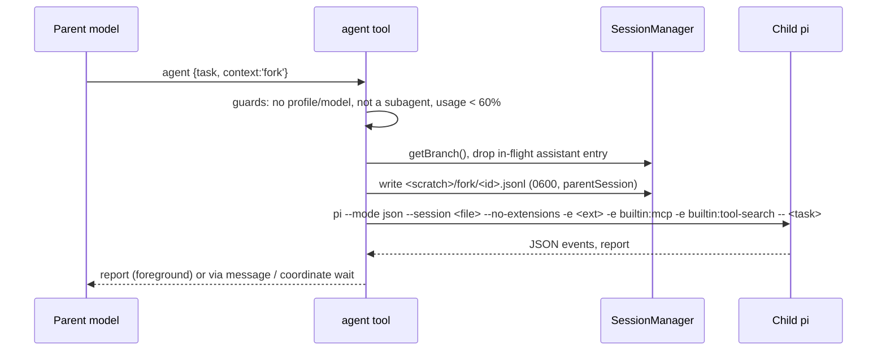

# 03 — Waiting for background agents, and starting a subagent with the parent's context

**Status:** Proposed. **Priority:** P2a wait — high; P2b context — medium.
**Owner area:** `src/subagents/*`, `src/team/tools.ts`. **Related:** [04 agents view](04-agents-view.md); 05 fan-out batches builds on the wait primitive; 01/02 define the `plan` profile and permission merge that forks inherit.

## 1. Problem and evidence

### P2a — no way to wait

A background `agent` call returns at once with `Started <id> in the background; its report arrives as a message.` (`src/subagents/tool.ts:333`). The report arrives later through `ReportQueue.flush()`, which calls `pi.sendMessage(..., { deliverAs: 'followUp', triggerTurn })` (`src/subagents/handoff.ts:93-104`). Costs seen in live sessions:

1. **Polling.** A parent with nothing else to do cannot block on a child. Models loop `bash sleep 60` + `coordinate list`. Each poll is a paid step that carries the whole context.
2. **One paid turn per late report.** Each report after the parent's turn ends wakes it (`handoff.ts:100`). Batching (`REPORT_BATCH_MS = 1_500`, `handoff.ts:65`) merges only reports within 1.5 s. Three children that finish minutes apart cost three turns.
3. **Already-read suppression is a workaround.** `ReadReports` (`handoff.ts:108-140`) skips the wake when the parent already read `<scratch>/report.md`, because models poll report files.

The limit refusal says "Wait for one to finish" (`tool.ts:68`) but gives no tool for it.

### P2b — every subagent starts cold

`task` says "no conversation is inherited" (`tool.ts:306`); the child runs with `--mode json --no-session` and the task as its only prompt (`src/subagents/process.ts:80-91`). For a side task that depends on a long discussion, the parent must restate everything in `task` (max `MAX_TASK_CHARS`). This costs output tokens, loses detail, and the child re-reads files the parent already has.

## 2. Competitor research

| Product | Wait / join | Context inheritance |
|---|---|---|
| **Codex CLI** (multi-agent v1) | `wait` tool over agent ids; default 30 s, clamped (`DEFAULT_WAIT_TIMEOUT_MS = 30_000`, [`multi_agents_common.rs`](https://github.com/openai/codex/blob/main/codex-rs/core/src/tools/handlers/multi_agents_common.rs)); returns final statuses ([`multi_agents/wait.rs`](https://github.com/openai/codex/blob/main/codex-rs/core/src/tools/handlers/multi_agents/wait.rs)) | `spawn_agent` `fork_context: bool` and `fork_turns` (`none`, `all`, last N) ([`multi_agents_spec.rs`](https://github.com/openai/codex/blob/main/codex-rs/core/src/tools/handlers/multi_agents_spec.rs)) |
| **Claude Code** | No model-facing wait; background results arrive as messages ([sub-agents](https://code.claude.com/docs/en/sub-agents)) | Fork "inherits the entire conversation so far", same system prompt, tools and model; "its first request reuses the parent's prompt cache"; "A fork can't spawn further forks"; `/subtask` ([sub-agents](https://code.claude.com/docs/en/sub-agents)) |
| **Claude Code agent teams** | Lead notified when teammates go idle ([agent-teams](https://code.claude.com/docs/en/agent-teams)) | Fresh |
| **OpenCode** | Child session (`sessions.create({ parentID })`), synchronous by default ([`task.ts`](https://github.com/anomalyco/opencode/blob/dev/packages/opencode/src/tool/task.ts)) | Task prompt only |

**Takeaways.** A bounded wait over ids (Codex) fixes polling. Wait must end early on user input. Forks pay off only with prompt-cache reuse or for context that is expensive to restate; Codex (`fork_turns`) and Claude Code (no nested forks) both bound the cost.

## 3. Pi API constraints

From `@earendil-works/pi-coding-agent` (`docs/`, `dist/core/extensions/types.d.ts`).

- **Tools can block.** `execute(id, params, signal, onUpdate, ctx)` may await for minutes; `signal` aborts on Esc (`app.interrupt`, `docs/keybindings.md`). `onUpdate` draws to the screen only.
- **Pending input.** `ctx.hasPendingMessages()` (`types.d.ts:244`). Team messages arrive as `deliverAs: 'steer'` (`src/team/session.ts:390-393`), so a child's question also counts.
- **Messages.** `pi.sendMessage(message, { triggerTurn, deliverAs })` (`types.d.ts:1519-1522`). A report returned inline by a tool needs no message.
- **Sessions.** `ctx.sessionManager` is read-only: `getSessionFile()`, `getBranch()`, `getLeafId()`, `buildContextEntries()` (`dist/core/session-manager.d.ts:178`). `SessionManager.create(cwd, sessionDir)` + `appendMessage()` / `appendCompaction()` write a session (`:263-271, 371`). CLI: `--session <path|id>`, `--fork`, `--session-dir` (`docs/cli.md`). Headers can carry `parentSession` (`docs/session-format.md`).
- **Usage.** `ctx.getContextUsage()` (`types.d.ts:248`).
- **Compaction.** After compaction the branch starts with a `compaction` entry whose `summary` replaces older messages ([COMPACTION.md](../COMPACTION.md)).

## 4. Design — P2a: `coordinate wait`

### 4.1 Where it lives

Action `wait` on `coordinate`, offered only where `stop` is (sessions with the `agent` tool, `src/team/tools.ts:64`). No new tool, so the tool list and cache prefix stay stable. `AgentControl` (`tool.ts:343-350`) gains `wait()`, called like `stop`.

### 4.2 Schema

```ts
// coordinate, action: 'wait'
ids?: string[]            // default: every background child of this session
mode?: 'all' | 'any'      // default 'all'
timeoutSeconds?: number   // default 600, min 5, max 1800
```

Result text:

```
Background subagent researcher-3fa9 finished (2m 10s · 14 tool calls · $0.08):
Task: map the auth flow
<report, capped at REPORT_MAX_BYTES with the full-report path>

Still running: implementer-91c0 (4m, → file src/auth.ts). Wait ended: timeout after 600s.
```

`details`: `{ finished: ResultDetails[], running: string[], ended: 'done'|'any'|'timeout'|'input'|'aborted' }`.

An id this session never started is an error that lists the background ids. An id whose report was already delivered returns `<id>: report already delivered (see its message)`.

### 4.3 Report ownership

Each background run gets `settled: Promise<Report>`, resolved before the report enters `ReportQueue`. `ReportQueue` gains `claim(id): Report | undefined` (removes an unflushed report) and a `claimed` set so `add()` drops a report a waiter took.

- Finishes **during** a covering wait: the waiter takes it. No `followUp`, no wake.
- Finished **before** the wait, still in the 1.5 s batch: `claim()` pulls it out.
- Already **flushed**: the wait returns the "already delivered" line.
- A returned report counts as read: `read.consume(id)`.
- Ids **not** covered keep the batched `followUp` path; they do not wake the parent during the wait because it is inside a tool call.
- Two waits over one id: the first to settle claims it; the other gets "already delivered by another wait".

### 4.4 Flow

```mermaid
sequenceDiagram
  participant M as Parent model
  participant C as coordinate wait
  participant R as AgentRuns / ReportQueue
  participant K as Child processes
  M->>C: wait {ids:[a,b], mode:'all', timeoutSeconds:600}
  C->>R: claim queued reports for a,b
  loop until done/any/timeout/input/abort
    K-->>R: a finishes → Report
    R-->>C: settled(a) (claimed, not queued)
    C-->>M: onUpdate "a done; waiting for b" (screen only)
    C->>C: every 500 ms: ctx.hasPendingMessages()?
  end
  C-->>M: tool result: reports a,b inline
```

### 4.5 Early exits

| Event | Behavior |
|---|---|
| `mode: 'any'`, one covered child finishes | Return its report, plus others finished in the same 1.5 s window |
| Timeout | Finished reports + `Still running: …` with each child's activity from the team row |
| `ctx.hasPendingMessages()` true (user, teammate or child message) | Return `ended: 'input'` with what finished. The model reads the steer and may wait again. Covers a child that blocks on a question to the parent |
| Esc (`signal` aborted) | Error "wait cancelled"; children **keep running** (stop is `coordinate stop` / `/agents kill`) |
| Covered child stopped or crashed | Its stop or failure report is returned |
| No background children | Return at once: "No background subagents are running." |

### 4.6 Cost

A blocked tool spends no tokens. Cost is the `wait` step plus one continuation step — the same as one wake, without "still waiting" turns. Provider prompt caches last minutes (Anthropic default 5 min); a longer wait resumes cold, as a late wake would. Default 600 s; the model may raise it to 1800 s. The parent can run `wait` beside other tool calls in one turn; Pi runs them in parallel.

### 4.7 Prompt changes

- `agent` description (`tool.ts:300-304`): "Background calls return an agent id; the report arrives as a message, or call `coordinate wait` when you have nothing else to do. Do not poll with sleep."
- Background start result (`tool.ts:333`): append "`coordinate wait` blocks until it finishes."
- Limit refusal (`tool.ts:68`): "call `coordinate wait` with `mode: 'any'`".
- Headless (`-p`) runs keep `settle()` (`tool.ts:347`) for unwaited reports.

### 4.8 Scope

Wait covers only children of the calling process (`runs.background`), including a subagent's own children. Siblings and grandchildren: use `sendMessage`. The external API (`src/api/*`) is unchanged.

## 5. Design — P2b: `context` on `agent`

### 5.1 Schema

```ts
context?: 'fresh' | 'summary' | 'fork'   // default 'fresh'
```

| Mode | Child gets | Cost | Use when |
|---|---|---|---|
| `fresh` | Task only (today) | Lowest | Self-contained work |
| `summary` | Digest before the task: latest compaction summary + last user and assistant **text** messages (no tool results, images or thinking), newest kept, max 24 000 chars, labelled `Parent context (read-only, may be stale)` | Small, fixed | Child needs decisions and intent, not file contents. Fan-out (doc 05) uses this mode |
| `fork` | Parent's active branch (post-compaction) as its session, then the task | Up to the parent's whole context | Side task needing the full discussion |

`summary` needs no model call, so it is deterministic. It excludes tool results, the main source of file contents and secrets.

### 5.2 Fork mechanics

1. Before spawn, read `ctx.sessionManager.getBranch()`. Drop the trailing assistant entry holding this `agent` call (a dangling `toolUse` breaks the provider request) and anything after it.
2. Write `<scratch>/fork/<session>.jsonl` with `SessionManager.create(childCwd, <scratch>/fork)`, header `parentSession` = parent file, then the kept entries (`appendCompaction` / `appendMessage`). Mode `0600`.
3. `buildAgentArgs` replaces `--no-session` with `--session <file>`. All other args stay, including `--no-extensions -e <extension> -e builtin:mcp -e builtin:tool-search` (`process.ts:83`). The task stays the trailing positional prompt.
4. Release deletes the fork file with the scratch folder, unless the scratch is kept.

Rules:

- **No `profile` or `model` with fork.** Either is an error that suggests `summary`; a different prompt or model changes behavior and loses any cache.
- **Size guard.** Refuse fork above 60% of the window (`ctx.getContextUsage()`); suggest `summary`.
- **No nested forks.** A subagent (`SUBAGENT_ENV` set) may not fork; `summary` is allowed.
- **`isolate: true`** writes the fork file with the worktree as cwd.
- **Permissions and plan mode** (docs 01/02): the child gets `OCTOCODE_PERMISSIONS_POLICY` like any child; in plan mode, fork runs with the read-only policy.

### 5.3 Cache cost

Claude Code forks hit the parent's cache because system prompt and tools match. Ours do not: the child adds the subagent prompt section and its own tool set (`process.ts:80-88`), so its first request is a cache miss at full input price. Until phase 4 measures this, docs and the tool description say fork costs the parent's context in input tokens.

### 5.4 Flow



### 5.5 User command

`/agents fork <task>` starts a background fork of the current conversation (like `/subtask`).

## 6. Edge cases

- **Abort during fork setup:** `finish()` removes the scratch and fork file (`tool.ts:323-338`).
- **Compaction during wait:** it runs between turns, so the result lands after it. Tool-result trimming keeps `Full report:` pointers ([COMPACTION.md](../COMPACTION.md)).
- **Session replaced or shut down during wait:** `session_shutdown` stops children (`tool.ts:274-281`); waits resolve with stop reports; the old session drops the result.
- **Child crash:** reported `failed`; wait returns it.
- **Concurrency cap:** wait holds no slot; a fork counts against `OCTOCODE_MAX_SUBAGENTS`.
- **Images in a forked session:** copied; the size guard covers the cost.

## 7. Files to change

| File | Change |
|---|---|
| `src/subagents/handoff.ts` | `ReportQueue.claim()`, claimed set, `settled` waiters |
| `src/subagents/tool.ts` | `AgentControl.wait()`; settled promise; `context` param, guards; description text |
| `src/subagents/context.ts` (new) | `summaryDigest(branch)`, `writeForkSession(branch, cwd, dir)` |
| `src/subagents/process.ts` | `buildAgentArgs` takes a session file instead of `--no-session`; keeps the builtin flags |
| `src/subagents/command.ts` | `/agents fork <task>` |
| `src/subagents/render.ts` | Wait result renderer |
| `src/team/tools.ts` | `wait` action and params, gated like `stop` |
| `docs/FEATURES.md`, `README.md` | Wait, context modes, costs |

## 8. Phased plan

1. **Wait (ship first).** All/any/timeout, claim, input and Esc exits, prompt text. Unblocks doc 05.
2. **Summary context.** Digest builder; no process changes.
3. **Fork context.** Fork writer, `--session` spawn, guards, `/agents fork`. Docs mark fork as costly.
4. **Fork cost gate.** Measure first-request cache hits and input tokens of `fork` vs `summary` on real tasks. Until this gate passes, prompts and docs do not recommend `fork` for wide use, and fan-out keeps `summary`. If cache misses dominate, try moving subagent-only instructions into the fork's first user message so system prompt and tools match the parent's; keep the change only if profile behavior holds in tests.

## 9. Test plan

**Unit**

- `ReportQueue`: claim stops `sendMessage`; `add()` after claim is dropped; unclaimed reports still wake.
- Wait: `all`, `any`, timeout with running list, `hasPendingMessages` → `ended: 'input'`, abort → error with children alive, unknown id → error, delivered id → one line.
- Digest: keeps compaction summary; drops tool results, images, thinking; 24 000 cap keeps newest.
- Fork writer: drops the in-flight entry; opens with `SessionManager.open`; mode `0600`; `parentSession` header.
- Args: fork args contain `--session <file>`, `-e builtin:mcp`, `-e builtin:tool-search`, no `--no-session`.
- Guards: fork + profile, fork + model, fork in subagent, fork over 60% → errors.

**End-to-end (fake child)**

- Two children finishing 5 s apart + `wait all` → one tool result, zero `octocode-agent-result` messages, zero extra turns.
- Fork child receives parent messages (fake child echoes its message count).

**Real Pi flow** (`pi --no-extensions -e dist/index.js -e builtin:mcp -e builtin:tool-search`)

1. Two background researchers, then "wait for both": one `coordinate wait`, no `bash sleep`, no extra turns, reports inline.
2. Type during the wait: `ended: input`, message handled.
3. Esc during the wait: children keep running in `/agents`.
4. `context: 'fork'` after a decision: the report shows the child knew it. Record input tokens vs `fresh` and `summary` (phase 4 gate data).

## 10. Open questions

1. Should FYI messages (`wake: false`) end a wait? Proposed yes; revisit if waits churn.
2. Is 600 s right for providers with other cache TTLs?
3. Offer `fork_turns`-style partial forks (last N turns) instead of the 60% refusal?

## 11. Out of scope

- Waiting on other sessions' agents or teammates (use `sendMessage`).
- Model-generated summaries.
- Resuming a finished child with new input.
- Batch spawning (doc 05) and token budgets (doc 06).
