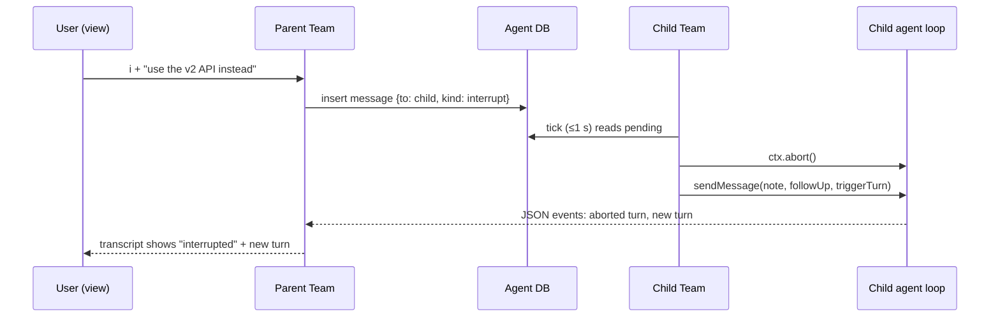

# 04 — `/agents` as a navigable view

**Status:** Proposed. **Priority:** P2.
**Owner area:** `src/subagents/*` (transcript, view), `src/team/*` (interrupt, panel), `src/agentdb/schema.ts` (message `kind`). **Related:** [03 wait and context](03-agent-wait-and-context.md) (forks reuse the child session folder added here); 01 permissions (its M4 relay shares the message `kind` column and can surface in this view).

## 1. Problem and evidence

The user sees that children run, not what they do, and steers them only with typed commands.

- **Panel is one line per agent.** `AgentsView` draws a static widget, at most 6 rows (`src/team/panel.ts:12, 146-227`). It cannot be focused or opened.
- **`/agents` is text commands:** `tell`, `kill`, `merge`, or a member list notification (`src/subagents/command.ts:16-20, 106-118`).
- **No transcript.** The child runs with `--mode json --no-session` (`src/subagents/process.ts:80`). The parent keeps a tool-call count, the last 5 activity lines and usage (`process.ts:196-219`, `tracker` in `src/subagents/tool.ts:170-190`), and the final answer (`src/subagents/report.ts`). Nothing replays after exit. `docs/FEATURES.md` says "Subagents keep their output in their own session folder"; that is the scratch folder, not a Pi session.
- **Steering is message-only.** User messages go through the team database and arrive as `steer` (`src/team/session.ts:390-393`), read at the child's next step. No interrupt stops the current step without killing the child. stdin is ignored (`process.ts:158`).

## 2. Competitor research

| Product | Navigation | Steering | Transcript |
|---|---|---|---|
| **Claude Code subagents/forks** | Panel below the prompt; ↑/↓, **Enter** opens transcript, **x** stops or dismisses, **Esc** returns ([sub-agents](https://code.claude.com/docs/en/sub-agents)) | Messages in an open transcript go to that agent; **Ctrl+Enter** makes it read the message now | In-process |
| **Claude Code agent view** (`claude agents`) | Table by state; **Space** peeks and replies; **Enter/→** attaches, **←** detaches ([agent-view](https://code.claude.com/docs/en/agent-view)) | Reply joins the queue; `/stop` | Persisted; `claude agents --json` |
| **Claude Code agent teams** | Idle rows hide after 30 s; >3 idle collapse into one row ([agent-teams](https://code.claude.com/docs/en/agent-teams)) | Select a row to review or send work | Per-teammate sessions |
| **OpenCode** | **Leader+Down** enters first child, **Right/Left** cycle, **Up** returns ([agents](https://opencode.ai/docs/agents), [keybinds](https://opencode.ai/docs/keybinds)) | Child is a normal session view | Persisted child session with `parentID` ([`task.ts`](https://github.com/anomalyco/opencode/blob/dev/packages/opencode/src/tool/task.ts)) |
| **Codex** | Subagents above the composer ([subagents](https://learn.chatgpt.com/docs/agent-configuration/subagents)) | `send_input` / `close_agent` ([`multi_agents_spec.rs`](https://github.com/openai/codex/blob/main/codex-rs/core/src/tools/handlers/multi_agents_spec.rs)) | In-process |

**Takeaways.** Two levels: a **list** with peek, and a **transcript**. ↑/↓, Enter, Esc everywhere; ←/→ to switch siblings. Three steering verbs: **message**, **interrupt**, **stop**. Transcripts outlive the child. Finished rows linger (30 s).

## 3. Pi API constraints

- **Custom UI.** `ctx.ui.custom(factory, { overlay, overlayOptions, onHandle })`; the factory gets `tui`, `theme`, `keybindings`, `done` (`dist/core/extensions/types.d.ts:121-130`). A focused overlay keeps input until `done()` or focus release (`docs/tui.md`). Use `matchesKey()`/`Key`, `tui.requestRender()`, `Focusable` and `CURSOR_MARKER` for inputs.
- **Shortcuts.** `pi.registerShortcut(key, { description, handler(ctx) })` (`types.d.ts:1190`). Taken by Pi: `escape`, `ctrl+c/d/z/g/v/l/p/t/o`, `shift+tab`, `ctrl+shift+n/t` (`docs/keybindings.md`). Doc 02 takes `ctrl+alt+p`.
- **Modes.** `ctx.hasUI` is false in print/JSON mode; RPC routes only dialogs (`docs/rpc-extension-ui.md`). The view is interactive-only.
- **Child events.** JSON mode emits `agent_*`, `turn_*`, `message_start/update/end`, `tool_execution_start/update/end`, `queue_update`, `compaction_*` (`docs/json.md`). We parse `tool_execution_start/end` and `message_end` today (`process.ts:198-219`).
- **Child interrupt.** Inside the child, `ctx.abort()` stops the current operation (`types.d.ts:242`). RPC mode has `steer`/`abort` over stdin (`docs/rpc-commands.md`); not chosen, because it changes the spawn and report contract.
- **Persistence.** `--session-dir <dir>` writes a session file; `pi --session <file>` reopens it (`docs/cli.md`).

## 4. Design

### 4.1 Transcript capture

**Live buffer (phase 1).** A `Transcript` per run (`src/subagents/transcript.ts`), fed from `handleLine`:

| Event | Item |
|---|---|
| `message_end` user / custom | `{ kind: 'in', text }` |
| `message_update` assistant delta | appended to the open `{ kind: 'say', text }` (throttled render) |
| `message_end` assistant | closes `say`; thinking collapsed |
| `tool_execution_start` | `{ kind: 'tool', name, hint, status: 'running' }` |
| `tool_execution_end` | same item: status, duration, first 400 chars of result |
| `compaction_end` | `{ kind: 'note', text: 'compacted' }` |

Text passes `sanitizeTerminalText`. Ring of 2 000 items or 2 MB; dropped items leave "… N earlier items". Kept in `AgentRuns` by id for 10 minutes after the child finishes.

**Persisted child sessions (phase 3).** Replace `--no-session` with `--session-dir <scratch>/session`; doc 03 forks use `--session <file>` in the same folder. All other args stay, including `--no-extensions -e <extension> -e builtin:mcp -e builtin:tool-search` (`process.ts:83`). The child writes a real session file, `0600`: full transcript after exit or restart, and `o` prints `pi --session <file>` to reopen it. The scratch sweep (`SCRATCH_MAX_AGE_MS`, 7 days, `src/subagents/handoff.ts:18`) still cleans it. By default the session folder is removed with the scratch on release; `OCTOCODE_SUBAGENT_TRANSCRIPTS=keep` keeps it, and `dropEmptyScratch` then treats `session/` as non-empty.

### 4.2 The view

Opened by `/agents` with no arguments (interactive) or **ctrl+alt+a**. Text subcommands (`tell`, `kill`, `merge`, new `show <id>`, `interrupt <id> [note]`) stay for scripts and non-UI modes. The bottom panel stays and adds the hint `ctrl+alt+a agents` when a child runs.

Overlay, 90% width/height:

```
┌ Agents — 3 running · 1 done · $0.41 · 3/3 slots ───────────────────┐
│ ● main-91c0          you                                         │
│ ›● researcher-3fa9  2m  → localSearch "auth"     ↑12k ↓1k  ✉ 1 │
│  ● implementer-77ab 4m  → file src/auth.ts        ↑40k ↓3k  ⚿ iso│
│    └ ● reviewer-0c1d 1m  model turn (grandchild: status only)    │
│  ✓ general-12ef     done 30s ago · report delivered             │
├ peek ─────────────────────────────────────────────────────────────┤
│ Task: map the auth flow                                        │
│ last: "Found two token paths; checking refresh…"               │
└ ↑↓ select  enter open  m message  i interrupt  x stop  esc close ┘
```

**List keys**

| Key | Action |
|---|---|
| ↑ / ↓ | Select; peek shows task, last assistant sentence, pending question |
| Enter / → | Open transcript (own children only) |
| m | Message (inline input; Enter sends, Esc cancels) |
| i | Interrupt with optional note |
| x | Stop (second press confirms); on a finished row, dismiss |
| g | Merge an isolated child's ref, with confirmation |
| o | Session file path and `pi --session` command (phase 3) |
| Esc | Close |

**Transcript keys**

| Key | Action |
|---|---|
| ↑ / ↓, PgUp / PgDn, Home / End | Scroll; End follows new output |
| ← / → | Previous / next own child |
| m / i / x | As in the list |
| t | Toggle tool result previews |
| Esc, or ↑ at top with empty input | Back to the list |

An overlay, not a session switch: `switchSession` replaces the parent session in this process (`types.d.ts:1661`), which would stop its tools and children.

Rows come from `team.snapshot()`, so grandchildren and collaborators show status. Transcripts exist only for this process's own children (it owns their stdout); a grandchild row says "status only". Finished children stay listed 30 s or until dismissed; their transcript stays openable 10 minutes (phase 1) or while the scratch exists (phase 3).

### 4.3 Steering semantics

- **Message (`m`)** = `team.send(id, text, { from: USER_SENDER })`, as `/agents tell`. Delivered as `steer`, before the child's next model call. A finished child's input is disabled: "finished — its report is in your conversation".
- **Interrupt (`i`)** = a team message with `kind: 'interrupt'`. The child's `Team.deliver` calls the captured `ctx.abort()` (a running bash or model stream stops), then sends the note with `deliverAs: 'followUp', triggerTurn: true`. Default note: "The user interrupted you; stop the current step, say where you are, and continue only if still useful."
- **Stop (`x`)** = `stopBackground(background, id, USER_SENDER)` or the foreground map (`command.ts:24`); the parent gets "cancelled by the user" without a wake.

**Message `kind` column (shared schema).** One agent-DB migration, v1→v2, adds `kind TEXT NOT NULL DEFAULT 'message'` to team messages, with values `message | interrupt | permission-request`. It is a new step appended to `MIGRATIONS` and `AGENT_SCHEMA_VERSION = 2` (`src/agentdb/schema.ts`). It ships with whichever lands first: this doc's interrupt (phase 2) or doc 01's M4 permission-request relay. The other reuses it with no further migration. Existing rows read as `message`. Unknown kinds are delivered as plain messages.



User text keeps `MESSAGE_MAX_CHARS` and is attributed to the user, so the child treats it as user steering, not peer information.

### 4.4 Edge cases

- **Esc with the view open:** the overlay owns Esc and closes first. Foreground children still follow the parent turn's signal.
- **Child compaction:** shown as a note; the live buffer keeps earlier items; phase 3 shows the session file's branch.
- **Child crash or idle kill** (`OCTOCODE_SUBAGENT_IDLE_MINUTES`): row turns red with the error; transcript stays.
- **Parent session replaced:** `session_shutdown` calls `done()` and stops children as today.
- **Concurrency cap:** the view adds no runs; the header shows slots used.
- **Many children:** list scrolls; more than 3 idle teammates collapse into one row.
- **Narrow terminals:** under 60 columns, hide token columns; under 40, list only.
- **Untrusted text:** child text, tasks and rows are sanitized and clipped (`panel.ts`, `safe()`).
- **Non-UI modes:** `/agents show <id> [n]` prints the last n (default 20) items.
- **Interrupt to a finished child:** refused, like a message.

## 5. Files to change

| File | Change |
|---|---|
| `src/subagents/transcript.ts` (new) | Ring buffer, event → item mapping, sanitizing |
| `src/subagents/process.ts` | Pass parsed events to an optional `onEvent`; phase 3 `--session-dir`, builtin flags kept |
| `src/subagents/tool.ts` | Transcripts in `AgentRuns`; `transcript(id)` on `AgentControl` |
| `src/subagents/view.ts` (new) | Overlay: list, peek, transcript, inputs |
| `src/subagents/command.ts` | `/agents` (no args, UI) opens the view; `show <id>`; `interrupt <id> [note]` |
| `src/subagents/handoff.ts` | `dropEmptyScratch` and sweep aware of `session/` |
| `src/agentdb/schema.ts`, `src/team/model.ts`, `src/team/store.ts` | Message kind; schema v1→v2 (shared with doc 01; only the first to land adds it) |
| `src/team/session.ts` | Interrupt delivery with captured `ctx.abort()` |
| `src/team/panel.ts` | Hint line; 30 s linger for finished rows |
| `src/index.ts` | `registerShortcut('ctrl+alt+a', …)` with UI, not in subagents |
| `docs/FEATURES.md`, `docs/CONFIGURATION.md`, `README.md` | View, keys, `OCTOCODE_SUBAGENT_TRANSCRIPTS`; fix the "own session folder" sentence |

## 6. Phased plan

1. **Read-only view.** Ring buffer, overlay with list/peek/transcript, ←/→, `x` stop, `m` message. Shippable alone.
2. **Interrupt.** `kind: 'interrupt'`, abort-and-continue in the child, `i` key, `/agents interrupt`. If doc 01 M4 has not shipped, this phase adds the v1→v2 `kind` migration; otherwise it reuses it.
3. **Persisted child sessions.** `--session-dir`, `o` key, transcripts after exit and restart, opt-in keep; shared with doc 03 forks.
4. **Polish.** Doc 01 `permission-request` messages shown in the peek with y/n; collapsed idle rows; JSON output for the external API.

## 7. Test plan

**Unit**

- Transcript: deltas merge, tool start/end pair by id, escapes stripped, caps by count and bytes, freed after 10 min.
- View: pure render of (state, width); ↑/↓ bounds, Enter opens own child only, ←/→ wrap, `x` needs two presses, Esc from transcript → list, Esc from list → `done`.
- Migration: a v1 file migrates to v2; old rows read `kind = 'message'`; a v2 file opens unchanged; the step runs once when docs 01 and 04 both use it.
- Interrupt: `kind` round-trips; child `deliver` calls `abort` then `sendMessage(followUp, triggerTurn)`.
- Phase 3 args: `--session-dir` replaces `--no-session`; `-e builtin:mcp -e builtin:tool-search` present.
- Shortcut registered only with UI and not in subagents.

**End-to-end (fake child emitting JSON events)**

- Background fake child: `transcript(id)` has its text and tool items, readable after exit.
- `/agents interrupt <id> note`: the fake child (real extension loaded) aborts and receives the note.

**Real Pi flow** (`pi --no-extensions -e dist/index.js -e builtin:mcp -e builtin:tool-search`)

1. Two background researchers; ctrl+alt+a; rows update; Enter opens one; → switches; text streams.
2. `m` "also check tests/": the child's next step mentions it.
3. `i` during a long bash in the child: it stops and continues with the note.
4. `x` twice: the child stops; the parent gets "cancelled by the user" without a new turn.
5. Phase 3: after the child finishes, `o` shows a path; `pi --session <path>` opens it.

## 8. Open questions

1. Enter on `main`: close the view, or inert?
2. Keep transcripts by default? Proposed: delete with scratch, opt-in keep.
3. Should an interrupt also clear the child's queued steers (Pi `clear_queue`)?
4. Is `ctrl+alt+a` reliable (macOS Terminal needs "Use Option as Meta")? Fallback is `/agents`.

## 9. Out of scope

- Attaching to a running child interactively (needs RPC-mode children).
- Dispatching new top-level sessions from the view.
- Other users' or sessions' agents.
- Changing the report or wait contracts (doc 03).
