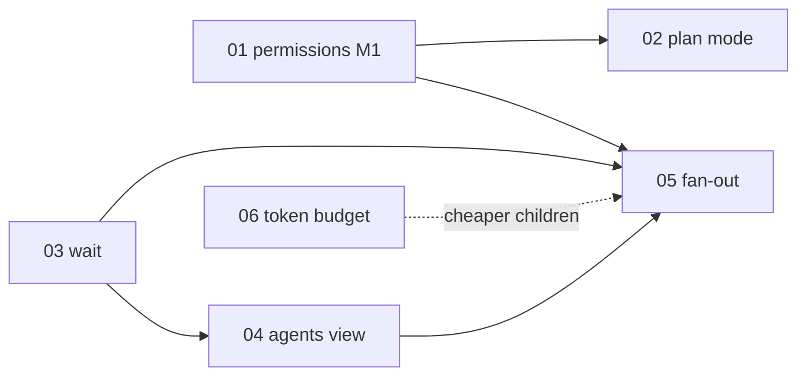

# Octocode for Pi — roadmap implementation docs

These documents design the next six features. Each one is based on research into Claude Code, Codex CLI and OpenCode, on Pi's extension API, and on the current code. Every document has the same sections: problem and evidence, competitor research (with citations), Pi API constraints, design, files to change, phased plan, test plan, open questions, and out of scope.

Status: **proposed**. Nothing here is built yet. The feature docs ([FEATURES](../FEATURES.md), [CONFIGURATION](../CONFIGURATION.md)) stay the authority for shipped behavior.

| # | Document | Priority | What it adds | Depends on |
|---|---|---|---|---|
| 01 | [Permission policy](01-permissions.md) | P1 | allow / ask / deny rules by tool, path and command pattern; global, trusted-project and per-profile layers; the strictest rule wins | — |
| 02 | [Plan mode](02-plan-mode.md) | P1 | `/plan`, `Ctrl+Alt+P`: read-only main session on the 01 engine; bundled `plan` profile; Execute / Save to backlog exit | 01 M1 (M1 can ship with its own small gate) |
| 03 | [Agent wait and context](03-agent-wait-and-context.md) | P2 | `coordinate wait` (all/any, timeout, reports inline, no extra wake); `agent` `context: fresh \| summary \| fork` | — |
| 04 | [`/agents` view](04-agents-view.md) | P2 | Overlay with child list and live transcript; message, interrupt, stop, merge; persisted child sessions | 03 (shares fork session files) |
| 05 | [Fan-out batches](05-fan-out-batches.md) | P2 | `agent` `items[]` + `/batch`: 5–30 worktree children, queued dispatch, independent verify, merge queue on an integration ref, resumable journal | 01, 03, 04 |
| 06 | [Token budget](06-token-budget.md) | P3 | Measured baseline; per-profile `mcpTools:` and `skills:`; graph tool deferred; upstream octocode-mcp schema merge (−27K chars) | — (05 multiplies its savings) |

## Order

Suggested delivery, each step shippable:

1. **03 wait (phase 1)**: small, and it removes the polling and the extra paid turns seen in real sessions.
2. **06 phases 0–1**: the measurement test and local narrowing. These are cheap and make every later child cheaper. Send the upstream schema proposal in parallel.
3. **01 M1 to M2**: the policy engine, bash segment matching and the ask dialog.
4. **02 plan mode** on the 01 engine, plus the `plan` profile.
5. **03 context** (`summary`, then `fork`) and **04 view** phases 1–2.
6. **05 fan-out**, after 01, 03 and 04 are in place.

## Shared contracts

The six documents agree on these names. Change them in every document at the same time.

| Contract | Value | Defined in |
|---|---|---|
| Profile frontmatter | `permissions:` (tighten-only), `mcpTools:`, `skills:` | 01, 06 |
| Policy to children | `OCTOCODE_PERMISSIONS_POLICY` (merged JSON, without session grants) | 01 |
| Headless `ask` | deny, with reason "needs approval; ask your parent via sendMessage"; optional relay to the parent with a 120 s timeout (`OCTOCODE_PERMISSIONS_RELAY_SECONDS`) | 01 |
| Modes | `default` / `auto` / `plan`; `OCTOCODE_PERMISSIONS_MODE`, `OCTOCODE_PLAN=1`; a project file can never set `auto` | 01, 02 |
| Shortcuts | `Ctrl+Alt+P` plan mode, `Ctrl+Alt+A` agents view (`Shift+Tab` and `ctrl+p` belong to Pi) | 02, 04 |
| Wait | `coordinate wait { ids?, mode: all\|any, timeoutSeconds ≤ 1800 }`; `ReportQueue.claim()` so a report is delivered once | 03 |
| Context | `agent` `context: fresh\|summary\|fork`; fan-out uses `summary`, never `fork` | 03, 05 |
| Team message kinds | `interrupt` (04) and `permission-request` (01 M4) | 01, 04 |
| MCP exposure | `OCTOCODE_MCP_EXPOSURE=default\|direct\|codemode` (replaces `OCTOCODE_MCP_DIRECT`), `OCTOCODE_MCP_TOOLS` (per tool) | 06 |
| Agent database | schema v5: team message `kind` column | 01, 04 |

## Settled decisions

| # | Decision | Evidence |
|---|---|---|
| 1 | **One agent-database migration, v4 → v5.** It adds a team message `kind` column (`message \| interrupt \| permission-request`). It ships with the first feature that needs it (04 interrupt or the 01 M4 relay); the other feature reuses it. | Both kinds change the team store. |
| 2 | **`OCTOCODE_MCP_EXPOSURE` replaces `OCTOCODE_MCP_DIRECT`.** Values are `default`, `direct` and `codemode`, and `OCTOCODE_MCP_TOOLS` still overrides single tools. There is no alias. | AGENTS.md: no compatibility shims. |
| 3 | **Profile `permissions:` is nested YAML.** There is no JSON-string fallback. | Pi's `parseFrontmatter` calls `yaml.parse` (`dist/utils/frontmatter.js`). Block and flow maps were tested and parse to objects. |
| 4 | **Octocode owns `--plan`, `/plan` and `Ctrl+Alt+P`.** These replace Pi's demo plan-mode extension. Do not load both: Pi reports the conflict. | The demo registers the same three (`examples/extensions/plan-mode/index.ts:53,141,158`) and loads only with `-e`. |
| 5 | **No `scripts/` change.** Measurement lives in `tests/token-budget.test.ts`: fixed budgets in CI, plus `OCTOCODE_TOKEN_REPORT=<session.jsonl>` for a breakdown of a real session. | AGENTS.md requires approval for scripts. |
| 6 | **The synced-skills cost is already fixed.** The recorded 50.5K session started before the exclusion. The repository baseline after the fix is about 32.7K tokens. | A fresh `pi -p` session in this repository does not list the `docx` synced skill. |
| 7 | **`fork` is gated on measurement.** A Pi fork does not share the parent's prompt cache, so 03 phase 4 measures the cost before `fork` is recommended for wide use. Fan-out always uses `summary`. | The child's system prompt and tools differ from the parent's. |

## Measured baseline (from 06)

| Setup | First-request input |
|---|---|
| Current configuration, test repository | ~30.6K tokens (12.2K without MCP) |
| The four direct Octocode tools | ~18.5K tokens (~57% of the request) |
| Real session in this repository, before the deferral change | ~50.5K tokens (27 skills ≈ 6.8K) |
| Same session with deferral and the synced-skills exclusion | ~32.7K tokens |
| Target after local changes / after the upstream schema merge | ≤ 26K / ≤ 19K |
