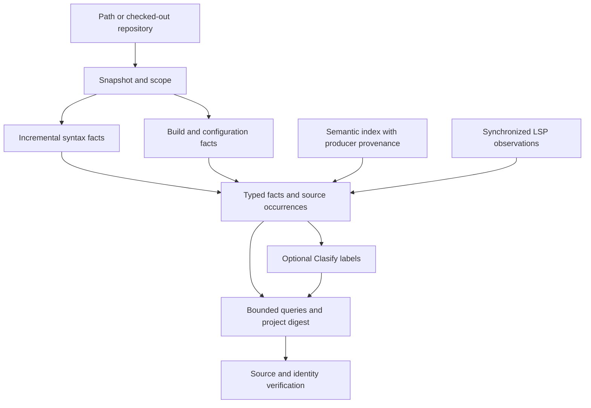

# Project graph research and Clasify reflection

Research started 2026-09-27; follow-up fixes and verification completed 2026-09-28. This records research, corrective changes and exploratory evaluation; no persistent project-graph service was added.

**Decision:** build a queryable project digest on the existing graph machinery, with separate syntax, resolved-symbol, build/configuration, and architectural-label layers. Use Clasify selectively to locate unfamiliar semantic evidence or assign reviewable labels. Exact search, graph algorithms and LSP already answer many research questions more directly.

## Follow-up fixes and verification

The second pass changed the sibling `octocode-core`, regenerated the shared contracts, rebuilt native/CLI/MCP, and exercised the real interfaces. Output schemas remain internal: the live catalog check covers all 16 CLI tools and 14 MCP tools, with no exported `outputSchema`.

| Finding | Correction and evidence |
| --- | --- |
| Unsupported SCIP promise | Removed `rustWorkspace:"scip"` from core. `syntax` and `cargo` explicitly describe syntactic evidence. Both core and live MCP reject SCIP rather than returning ordinary syntax under a semantic mode. |
| Cargo freshness and alias scope | Removed the incomplete five-minute metadata memo. Each graph build refreshes bounded offline metadata; aliases resolve within the importing package, with two-pass library discovery. Undeclared siblings, registry-name collisions and conflicting conditional targets cannot fabricate local edges. All 38 graph tests pass; six live checks verify different same-name aliases and a member-manifest change in one MCP session. |
| Graph terminology and identity | Core/docs now distinguish alternate-path edges, direction-dependent topological layers and test retention roots. Source generation and declaration IDs explicitly promise source identity and local occurrences. No production semantic-reuse caller was found; a regression test proves different provider configurations may share source generation but differ in full snapshot identity. A future persistent resolved graph still needs configuration-aware identity. |
| LSP schema selection | CLI selection follows local references and enum membership; selecting `operation=definition` or `variant=anchored` works. Defaults do not masquerade as selector values. |
| File-discovery friction | Files mode already includes hidden entries; its core description now says so. No redundant hidden-field switch was added. |
| Clasify verification promises | Core, skill and docs describe bounded source windows, which may omit the deciding statement. Expand or follow the source when necessary; a high score does not replace verification. Provider usage is not assumed free or zero when unavailable. |
| Paginated evidence and evaluation | The grader now verifies the deciding source line in actual model-visible structured or numbered-text reads, normalizes the promised answer types, and rejects wrong paths/lines or evidence supplied only by Clasify. It does not invent read facts from shared envelope fields. Catalogs are frozen and checked on every session; credentials are removed in `finally`. Original V1 scores remain unchanged. |
| Skill-listing slowdown | Freshness compares path sets and sizes before bytes, stops at the first mismatch, and compares aliased installations once per check. Cycles and unreadable trees stay unknown; there is no persistent cache to hide edits. All 180 CLI tests pass; the rebuilt real list command completed in 1.49 seconds for 16 skills. An earlier 78-second unit-test timeout used a different setup, so it is not a controlled speed ratio. |
| Stale guidance | Removed missing AST/LSP skill references and corrected response-pagination and Clasify output/accounting docs. Canonical Clasify skill review and documentation-link checks pass. |

Verification receipts: [all-tool live acceptance](.octocode/tmp/graph-fixes/all-tools-acceptance.json) (**57/57**, including live provider/GitHub, CLI clone/rewrite, continuations and CLI/MCP consistency), [same-session Cargo checks](.octocode/tmp/graph-fixes/cargo-live-receipt.json) (**6/6**), [Rust suite](.octocode/tmp/graph-fixes/rust-tests.log) (**1,777 passed**, two existing manual checks ignored), and [all-tool field inventory](.octocode/octocode-dev/graph-fixes-tool-inventory.json). Core has 341 passing tests, config 259 and MCP 224; contract regeneration/sync, builds, and full-workspace Rust Clippy with warnings denied pass. Inventory zero-hit candidates were traced to shared implementations, not removed blindly.

Cargo metadata now runs per graph query: correctness improves at the cost of a small subprocess on Cargo-aware queries. The parsed-source cache remains. Conditional graph evidence is conservative and syntactic; it does not represent one active build configuration.

Native verification initially stalled while loading `seq-macro`; even code-signature verification of that local artifact timed out. Disabling incremental compilation and refreshing that dependency did not resolve it. A fresh platform target using Apple's default linker completed successfully. This was an invocation-only workaround; no global settings, security checks or repository linker configuration changed. There is no observed red-test run for the new Cargo regressions, because the initial compiler never reached them; the final unit and live checks are green.

## What worked

| Observation | Why it matters |
| --- | --- |
| AST topology found useful dependency, dependent, path, cycle and reachability candidates in TypeScript and Rust. | Start research with a bounded graph query, then inspect deciding edges. A whole-repository LLM pass is unnecessary. |
| Live LSP resolved `loader.ts:3 getOctocodeHome` to `home.ts:13`; the parent repeated this successfully with `serverAvailable:true`. Workers also verified a TypeScript re-export and a Rust re-export. | Syntax anchors can feed identity-aware verification. Keep provider and workspace scope with the answer. |
| Generated-file scan failure was explicit. Narrowing config from its package root to `src` produced complete syntactic coverage: 15 files, 176 resolved imports, 11 external, zero unresolved/unsupported. | Useful partial results are possible when omissions remain visible. Narrowing scope changes what “external” means. |
| Exact continuation replay worked; graph results and diagnostics have separate pagination. | Reuse the existing continuation contract. Do not replace it with prose telling an agent to guess a page. |
| Existing typed graph model already has evidence, coverage, semantic observations and generation checks. | Extend these boundaries before adding another graph representation or database. |
| A worker used one Clasify matrix over two unread large files to narrow cache and unresolved-import investigation. Another worker skipped Clasify when exact anchors and deterministic graph/LSP evidence settled its questions. | Smart usage includes both admission and omission. Call count alone is not a success metric. |

These are bounded observations. The worker's Rust reference result reported `exhaustive:false`; it cannot establish global absence. Live local timings were not controlled performance measurements.

## Initial findings before the follow-up fixes

| Finding | Evidence and consequence |
| --- | --- |
| **Confirmed live contract mismatch: `rustWorkspace:"scip"`.** | The advertised mode promises rust-analyzer reference edges. Parent runs over the engine crate returned JSON-identical syntax and SCIP responses: 123 scanned files, two dependency rows, syntactic/lexical-occurrence basis. All seven diagnostics were read; none reported SCIP availability. Treat this mode as unverified semantic capability until the implementation or contract is corrected. [Receipts](.octocode/benchmarks/graph-research-v1/live-evidence.json). |
| `transitiveEdge` does not mean an indirect import. | It marks a condensation edge whose destination is also reachable by another successor. A distance-one edge can have this flag. [Algorithm](packages/octocode-native/crates/engine/src/graph/algorithms.rs#L386). |
| `topologicalLayer` is not an architectural layer. | Dependents reverses the graph before computing condensation layers. The number depends on the query's orientation. [Traversal](packages/octocode-native/crates/runtime/src/tools/ast_graph/analysis.rs#L196). |
| `includeTests:false` is narrower than its casual reading. | It removes tests as retention roots; the worker still observed a `cfg(test)` module reachable through syntactic module edges. This is not an active-build runtime reachability filter. |
| Current snapshot generation is insufficient for a reusable resolved graph. | The generation digest serializes `(root, schema, files)`. Build flags, resolver configuration, dependency versions and provider identity need explicit invalidation inputs for semantic reuse. [Digest](packages/octocode-native/crates/engine/src/graph/model.rs#L882). |
| AST declaration IDs are occurrences. | IDs include file, name, byte offset and kind. Prepending source changes identity; wrapping the ID as a symbol does not make it a canonical binding. [Construction](packages/octocode-native/crates/engine/src/signatures/graph_facts/mod.rs#L683). |
| Cargo metadata freshness is bounded by a five-minute TTL. | The cache watches only root manifest/lockfile size and modification time. Member-manifest changes need stronger invalidation before promising a current project digest. [Cache](packages/octocode-native/crates/runtime/src/tools/ast_graph/graph.rs#L1206). This limitation was source-verified; a member-edit regression fixture was not run. |
| Clasify's selected verification window can miss the deciding declaration. | The worker received `exists=0.84` and lines 164–172 for symbol identity; `NodeId::symbol` begins at 180 and the real occurrence-ID construction is in another file. Source verification corrected the implication. One observation is not a calibrated accuracy estimate. |

At the initial research cutoff, cross-package Cargo alias collision was a hypothesis. The follow-up added the two-package regression and corrected the resolver, as recorded above.

## Architecture to implement

This is an engineering synthesis of primary documentation and the inspected implementation.

| Layer | Store | Query or guarantee |
| --- | --- | --- |
| Snapshot | Root/revision, dirty content hashes, indexed paths, exclusions, generated inputs, configuration and tool fingerprints, failures | Every answer names its snapshot and configuration. Publish atomically; distinguish partial from complete. |
| Syntax | Files, declaration occurrences, containment, spans, import expressions, call-site shapes | Fast discovery and candidate file topology. Reuse parsing independently of semantic resolution. |
| Build | Packages, versions, configured targets, compiler arguments, generated-source relationships | Keep alternative configurations separate; a union can invent a path no real build contains. |
| Resolved semantics | Producer-qualified symbols, occurrences, binding/reference/call/override relations and evidence | Join through verified identities and spans, not equal display names. Record unsupported and unresolved relations. |
| Live overlay | LSP capability, synchronized document version, server/configuration identity and result | Targeted fresh verification. Do not silently combine stale indexed facts with edited documents. |
| Architecture | Explicit component rules, permitted dependencies, optional inferred labels with evidence/model/prompt identity | Declared policy and inferred meaning remain distinguishable from observed dependencies. |
| Serving | Forward/reverse indexes, bounded traversal, coverage and executable continuations | Overview, dependencies, impact candidates, paths, cycles and source-backed explanations. Internal typed output; no exported MCP output schema. |

Begin with the existing in-process snapshots and indexes. Add persistent storage only after measuring repeated-query cost and invalidation correctness. SCIP is an interchange format, explicitly separate from query storage; its design supports document-level incremental ingestion and leaves bidirectional serving to a query engine. It does not require adopting a graph database. [SCIP design](https://github.com/scip-code/scip/blob/08b592d981d675d46de9301b50c66ed9064dc759/docs/DESIGN.md).

Tree-sitter can reuse edited trees and parse included ranges for embedded languages; the application still owns relationships between those languages. Syntax reuse alone does not establish semantic cache validity. [Tree-sitter](https://tree-sitter.github.io/tree-sitter/using-parsers/3-advanced-parsing.html).

Build context is part of meaning: Clang records working directories and compilation arguments and allows several configurations for one source file. Bazel distinguishes possible dependencies from configured targets. Preserve these contexts rather than flattening them into one graph. [Clang compilation database](https://clang.llvm.org/docs/JSONCompilationDatabase.html#format), [Bazel cquery](https://bazel.build/query/cquery).

Use typed relations: references, imports, calls, implicit calls, overrides and generated relationships answer different questions. Kythe's schema also allows identities that change across input versions. [Kythe schema](https://kythe.io/docs/schema/).

LSP call hierarchy is capability-dependent and uses prepare followed by incoming/outgoing requests. Document state must be synchronized before querying. An LSP overlay is therefore a targeted service, not a universal complete repository export. [Call hierarchy](https://github.com/microsoft/language-server-protocol/blob/de9a671ae6ba374cc748a29c1c620cbc536302ff/_specifications/lsp/3.17/language/callHierarchy.md), [Synchronization](https://github.com/microsoft/language-server-protocol/blob/de9a671ae6ba374cc748a29c1c620cbc536302ff/_specifications/lsp/3.17/textDocument/didChange.md).

## Research flow for a path or repository

1. Establish the checkout, revision/dirty state, workspace boundaries and relevant build configurations. For a repository URL, obtain a pinned checkout before local analysis.
2. Discover paths with `structureSearch`; find exact strings with `localSearch`; get declarations and spans with `astSearch`. Read only the needed configuration and source windows.
3. Query `astTopology` for candidate dependencies, dependents, paths or cycles within an explicit root. Rehydrate `base` paths and envelope `shared` fields when storing rows.
4. Verify consequential edges with `localFetch` and identity-aware `lspSearch`. A reference is not necessarily a call; a static call graph is not complete runtime behavior.
5. Use Clasify only when an unresolved semantic question will change the next read or decision. Batch shared evidence questions as `resources × questions`, within the cell budget. Keep unrelated question sets separate.
6. Read the returned verification window and expand or follow the source when it does not contain the deciding statement. Follow `next.clasify` when coverage is partial; retain errors and partial pages. A high score is not proof.
7. Answer with evidence provenance, snapshot/configuration and coverage. No hits in a bounded graph or partial page cannot justify deletion or global absence.

For Clasify, compare the expected direct-reading work avoided with its schema, provider, verification and retry cost. File length or a failed literal search alone does not justify a call. Already supplied facts and exact symbol lookups are useful negative controls.

## Implementation sequence and acceptance checks

1. Correct the SCIP capability mismatch or explicitly report unavailable/incomplete semantic indexing. Test the actual CLI path and relevant configurations.
2. Define snapshot/configuration identity and invalidation before making persistent digest promises. Test source edit, rename, deletion, member manifest, resolver config, package exports, features and generated inputs independently.
3. Expose a small digest plus bounded queries over existing graph structures. Runtime currently constructs the richer `CodeGraphBuilder` only for drift; preserve this useful cost boundary until measurement supports broader materialization. [Construction](packages/octocode-native/crates/runtime/src/tools/ast_graph/graph.rs#L98).
4. Test typed-edge precision on aliases, equal names, overloads, macros, dynamic imports and generated code. Report precision/recall by relation and provenance, not one universal graph score.
5. Test stale snapshots between result/diagnostic pages, configuration changes and missing providers. Measure cold/warm latency, bytes hashed, files reparsed, memory and provider usage separately. The parsed-fact cache saves extraction work but every current scan still reads and hashes input. [Cache key](packages/octocode-native/crates/engine/src/graph/mod.rs#L226).

## Paired evaluation results (V1, preserved)

Eight fresh `gpt-6-astra` / high-effort sessions compared three read tools with the same tools plus optional Clasify. Canonical instructions reflected the available catalog. The four paired cases used verbatim graph source: parsed-fact reuse, evidence-graph materialization, snapshot identity and an exact-symbol control. No output schema was exported by either MCP catalog.

| Metric | Without Clasify | Optional Clasify |
| --- | ---: | ---: |
| Valid isolated sessions | 4/4 | 4/4 |
| Source-verified answers, post-hoc audit | 4/4 | 4/4 |
| Original exact-string grader | 1/4 | 1/4 |
| Host input + output tokens | 296,723 | 252,509 |
| Cached input tokens, included above | 210,688 | 158,976 |
| Tool calls | 9 | 7 |
| Clasify calls | 0 | 3 |
| Tool errors | 0 | 0 |
| Empty reads | 2 | 0 |
| Summed trial wall time | 94.70 s | 88.09 s |
| Provider tokens | — | Unknown |

Optional Clasify used **14.9% fewer total host tokens** and **7.0% less summed wall time** in this sample. It selected all three semantic-location cases and skipped the exact-symbol control. Each selected top window contained the deciding statement, followed by a direct source read. The snapshot case still used 5.9% more host tokens and took longer; Clasify did not help every semantic lookup.

**This is promising exploratory evidence, not a confirmed performance win.** The frozen grader imposed unspecified comma spacing and rejected a valid qualified enum name. It also missed source evidence available in numbered text when response pagination omitted structured rows. The original `BENEFIT_NOT_DEMONSTRATED` report is preserved; a separate audit confirms all eight substantive answers and exact citations. That calibration is post-hoc, so it does not retroactively satisfy the frozen acceptance gate.

The sample is small, selected from known public source, and includes only source navigation. It does not measure end-to-end graph research, graph precision, statistical variance or billed cost. Cached input differed, and provider usage is unavailable. Even the one-call exact control had materially different token totals, so the aggregate reduction cannot be attributed entirely to avoided reads. A stronger next experiment freezes normalized field grading first, then uses fresh repositories/questions and repeated counterbalanced trials.

Reproduce the recorded results from the [manifest and original report](.octocode/benchmarks/graph-research-v1/report.json); inspect [the independent grading audit](.octocode/benchmarks/graph-research-v1/audit.json) and [live graph/LSP receipts](.octocode/benchmarks/graph-research-v1/live-evidence.json). The source-only benchmark build and package verification passed: 19 TypeScript tests, 67 Python comparison tests and 97 advanced-research tests. Six frozen-grader checks, five audit checks, existing scope/grading checks and the offline app-server isolation check also passed.

## Fresh evaluation (V3, corrected frozen grader)

The fresh eight-trial run used the same four development-selected public-source questions, a corrected rubric frozen before execution, and a catalog checked against every startup event. All eight sessions were valid, all eight answers were source-verified, and there were zero tool errors. This is a fresh run, not a held-out task set.

| Metric | Without Clasify | Optional Clasify |
| --- | ---: | ---: |
| Correct / valid sessions | 4/4 | 4/4 |
| Host input + output tokens | 229,935 | 251,380 |
| Cached input tokens, included above | 161,152 | 183,680 |
| Tool calls | 5 | 7 |
| Clasify calls | 0 | 3 |
| Tool errors | 0 | 0 |
| Summed trial wall time | 73.39 s | 78.88 s |
| Provider tokens | — | Unknown |

**Verdict: `BENEFIT_NOT_DEMONSTRATED`.** Optional Clasify used **9.33% more host tokens** and **7.49% more observed wall time**. It again skipped the exact-symbol control and correctly located semantic evidence, but two questions that the baseline answered in one read took classification plus a verification read. Correct routing away from the literal control is useful; it does not establish that the three semantic calls were economical. Native validation also ran concurrently, so wall time is descriptive rather than an isolated latency benchmark.

The direction reverses V1's exploratory savings. Keep both receipts; do not average away the failed gate or broaden mandatory Clasify use. Evidence sufficiency and expected avoided work must decide admission. Provider usage remains unknown and cached input differs, so neither run establishes billed savings or a general accuracy estimate. The corrected harness and product fixes remain valuable independently of the efficiency result.

An intermediate V2 consumed one valid baseline answer before an overly strict harness guard rejected two identical MCP startup catalogs. V2 is preserved as `INCONCLUSIVE`. The corrected rule requires at least one observed catalog and requires **every** observed catalog to equal the frozen catalog; tests cover repeated identical catalogs and changed catalogs. V3 then started eight new sessions without retries or result-driven prompt changes.

The final benchmark package verification passed all 183 tests plus grader/scope/app-server selftests. Frozen source/catalog checks pass; no V2/V3 copied credentials or trial processes remain.

[Fresh V3 report](.octocode/benchmarks/graph-research-v3/report.json) · [V2 incomplete report](.octocode/benchmarks/graph-research-v2/report.json). The graph-research-v1 evaluation protocol was removed with the old benchmark campaigns; it remains in git history.

## Method and friction

The initial research used three independent read-only workers for primary-source practices, live AST/LSP probes, and implementation/cache review. The parent re-read deciding cache/identity/layer statements, repeated a live LSP definition, compared syntax and SCIP with complete diagnostics, and integrated the findings after all workers completed. No worker edited production code during that initial phase. The follow-up used separate core/schema, runtime and evaluation lanes, with parent integration and live verification. No graph database or new graph API was added by this research.

Manual counting of source windows produced off-by-one anchors. Exact lookup and frozen fixture offsets confirmed the cache key at line 226 and conditional graph construction at line 98. Recheck summarized evidence and use returned source-line metadata before publishing exact citations.

Initial friction, addressed in the follow-up table: AGENTS referenced missing AST/LSP best-practice skill files; `structureSearch` files mode rejects the tree-only `hidden` field; selecting the LSP `definition` schema branch by `operation` returned no branch despite a valid operation, so the full query schema was needed. User-local obsolete configuration keys emitted repeated warnings. These are recorded without changing the user's global configuration.

The frozen evaluation protocol (graph-research-v1, since removed; see git history) isolates source-navigation routing from graph correctness. All examples are development-selected public source, not held-out tasks. Expected answers remain outside solver roots; tool access is restricted to the copied source. Provider token usage is unavailable, so this evaluation cannot establish total cost savings.

## Core instructions and GitHub research refactor (2026-09-28)

The latest pass reviewed all 16 tool contracts and selection boundaries, consolidated shared file-reader fields in core, removed duplicated pagination prose, and made Clasify admission conditional on decision-changing semantic ambiguity or an explicit classification request. The opening instruction now permits independent batched evidence needs instead of prescribing one question per call. Fixed grammar-selector guidance belongs with the AST field; the runtime grammar inventory still supplies language availability and the parser/LSP boundary. Output schemas remain absent from public catalogs; core-owned internal output types remain intact.

The native correction removes an aggregate matrix-size rejection that incorrectly aborted valid sibling work. The existing 4 MiB limit still applies to each serialized provider request after projection. A regression sends 25 valid Unicode resources whose aggregate exceeds 4 MiB, an oversized question, and a healthy sibling: valid requests reach the mock provider, the oversized request receives its own error, and siblings survive. The fixture's trace metadata stays within the separate security limit; this does not authorize unbounded trace input.

**Good:** shared MCP instructions shrank from 3,553 to 2,975 UTF-8 bytes (16.27%); full CLI instructions from 4,505 to 3,378 bytes (25.02%). Combined reader schema source shrank from 177 to 123 lines. All 16 input contracts retain their structural constraints, and both reader schemas remain exactly identical, including descriptions. These are source/payload-size improvements, not measured workflow token savings.

**Bad / not demonstrated:** the frozen 10-question GitHub evaluation missed its efficiency gate. Both arms answered 10/10 correctly from verified pinned sources, with zero tool errors, but actual host input plus output tokens rose from 526,666 to 538,637 (+2.27%; target was at least 5% reduction). Calls rose from 11 to 13. One two-source question used extra tree/read navigation; that observation does not establish causality. Neither arm invoked Clasify, so this run says nothing about its provider efficiency or the corrected capacity boundary.

Keep the independently justified contract deduplication and correctness fixes without claiming an end-to-end performance win. Do not tune against these now-observed questions or relabel this public, development-selected sample as held-out. Provider usage is unknown, cached input differs, and concurrent native checks make wall time descriptive. All 20 authorized trials ran once, without retries or candidate tuning; the frozen subjects and all observed startup catalogs matched.

Verification caught two stale tests that required the old one-question wording and aggregate preflight cap. They now check tool availability and the actual provider-boundary regression rather than preserving obsolete prose or rejection behavior. A baseline launcher failure was not reproduced in three direct runs or the focused suite; the final full CLI suite passes.

Final checks passed: core 340 tests, native 1,778 (two existing manual tests ignored), CLI 180, MCP 224, config 259, and 57 live all-tool acceptance checks. Full native Clippy, formatting and crate-boundary checks passed. Parent replay confirmed all 14 evaluator checks, 20 answers/usage receipts and 40 catalog observations; workers and trial processes completed, with no copied credentials remaining.

The [ten questions, answers, pinned citations and usage receipts](.octocode/benchmarks/github-research-refactor/REPORT.md) preserve the failed performance gate. The [integrated audit](.octocode/octocode-dev/2026-09-28-github-refactor.md) records build, schema and live-tool checks. No commits were created.
