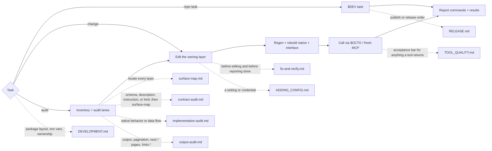

# Octocode Dev

tools: `node skills-dev/octocode-dev/scripts/dev.mjs <task>` (`$DEV`) · `yarn workspace <pkg> <script>` · `node packages/octocode/out/octocode.js` (`$OCTO`) · Octocode MCP
output: working-tree edits; audit reports in `<repo>/.octocode/octocode-dev/`; none for plain task runs

A plain task run reports its exit code. Dotted edges name the trigger that loads a `references/` or `docs/` page. The tool-output acceptance bar also reads `<repo>/docs/TOOL_DATA_CONTRACT.md`.

Paths: `<repo>` is the monorepo root. `CORE` is `../octocode-mcp-host/packages/octocode-core`. Bare `docs/` paths are this skill's docs. Route open native design to `rust-best-practices` and doc rewrites to `octocode-documentation`.

## Hard rules

- Never `git commit` or `git stash`. Leave changes in the working tree.
- Contracts have one pipeline: edit CORE → build core → `yarn contracts:regen` → `yarn workspace @octocodeai/octocode-native build:dev`.
- Never hand-write a tool wire type (TS interface, Zod copy, or serde query/result struct). Never hand-edit `packages/octocode-config/contract/`. Never add tool logic or guidance to an interface package.
- Declare and implement each new contract field or discriminator in `crates/runtime/src/contracts/field-effect-coverage.json`.
- Config flows through `@octocodeai/config`. Never reimplement home, env propagation, or `.env` parsing.
- Never lower coverage floors or special-case tests.
- After a native, engine, or CLI change: `yarn workspace @octocodeai/octocode-native build:dev` → `yarn workspace octocode build:dev` (or `octocode-mcp`) → `$OCTO config --json && $OCTO scheme` → call the changed tool.
- An MCP server started before the rebuild serves the old contract. Restart it before you judge behavior.
- A core/native fingerprint mismatch means regenerate and rebuild. Never use `OCTOCODE_ALLOW_CONTRACT_DRIFT`.

## Task runner

Root `package.json` keeps only `build:native:all`, `platforms:check`, `lint:fix`, `test:quiet`, `contracts:regen`. Run every other repo task with `$DEV`. Extra arguments pass through; `$DEV --help` lists all tasks.

| Need | Command |
|---|---|
| Fast local build (default) | `$DEV build:dev` |
| Release build (slow) | `$DEV build` |
| Tests / lint / typecheck | `$DEV test` · `$DEV lint` · `$DEV typecheck` (`:ci` variants skip benchmark) |
| Full repo contract before handoff | `$DEV verify` |
| Docs links, catalog, config keys | `$DEV docs:verify` |
| Workspace scripts present / outputs built | `$DEV health:check` · `$DEV check-outputs` |
| Disk cleanup | `$DEV clean:cache` (stale native copies, deps stay warm) · `$DEV clean` (all build outputs) |
| One range per external dependency | `$DEV deps:dedupe` (`--fix` rewrites) |
| Local dev resolutions | `$DEV setup` then `yarn install` |
| Publish guard | `$DEV prepublish` (`--fix`, `--dry-run`); CI build: `$DEV build:ci` |
| One package | `yarn workspace <pkg> <script>` |

When a script flag or path rule is unclear, read `scripts/README.md`. Scripts:

| When | Script |
|---|---|
| `run <script>`, `verify`, `check`, `report`, `check-outputs`; after editing it run `node --test skills-dev/octocode-dev/scripts/workspace-health.test.mjs` | `scripts/workspace-health.mjs` |
| Debugging the `docs:verify` gate | `scripts/docs-verify.mjs` |
| Dedupe flags beyond `deps:dedupe` | `scripts/dedupe-deps.mjs` |
| Local resolutions on (`setup`) / off before publish | `scripts/dev-setup.mjs` / `scripts/prepublish.mjs` |
| Starting a tool audit | `scripts/tool-inventory.mjs [tool] [--json]` |
| Library for the `octocode-mcp` build; not run by hand | `scripts/esbuild-package.mjs` |

## Audit a tool end to end

1. Map: run `scripts/tool-inventory.mjs <tool>`. Locate every layer with `references/surface-map.md`.
2. Work the lanes in order; load each reference only while you work it: contract → implementation → output.
3. When a finding is confirmed, fix the owning layer and verify with `references/fix-and-verify.md`.
4. Write the report from `assets/audit-report.md` to `<repo>/.octocode/octocode-dev/<tool>-<date>.md`. Give each finding `path:line`, severity, evidence, fix, and the verification command and result.

A multi-tool audit may run one subagent per tool. Give each the tool name, this skill path, and the report template.

## Done gate

- The owning layer changed. Generated outputs were regenerated, not edited. New fields are covered.
- `$DEV build:dev` (or the package build) exited 0. The changed path ran through `$OCTO` or MCP.
- Focused tests pass. Before a handoff that spans packages, `$DEV verify` and `$DEV docs:verify` pass.
- Report the exact commands and results. Name anything not verified.
