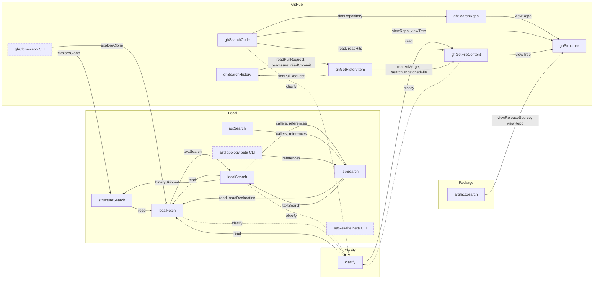

# Tool connections

Which tool leads to which. Every `next.*` page and `hints.*` lead is a ready `{tool, query}` call: its `query` is already the whole `{queries:[…]}` input, so pass it unchanged. This page lists each one, the fields it sets, when it appears, and what filters it out. The flow rules are in [OCTOCODE_WORKFLOWS.md](../../../docs/OCTOCODE_WORKFLOWS.md); the envelope is in [TOOL_DATA_CONTRACT.md](../../../docs/TOOL_DATA_CONTRACT.md).

## Map

Solid arrows are `hints.*` leads to another tool. Dashed arrows need a condition (clasify key, a wide or large read). Every tool also pages itself with `next.*` (see [Pages](#pages)); self leads are left out.

Entry tools (nothing leads to them, by design): `ghSearchCode`, `astSearch`, `artifactSearch`. `ghCloneRepo`, `astTopology` and `astRewrite` are CLI-only and have no inbound lead; `astRewrite` has no outbound lead to another tool (a dead end by design: it only previews and applies).

## Channels

`next` is a page (the unread rest of this result) and `hints` is a lead (optional new evidence). Names ending in a digit (`readHits2`, `expandValues3`) repeat their kind. Reads of withheld evidence (`readHits`, `readDeclaration`, `readFullPatches`, `wholeLines`, `readBoundedLines`) are pages.

## Pages

Pages stay on the same tool (`next.<name>` to the same `tool`) and set only the paging fields.

| Tool | Pages | Paging fields set |
|---|---|---|
| localSearch | `nextPage`, `nextMatchPage`, `expandValues`, `restart` | `page`, `matchPage`, `pageSize`, `snapshot`, `matchContentLength` |
| structureSearch | `nextPage`, `expandScan` | `page`, `snapshot`, `maxEntries`, `scanOffset` |
| astSearch | `nextPage`, `nextMatchPage`, `expandScan`, `expandCaptures`, `expandValues` | `page`, `pageSize`, `matchPage`, `snapshot`, `maxFiles`, `scanOffset`, `captureText`, `matchContentLength` |
| astTopology | `nextPage`, `nextDiagnosticPage`, `restartDiagnostics`, `expandScan` | `page`, `diagnosticPage`, `diagnosticSnapshot`, `maxFiles`, `supersedes` |
| astRewrite | `nextPage`, `restart`, `apply` | `page`, `snapshot`, `apply` |
| localFetch | `continue`, `continueBlock`, `restart` | `offset`, `length`, `unit`, `snapshot` |
| lspSearch | `nextPage`, `continueWalk`, `restart`, `retry` | `page`, `snapshot` |
| ghSearchRepo, ghSearchCode, ghSearchHistory | `nextPage`, `retry` | `page`, `pageSize` |
| ghStructure | `nextPage`, `continueMaterialize`, `retry` | `page`, `materializeOffset` |
| ghGetFileContent | `continue` | `offset`, `length`, `unit` |
| ghGetHistoryItem | `continuePatch`, `nextFilePage`, `nextCommentPage`, `nextReviewPage`, `nextCommitPage`, `continueBody`, `continueReviewBody`, `continueCommentBody` | `offset`, `length`, `filePage`, `commentPage`, `reviewPage`, `commitPage` |
| artifactSearch | `nextPage` | `page` |
| clasify | `next.clasify` (its own resume) | the whole `{queries:[matrix]}` input, with the unjudged window |
| every tool | `responsePagination.next` | `responseOffset`, `responseSnapshot`, `responseScope` |

## Leads to another tool

| Source | Lead | Target | Fields set | Emitted when |
|---|---|---|---|---|
| localSearch | `read` | localFetch | `path`, `ranges` | Few files, no `contextLines`; reads the top file's hit windows |
| localSearch | `callers`, `references` | lspSearch | `path`, `operation` (the lead's name), `symbolName`, `lineHint` | The search term resolves to one declaration: `callers` for a function or method, else `references` |
| localSearch | `binarySkipped` | structureSearch | `operation:files`, `path`, `entryType`, `nameRegex` | Binary files were skipped; lists every one |
| localSearch | `includeIgnored` | localSearch | `noIgnore`, `hidden` | Empty result, but ignored or hidden files match |
| localSearch | `repair` | localSearch | `matchString` or `regex:literal` | `invalidRegex` error |
| localSearch | `clasify` | clasify | `mainGoal`, `resources`, `questions` | At least 8 files for a plain multi-word phrase (never a literal, regex, or path) |
| structureSearch | `read` | localFetch | `path`, `minify:"symbols"` | `files` result of 5 or fewer, complete, page 1 |
| structureSearch | `includeHidden` | structureSearch | `hidden:true` | Dot entries were skipped |
| structureSearch | `narrowScope` | structureSearch | `operation:tree`, `path`, `maxDepth:1` | A `files` listing passed `maxEntries`; outlines the subdirectories to list separately |
| astSearch | `callers`, `references` | lspSearch | `path`, `operation` (the lead's name), `symbolName`, `lineHint` | A name filter singled out one declaration |
| astSearch | `repair` | astSearch | the repaired query | The pattern did not compile |
| astTopology | `references` | lspSearch | `path`, `symbolName`, `lineHint`, `includeDeclaration`, `groupByFile` | A `deadCode` candidate (CLI) |
| astTopology | `read` | localFetch | `path`, `ranges` (the import line) | The top `dependents`, `dependencies`, `path` or `cycles` row names an import edge |
| astTopology | `readDiagnostics` | astTopology | `diagnosticPage:1`, `diagnosticSnapshot` | Coverage counts withheld their diagnostic rows |
| astTopology | `narrowScope` | astTopology | `path` (a narrower subdirectory) | The scan root is too large for the file budget |
| astTopology | `retrySuffixMatch` | astTopology | `source` (the scanned file that shares the path suffix) | `invalidGraphQuery`: the named file is not in the scan |
| localFetch | `readBlock`, `readBoundedLines`, `wholeLines` | localFetch | `path`, `ranges`, `contextLines`, `matchString` | A block match was cut or a long line clipped |
| localFetch | `clasify` | clasify | `resources`, `questions` | File of 1k+ lines, paged, no range, and `mainGoal` asks where something is |
| localFetch | `textSearch` | localSearch | `path`, `matchString` | Same large read, but `mainGoal` names one identifier; or a `matchString` missed the file (searches its directory) |
| localFetch | `ignoreCase` | localFetch | the same read, `caseMode:"insensitive"` | A case-sensitive `matchString` selected no line |
| localFetch | `findFile` | structureSearch | `operation:files`, `path` (the closest existing directory), `include` (the stem) | The file does not exist |
| lspSearch | `read` | localFetch | `path`, `ranges` or `matchString` | The anchor did not resolve |
| lspSearch | `didYouMean` | lspSearch | `symbolName`, `lineHint` | A near name exists within 20 lines of `lineHint` |
| lspSearch | `textSearch` | localSearch | `path`, `matchString` | The server's project cannot see all uses |
| lspSearch | `readDeclaration` | localFetch | `path`, `ranges` | A body was capped in the location page |
| ghSearchRepo | `viewRepo` | ghStructure | `owner`, `repo` | Rows found |
| ghSearchCode | `read`, `readHits` | ghGetFileContent | `owner`, `repo`, `path`, `ref`, `ranges` or `matchString` | Hits found; one per capped file |
| ghSearchCode | `findRepository` | ghSearchRepo | `keywords` | Repo not found (renamed or hidden) |
| ghSearchCode | `viewRepo`, `viewTree` | ghStructure | `owner`, `repo`, `path`, `ref` | Non-default ref asked, repo archived, or scoped path empty |
| ghSearchCode | `searchCode` | ghSearchCode | `match:file`, `page:1` | A path search came back empty |
| ghSearchCode | `clasify` | clasify | `resources`, `questions` | Wide semantic phrase |
| ghStructure, ghGetFileContent | `viewTree` | ghStructure | `owner`, `repo`, `path` | Path not found |
| ghGetFileContent | `read` | ghGetFileContent | the query with the corrected `path` | Only the path's case differs |
| ghSearchCode, ghStructure, ghGetFileContent | `viewRefs` | ghStructure | `owner`, `repo`, `operation:refs` | A branch, tag, or SHA did not resolve |
| ghGetFileContent | `clasify` | clasify | `resources`, `questions` | Same large-read rule as localFetch |
| ghGetFileContent | `searchCode` | ghSearchCode | `owner`, `repo`, `keywords` | A literal `matchString` missed a small file |
| ghGetFileContent | `ignoreCase` | ghGetFileContent | the same read at the resolved `ref`, `caseMode:"insensitive"` | A case-sensitive `matchString` selected no line |
| ghSearchHistory | `readPullRequest`, `readIssue`, `readCommit` | ghGetHistoryItem | `operation`, `number` or `ref`, `sections` | Rows found |
| ghSearchHistory | `readIssueLinks` | ghGetHistoryItem | `operation:issue`, `number` | A pull-request search whose one keyword is an issue number (`#N`) |
| ghGetHistoryItem | `readFiles`, `readPatches`, `readSelectedPatches`, `readBody`, `readDiscussion`, `readRawBody`, `widenContext`, `readFullPatches`, `readUntrimmed` | ghGetHistoryItem | `sections`, `include`, `contextLines`, `minify` | A PR summary left sections unread, or a `matchString` view narrowed patches |
| ghGetHistoryItem | `readIssue`, `readPullRequest`, `readPatches` | ghGetHistoryItem | `operation`, `number` or `ref`, `sections` | Wrong operation for the number, or a commit without a diff |
| ghGetHistoryItem | `readPullRequest` | ghGetHistoryItem | `operation:pullRequest`, `number`, `sections` | Issue closed by a PR |
| ghGetHistoryItem | `findPullRequest` | ghSearchHistory | `operation`, `keywords` | Closed issue with no linked PR; commit with no `(#N)` headline |
| ghGetHistoryItem | `readAtMerge` | ghGetFileContent | `owner`, `repo`, `ref`, `path`, `ranges` | A merged PR with patches |
| ghGetHistoryItem | `searchUnpatchedFile` | ghGetFileContent | `path`, `ref`, `matchString` | A `matchString` skipped patchless files |
| artifactSearch | `viewReleaseSource`, `viewRepo` | ghStructure | `owner`, `repo`, `ref` | Registry names a release ref; `viewRepo` when it has none |
| ghCloneRepo | `exploreClone` | structureSearch or localFetch | `path` (the clone) | CLI only; clone finished |
| clasify | `read` | the resource's tool (localFetch, ghGetFileContent, ...) | the located `path`, `ranges` | A window was located |

## Availability and filtering

The native engine drops a lead whose target the current surface cannot run, after the row is built (`continuations::finalize`). It keeps pages to the same tool.

| Target | Not available when | Result |
|---|---|---|
| `ghCloneRepo` | MCP surface, or storage not `persistent` | Only the CLI sees `exploreClone`; no tool leads to it |
| `astRewrite` | MCP surface (CLI-only), and `OCTOCODE_BETA` unset | No tool leads to it, so nothing is dropped |
| `astTopology` | MCP surface (CLI-only), and `OCTOCODE_BETA` / `local.beta` unset | Never a lead target; as a source it runs only on the CLI behind the same gate |
| Any local tool | `local.enabled` is false | Every lead to localFetch, localSearch, structureSearch, lspSearch is dropped |
| `clasify` | No classification key | `hints.clasify` is dropped silently |
| Any tool | Removed by `tools.enabled` / `tools.disabled` | Dropped silently |

Gaps:

- A configured `clasify` key counts as available even when the provider refuses it: the lead is emitted, and its replay returns a valid but unjudged row.
- User-disabled tools drop leads silently.

## Cycles

- `localSearch` and `lspSearch`: `callers`/`references` to `lspSearch`, `textSearch` back to `localSearch`.
- `ghSearchHistory` and `ghGetHistoryItem`: `readPullRequest` / `readIssue` forward, `findPullRequest` back.
- `ghGetHistoryItem` to itself: `readIssue` and `readPullRequest` swap when the number is the other kind; each stops after one hop.
- `clasify` and `localFetch` / `ghGetFileContent`: `clasify` out of a large read, `read` back.
- `ghSearchCode` and `ghSearchRepo`: `findRepository` out, `viewRepo` onward to `ghStructure`, not back.

No cycle repeats on its own: each hop narrows to a new query or a smaller read.

## Field fit with the published schema

Every lead field exists in the full contract. `tools/list` publishes a trimmed view, so some lead fields are not visible to a caller:

- Paging fields (`page`, `pageSize`, `snapshot`, `offset`, `length`, `unit`, `diagnosticPage`, `diagnosticSnapshot`, `matchPage`, `matchContentLength`, `captureText`) are set only by `next.*`. Copy them; do not write them by hand.
- Lead-only fields: `entryType`, `nameRegex` (structureSearch), `hidden`, `includeDeclaration` and `groupByFile` (lspSearch), `minify` (ghGetHistoryItem).
- Paths: local leads, `callers`, `references`, and `textSearch` included, carry a workspace-relative `path`.

Every tool names a file or directory `path` and a revision `ref`.

## Sources

The channel kinds come from `continuationChannels.ts` in core; the emitters are under `packages/octocode-native/crates/runtime/src`. `octocode schema <tool>` is authoritative for fields.
