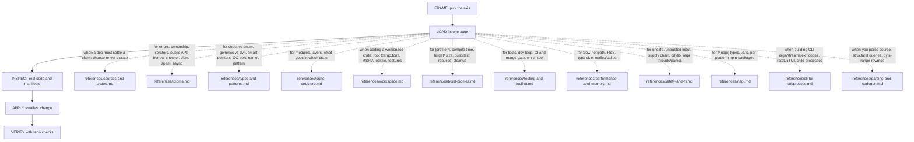

# Rust Best Practices

tools: `npx octocode` / `octocode-mcp`
related-skill: `octocode-research`
output: `<workspace>/.octocode/` for workspace work | `<home>/.octocode/` when no workspace applies

Skill map: solid edges are the flow; each dotted edge names the trigger that loads that `references/` page. Load only the page in play.

Reports: `<output>/rust-best-practices/`; scratch: `<output>/tmp/rust-best-practices/`. Chat-only advice stays in chat.

## Rules
- Read the real `Cargo.toml`, `src/` layout, and target code before advising; match the crate's edition, MSRV, and conventions.
- Prefer std or an already-present dependency. Verify a new crate's maintenance, license, and API against upstream source (`octocode-research`), not registry stars.
- Anchor idiom/API claims to the official canon (API Guidelines, Reference) and name it; crate behavior comes from upstream source.
- `cargo clippy` and `cargo fmt` are the first review pass: run them, never hand-argue a lint clippy decides.
- Never change observable behavior while cleaning up; behavior-preserving cleanup belongs to `octocode-clean-agentic-code`.
- No performance claim without a `--release` benchmark or profile. `unsafe` only for a proven need, each block with a written safety invariant.
- Stay within the requested axis. Adding a dependency, bumping MSRV/edition, or touching a lockfile needs explicit consent.

## Related
`octocode-research`: upstream crate source and version-at-ref proof (registry metadata is not code evidence) · `octocode-clean-agentic-code`: cleanup · `octocode-roast`: smell inventory · `octocode-eval-benchmark`: measure a performance change · `octocode-skills`: change this folder.
