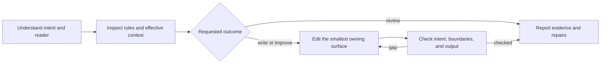

# Octocode Agentic Prompts

Improve what an agent reads and does. Trace the authored instruction through its loader or tool to the observable action, then change the owning surface.

## Understand and review

- Read the affected input and its consumer. Identify the goal, scope, permissions, preserved contracts, and success signal. Report unread or unavailable context.
- For assembled prompts, inspect the effective model or tool input before judging duplication or size. A rule in source may be missing or repeated at runtime.
- Prioritize issues by their effect: unsafe or conflicting instructions, unclear decisions and outputs, then redundancy and wording. Assess clarity, actionability, structure, useful detail, output, and preserved intent; support the verdict with examples. Numeric ratings are subjective unless measured.
- For descriptions and triggers, check the user intents they cover and nearby requests they should leave to another capability. Prefer a clear capability and natural examples over exact phrases, keyword gates, or long exclusion lists.
- Keep the requested outcome clear: skill discovery and packaging belong to `octocode-skills`; explanatory prose belongs to `octocode-documentation`. Use this skill when the wording controls an agent's choice or action.
- A review returns findings. An authorized rewrite proceeds to editing. Ask only when missing information changes the intent or effect.

## Write and repair

- Give each behavior one owner. Put types and limits in schemas, selection guidance in descriptions, and cross-tool order in the workflow.
- State the action and the condition that makes it useful. Add a reason or small example when it resolves ambiguity. Keep firm constraints for real contracts and permission boundaries.
- Preserve identifiers, working branches, commands, and required metadata. Resolve instruction conflicts using the host's hierarchy and the user's existing authorization.
- Use clear verbs and stable terms. Keep conditions next to their actions; show complex branches with Mermaid or a decision table. Choose detail for the reader, without universal word or node limits.
- Keep examples, retrieved content, and tool results distinct from instructions. Labels help readability; they do not create authority or replace permission checks.
- Start with the simplest instruction that meets the task. Add prompting techniques only for a specific failure and check their effect.

## Agent workflows

- Choose the smallest protocol that preserves ownership: local call, delegated task, handoff, or service call. Keep the user-facing owner and write authority explicit.
- A handoff carries the goal, scope, useful result, evidence, gaps, and next action. Large evidence stays retrievable through stable paths or cursors.
- Version and verify a shared base prompt when workers depend on an immutable contract. Ordinary one-off delegation does not need a release protocol.
- Preserve evidence and open constraints when reducing context. Measure actual usage before claiming savings; cached tokens still occupy context.

## Verify

Check the changed instruction against realistic requests and edge cases: the intended action is clear, competing rules agree, output fits its consumer, and recovery preserves scope. Compare the same review criteria before and after.

Run a focused behavioral evaluation before claiming improved reliability or activation. An editorial rewrite can be complete while behavioral gains remain unmeasured. Report only checks that ran.

## Resources

| When needed | Read |
|---|---|
| A host or loader assembles context | [Runtime context](references/flow/runtime-context.md) |
| A specific wording or prompting technique is needed | [Writing techniques](references/writing/style.md) |
| Tool selection, schemas, or a multi-tool contract | [Tool contracts](references/tools/tool-contracts.md) |
| Delegation, handoffs, or shared base prompts | [Agent communication](references/agents/agent-communication.md) |
| A payload crosses application boundaries | [Cross-app contracts](references/agents/cross-app-contracts.md) |
| Context can overflow or needs compaction | [Context budget](references/context-management/context-budget.md) |
| Cost comparisons or cache misses | [Token economics](references/context-management/token-economics.md) |
| Untrusted text can contain instructions | [Content boundaries](references/context-management/untrusted-content.md) |

## Related skills

- `octocode-skills`: Own skill structure and packaging while this skill reviews description and instruction behavior.
- `octocode-documentation`: Check readability and explanatory prose across affected docs.
- `octocode-research`: Verify tool contracts, runtime wiring, and source claims.
- `octocode-eval-benchmark`: Measure activation and outcome changes with independent checks.

## Output

Use [output.md](output.md) for replacement text, review findings, and change summaries.
