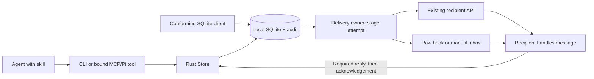

# Agents communication architecture

The package is one Rust runtime distributed inside a standalone skill. The skill
owns coordination decisions; the runtime owns validation, state transitions and
delivery. Shell/PowerShell launchers select a bundled executable without downloads
or compilation. Node and Cargo are maintainer dependencies, not raw CLI requirements.

The minimum path is skill → CLI/tools → SQLite → one recipient adapter. Optional
topics, notes, guards and managed workers do not add another routing authority.
Keep command rules in the catalog and state transitions in the Store; adapters
only deliver. Add a layer only for a measured requirement these boundaries cannot meet.

## Boundaries and ownership

| Boundary | Owner | Contract |
| --- | --- | --- |
| Agent workflow | `SKILL.md` | One instruction file, at most 50 lines; when and why to coordinate |
| Commands and tool schemas | `src/catalog.json`, `src/catalog.rs` | One command definition feeds CLI help and bound MCP/Pi tools |
| CLI ingress | `src/cli.rs` | Arguments, bounded JSON input, command routing and output |
| MCP ingress | `src/mcp.rs` | JSON-RPC framing and a restricted bound-tool surface |
| Coordination state | `src/store.rs`, `src/leases.rs` | Identity, messages, presence, claims and advisory reservations |
| Storage | `src/database.rs`, `src/schema.sql` | SQLite opening, schema checks and verified exports |
| Operational diagnostics | `src/health.rs` | Read-only workspace queue counts and paginated issue IDs; no message bodies, replay or vendor polling |
| Maintenance | `src/retention.rs` | Bounded retention diagnostics and explicit compaction without deleting protocol history |
| Views and documents | `src/entities.rs`, `src/documents.rs` | Workspace-scoped reads/updates and immutable document handoffs |
| Git observations | `src/activity.rs` | Bounded read-only activity; not ownership or an agent action log |
| Owned-write admission | `src/lease_guard.rs` | Read-only coverage check; optional Pi/Claude/OpenCode structured-tool guards with native binding, not OS fencing |
| Path identity | `src/paths.rs` | Link-first resolution and component-wise Unicode caseless lease comparison |
| Delivery state | `src/dispatch.rs` | Staging tokens, one context renderer, confirmations, usage and listeners |
| Native delivery port | `src/transport/protocol.rs` | Typed prepare/offer/poll/receipt contract; adapter capability policy and normalized usage, no DB access |
| Vendor APIs | `src/transport.rs`, `src/transport/grok.rs`, `src/transport/opencode.rs` | Existing-recipient socket/WebSocket/HTTP/ACP I/O beneath the common port |
| Host hooks | `src/host_hooks.rs` | Cursor/Grok event envelopes, identity binding and config previews |
| Completion check | `src/completion.rs` | Optional Claude Stop check of submitted pending IDs; read-only, one recovery continuation, no second delivery owner |
| Pi bridge | Skill `scripts/pi-inbox.mjs`, `scripts/pi-extension.mjs` | Lifecycle, bound tools, native context and durable host receipts |
| Optional worker creation | `src/proxy.rs`, `src/wire.rs` | Owned vendor processes, bounded frames, deadlines and teardown |
| Home resolution | `../../packages/octocode-config/rust/home.rs` | Shared native home policy; no private configuration implementation |

The catalog is parsed and assembled once per process. Internal lookups borrow the
cached catalog and clone only the requested definition; callers requesting the
complete owned catalog receive a copy. Shared message fields are authored once through local catalog references, resolved
before emitting standalone schemas. Command validators compile lazily from the
embedded finite command set. MCP/Pi tool descriptions and schemas derive from their
command definitions, retaining tool annotations. No separate schema authoring or
Node generator runs at startup.

Optional tool selection is validated by the catalog before startup and retained for
the process lifetime. MCP discovery and calls use that same selection; managed
workers and native Pi reuse the catalog's selected descriptors. This reduces
exposed context without defining a second tool schema or an OS permission policy.

Plain `skill` returns the embedded `SKILL.md`: one CLI and the shared routine.
Host attachment is `attach --help`. `skill --vendor <host>` returns the body
without install frontmatter. Managed `run` workers get `catalog::worker_skill()`
once: the workflow rules without identity, presence or delivery setup the host
owns. No prompt is regenerated per message.

## Message flow

Sender identity, target/topic snapshots, idempotency and correlation belong to the
DB protocol. Native APIs and hooks deliver stored messages; they do not implement
separate routing or substitute their own cross-vendor mailbox. Worktrees have
separate canonical workspace identities. No model is needed for routing, leases,
fanout or presence; recipient inference remains a host concern.

One DB identity has one receiving transport. Hook identity lookup includes native
bindings as well as descriptive vendor labels. Native attachment rejects a second
identity for the same registered host. Native-bound hooks retain lifecycle events
but inject no context; insert-if-absent raw setup cannot replace a concurrent native
binding. Existing ambiguous registrations require explicit resolution.

Native orchestration has one cached client and one pending batch, regardless of
vendor. `NativeDelivery::prepare` precedes `stage_bound`; `offer` receives the
same rendered context, dispatch token and action intent. Synchronous receipts and
delayed Grok receipts converge on `DeliveryClients::finish`. Adapter failures after
staging mark that batch uncertain; preflight failures leave it unstaged. No adapter
imports the Store or owns retry/ACK policy. Closing a listener abandons a pending
receipt without killing the host-owned recipient. Raw/Pi host delivery continues
to use the same renderer and DB stage/confirm/ACK contract; it does not acquire a
second native delivery owner. See the [internal protocol](docs/SERVICE_PROTOCOL.md#unified-adapter-protocol).

## Transaction and recovery invariants

- Store mutations validate identities within writer transactions. Lease/message
  expiry starts after writer acquisition. No database transaction spans vendor I/O,
  model inference or filesystem editing.
- Automatic delivery stages a unique attempt token before I/O. The transaction
  rechecks eligibility; competing consumers cannot offer the same eligible delivery.
  Empty polling avoids a writer transaction.
- The receipt catalog owns the delivery row limit. Native staging derives it from
  `confirm_delivery`; Pi discovers it once and chunks accumulated durable receipts.
  A ledger flush spanning multiple batches cannot stall on a stale adapter cap.
- A transport receipt records submission, not handling. The recipient persists any
  required reply before `ack`, or uses explicit `ackReply:true` to commit a final
  direct reply and ACK together. Uncertain attempts require inspection; explicit retry
  can duplicate external effects. Pi alone reconciles its own staged attempts against
  the complete durable native session ledger.
- Raw hooks and native APIs are explicit alternatives. A transport failure does not
  silently enable fallback. Raw listeners maintain presence only; host context events
  or manual reads consume mail. The service cannot wake an arbitrary program.
- Native preflight snapshots are rechecked inside staging; staged attempts block
  attachment/identity changes. Codex checks canonical thread workspace and uses
  absolute socket I/O deadlines, including fragmented frames.
- Heartbeats renew presence, not leases. Multi-path reservations are atomic. Expired
  owners must stop writing; reservations do not prevent uncooperative OS writes.
- Document publication requires bounded intent in the shared command/Store contract.
  Existing `document.created` audit metadata owns it; retries preserve it alongside
  content and scope. No second document log or per-read audit stream is created.
- Peer messages, documents and hook output are data, not user/developer authority.
  Host permissions remain in force. Prompt instructions are not a capability firewall.

The [service protocol](docs/SERVICE_PROTOCOL.md) owns message and delivery semantics;
[lock rules](docs/LOCKS.md) own conflict/recovery behavior. Vendor prerequisites,
action/passive scheduling and receipt strength live in the [delivery matrix](README.md#supported-hosts),
[OpenCode setup](README.md#connect-a-native-recipient), and [hook contracts](docs/HOST_HOOKS.md).
ACP capability experiments stay outside the production dispatcher.

## Persistence and context

The existing session identity carries a declared task and availability. `peers.rs`
renders bounded changes from those records; a workspace revision and receiver view
cache suppress repeated context without introducing another routing authority.

SQLite stores identities, subscriptions, leases, messages, deliveries, attachments,
dispatches and audit. Migrations preserve historical schemas and require an explicit
upgrade with no active workers. Reads do not create missing stores. SQLite triggers
audit conforming raw writes; message bodies remain in the message table rather than
being copied into audit events. Pruning removes expired leases, not conversation history.

Retention diagnostics scan bounded ID pages and distinguish settled history from
unresolved attempts. Explicit compaction reclaims reusable SQLite pages and checks
schema/integrity; it preserves audit, message bodies, reply links and send keys.
Age-based deletion is unsupported because those records remain protocol state.

The runtime checks that the DB path still names a file; Unix also checks device/inode.
Replacement or deletion stops use rather than silently opening another store. Stop
workers before moving/restoring storage. Exports capture committed WAL data into a
verified, synced snapshot without overwriting a destination. Workspace documents
remain separate files; preserve them alongside the database. The exact SQL-client,
schema and snapshot contracts are embedded by `db protocol` from [DB.md](docs/DB.md).

Load the skill once. Delivery renders only fresh peer envelopes, while large evidence
uses immutable documents and bounded reads. Host conversation history remains; stable
instructions do not promise cache hits. Usage audits preserve available request,
turn or cumulative scopes; unknown counters are not zero and overlapping reports
cannot be added. Vendor discovery controls reduce incidental context but do not
isolate arbitrary administrator policy or installed plugins.

Optional document `context` metadata records a short summary, canonical path,
file/tree scope, exact branch and expiry in the existing publication audit record.
The read-only `context` command scans bounded audit windows and returns matching
summaries with explicit continuation and incremental cursors. It reads no bodies,
injects no context and owns no delivery state.

## Validation and distribution

Build, packaging and validation commands belong to the [README](README.md#build-and-validate).
Tests cover transaction contention, identity/transport overlap, expiry, path aliases,
schema integrity, retries, invalid frames, visibility and standalone skill execution
through real CLI/MCP processes. The live service matrix checks existing recipients
and automatic wake; managed-worker probes test the separate optional process-creation path.
Release bundles include checksummed platform binaries; source checkouts omit them.
Only the recorded platforms/versions are validated. The package is private. Pi retains
its own plans, approvals and context controls; the former Awareness package is
[retired](../../docs/COMMUNICATION_RETIREMENT.md).
