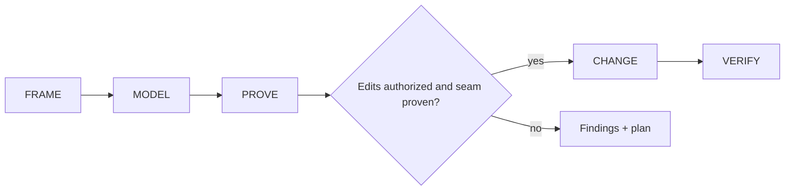

# Octocode Architect

tools: `octocode-mcp` / `npx -y octocode` — topology via the CLI-only beta `npx octocode astTopology` (`OCTOCODE_BETA=true`) or the `npx octocode graph` CLI

Optional beta topology uses `OCTOCODE_BETA`, configurable in `<HOME>/.octocode/.env`.

Model the system, test architecture hypotheses against code and runtime evidence, then make the smallest authorized, verified improvement.

Scale rigor to consequence. Do not invent layers, abstractions, findings, or operational work to satisfy a checklist.

## Phases

| Phase | Useful result |
|---|---|
| Frame | The decision, intended benefit, scope, use case, and contract owner. Identify the revision or working tree; capture a baseline when claiming a measurable improvement. |
| Model | Representative flows from source through validation, transformation, boundaries, and consumers. Note shapes, owners, invariants, and failure modes where they affect the decision. |
| Prove | Evidence that supports or rejects each finding, plus remaining uncertainty. A graph edge or pattern preference alone does not establish a defect. |
| Change | The smallest authorized change at the proven boundary. Add a focused test when it can detect the failure. |
| Verify | Relevant checks on the actual production path and a review of affected wiring. Inspect both exit status and payload errors; use comparable before/after measurements for improvement claims. |

## Evidence rules

- Separate declared rules, observed structure, and inferred intent. Static dependencies, control flow, data ownership, and runtime wiring answer different questions.
- Match proof to the claim: source can establish a static fact; runtime and performance claims need execution evidence. Label candidates and name the missing decisive check.
- Tests must distinguish the competing explanations. Use distinct IDs, paths, versions, or roots when their identity matters, and assert the specific failure. Keep disproof when a sharper fixture rejects a finding.
- Topology edges are syntactic candidates. A type-only cycle is not runtime proof. Before any completeness or absence claim, read coverage signals and check consumers outside the scanned roots, and verify symbols separately with semantic references.
- For repo, GitHub, package, or symbol evidence, use `octocode-research`; it owns tool selection and live schemas. This skill owns architecture analysis.
- Algorithms: write the contract (`inputs + preconditions → postconditions + invariants → termination → cost`) before optimizing. Tests are evidence, not a proof of an invariant.

## Gates

- Report a candidate, not a defect, when decisive scope, flow, symbol identity, runtime impact, or measurement remains unresolved.
- Ask before public-contract rewires, cross-package moves, schema/storage migrations, or deletes/renames unless that exact scope is already authorized.
- Keep cleanup caused by or directly adjacent to the change. Broader refactoring requires evidence, an acceptance sensor, and authorization.
- Bookkeeping follows the repo and release contract: update only required docs, manifests, versions, generated artifacts, lockfiles, changelogs, or snapshots. Regenerate derived artifacts; never hand-edit them.
- Unimplemented reachable paths fail explicitly. Tests prove outcomes, not merely calls.
- Preserve concurrent work. Inspect the working tree, coordinate overlapping paths, and never stash, reset, overwrite, or discard another contributor's changes.

## Resources

Load the page that answers the current question.

| When needed | Read |
|---|---|
| Layers, ownership, blast radius | [architecture-lenses](references/architecture-lenses.md) |
| Path crosses trust or process boundary | [contract-data-flow-checks](references/contract-data-flow-checks.md) |
| Correctness, complexity, concurrency | [algorithm-review](references/algorithm-review.md) |
| Topology, cycles, dead code, hot paths | [architecture-analysis](references/architecture-analysis.md) |
| Before any source edit | [change-discipline](references/change-discipline.md) |
| Agent-authored work | [agent-defect-classes](references/agent-defect-classes.md) |
| Class prevalence disputed | [agent-defect-evidence](references/agent-defect-evidence.md) |
| Consequential result needs a decision record | [output-contracts](references/output-contracts.md) |

## Related skills

- `octocode-research`: Use to verify code paths, callers, and external evidence.
- `octocode-rfc-generator`: Use when a consequential choice needs a reviewed decision record.

## Output

See [output.md](output.md) for the response and saved-artifact format.
