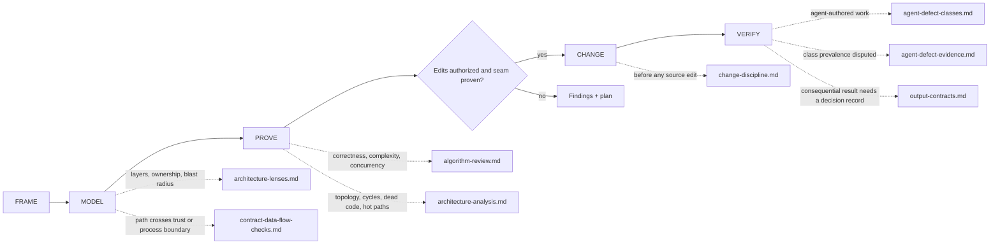

# Octocode Architect

tools: `octocode-mcp` / `npx octocode` — topology via beta `astTopology` (`OCTOCODE_BETA=true`) or the `octocode graph` CLI
related-skill: `octocode-research`
output: `<workspace>/.octocode/` for workspace work | `<home>/.octocode/` when no workspace applies
routes: load/run a reference, doc, or script only when it changes the next action; otherwise keep the rule here.

Model the system, test architecture hypotheses against code and runtime evidence, then make the smallest authorized, verified improvement.

Skill map: `FRAME → MODEL → PROVE → CHANGE → VERIFY`; dotted edges load a reference. Review-only requests end at findings and a plan.

Pages (load when its map edge applies): `references/architecture-lenses.md` · `references/contract-data-flow-checks.md` · `references/algorithm-review.md` · `references/architecture-analysis.md` · `references/change-discipline.md` · `references/agent-defect-classes.md` · `references/agent-defect-evidence.md` · `references/output-contracts.md`

## Rules

- Before editing, name the use case, quality attribute, contract owner, and smallest useful slice. An unresolved use case, owner, or contract is a decision gap—not permission to guess.
- Separate declared architecture, observed structure, and inferred intent. A graph edge, code smell, folder name, or pattern preference is a hypothesis, not a flaw.
- Trace static dependencies, runtime control, external/internal data movement, contract behavior, and invariant ownership separately; one lane cannot prove another.
- For repo, GitHub, package, or symbol evidence, use `octocode-research`; it owns tool selection and live schemas. This skill owns architecture analysis.
- Before editing, map interfaces, consumers, stored data, operations, tests, rollout, and rollback; retrace them in the diff.
- Improvement needs a sensor: baseline → change one variable → rerun comparably → keep only demonstrated improvement.
- Refactor when the request allows edits and evidence shows a smaller, clearer seam improves the named quality. Review-only requests return findings and a plan, not edits.
- Preserve concurrent work. Inspect the working tree, coordinate overlapping paths, and never stash, reset, overwrite, or discard another contributor's changes.
- Scale rigor to consequence. Do not invent layers, abstractions, findings, or operational work to satisfy a checklist.

## Workflow

1. **FRAME** — state the decision, quality attribute (performance/maintainability/correctness), scope, and consequence. Pin the review target (commit, branch, or working tree) and run baseline sensors before findings. Stop if the decision is open-ended without a named attribute — clarify first.
2. **MODEL** — map boundaries, contracts, and representative data/control flows from exact source using `octocode-research`.
3. **PROVE** — confirm hypotheses with exact code, AST/LSP identity, and tests before reporting a finding. Rate each finding `confirmed | likely | candidate | dismissed`: confirmed needs exact code plus an executed command or test; anything weaker names the missing decisive evidence. A fixture or test proves a hypothesis only if it could fail it: give every identity the hypothesis distinguishes (IDs, SHAs, paths, versions, roots) a distinct value, and make a negative test assert the specific error, not any rejection. When a sharper fixture contradicts a finding, dismiss it and keep the disproof.
4. **CHANGE** — only when the request authorizes edits and evidence names a specific seam. Implement one vertical slice; keep cleanup within the changed area.
5. **VERIFY** — rerun the pre-change checks and confirm the diff is within authorized scope. Review-only requests stop here and return findings + a plan, not edits.

## Gates

- Report a candidate—not a defect—when decisive scope, flow, symbol identity, runtime impact, or measurement remains unresolved.
- Ask before public-contract rewires, cross-package moves, schema/storage migrations, or deletes/renames unless the user already authorized that exact scope.
- Keep cleanup caused by or directly adjacent to the change. Broader refactoring requires evidence, an acceptance sensor, and authorization.
- Bookkeeping follows the repo and release contract: update only required docs, manifests, versions, generated artifacts, lockfiles, changelogs, or snapshots.
- Unimplemented reachable paths fail explicitly. Tests prove outcomes, not merely calls.
- Chat-only output stays in chat. Requested source edits stay in their named repo; do not create planning artifacts unless asked.
- Write findings in STE-80. Show evidenced flows and wiring as Mermaid diagrams, not dense prose. HTML explainers are for people on request, never agent context (`references/output-contracts.md`).

Skill maintenance: run `node scripts/eval-architect.mjs --self-test` and `node scripts/eval-architect.mjs --json` after editing rules or `evals/cases.json`, then the `octocode-skills` review; `README.md` § Sources lists where these rules come from.
