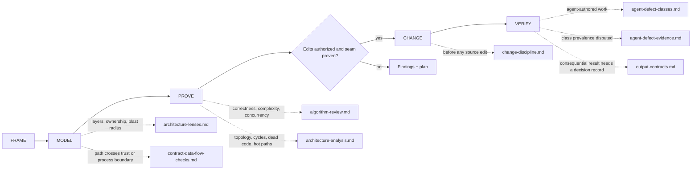

# Octocode Architect

tools: `octocode-mcp` / `npx octocode` — topology via beta `astTopology` (`OCTOCODE_BETA=true`) or the `octocode graph` CLI
related-skill: `octocode-research`
output: `<workspace>/.octocode/` for workspace work | `<home>/.octocode/` when no workspace applies

Model the system, test architecture hypotheses against code and runtime evidence, then make the smallest authorized, verified improvement.

Skill map: review-only requests take the `no` branch.

Pages (load when its map edge applies): `references/architecture-lenses.md` · `references/contract-data-flow-checks.md` · `references/algorithm-review.md` · `references/architecture-analysis.md` · `references/change-discipline.md` · `references/agent-defect-classes.md` · `references/agent-defect-evidence.md` · `references/output-contracts.md`

Scale rigor to consequence. Do not invent layers, abstractions, findings, or operational work to satisfy a checklist.

## Phases
1. **FRAME**: state the decision, the quality attribute (correctness, performance, changeability, security, operability), scope, and consequence. Name the use case, contract owner, and smallest useful slice. An unresolved use case, owner, or contract is a decision gap, not permission to guess. Pin the review target (commit, branch, or working tree); when a sensor exists, run its baseline before findings.
2. **MODEL**: map boundaries, contracts, and 1–3 representative flows from exact source. Trace `source → validate → transform → boundary → sink → observation`; at each hop name the data shape, owner, invariant, and failure mode. Separate declared architecture, observed structure, and inferred intent: only a declared rule directly proves a violation. Trace static, control, data, ownership, and runtime wiring separately; one lane cannot prove another.
3. **PROVE**: a graph edge, code smell, folder name, or pattern preference is a hypothesis, not a flaw. Rate each finding `confirmed | likely | candidate | dismissed`: confirmed needs exact code plus an executed command or test; anything weaker names the missing decisive evidence. A fixture or test proves a hypothesis only if it could fail it: give every identity the hypothesis distinguishes (IDs, SHAs, paths, versions, roots) a distinct value, and make a negative test assert the specific error, not any rejection. When a sharper fixture contradicts a finding, dismiss it and keep the disproof.
4. **CHANGE**: only when the request authorizes edits and evidence names a specific seam. Write `proven problem → harmed quality → seam → preserved contract → slice → sensor` first. Implement one reversible vertical slice; start with a failing assertion on the owned interface.
5. **VERIFY**: rerun the pre-change checks on the production path and retrace the affected wiring in the diff. Exit status controls green, and a zero exit with an error in the payload is a failure. An improvement is kept only when a comparable rerun shows it: baseline → change one variable → rerun.

## Evidence rules
- Topology edges are syntactic candidates. A type-only cycle is not runtime proof. Before any completeness or absence claim, read coverage signals and check consumers outside the scanned roots, and verify symbols separately with semantic references.
- For repo, GitHub, package, or symbol evidence, use `octocode-research`; it owns tool selection and live schemas. This skill owns architecture analysis.
- Algorithms: write the contract (`inputs + preconditions → postconditions + invariants → termination → cost`) before optimizing. Tests are evidence, not a proof of an invariant.

## Gates
- Report a candidate, not a defect, when decisive scope, flow, symbol identity, runtime impact, or measurement remains unresolved.
- Ask before public-contract rewires, cross-package moves, schema/storage migrations, or deletes/renames unless that exact scope is already authorized.
- Keep cleanup caused by or directly adjacent to the change. Broader refactoring requires evidence, an acceptance sensor, and authorization.
- Bookkeeping follows the repo and release contract: update only required docs, manifests, versions, generated artifacts, lockfiles, changelogs, or snapshots. Regenerate derived artifacts; never hand-edit them.
- Unimplemented reachable paths fail explicitly. Tests prove outcomes, not merely calls.
- Preserve concurrent work. Inspect the working tree, coordinate overlapping paths, and never stash, reset, overwrite, or discard another contributor's changes.

## Output
Chat-only output stays in chat. Requested source edits stay in their named repo; create planning artifacts only when asked. Write findings in STE-80 (owner: `octocode-documentation`). A Mermaid diagram of evidenced edges can replace a dense wiring paragraph. HTML explainers are for people on request, never agent context (`references/output-contracts.md`).

Skill maintenance: run `node scripts/eval-architect.mjs --self-test` and `node scripts/eval-architect.mjs --json` after editing rules or `evals/cases.json`, then the `octocode-skills` review; `README.md` § Sources lists where these rules come from.
