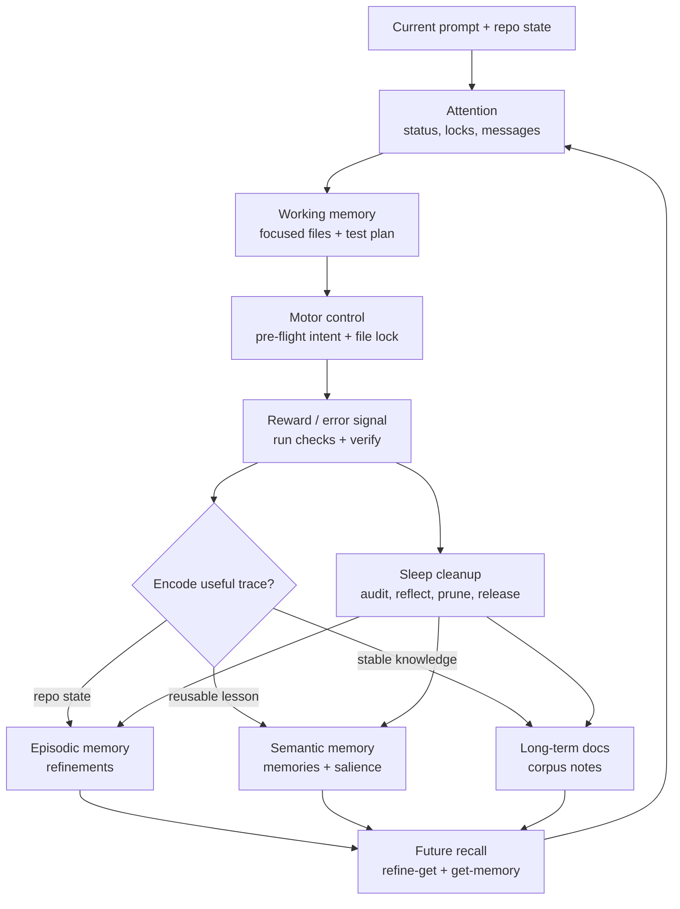

# Octocode Awareness

`octocode-awareness` gives agents situational awareness in a real local repo. It stores local memory, file claims, handoffs, peer messages, and verification records in SQLite so separate runs can coordinate instead of starting cold or colliding silently.

The core loop is simple: attend to current state, focus the working set, claim files before editing, verify before saying done, then consolidate and clean up.

## How it works

The skill starts by recalling relevant memories, refinements, active locks, and unread peer messages for the current workspace. Before edits it records a pre-flight intent for the target files, then after the work it records verification, releases locks, and saves reusable lessons or handoffs when the next agent would benefit.

For harder calls, `reflect --judgment-note ... --duo` keeps the nuance visible and emits two advisory reflection-agent prompts: one checks whether the outcome is really verified, and one asks whether the task revealed a reusable harness or skill improvement. When another skill emits structured eval failures, pass them through `--eval-failure-json` so failed ids and signatures stay mineable without becoming a rigid pass/fail checklist.

## Thinking flow

```text
attend -> focus -> claim -> work -> verify -> encode -> sleep
```

- **Attend:** read memories, handoffs, active locks, and messages.
- **Focus:** keep the current prompt, files, and test plan in working memory.
- **Claim/work:** lock intended files, then make the change.
- **Verify:** run the declared check and record the result.
- **Encode:** choose the right layer: refinement, memory, or corpus note.
- **Sleep:** audit idle state, reflect, mark handoffs done, supersede stale memories, prune resolved messages, and release locks.

Sleep is not a timer. The agent sleeps when work is ending, a session is ending, or the user asks for cleanup. It is considered idle only after an audit shows no live locks or active intents for that agent, no missing verification for its work, and no unresolved blocker messages it must answer.

## Brain-like layers

Awareness uses a brain-inspired operating model without adding a new storage layer:

- **Attention:** `status`, active locks, and unread messages show what is live now.
- **Working memory:** the current prompt, file reads, and claimed files stay focused on the task.
- **Episodic memory:** refinements preserve what happened in this repo or branch.
- **Semantic memory:** reusable lessons become global memories with salience, recall, and supersession.
- **Long-term docs:** the corpus turns repeated high-value lessons into browsable Markdown.
- **Sleep:** verification, reflection, stale-memory cleanup, message pruning, corpus updates, and lock release turn messy work traces into durable knowledge.



The detailed checklist lives in `references/brain-model.md`.

## Good asks

- "Use awareness before changing this repo."
- "Check whether another agent is working on these files."
- "Remember the lesson from this failed test for next time."
- "Leave a handoff for the next agent on this branch."
- "Show me the awareness data."

## Installation

Install the skill with the Octocode skill installer:

```bash
npx octocode skill --name octocode-awareness
```

After installing, run readiness checks from the installed source with `node ~/.octocode/skills/octocode-awareness/scripts/install.mjs --check-only`. For always-on Claude file-lock hooks, inspect first with `node ~/.octocode/skills/octocode-awareness/scripts/install-hooks.mjs --check --global` and install only after reviewing `--dry-run`.

## Features

- Reusable memories for lessons, gotchas, workflows, and decisions.
- Repo and branch-specific handoffs for unfinished work.
- File locks that say who claimed a file, why, and when the claim expires.
- Agent-to-agent messages for blockers, questions, decisions, and handoffs.
- Verification records tying an edit intent to the test or review plan that actually ran.
- A curated Markdown corpus at `~/.octocode/awareness/corpus/**/*.md` for concise engineering knowledge and learning ideas.
- A "sleep" cleanup pass that records what mattered, removes stale state, and leaves the workspace easier for the next run.
- Audit-first cleanup: destructive actions are previewed with dry-run style checks before old memories or messages are removed.
- A local HTML viewer when a human wants to inspect the stored state.

## Where it fits

Use Awareness alongside editing or investigation skills when the repo is dirty, the task is long-running, multiple agents may touch the same files, or the user wants durable lessons. It is not a code-search skill and it does not replace tests; it makes coordination and verification visible.

## Hook-aware behavior

In hosts that support lifecycle hooks, Awareness can automatically claim files before edits, release locks afterward, surface unread messages, capture session handoffs, and flag unverified "done" claims. Without hooks, agents can run the same commands manually through `scripts/awareness.py`; the data model stays the same.

For the full composition map across manual skill behavior, automatic hooks, subagent handoffs, reflection, harness learning, and sleep cleanup, see `references/agentic-flows.md`.

## For developers

Keep the agent-facing map in `SKILL.md`, the data model and coordination details in focused `references/`, and repeatable behavior in `scripts/awareness.py` or the hook helpers. When changing memory fields, lock semantics, hooks, or verification flow, update the CLI, README examples, schema helpers, viewer, and smoke tests together.

## User value

The user gets calmer multi-agent work: fewer hidden collisions, less repeated rediscovery, clearer handoffs, and success claims backed by recorded verification instead of good intentions.
