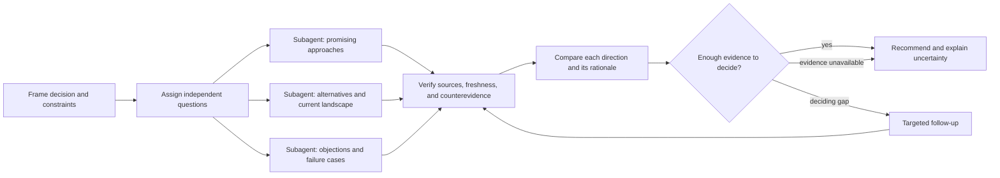

# Octocode Brainstorming

Investigate different directions with several subagents, test their evidence, and explain what supports the final recommendation. Use `octocode-research` for code, repository, and package facts.

## Frame the decision

Establish the issue, known context, constraints, open choice, and evidence that could change it. For changing facts, identify the relevant time window, version, or market. Ask only when a missing constraint materially changes the research.

## Choose independent directions

Use several subagents for substantive brainstorming research. Size the team to the distinct questions and available capacity; the diagram's roles are examples. Each worker investigates a different direction, not the same query under another label.

- For a claim: investigate the supporting case, strongest objection, and missing causal evidence.
- For an open idea: explore promising approaches, alternatives or adjacent fields, and practical failure cases.
- For a landscape: investigate existing solutions, recent developments, and unmet needs or adoption constraints.

Give each worker the decision, constraints, bounded question, and expected evidence. Let workers form initial assessments independently before cross-checking one another. Require a concise rationale, deciding sources, counterevidence, uncertainty, and what would change the conclusion; private reasoning transcripts are unnecessary.

Use the host's available delegation tools and respect its limits. If workers are unavailable or prohibited, investigate the directions sequentially and disclose the reduced independence. Never report sequential passes as separate agents. A simple factual lookup can go directly to research.

## Research with current sources

- Use available **Tavily, Exa, Serper, or host web/search tools** according to the question and coverage. Combine or switch tools when they can expose new evidence or resolve a gap; using every provider is not a quota.
- Search results discover sources. Fetch and inspect the underlying pages before using their claims. Distinct providers returning the same page or syndicated story are one source.
- Verify changing facts against current primary sources. Check publication/update dates, event dates, applicable versions, and later corrections or releases. State an as-of date when freshness affects the recommendation. Undated or inaccessible evidence remains uncertain.
- Use older sources for stable methods or prior art when still applicable. Recency alone does not establish quality. Use local evidence for workspace claims and external sources when they can change the decision.
- Reframe weak searches or change the evidence source when useful. Report unresolved coverage instead of filling gaps from memory. Use [research surfaces](references/research.md) for momentum, papers, or landscape discovery.

Provider setup belongs to the tool or connector. Direct integrations may use `TAVILY_API_KEY`, `EXA_API_KEY`, or `SERPER_API_KEY` from `<HOME>/.octocode/.env`; use only the variable that the selected client supports. Pass credentials through the host without displaying them. Connected tools can manage their own authentication, and a missing provider key does not block other available search tools.

## Check quality and reasoning

Each worker connects evidence to a conclusion and explains its limits. The parent checks deciding sources and compares:

| Check | Question |
|---|---|
| Relevance | Does the evidence address this question, scope, and constraints? |
| Authority and method | Is the source in a position to know, and does its method support the claim? |
| Freshness | Is the fact current for the relevant date and version? |
| Independence | Are supporting sources independent, or repeating the same origin? |
| Counterevidence | What conflicts with the conclusion, and which evidence is stronger? |

Distinguish observed facts, vendor claims, and inference. Vendor documentation can establish an advertised feature; independent performance or adoption claims need suitable independent evidence. Resolve contradictions by evidence quality, not agent votes or result counts. Retain material dissent and mark partial or blocked directions.

## Synthesize and decide

For each direction, explain its conclusion, why the evidence supports it, the strongest objection, confidence, and whether it changes the recommendation. Revise or drop unsupported claims; keep alternatives that remain credible.

The parent owns the final judgment. Recommend the best-supported direction and the smallest useful next action: a prototype, further research, a narrower scope, an RFC, or a reason to stop. State unresolved uncertainty and the check most likely to change the decision. Stop exploring when further available research cannot usefully change the result.

## Resources

| When needed | Read |
|---|---|
| Momentum, papers, or landscape sources | [research](references/research.md) |
| A saved brief is requested | [brief-template](references/brief-template.md) |

## Related skills

- `octocode-research`: Use for code or repository facts that decide a direction.
- `octocode-rfc-generator`: Use once a consequential option is ready for a written decision.
- `octocode-eval-benchmark`: Use when an experiment must measure the options.
- `octocode-scraping`: Fetch public sources or build a reusable research corpus.
- `octocode-chrome-devtools`: Inspect sources that need rendering or live browser access.

## Output

Use [output.md](output.md) for the comparison and recommendation, including each direction's rationale and evidence limits.
