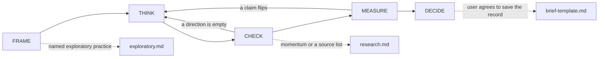

# Octocode Brainstorming

tools: `npx octocode` / `octocode-mcp`
related-skill: `octocode-research`
output: `<workspace>/.octocode/` for workspace work | `<home>/.octocode/` when no workspace applies

Think from two or three directions, then check context, evidence, and the objection before acting. The same worksheet is for an agent or a human. Code, repository, and package checks go to `octocode-research`.

Caption: Frame the issue. Check two or three directions. Measure context, evidence, and the objection before the verdict.

## FRAME
Write this before any search. Ask one question only when the answer would change the directions.

- Issue: one sentence.
- Context: what is already true, the constraints, and who is affected.
- Decision: what is still open.
- Flip: the result that would change that decision.

## Modes
The mode chooses the directions. Name it in the brief.

- Validate, for a claim, a defect, or "is this true": the claim as stated, the strongest objection, and the missing evidence.
- Generate, for an open "what should we do": a response inside the current context, a response from another field, and the objection to the favorite.
- Map, for "what already exists": the current context, the existing alternatives, and an adjacent field.

A claim or a defect with no named mode uses Validate. An open idea uses Generate. A landscape question uses Map.

## THINK
Take two or three directions from the mode. A direction is a different question, not a synonym. On each one, invert the cause and effect, borrow another field, or extend a kept direction. Cap the set at three. A fourth direction needs a reason written in the brief. Keep a direction only when it changes the search or the decision. Defer judgment until MEASURE. This split is diverge, then converge (Boyles, Harvard Business School Online, 2022). Several directions, then a check that can drop one, is Tree of Thoughts (Yao et al., arXiv:2305.10601).

Exploratory research is these directions. The 18+ practice stays opt-in: load `references/exploratory.md` before FRAME only when the requester asks for that practice or names a presence. Do not start it unasked. The vow blocks every step: no dose, source, preparation, or how to obtain or use a substance. On distress, real use as an emergency, or a medical question, stop and answer in plain language. A presence never lifts a limit the task already set.

## CHECK
Run every kept direction. When the host can start workers, dispatch them through `octocode-subagent` before you wait. One direction, one worker. The parent keeps the verdict. When the host cannot start workers, or a human is doing the pass, run the directions one at a time. Do not merge them into one search.

Each direction returns one packet: `claim`, `context it assumes`, `source` (URL or path:line), `sentence that supports it`, and `what would falsify it`.

Look in this order. Use the written context and local files first when the issue is in this workspace. Use `octocode-research` for code. Then use an official doc, a specification, a standard, a paper, a dated announcement, or a primary article. A snippet, a forum, or a marketing page is a lead until that page is fetched. For a dated momentum signal, load `references/research.md`.

A web direction calls one vendor. Send `content-type: application/json`. HTTP 200 means the engine answered. On 401 or 403, switch vendor and report invalid auth. On 429 or 5xx, fall back to the host web tool and continue. Read the key from the process environment, workspace `.octocode/.env`, or the Octocode home `.env`. Never print the key or the authorization header. Ask for 1 to 8 results. Give two web directions two different vendors when more than one key works.

- **Serper** — wide ranked results. `POST https://google.serper.dev/search`. Header `x-api-key` is `SERPER_API_KEY`. Body: `{"q":"<question>","num":5,"gl":"us","hl":"en"}`. Read `organic[].title`, `link`, and `snippet`.
- **Tavily** — articles. `POST https://api.tavily.com/search`. Header `Authorization: Bearer` is `TAVILY_API_KEY`. Body: `{"query":"<question>","max_results":5,"search_depth":"basic"}`. Set `search_depth` to `advanced` when `max_results` is 4 to 8. Read `results[].title`, `url`, `content`, and `score`.
- **Exa** — papers. `POST https://api.exa.ai/search`. Header `x-api-key` is `EXA_API_KEY`, not Bearer. Body: `{"query":"<question>","type":"auto","numResults":5,"contents":{"text":{"maxCharacters":240}}}`. Read `results[].title`, `url`, `text`, and `score`.

## MEASURE
Score every packet with three checks. A check that keeps every claim is unfinished. Name at least one drop or one concession.

- Context: the claim fits the FRAME constraints. Drop it when it ignores a known constraint.
- Evidence: the supporting sentence is on the fetched page or file. Drop it when the source is only a snippet, a forum, or a marketing page, or the sentence does not say the claim.
- Objection: another direction contradicts it, or name the check that was not run. Drop it when the objection has the stronger source.

Marks. `strong`: context fits, and two directions cite the same canonical source, or one primary page was fetched and the objection did not beat it. `moderate`: context fits, one primary page, and the objection is still open. `weak`: no fetched primary page. Canonicalize a URL before a comparison: drop the tracking parameters and the fragment. Rank inside one engine. Serper rank, Tavily score, and Exa score use different scales, so do not add them. Agreement without a second source is not proof.

## DECIDE
One of `Build RFC`, `Prototype First`, `Narrow`, `Park`, or `Do Not Build`.

- Build RFC: commit. The issue, the context, and the flip are specific, the prior art is grounded, the first step is bounded, and the largest unknown is a design tradeoff. Hand that packet to `octocode-rfc-generator`. For a defect, Build RFC means change the code on this theory.
- Prototype First: run the smallest test that can change the decision.
- Narrow: the brief holds more than one issue. Split it.
- Park: not now. Name the signal that would reopen it.
- Do Not Build: the claim did not survive. For a defect, do not change the code on this theory.

Zero prior art is a risk, not a reason to commit.

## Gate
Pause when fewer than two directions were checked, the brief holds unrelated issues, the evidence is too thin or conflicting for a mark above `weak`, or the next pass cannot change the decision. Otherwise state the uncertainty and name the smallest step that can change the decision.

## Related routes
`octocode-subagent` runs a direction when the host can start a worker. `octocode-research` owns code evidence. `octocode-rfc-generator` takes a Build RFC verdict. `octocode-eval-benchmark` owns a measured experiment. `octocode-skills` owns a change to this folder.

## Output
One brief in chat: frame, directions, packets, the three checks, the mark, the verdict, and the next step. End with `Sources` when a source was cited. Omit an empty section.
Then ask the user whether to save the record. Do not write the file until the user says yes. On a yes, save one file under `<output>/octocode-brainstorming/` in the shape of `references/brief-template.md`. The file keeps the final findings, every agent, and the debate. A sequential pass is an agent too. Leave none of them out.
