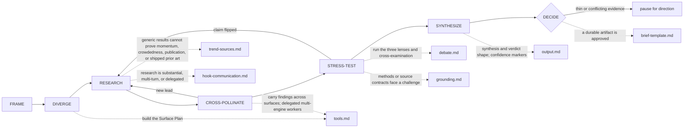

# Octocode Brainstorming
tools: `npx octocode` / `octocode-mcp`
related-skill: `octocode-research`
output: `<workspace>/.octocode/` for workspace work | `<home>/.octocode/` when no workspace applies
routes: load/run a reference, doc, or script only when it changes the next action; otherwise keep the rule here.

Explore ideas with evidence.

Caption: leads loop back into research; the decision gate pauses instead of guessing; dotted edges load a page in `references/`.
Pages (load each when its map edge fires): `references/tools.md` · `references/trend-sources.md` · `references/hook-communication.md` · `references/debate.md` · `references/grounding.md` · `references/output.md` · `references/brief-template.md`.

Artifacts: `<output>/octocode-brainstorming/`; resumable runs: `<output>/brainstorming/runs/`. Chat-only answers stay in chat; approved edits keep their named paths.

## Modes and lobby rules
- Generate: create distinct angles, then validate the strongest few. Validate: reframe enough to avoid anchoring, then investigate. Map: expand adjacent terms and existing solutions.
- Capture framing before judging. Ask one focused question only when direction, audience, or research scope changes the work materially.
- Declare a Surface Plan: mark local, top resources/web, and repo/package/code evidence active or skipped with a reason.
- Treat snippets and summaries as leads; cite exact sources or mark claims weak. Track `claim → source → confidence → next query`.
- Carry useful leads across active surfaces. Use the relevant Critical Architect, Visionary Entrepreneur, and Product lenses; for consequential verdicts, check all three.
- Recall potentially useful context first and validate it; capture only durable lessons that survive rebuttal.

## Decision gate
Pause for direction when the idea holds unrelated decisions, evidence is too thin or conflicting for a defensible verdict, or the next research round costs more than it can change. Otherwise state the uncertainty and recommend the smallest decision-changing step.

## Route facts the map cannot hold
- For code, repo, or package evidence, use `octocode-research`.
- For substantial, multi-turn, or delegated research, run `scripts/brainstorm-run.mjs` to keep a resumable claim/source/decision ledger.
- Score every prior-art claim with its confidence markers. Match chat brevity or saved decision depth.
- When improving this skill, use `octocode-eval-benchmark`.

## Related routes
- Use `octocode-rfc-generator` for a Build verdict and `octocode-eval-benchmark` for measurable experiments. For technical evidence, `octocode-research` owns MCP/CLI workflow and live tool/grammar discovery.
- Use `octocode-skills` when changing this skill folder.
- Use `octocode-subagent` to dispatch and synthesize workers; the brainstorm Scout/Aggregator/Checker topology is in `references/tools.md`.

## Scripts — every one takes `--help`
| Script | Run when | How |
|---|---|---|
| `scripts/brainstorm-run.mjs` | research is substantial, multi-turn, delegated, or saved as a brief | `node <skill_dir>/scripts/brainstorm-run.mjs start --idea "<idea>" --mode Validate`, then `checkpoint --run-id <id>`, then `finish --run-id <id>`; `hook --event <event>` serves `hooks/hooks.json`; commands in `references/hook-communication.md` |
| `scripts/serper-search.mjs` | validating web credentials at session start | `node <skill_dir>/scripts/serper-search.mjs --check` — broad Google results (`SERPER_API_KEY`) |
| `scripts/tavily-search.mjs` | validating web credentials at session start | `node <skill_dir>/scripts/tavily-search.mjs --check` — curated/deeper research (`TAVILY_API_KEY`) |
| `scripts/exa-search.mjs` | validating web credentials at session start | `node <skill_dir>/scripts/exa-search.mjs --check` — neural/category search (`EXA_API_KEY`) |

- Use the `--check` scripts for credential presence only; fetching and search output come from the host web tool. Pick engines by the evidence need and add another when it can reduce a real gap (`references/tools.md`).
- All four scripts import the vendored `scripts/octocode-config.mjs` for Octocode home and env; never import `@octocodeai/config`, which is absent when this folder installs alone.

## Output
Use the compact shape in `references/output.md`: framing, evidence, what survived review, verdict, risks, and next step. When evidence was cited, end with a consolidated `Sources` list. Get approval before saving; use `references/brief-template.md`.
