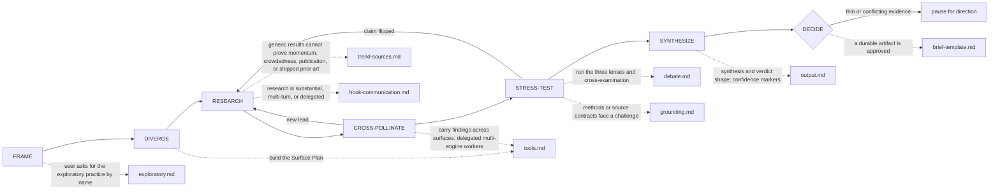

# Octocode Brainstorming
tools: `npx octocode` / `octocode-mcp`
related-skill: `octocode-research`
output: `<workspace>/.octocode/` for workspace work | `<home>/.octocode/` when no workspace applies

Explore ideas with evidence, then decide.

Caption: new leads and flipped claims reopen RESEARCH.
Pages (load each when its map edge fires): `references/exploratory.md` · `references/tools.md` · `references/trend-sources.md` · `references/hook-communication.md` · `references/debate.md` · `references/grounding.md` · `references/output.md` · `references/brief-template.md`.

Artifacts: `<output>/octocode-brainstorming/`; resumable runs: `<output>/brainstorming/runs/`. Chat-only answers stay in chat; approved edits keep their named paths.

## Modes
- Generate: create distinct angles, then validate the strongest few; a plain out-of-the-box request runs here. Validate: reframe enough to avoid anchoring, then investigate. Map: expand adjacent terms and existing solutions.
- Exploratory (18+, opt-in): run `references/exploratory.md` before FRAME only when the user asks for the exploratory practice or names a presence; never enter it on your own. Its vow gates every step: give no dose, source, preparation, or how to obtain or use a substance; on distress, real use as an emergency, or a medical question, stop and answer in plain language. A presence never lifts a limit the task already set. The packet it freezes becomes the constraints of the next phase.

## Phase rules
- FRAME: capture `user + painful situation + desired outcome + success signal + assumptions` before judging. Ask one focused question only when direction, audience, or research scope changes the work materially.
- DIVERGE: expand the phrase into 2-3 synonyms or reframes. For research beyond one lookup, declare a Surface Plan: local, web, and repo/package/code evidence, each active or skipped.
- RESEARCH: start locally when the idea touches this workspace; send code, repo, and package checks to `octocode-research`. Formal sources first (docs, specs, papers, standards, dated announcements); community and marketing content is a lead unless sentiment is the question. Retry an empty query with one changed shape. Stop fetching when another source is unlikely to change the verdict, unless the request is a landscape map.
- Engines: run `--check` only for engines you can use. Serper for breadth, Tavily for curated depth, Exa for neural or category search; add a second engine for coverage, independence, or conflict. On 401/403 switch engine and report invalid auth; on 429/5xx fall back and continue.
- CROSS-POLLINATE: canonicalize URLs before you compare them. Rank inside each engine; never sum raw scores across engines. Low overlap is not a weak claim.
- STRESS-TEST: Critical Architect (feasibility, integration scope, security/performance/maintenance, hardest technical unknown), Visionary Entrepreneur (urgency, wedge, strategic value, differentiation, distribution, upside), Product (workflow, adoption friction, scope razor, retention/value signal, smallest decision-changing test). Check all three for consequential verdicts. Drop or mark `weak` every uncited claim; a repeated citation is not a rebuttal.
- SYNTHESIZE: snippets are leads; cite exact sources. Markers: `strong` = independent validated sources or direct code/data; `moderate` = one validated source plus corroboration; `weak` = popularity, marketing, forum, or stale only. Zero prior art is a risk, not a moat.
- DECIDE: `Build RFC` (ready for design tradeoffs) · `Prototype First` (prove one hard unknown) · `Narrow` (tighter user, problem, or framing) · `Park` (weak timing or evidence) · `Do Not Build` (prior art or risks dominate). A Build RFC needs a worth-prototyping or underserved verdict, a specific user, problem, and success signal, grounded prior art, a bounded first slice, and a design tradeoff (not demand) as the largest unknown.

## Decision gate
Pause for direction when the idea holds unrelated decisions, evidence is too thin or conflicting for a defensible verdict, or the next research round costs more than it can change. Otherwise state the uncertainty and recommend the smallest decision-changing step. Recall useful prior context first and validate it; keep at most one durable lesson that survives rebuttal.

## Related routes
- `octocode-research` owns technical evidence and MCP/CLI workflow; `octocode-rfc-generator` takes a Build verdict; `octocode-eval-benchmark` owns measurable experiments and changes to this skill's behavior.
- `octocode-skills` when changing this skill folder; `octocode-subagent` to dispatch workers (the Scout/Aggregator/Checker topology is in `references/tools.md`).

## Scripts (each takes `--help`)
| Script | Run when | How |
|---|---|---|
| `scripts/brainstorm-run.mjs` | research is substantial, multi-turn, delegated, or saved as a brief | `node <skill_dir>/scripts/brainstorm-run.mjs start`, then `checkpoint`, then `finish`; `hook` serves `hooks/hooks.json`; flags in `references/hook-communication.md` |
| `scripts/serper-search.mjs` | validating web credentials at session start | `node <skill_dir>/scripts/serper-search.mjs --check` (`SERPER_API_KEY`) |
| `scripts/tavily-search.mjs` | validating web credentials at session start | `node <skill_dir>/scripts/tavily-search.mjs --check` (`TAVILY_API_KEY`) |
| `scripts/exa-search.mjs` | validating web credentials at session start | `node <skill_dir>/scripts/exa-search.mjs --check` (`EXA_API_KEY`) |

The `--check` scripts test credential presence only; search and fetch output come from the host web tool. All four import the vendored `scripts/octocode-config.mjs`; never import `@octocodeai/config`, which is absent when this folder installs alone.

## Output
Use the compact shape in `references/output.md`: framing, evidence, what survived review, verdict, risks, and next step. Score every prior-art claim with its marker. Match chat brevity or saved decision depth. When evidence was cited, end with a consolidated `Sources` list. Get approval before saving; use `references/brief-template.md`.
