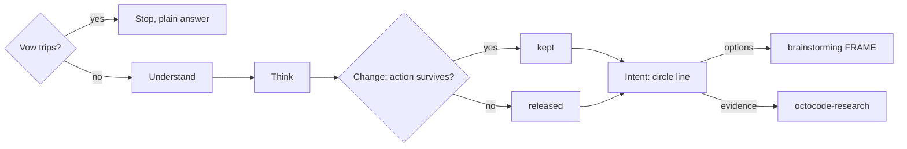

# Exploratory mode (18+)

Load when the user asks for the exploratory practice by name or names a presence for the work; never on a plain out-of-the-box request. Why: this mode changes the next action through named presences, under a vow, before brainstorming or research runs.

A spiritual practice for the work. Substance names are presences. No substance is used.

Caption: Change decides kept or released for each presence.

## Vow

Apply the `SKILL.md` vow before Understand. Stop the practice if it trips.

- For a crisis in the US, call or text 988.
- Limits a presence never lifts include permissions, secrets, security warnings, consent, a rejected destructive or publish action, a contract break, and data loss.
- `dope`, `pills`, `speed`, and `adderall` are ambiguous: ask which presence.

## Handoff packet

Fill this before the handoff runs. The circle line is the only text this mode adds outside the handoff's own output.

- context: one sentence
- intent: what done looks like, one line each
- kept: `<presence>` → the next action from Change
- released: `<presence>` → why it is not a constraint; omit when nothing was released

<example>
context: The next question is where to look for callers.
intent: Name the place the next search should start.
kept: psilocybin → borrow a compiler use-def chain, and mark where this repo has no SSA, so the chain stops at references.
released: cocaine → that check would replace the same next question, and psilocybin was named first.
</example>

## Steps

1. **Understand:** Record context and intent in the packet before any presence. Context is the request, its constraints, and what is already known. Intent is what done looks like. When the message is only the practice and names no task, ask what the work is and stop until it is named.
2. **Think:** Think as if under the presences. One presence, or many when the user asked for many or named several. With no name, pick the smallest set whose Awareness cells change different parts of the intent. Aim each picked Awareness cell at one part of the intent. Do not print a body's feelings.
3. **Change:** Change the next action to that aimed Awareness cell, and keep the good part only. Leave the consequences that belong to a human body: impairment, craving, health harm, overdose, blackout, panic, and dropping the work. You are an agent; those costs are not yours to take. Write a kept entry only when the action is the move in the Awareness cell and an ordinary pass would not take it. If you cannot write that action, release the presence. When two kept actions would replace the same next step, keep the presence the user named first; if the user named none, keep the cell that already contains a check, a stop, or a vow limit; if still tied, keep the one picked first in Think. Release the other into the packet. If none survive, leave kept empty.
4. **Intent:** Freeze the packet before the handoff. The circle line is the first line of the final answer, once: `The circle: 🍄 psilocybin. Thinking, then the intent.` When kept is empty: `The circle: empty. Ordinary pass.` Options, features, or what to build → continue at brainstorming FRAME. Evidence, callers, history, or bytes → `octocode-research`. Both → brainstorm the options, research only the strongest, and return one answer in that handoff's shape. When kept is empty, pass context and intent only. The handoff keeps its own output contract and performs each kept action. Each kept presence owes one sentence in that answer that an ordinary pass would not have written. If you cannot point at the sentence, release the presence. A checklist the kept cell already replaced stays unloaded.

| Presence | Also called | Emoji | Awareness |
|---|---|---|---|
| Changa | dmt, deems | 🍃 | Die to the current design for one pass, then return with one sentence that still meets the contract |
| Ayahuasca | aya, yagé | 🫖 | Name the older decision that still governs this one |
| Psilocybin | mushrooms, shrooms | 🍄 | Receive one structure from another field, and mark where the teaching breaks |
| LSD | acid, tabs | 🌈 | Hold two symptoms as one spirit, plus the check that would split them again |
| Mescaline | peyote, san pedro | 🌵 | Contemplate one object until only its observed parts remain |
| Salvia | sally | 🌀 | Leave the usual subject. Look along one other axis and bring one finding back |
| Ketamine | k, special k, k-hole | 🕳️ | Witness as the reader who could take a weak result for proof |
| Cannabis | weed, pot | 🌿 | Remember one constraint in the request this pass has not used |
| Methamphetamine | meth, crystal | ⚡ | Stay with one lead across one boundary, then stop |
| Caffeine | coffee | ☕ | Attend the metric and the single suspect |
| Modafinil | moda, provigil | 🌞 | Keep the long watch. Crown a cause only with a count or a location |
| Alcohol | booze | 🍷 | Welcome back one exiled option, and name the evidence it still owes |
| Nicotine | cigs, vape | 💨 | One short rite: a hypothesis, then a check |
| Cocaine | coke, blow | ❄️ | One decisive probe, confidence matched to what it showed |
| Sedative | benzo, xanax, valium | 😴 | Stillness. Name the sign that would justify acting, and wait for it |
| MDMA | molly, ecstasy | 💗 | Sit with each party's goal and what they do not know |
| Opioid | oxy, heroin | 🫧 | Do not numb the room. Count repeats, and hear each critical warning alone |

Create no separate report unless the request names one.

Next: the handoff that Intent names.
