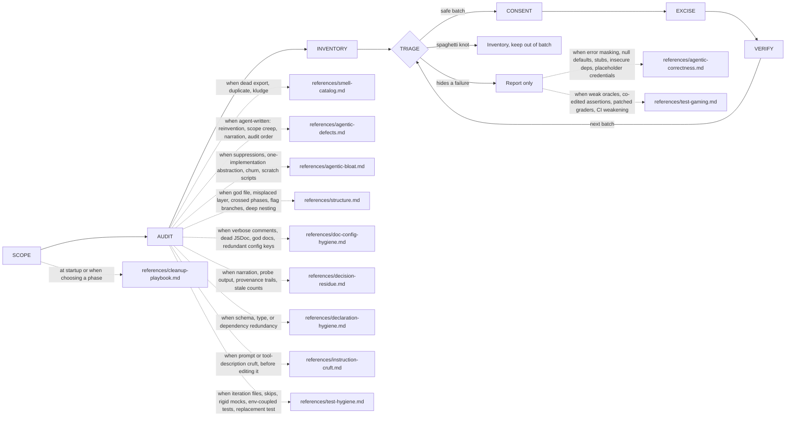

# Octocode clean agentic code

tools: `npx octocode` / `octocode-mcp`
related-skill: `octocode-research`
output: `<workspace>/.octocode/` for workspace work | `<home>/.octocode/` when no workspace applies

Remove dead weight and agent residue without changing observable behavior. Not for bug fixes.

Flow:

Caption: every batch loops through VERIFY; disguised failures and knots never enter a batch.

## Gates
- Architecture and quality come before a patch. Solve the class through the contract, protocol, or generic mechanism that already owns it. Do not hand-pick one case. Do not add a rigid value or a one-off patch.
- Never change behavior. For instruction text, behavior is every outcome, constraint, and contract it decides. If a removal needs a behavior change, flag it and stop.
- Report code that disguises a failure (error masking, null defaults on required values, stubs, unverified success); do not delete it. Never widen the mask to pass a check.
- Test or grader gaming (edited assertions, special-cased inputs, patched graders, CI weakening) is report-only.
- Refuse an edit that creates or extends spaghetti (a new flag, nested branch, wrapper, or copied function). Report the knot.
- Stay in the requested scope and reuse its authorization. Ask only when a deletion or behavior change exceeds it.
- Runtime-affecting config (env vars, aliases, compiler flags) needs explicit consent. Prose-only removals proceed in an approved batch.
- Do not hand-edit lockfiles, generated output, or build artifacts; regenerate them with their owning tool.
- A committed secret: flag it and stop; rotation comes first.

## Phase rules
- **SCOPE:** state target paths, smell classes, and exclusions.
- **AUDIT:** before you delete an export or adapter, read its exact source, references, entrypoints, and config. LSP references prove symbols and callers prove calls; AST topology gives candidate file edges only. Empty results do not exclude dynamic or external consumers.
- **INVENTORY:** one row per item: file, line, class, confidence, callers, safe to delete. Set confidence from completed evidence only; missing edges alone never prove dead.
- **TRIAGE:** rank high-confidence deletions, then prose-only trims, then hierarchy moves, then medium-confidence items that need proof. Low confidence: report, do not edit.
- **CONSENT:** apply what existing authorization covers. A finished inventory adds no approval step.
- **EXCISE:** keep each batch small enough to revert atomically. For duplicates, keep the canonical copy and update all callers first. Stop the batch when the edit would hand-pick one case, add a rigid value, or leave a one-off patch. Report it and name the contract or mechanism that should own the class.
- **VERIFY:** run the repo's build, test, typecheck, and lint; read the output, not a summary. Repair failures you introduced; list pre-existing ones. Never lower a coverage floor or threshold; restore useful coverage a deleted test removed.

## Thresholds
- God file: over 400 LOC AND more than one responsibility. God folder: over 20 files across domains. God doc: over 300 lines or more than one concept.
- Spaghetti: only two moves enter a batch: delete a branch proven unreachable, or move one straight phase to its existing owner. Every other knot goes to `octocode-architect`.
- Config line counts start an audit, never a delete gate (`tsconfig.json` 60, `package.json` 150).
- Instruction cruft: name the target model first; cut for fit, never on character count. Keep trigger text, contracts, safety and policy rules, and strings a script or test matches.

Related: `octocode-research` (symbol proof, callers, blast radius) · `octocode-agentic-prompts` (intent-changing instruction rewrites) · `octocode-roast` (smell inventory) · `octocode-architect` (structural untangles) · `octocode-eval-benchmark` (metrics) · `octocode-skills` (folder changes). No scripts.

## Output
One cleanup report in chat. Save one file under `<output>/octocode-clean-agentic-code/` only when the task asks to keep it. Scratch stays in `<output>/tmp/octocode-clean-agentic-code/`. Approved edits keep their paths.
