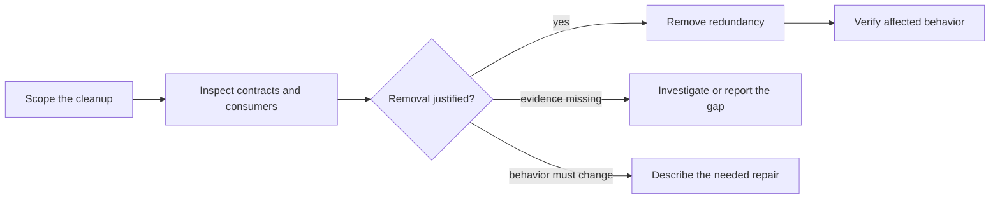

# Octocode clean agentic code

Remove redundant code and instructions while preserving observable behavior and useful contracts.

## Workflow

1. Identify the requested paths and intended result. Reuse existing authorization; ask only about effects outside that scope.
2. Read candidates, their contracts, and consumers. For deletion, check references, entrypoints, configuration, and dynamic or external use. Topology gives leads; semantic references establish symbol identity. An empty search alone does not prove absence.
3. Remove proven redundancy in reviewable batches. Keep one owner for duplicate logic or prose and update callers and links. Use the owning generator for lockfiles and derived artifacts.
4. Run relevant checks and inspect their results. Repair introduced failures, preserve coverage thresholds, and report checks that could not run.

## Boundaries and judgment

- Preserve outcomes, constraints, and contracts, including those expressed in instructions. If a finding needs a bug fix or design change, explain it and continue only under the appropriate authorized scope.
- Error masking, stubs, and test or grader gaming need a correctness repair; deleting the symptom can change behavior. Never weaken checks or widen a mask to make cleanup pass.
- File size and pattern matches are inspection signals. New branches, wrappers, or unclear ownership suggest a design question for `octocode-architect`.
- Retain text or configuration consumed by a runtime, parser, or external user until that contract is deliberately changed.
- If a secret is found, redact the value and report the exposure for rotation. Removing a reference does not resolve the exposure.

## Resources

Load the page that answers the current question.

| When needed | Read |
|---|---|
| When dead export, duplicate, kludge | [smell-catalog](references/smell-catalog.md) |
| When agent-written: reinvention, scope creep, narration, audit order | [agentic-defects](references/agentic-defects.md) |
| When suppressions, one-implementation abstraction, churn, scratch scripts | [agentic-bloat](references/agentic-bloat.md) |
| When god file, misplaced layer, crossed phases, flag branches, deep nesting | [structure](references/structure.md) |
| When comments, docs, instructions, or configuration contain stale or duplicate guidance | [text and config hygiene](references/text-config-hygiene.md) |
| When schema, type, or dependency redundancy | [declaration-hygiene](references/declaration-hygiene.md) |
| When iteration files, skips, rigid mocks, env-coupled tests, replacement test | [test-hygiene](references/test-hygiene.md) |
| When error masking, null defaults, stubs, insecure deps, placeholder credentials | [agentic-correctness](references/agentic-correctness.md) |
| When weak oracles, co-edited assertions, patched graders, CI weakening | [test-gaming](references/test-gaming.md) |

## Related skills

- `octocode-research`: Use to prove callers and effects before removal.
- `octocode-architect`: Use when cleanup exposes an unresolved boundary or design change.
- `octocode-agentic-prompts`: Use when an instruction change alters behavior.
- `octocode-skills`: Use for skill packaging and activation changes.

## Output

See [output.md](output.md) for the response and saved-artifact format.
