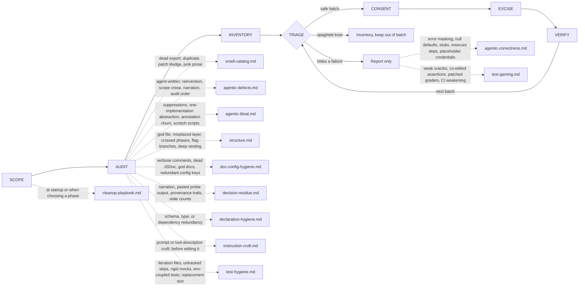

# Octocode clean agentic code

tools: `npx octocode` / `octocode-mcp`
related-skill: `octocode-research`
output: `<workspace>/.octocode/` for workspace work | `<home>/.octocode/` when no workspace applies
routes: load a reference only when it changes the next action; otherwise keep the rule here.

Remove dead weight and agent residue without changing observable behavior.
Reports go to `<output>/octocode-clean-agentic-code/`; scratch goes to `<output>/tmp/octocode-clean-agentic-code/`. Chat-only findings stay in chat; source edits keep their named paths.

Caption: every batch loops through VERIFY; disguised failures and knots never enter a batch; dotted edges load a page in `references/`.
Pages (load each when its map edge fires): `references/cleanup-playbook.md` · `references/smell-catalog.md` · `references/agentic-defects.md` · `references/agentic-bloat.md` · `references/structure.md` · `references/doc-config-hygiene.md` · `references/decision-residue.md` · `references/declaration-hygiene.md` · `references/instruction-cruft.md` · `references/test-hygiene.md` · `references/agentic-correctness.md` · `references/test-gaming.md`.

## Lobby rules
- Before deleting an export or adapter, inspect its exact source, references, entrypoints, and config. Use LSP references for symbols and callers for callable relationships; AST topology supplies candidate file edges. Empty results do not exclude dynamic or external consumers.
- Never change behavior. For instruction text, behavior means every outcome, constraint, and contract the text decides. If removal requires a behavioral change, flag it and stop.
- Separate dead weight from code that disguises a failure; report the second class instead of deleting it.
- Use safe batches; run the repo's checks after each. Read their output, never a summary.
- Keep edits within the requested cleanup scope. Reuse existing authorization for that scope; ask only when a proposed deletion or behavior change exceeds it.
- Config cleanup that affects runtime behavior needs explicit consent. Never touch lockfiles, generated output, or build artifacts.
- Spaghetti is forbidden. Detect tangled control flow, and refuse any edit that creates or extends it: a new flag, nested branch, wrapper, or copied function. Report the knot and leave it out of the batch.

Related: `octocode-research` (symbol proof, callers, import graphs, blast radius) · `octocode-prompt-optimizer` (instruction rewrites that change intent) · `octocode-roast` (smell inventory) · `octocode-architect` (structural untangles) · `octocode-eval-benchmark` (metrics) · `octocode-skills` (folder changes). No scripts.
