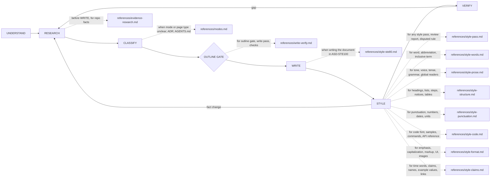

# Octocode Documentation

tools: `npx octocode` / `octocode-mcp`
related-skill: `octocode-research`
output: `<workspace>/.octocode/` for workspace work | `<home>/.octocode/` when no workspace applies

Skill map: solid edges are phases, dotted edges load a reference (style owners: only the topic's page); a single-file copyedit starts at STYLE.

| Mode | Route order |
|---|---|
| agent-docs | evidence-research → modes § Agent instruction files → write-verify |
| human-docs | evidence-research → modes (type) → write-verify |
| adr | evidence-research → modes § ADR → write-verify |
| codebase-pack | plan and gate the set once, then per file modes → write-verify |
| style-pass | style-pass → one owner → `style-lint.mjs` (+ style-pass § Review order for a report) |

A single-word question: quote its row of `assets/google-word-list.tsv` and stop.

## UNDERSTAND and RESEARCH
- Name the deliverable, audience, approved paths, and facts that still need evidence.
- Verify commands, paths, APIs, env vars, and behavior claims in the repo. Take commands only from manifests, Makefiles, or CI; never invent scripts.
- After about three targeted searches without a hit, mark the fact unresolved and continue. Omit it or label it "Not verified in repo".
- If code and a doc disagree, trust the code; fix or flag the doc.
- Cite module paths and doc links, not `file:line`. Describe behavior; do not paste implementations.

## CLASSIFY
- Mode, one per target: agent-docs (`AGENTS.md`, `CLAUDE.md`, agent rules) · human-docs (README, tutorial, how-to, API docs, runbook) · adr (decision, trade-off) · codebase-pack (one page per package) · style-pass (wording only).
- A wording-only request on a named file is style-pass. A page that needs an unverified fact is not style-pass: research first.
- Signals tie after one read: ask once with the likely modes, and do not write meanwhile.
- Human page: one Diátaxis type (tutorial, how-to, reference, explanation) per page; link sibling types.
- Audience: an agent reader gets flows as Mermaid or an arrow chain, no HTML or images. A human reader gets the diagram first, then the steps. HTML only on request. Reader unclear: write for the agent.
- ADR only for an expensive-to-reverse choice that is already decided; an open choice goes to `octocode-rfc-generator`. Match the existing ADR convention; else `<workspace>/docs/decisions/ADR-NNN-short-title.md`. Supersede old ADRs; never delete them.
- `AGENTS.md` is an index of links and non-obvious rules, about 60 lines.

## OUTLINE GATE and WRITE
- Edit only within the approved scope. Approval lasts for the session.
- Targets not yet authorized: present mode, type, targets, outline, evidence, and risks; write after approval.
- An existing target that is not yet authorized: ask Overwrite, Diff first, Rename, Skip, or Cancel.
- Write the document in ASD-STE100 (Issue 9): one instruction per sentence, 20 words or fewer in a procedure, active voice, condition first. Load `references/style-ste80.md`.
- A stated flow, branch, loop, or state is a Mermaid diagram (12 nodes or fewer), not a dense paragraph.
- Lead with the fact; link related pages with repo-relative paths; no code dumps. Put deep facts in the owning page.

## STYLE
- A style pass changes wording, not claims. Name the rule when you change another writer's wording.
- Precedence: the project's documented style → a consistent repo convention → this pack. In this pack, ASD-STE100 owns the sentence. Report a meaningful conflict.
- Defaults: sentence-case headings, second person, active voice, present tense, serial comma, descriptive link text, alt text on every image.
- Review for someone else: lint first, then structure, prose, and formatting. Report a repeated rule once as systemic. Never call unread sections clean.

## Output
One document in chat, or at the approved path. Save a draft under `<output>/octocode-documentation/` only before that path exists. Scratch stays in `<output>/tmp/octocode-documentation/`.
- Run `node scripts/style-lint.mjs <changed paths>`, then hand-check non-Markdown text. ERROR blocks completion; WARN needs a fix or explanation; INFO needs judgment.
- Run `node scripts/style-lint.mjs --self-test` after a lint-rule change; `node scripts/refresh-word-list.mjs --dry-run` checks word-list drift without writing.
- Check that named commands and linked paths exist and that no secrets or private URLs entered the doc.
- Finish when the approved docs pass fact, link, safety, structure, and style checks; name unverified claims or residual findings.

Deep repo research → `octocode-research`; architecture analysis → `octocode-architect`; an open decision that needs review → `octocode-rfc-generator`; skill folders → `octocode-skills`; ideation → `octocode-brainstorming`.
