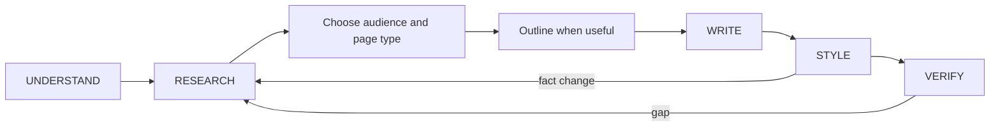

# Octocode Documentation

Use the workflow steps the task needs. A wording-only edit can start with the style review.

## UNDERSTAND and RESEARCH

- Name the deliverable, audience, approved paths, and facts that still need evidence.
- Verify commands, paths, APIs, env vars, and behavior claims in the repo. Take commands only from manifests, Makefiles, or CI; never invent scripts.
- Stop searching when another pass is unlikely to settle the claim. Mark unresolved facts and their impact; omit unsupported claims.
- When code and docs disagree, compare observed behavior with the accepted contract, tests, and decision history. Correct stale docs; flag a code defect when implementation violates the intended contract. If intent is unresolved, document the discrepancy without turning it into a new promise.
- Link stable source paths in durable docs; use exact line anchors when a review needs them. Explain behavior without copying implementation.

## CLASSIFY

- Mode, one per target: agent-docs (`AGENTS.md`, `CLAUDE.md`, agent rules) · human-docs (README, tutorial, how-to, API docs, runbook) · adr (decision, trade-off) · codebase-pack (one page per package) · style-pass (wording only).
- A wording-only request on a named file is style-pass. A page that needs an unverified fact is not style-pass: research first.
- When the mode is unclear, choose the smallest deliverable that meets the request. Ask only if the choice changes the intended audience or content.
- Give a page a clear purpose: tutorial, how-to, reference, or explanation. Split material when distinct reader needs make navigation difficult.
- Match the audience and medium. Use Mermaid or a short arrow chain for text-based flows; use richer visuals when they help the intended reader.
- ADR only for an expensive-to-reverse choice that is already decided; an open choice goes to `octocode-rfc-generator`. Match the existing ADR convention; else `<workspace>/docs/decisions/ADR-NNN-short-title.md`. Supersede old ADRs; never delete them.
- Keep `AGENTS.md` focused on non-obvious rules and links to their owners.

## WRITE

- Edit only within the approved scope. Approval lasts for the session.
- A request to create or edit a named document authorizes that write. Ask only when the destination or effect is genuinely unresolved.
- Use concrete verbs, short steps, and conditions beside their actions. Use `references/style-ste80.md` when controlled technical English is requested.
- Use a diagram when it makes a flow, branch, loop, or state easier to understand.
- Lead with the fact; link related pages with repo-relative paths; no code dumps. Put deep facts in the owning page.

## STYLE

- Preserve verified meaning during a style pass. Explain material changes; group repeated minor issues.
- Follow the user's request, the project's documented style, then consistent local conventions. Use this pack where they leave a choice open.
- Defaults: sentence-case headings, second person, active voice, present tense, serial comma, descriptive link text, alt text on every image.
- Review structure, claims, prose, links, and examples. Run an existing project doc check when relevant; this skill has no prose-grading script. Report review coverage honestly.

## Resources

Load the page that answers the current question.

| When needed | Read |
|---|---|
| Before WRITE, for repo facts | [evidence-research](references/evidence-research.md) |
| When mode or page type unclear; ADR; AGENTS.md | [modes](references/modes.md) |
| For planning, drafting, and verification | [write-verify](references/write-verify.md) |
| When controlled technical English is requested | [style-ste80](references/style-ste80.md) |
| For any style pass, review report, disputed rule | [style-pass](references/style-pass.md) |
| For word, abbreviation, inclusive term | [style-words](references/style-words.md); local lookup: `assets/google-word-list.tsv` |
| For tone, voice, tense, grammar, global readers | [style-prose](references/style-prose.md) |
| For headings, lists, steps, notices, tables | [style-structure](references/style-structure.md) |
| For punctuation, numbers, dates, units | [style-punctuation](references/style-punctuation.md) |
| For code font, samples, commands, API reference | [style-code](references/style-code.md) |
| For emphasis, capitalization, markup, UI, images | [style-format](references/style-format.md) |
| For time words, claims, names, example values, links | [style-claims](references/style-claims.md) |

## Related skills

- `octocode-research`: Use to verify commands, APIs, and behavior claims.
- `octocode-rfc-generator`: Use for an open consequential decision before writing an ADR.
- `octocode-agentic-prompts`: Use when instruction wording changes agent behavior.
- `octocode-skills`: Own skill structure while this skill reviews its documentation.

## Output

See [output.md](output.md) for the response and saved-artifact format.

## Verify

Check changed claims, commands, links, and examples against their sources. Review style in the changed text and report anything unresolved.
