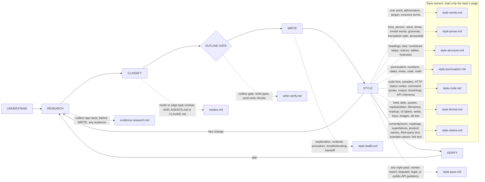

# Octocode Documentation

tools: `npx octocode` / `octocode-mcp`
related-skill: `octocode-research`
output: `<workspace>/.octocode/` for workspace work | `<home>/.octocode/` when no workspace applies
routes: load/run a reference, doc, or script only when it changes the next action; otherwise keep the rule here.

Use to write, repair, or review docs for humans and agents. Classify the deliverable, verify repo facts, and link durable sources instead of copying code detail.

Skill map: solid edges are phases, dotted edges load a reference. A fact change in STYLE or a failed check in VERIFY returns to RESEARCH; a single-file copyedit starts at STYLE.

Pages (load when its map edge applies): `references/evidence-research.md` · `references/modes.md` · `references/write-verify.md` · `references/style-ste80.md` · `references/style-pass.md` · `references/style-words.md` · `references/style-prose.md` · `references/style-structure.md` · `references/style-punctuation.md` · `references/style-code.md` · `references/style-format.md` · `references/style-claims.md`

Route order: agent-docs = evidence-research → modes § Agent instruction files → write-verify. human-docs = evidence-research → modes (type) → write-verify. adr = evidence-research → modes § ADR → write-verify. codebase-pack = plan and gate the set once, then per file modes → write-verify. style-pass = style-pass → one owner → `style-lint.mjs` (+ style-pass § Review for a report). A single-word question: quote its row of `assets/google-word-list.tsv` and stop.

## Rules

- UNDERSTAND names the deliverable, audience, approved paths, and facts that still need evidence.
- Verify commands, paths, APIs, env vars, and behavior claims in the repo. Omit unsupported claims or label them "Not verified in repo".
- Choose one mode and load only its route.
- Edit only within the approved scope. Approval lasts for the current session; ask only when a target or action needs authority not yet granted.
- Write explanations, runbooks, procedures, troubleshooting, and handoffs in STE-80 (ASD-STE100 rules, relaxed dictionary). Draw a stated flow, branch, loop, or state as a Mermaid diagram instead of a dense paragraph. Build HTML only when a person asks.
- A style pass changes wording, not claims. When you change another writer's wording, name the rule.
- The live Google guide wins for disputed or missing guidance; note when you cannot verify it.
- `AGENTS.md` is an index of links and non-obvious rules, not a content dump. One Diátaxis type per page; link siblings.
- Follow an established project style over this pack and report meaningful conflicts.
- Drafts: `<output>/octocode-documentation/`; scratch: `<output>/tmp/octocode-documentation/`. Chat-only reviews stay in chat; approved edits keep their requested paths.

## Verify

Run `node scripts/style-lint.mjs <changed paths>`, then hand-check non-Markdown text. ERROR blocks completion; WARN needs a fix or explanation; INFO needs judgment. Run `--self-test` after you change a lint rule. `scripts/refresh-word-list.mjs --dry-run` checks word-list drift against the live guide without writing.

Finish when the approved docs pass fact, link, safety, structure, and style checks. Name unverified claims or residual findings. Repo-fact research belongs to `octocode-research`; skill folders route to `octocode-skills`.
