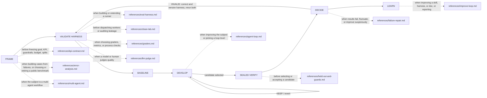

# Octocode eval benchmark
tools: `npx octocode` / `octocode-mcp`
related-skill: `octocode-research`
output: `<workspace>/.octocode/` for workspace work | `<home>/.octocode/` when no workspace applies

Separate real improvement from noise, leakage, and grader gaming.

Caption: develop on dev data; open the sealed test once, after selection; a dotted edge loads its page.
Modes: **ErrorAnalyze** · **Define** · **Run** · **Suite** · **Benchmark** · **Audit**.
Read `references/references.md` when you audit method provenance.

Definitions: `benchmarks/<name>/` (`benchmarks/README.md`); saved runs: `<output>/benchmarks/<name>/results/<run-id>/`. Keep evaluator artifacts outside solver access. Approved source edits keep their paths.

## Invariants
- Freeze the goal, primary KPI, meaningful effect threshold, guardrails, trial and selection budget, splits, and executable harness before comparing candidates. Version a corrected harness; rerun both sides.
- Each evaluated worker starts in a clean lab with only the production-equivalent task, subject instructions, and permitted inputs. Evaluator questions, answer keys, expected tool paths, prior attempts, and improvement feedback stay out of solver context and reachable storage.
- State every requirement the grader enforces; keep solution hints out. A deployment instruction under evaluation is subject; an answer-specific coaching overlay is leakage.
- Development iterates, validation selects, a sealed final test confirms. Repeated holdout feedback makes it development data. Record exposure and candidate count.
- Grade observable outcomes deterministically where possible; calibrate model judges against independent human labels. Before freezing, check positive, negative, ambiguous, and bypass examples.
- Select the candidate before opening final results; compare it with the baseline under the same conditions. Capture failures after the verdict; a suite or grader change starts a new version.
- Keep failures, Unknowns, grader errors, infrastructure errors, retries, and cost in the denominator and the report.
- Development KEEP is provisional. Final verdicts are ACCEPT, REVERT, INCONCLUSIVE (uncertain), or INVALID (compromised); the last two prove neither failure nor improvement.
- Public benchmarks orient; representative private tasks support product decisions. Public fixtures, regex checks, and self-tests check the grader, never generalization or agent behavior.
- `octocode-subagent` owns spawn mechanics; this skill owns how a multi-agent subject is measured.

Other owners: `octocode-research` proves code claims; `octocode-brainstorming` explores options; `octocode-agentic-prompts` improves wording; `octocode-skills` reviews folders; `octocode-rfc-generator` decides consequential designs.

## Maintainer verification
After maintainer edits, run `node scripts/check-description.mjs` (metadata), `node scripts/eval-skill.mjs --self-test` (grader mechanics), then the `octocode-skills` review. `benchmarks/skill-smoke/README.md` documents case and batch checks.
