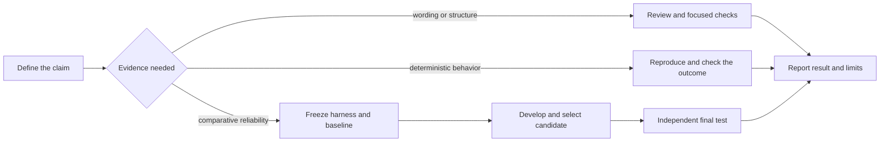

# Octocode eval benchmark

Choose evidence that can support the claim being made.

## Start at the needed depth

- **Editorial or structural repair:** review intent, links, examples, and relevant checks. Report an editorial result; improved activation or reliability remains unmeasured.
- **Deterministic regression:** capture the failing outcome, apply the change, and verify that outcome plus affected contracts. Use the project's focused tests; a sealed benchmark is unnecessary for a directly checkable fix.
- **Comparative or reliability claim:** use the evaluation safeguards below, with representative cases and an independent final check. Scale the sample and budget to the consequence and uncertainty.

For a reusable suite, keep definitions in `benchmarks/<name>/` (`benchmarks/README.md`) or the project's existing harness. Keep evaluator artifacts outside solver access. Read [method sources](references/references.md) when auditing provenance.

## Comparative evaluation safeguards

- Freeze the goal, primary KPI, meaningful effect threshold, guardrails, trial and selection budget, splits, and executable harness before comparing candidates. Version a corrected harness; rerun both sides.
- Each evaluated worker starts in a clean lab with only the production-equivalent task, subject instructions, and permitted inputs. Evaluator questions, answer keys, expected tool paths, prior attempts, and improvement feedback stay out of solver context and reachable storage.
- State every requirement the grader enforces; keep solution hints out. A deployment instruction under evaluation is subject; an answer-specific coaching overlay is leakage.
- Development iterates, validation selects, a sealed final test confirms. Repeated holdout feedback makes it development data. Record exposure and candidate count.
- Grade observable outcomes deterministically where possible; calibrate model judges against independent human labels. Before freezing, check positive, negative, ambiguous, and bypass examples.
- Select the candidate before opening final results; compare it with the baseline under the same conditions. Capture failures after the verdict; a suite or grader change starts a new version.
- Keep failures, Unknowns, grader errors, infrastructure errors, retries, and cost in the denominator and the report.
- Development KEEP is provisional. Final verdicts are ACCEPT, REVERT, INCONCLUSIVE (uncertain), or INVALID (compromised); the last two prove neither failure nor improvement.
- Public benchmarks orient; representative private tasks support product decisions. Public fixtures, regex checks, and self-tests check the grader, never generalization or agent behavior.
- Use the host's authorized worker tools when evaluating a multi-agent subject; this skill defines measurement and isolation, not permission to delegate.

## Maintainer verification

Review the skill with `octocode-skills`. Measure any claimed behavioral improvement on representative cases with an independent outcome check.

## Resources

Load the page that answers the current question.

| When needed | Read |
|---|---|
| Before freezing goal, KPI, guardrails, budget, splits | [kpi-contract](references/kpi-contract.md) |
| When building cases from failures, or choosing or retiring a public benchmark | [error-analysis](references/error-analysis.md) |
| When the subject is a multi-agent workflow | [multi-agent](references/multi-agent.md) |
| When building or extending a runner | [eval-harness](references/eval-harness.md) |
| Before dispatching workers or auditing leakage | [clean-lab](references/clean-lab.md) |
| When choosing graders, metrics, or process checks | [graders](references/graders.md) |
| When a model or human judges quality | [llm-judge](references/llm-judge.md) |
| When improving the subject or picking a loop level | [agent-loop](references/agent-loop.md) |
| Before selecting or accepting a candidate | [held-out-and-guards](references/held-out-and-guards.md) |
| When results fail, fluctuate, or improve suspiciously | [failure-repair](references/failure-repair.md) |
| When improving a skill, harness, or doc, or reporting | [improve-loop](references/improve-loop.md) |

## Related skills

- `octocode-research`: Use to verify the behavior and data behind a measurement.
- `octocode-agentic-prompts`: Use to edit agent instructions after an observed failure.
- `octocode-skills`: Use when the subject is skill activation or folder structure.

## Output

See [output.md](output.md) for the response and saved-artifact format.
